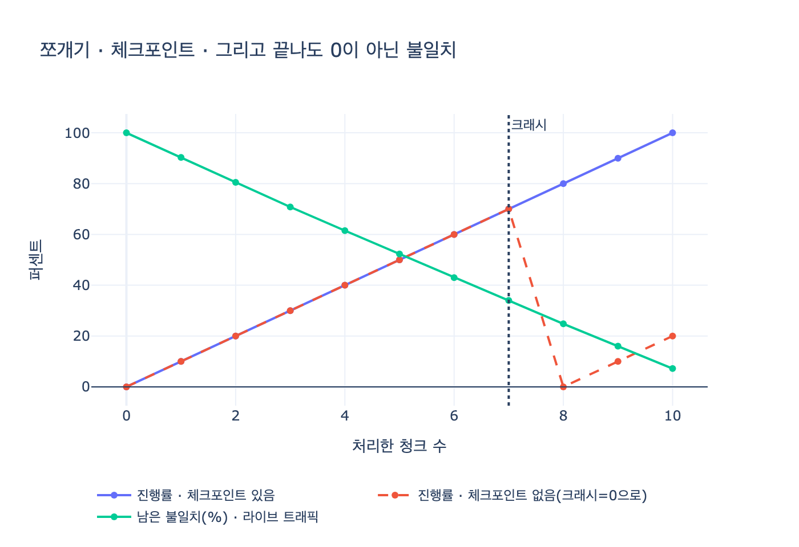

# 백필의 세 가지 원칙

> **Q.** 백필의 세 가지 원칙은 무엇인가?
>
> **A.** 쪼개서 돌리고, 어디까지 했는지 남기고, 멱등하게 만든다. 그리고 끝난 뒤 한 번 더 돌린다.

32장(스키마를 바꾸는 날) 한 장 요약의 네 번째 줄 그대로다.

> 백필은 쪼개서 돌리고, 어디까지 했는지 남기고, 멱등하게 만드세요. 그리고 끝난 뒤 한 번 더 돌립니다.

세 가지 원칙 + 꼬리 하나. 꼬리("한 번 더")까지 외워야 답이 완성된다.

## 백필이 어디에 끼는 일인가

백필은 독립된 작업이 아니라 **확장-수축(expand and contract)** 여섯 단계 중 세 번째다. 32장 예제 5(`ex5_migration_plan.py`)의 단계 목록:

| # | 단계 | 하는 일 |
|---|---|---|
| 1 | `expand` | 새 스키마를 «더한다». 옛것 그대로 |
| 2 | `dual-write` | 쓰기를 양쪽에 한다 |
| **3** | **`backfill`** | **옛 데이터를 새 스키마로 복사** |
| 4 | `dual-read` | 읽기를 둘 다 하고 비교 |
| 5 | `cutover` | 읽기를 새것으로. 옛것은 검증용 |
| 6 | `contract` | 옛 스키마 삭제 |

`dual-write`가 켜지면 **앞으로 들어오는** 데이터는 양쪽에 쓰인다. 하지만 **이미 쌓여 있던** 옛 데이터는 그대로다. 그걸 새 스키마로 옮기는 게 백필이다. 즉 백필은 「과거를 따라잡는 일」이고, 그 사이에도 현재는 계속 흐르고 있다. 이 사실 하나에서 세 원칙과 꼬리가 모두 나온다.

## 원칙 1 — 쪼개서 돌린다 (chunking)

한 트랜잭션으로 전체를 만지면 두 가지가 동시에 나쁘다.

- **락을 오래 쥔다.** 수천만 행을 한 트랜잭션으로 쓰면 그 시간 동안 다른 쓰기가 밀린다. 그래프 DB든 RDB든, 큰 쓰기 트랜잭션은 그대로 장애다.
- **실패하면 전부 롤백된다.** 73%까지 갔어도 커밋된 건 0이다. 다시 돌리면 또 0부터고, 같은 확률로 또 죽는다. 「몇 주째 백필 중」의 전형적 원인.

쪼개면 청크 하나가 하나의 짧은 트랜잭션이 된다. 그러면 얻는 것들:

- 언제든 **멈출 수 있다**. 트래픽 피크에는 청크 속도를 줄이거나 아예 세운다(스로틀링).
- 실패 범위가 **청크 하나**로 좁혀진다.
- 진행률이 관측 가능한 숫자가 된다 → 예제 5의 `백필_진행률` 게이트를 만들 수 있다.

청크 경계는 **안정적인 정렬 키**로 잡는다. 보통 PK 범위나 시간 범위. `OFFSET n LIMIT m`은 중간에 삽입/삭제가 일어나면 행을 건너뛰거나 중복 처리하므로 커서 기반(`WHERE id > :last_id ORDER BY id LIMIT m`)이 낫다.

## 원칙 2 — 어디까지 했는지 남긴다 (checkpoint)

체크포인트는 「다음에 처리할 커서」를 **영속 저장소**에 남기는 것이다. 재작업량 차이가 원칙의 전부다. 전체 $N$행을 $k$개 청크로 나누고, 청크 하나가 확률 $p$로 죽는다고 하면

$$P(\text{한 번 이상 실패}) = 1 - (1-p)^k$$

이므로 청크가 많아질수록 **실패는 사실상 확정 사건**이다. 그때 버리는 작업량이

- 체크포인트 없음: $O(N)$ — 처음부터
- 체크포인트 있음: $O(N/k)$ — 죽은 청크 하나

실무 요령 셋:

1. **커서와 데이터를 같은 트랜잭션에 커밋한다.** 따로 쓰면 "데이터는 썼는데 커서는 못 남긴" 창이 생긴다. 원칙 3(멱등)이 이 창을 무해하게 만들어 준다.
2. **커서를 로컬 파일/메모리에 두지 않는다.** 파드가 죽거나 재배포되면 함께 사라진다. 백필 대상과 같은 DB의 진행 테이블에 둔다.
3. **실패한 청크 목록도 남긴다.** 커서만 남기면 "건너뛴 청크"를 잊는다. `pending / done / failed` 상태를 청크별로 기록하면 실패분만 재시도할 수 있다.

## 원칙 3 — 멱등하게 만든다 (idempotency)

재시도는 예외가 아니라 기본값이다. 타임아웃 후 재실행, 재배포로 인한 중복 기동, 사람이 손으로 한 번 더 실행. 그러면 **같은 청크가 두 번 이상 처리된다.**

- 멱등한 쓰기: `SET`, `MERGE`, upsert — 몇 번 적용해도 최종 상태가 같다
- 비멱등한 쓰기: `CREATE`, `append`, `count = count + 1` — 적용 횟수만큼 결과가 달라진다

그래프에서는 이게 특히 잘 터진다. 32장 예제 2의 확장 단계가

```cypher
MATCH (a)-[e:R {kind:'이끔'}]->(b) CREATE (a)-[:R {kind:'리드'}]->(b)
```

인데, 이 쿼리를 두 번 돌리면 `리드` 엣지가 **두 배**가 된다. 그리고 이렇게 생긴 중복 엣지는 나중에 예제 4의 「둘 다 읽고 비교」에서 불일치로 잡히거나, 더 나쁘게는 잡히지 않고 조용히 집계를 부풀린다. 멱등하게 쓰려면 「없으면 만들고 있으면 그대로」(`MERGE`)여야 한다.

멱등성의 진짜 값은 부수 효과에 있다. **at-least-once 전달만으로 exactly-once 결과를 얻는다.** 커서 커밋이 조금 뒤처져 마지막 청크를 다시 처리해도 결과가 같으므로, 원칙 2의 "커서와 데이터를 원자적으로" 요구가 완화된다. 세 원칙은 이렇게 서로를 받쳐 준다.

## 그리고 — 끝난 뒤 한 번 더

세 원칙을 다 지켜도 부족하다. 백필은 **살아 있는 시스템** 위에서 돌기 때문이다.

커서가 5번 청크를 지나간 뒤, 3번 청크에 있던 행이 또 바뀐다. 백필은 그 행을 이미 「완료」로 처리했으니 다시 안 본다. 결과: **진행률 100%인데 새 스키마에는 헌 값이 남는다.** 커서가 진행될수록 「이미 지나간 구간」이 커지니, 놓칠 확률도 시간과 함께 커진다.

그래서 마지막에 한 번 더 돈다. 두 번째 패스는 보통 첫 패스보다 훨씬 싸다. 대상이 「백필 시작 이후 변경된 행」으로 좁혀지기 때문이다(`updated_at > 백필_시작시각`, 변경 로그, CDC 등).

다만 순서가 중요하다. **한 번 더 돌리는 것만으로는 불일치 0을 보장하지 못한다.** 스윕이 도는 동안에도 쓰기는 들어오니 꼬리가 끝없이 이어질 수 있다. 그래서 32장의 단계 순서가 이렇게 생겼다.

1. `dual-write`를 **먼저** 100%로 만든다 → 새 쓰기가 양쪽에 들어가므로 「지나간 뒤 바뀜」의 **원천**이 막힌다
2. 그다음 백필(쪼개기 · 체크포인트 · 멱등)
3. 최종 스윕 — 그래도 남은 잔여를 한 번 더
4. `dual-read`로 불일치를 **세고**, 0이 될 때까지 수축하지 않는다

예제 5의 게이트가 `dual-write` → `양쪽 쓰기가 100%인가`, `backfill` → `백필이 끝났나`, `dual-read` → `불일치가 0인가` 순서인 이유가 여기 있다. 백필이 「끝났다」고 스스로 선언하는 게 아니라, 다음 단계의 관측값이 그걸 판정한다.

## 한 줄 정리

| 원칙 | 없으면 | 있으면 |
|---|---|---|
| 쪼갠다 | 락을 오래 쥐고, 실패하면 전부 롤백 | 짧은 트랜잭션. 멈추고 재개할 수 있다 |
| 어디까지 했는지 남긴다 | 재시도가 늘 0부터 ($O(N)$ 재작업) | 죽은 자리에서 재개 ($O(N/k)$) |
| 멱등하게 만든다 | 재시도가 엣지·행을 중복 생성 | 몇 번 돌려도 같은 상태 |
| 한 번 더 돌린다 | 「100% 완료」인데 헌 값이 남는다 | 백필 중 변경분을 회수 |

## 시각화



세 곡선을 겹친 그림이다. 실선(체크포인트 있음)은 크래시 지점에서도 진행률을 유지하고, 점선(체크포인트 없음)은 0으로 되돌아간다. 세 번째 곡선은 라이브 트래픽이 섞인 백필의 남은 불일치인데, 커서가 100%에 닿아도 0이 아니다. 그게 「한 번 더」가 필요한 이유다. 재현 코드는 [`expy.py`](expy.py).
