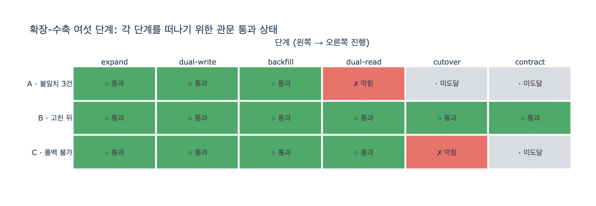

# 각 단계를 떠나기 위한 관문 조건

> **Q.** 각 단계를 떠나기 위한 관문 조건은 무엇인가?
>
> **A.** `expand`는 새 스키마 존재, `dual-write`는 양쪽 쓰기 100%, `backfill`은 진행률 100%, `dual-read`는 불일치 0, `cutover`는 옛것 읽기 0과 롤백 가능, `contract`는 가장 긴 주기보다 오래 조용함이다.

---

## 왜 「관문」인가

32.5절의 핵심 주장은 한 줄이다.

> 마이그레이션 계획은 문서가 아니라 **코드**로 적으세요. 조건을 못 채우면 넘어갈 수 없게요.

계획을 문서로 적으면 「지금 어디쯤인가」를 **사람이** 판단하게 된다. 그리고 사람은 「대충 된 것 같은데」로 다음 단계로 넘어간다. 반대로 조건을 코드로 적으면 *넘어갈 수 없다*. 불일치 3건이 남아 있으면 막힌다.

그래서 32장의 `ex5_migration_plan.py`는 여섯 단계를 **상태 기계**로 만든다. 각 단계마다 「이 단계를 **떠나려면** 통과해야 하는 조건」을 함수로 붙여 놓는다. 관문은 「들어가는」 조건이 아니라 「나가는」 조건이라는 점이 중요하다 — 단계에 진입하는 건 쉽고, 그 단계를 졸업하는 게 어렵다.

## 여섯 단계와 관문 조건

| # | 단계 | 하는 일 | **떠나기 위한 관문** | 관측 지표 |
|---|---|---|---|---|
| 1 | `expand` | 새 스키마를 «더한다». 옛것 그대로 | 새 스키마가 있나 | `새_스키마_존재 == True` |
| 2 | `dual-write` | 쓰기를 양쪽에 한다 | 양쪽 쓰기가 100%인가 | `양쪽_쓰기_비율 >= 1.0` |
| 3 | `backfill` | 옛 데이터를 새 스키마로 복사 | 백필이 끝났나 | `백필_진행률 >= 1.0` |
| 4 | `dual-read` | 읽기를 둘 다 하고 비교 | 불일치가 0인가 | `불일치_건수 == 0` |
| 5 | `cutover` | 읽기를 새것으로. 옛것은 검증용 | 옛것 읽기가 0인가 **그리고** 롤백이 가능한가 | `옛것_읽기_건수_최근 == 0` **and** `롤백_가능` |
| 6 | `contract` | 옛 스키마 삭제 | 가장 긴 주기보다 오래 조용한가 | `옛것_마지막_읽기_경과일 > 가장_긴_주기_일` |

책의 원문 코드는 이렇게 생겼다.

```python
GATES = {
    "expand":     [("새 스키마가 있나", lambda s: s["새_스키마_존재"])],
    "dual-write": [("양쪽 쓰기가 100%인가", lambda s: s["양쪽_쓰기_비율"] >= 1.0)],
    "backfill":   [("백필이 끝났나", lambda s: s["백필_진행률"] >= 1.0)],
    "dual-read":  [("불일치가 0인가", lambda s: s["불일치_건수"] == 0)],
    "cutover":    [("옛것 읽기가 0인가", lambda s: s["옛것_읽기_건수_최근"] == 0),
                   ("롤백이 가능한가", lambda s: s["롤백_가능"])],
    "contract":   [("가장 긴 주기보다 오래 조용한가",
                    lambda s: s["옛것_마지막_읽기_경과일"] > s["가장_긴_주기_일"])],
}
```

여섯 단계 중 **`cutover`만 관문이 두 개**다. 이건 일부러다. cutover는 되돌리기가 제일 어려운 단계라서, 그 앞에서 「되돌릴 수 있나」를 한 번 더 묻는다. 옛 스키마가 아직 살아 있고 데이터가 최신이면 되돌릴 수 있다.

## 관문 하나하나가 어디서 나왔나

이 조건들은 32장 앞 예제들에서 하나씩 채굴된 값이다. 허공에서 만든 체크리스트가 아니다.

### `dual-write` → 양쪽 쓰기 100% (예제 2)

`ex2_expand_contract.py`의 3단계다. 확장-수축의 순서는 **「읽기 먼저, 쓰기 나중」**이다.

- DB를 먼저 바꾸면 → 옛 코드가 죽는다
- 코드를 먼저 바꾸면 → 새 코드가 죽는다

그래서 그 사이에 「둘 다 되는」 구간을 만든다. 쓰기가 **일부만** 양쪽으로 가고 있으면 그 구간이 완성된 게 아니다. 비율이 0.98이면 2%의 데이터가 새 스키마에 안 들어가고, 그 2%는 backfill이 못 잡는 구멍이 된다. 그래서 `>= 1.0`이지 `>= 0.99`가 아니다.

### `backfill` → 진행률 100%

백필은 쪼개서 돌리고, 어디까지 했는지 남기고, 멱등하게 만든다. 그리고 **끝난 뒤 한 번 더 돌린다**. 진행률이 100%라는 말은 「모든 청크가 체크포인트로 기록됐다」는 뜻이다. 「돌렸다」가 아니라 「기록으로 확인된다」여야 관문이 된다.

### `dual-read` → 불일치 0 (예제 4)

`ex4_dual_read.py`가 이 조건의 근거다. 읽기 전략 네 가지 중 **「둘 다 읽고 비교」**만 데이터가 어긋난 걸 알려 준다.

| 전략 | t3(옛=김도현, 새=정하윤) 처리 | 문제 감지 |
|---|---|---|
| 옛것만 읽기 | 조용히 김도현 | 0건 |
| 새것만 읽기 | 조용히 정하윤 | 0건 |
| 새것 없으면 옛것 | 조용히 정하윤 | 0건 |
| **둘 다 읽고 비교** | 정하윤 + **「불일치」 신고** | 2건 |

앞의 세 전략은 어긋난 곳에서 «그냥 하나를 고른다». 조용히. 고른 게 맞을 수도 틀릴 수도 있는데 아무도 모른다.

핵심 문장:

> 이행 중에는 데이터가 어긋난다. **안 어긋나는 이행은 없다.** 중요한 건 어긋나는 것을 «막는» 게 아니라 «아는» 것이다.

그래서 관문은 「어긋나지 않게 했나」가 아니라 **「어긋난 걸 세어서 0으로 만들었나」**다. 값은 읽기가 두 배가 되는 것 — 이행 구간에만 내는 값이라 괜찮다. 이 값을 안 내면 수축한 뒤에 «조용히 틀린 데이터»가 남는다.

### `contract` → 가장 긴 주기보다 오래 조용 (예제 3)

이게 이 장에서 제일 반직관적인 관문이다. `ex3_when_to_contract.py`는 같은 데이터를 세 가지 기준으로 판정한다.

| 판정 방법 | 결론 | 이유 |
|---|---|---|
| 최근 30일 건수가 0인가 | 지워도 됨 | 최근 창 안에는 아무도 안 읽었다 |
| 모든 주체가 30일 이상 조용 | 지워도 됨 | 제일 최근이 52일 전 |
| **가장 긴 주기(92일)보다 오래** | **아직** | 분기 결산이 52일 전. 아직 한 주기가 안 지났다 |

앞의 둘은 「지워도 됨」이라고 하고 세 번째만 「아직」이라고 한다. **그리고 세 번째가 맞다.**

「최근 30일」은 흔히 쓰는 기준인데 함정이 있다. 분기 결산처럼 «드물게 도는» 것을 놓친다. 52일째 조용하니 안 쓰는 것처럼 보이지만 이건 92일마다 도는 잡이다. 40일 뒤에 깨어나서 없어진 이름을 찾는다. 연말 정산이면 365일이다.

> 기준은 «시간»이 아니라 **«가장 긴 주기»**여야 한다.

그 주기를 어떻게 아나. **크론 표현식을 파싱해서** 계산한다. 다만 크론에 없는 것(사람이 손으로 도는 것)은 못 잡으니 안전장치를 하나 더 둔다.

- 옛 이름을 읽으면 «경고 로그»를 남기게 하고, 그 로그를 본다
- 지우기 전 마지막 한 달은 «읽으면 알림»까지 켠다
- 지울 때는 되돌릴 수 있게 지운다 — 바로 `DROP` 하지 말고 이름만 바꿔 두고(`이끔 → _deprecated_이끔`) 한 주기 더 기다린 뒤 진짜로 지운다

그리고 **드물게 도는 잡일수록 실패 알림을 세게 건다.** 매일 도는 건 내일 알지만, 2년에 한 번 도는 건 2년 뒤에 안다.

### 옛것 읽기 0 → 예제 1의 `Reads` 엣지

`옛것_읽기_건수_최근`을 어디서 세나. 29장에서 만든 `Reads` 엣지다. 코드 검색으로는 동적으로 조립한 쿼리를 못 찾는다. `Reads`는 «실제로 읽은 기록»이라 검색에 안 걸리는 것도 잡힌다. 세는 데 5분 걸리고, 안 세면 배포하고 나서 안다.

## 관문에는 순서가 있다

상태 기계라는 말의 실질적 의미는 이것이다. 뒤쪽 단계의 관문이 **이미 참이어도** 앞이 막히면 못 간다.

책의 기본 `STATE`가 정확히 그 상황을 보여 준다.

```python
STATE = {
    "새_스키마_존재": True,
    "양쪽_쓰기_비율": 1.00,
    "백필_진행률": 1.00,
    "불일치_건수": 3,              # ← 여기서 막힌다
    "옛것_읽기_건수_최근": 0,       # cutover 관문은 이미 통과 상태
    "가장_긴_주기_일": 92,
    "옛것_마지막_읽기_경과일": 52,
    "롤백_가능": True,             # 이것도 통과 상태
}
```

`cutover`의 두 관문(옛것 읽기 0, 롤백 가능)은 이미 참이다. 그래도 `dual-read`에서 불일치 3건에 막혀 있으니 cutover에 **도달 자체를 못 한다**. 형식으로 쓰면

$$\text{진행 가능 지점} = \min\{\, i \;:\; \lnot G_i(s) \,\}$$

관문 조건 $G_i$ 가 처음으로 거짓이 되는 인덱스에서 멈춘다. `STATE["불일치_건수"]`를 0으로 바꾸면 다음 단계로 넘어간다 — 32장 README가 「일부러 `dual-read`에서 막히게 해 두었다」고 밝힌 부분이다.

## 외우는 방법

각 관문이 무엇을 **0 또는 100%로** 만들라고 요구하는지로 묶으면 기억이 쉽다.

| 방향 | 단계 | 지표 |
|---|---|---|
| **존재** | expand | 새 스키마가 있다 |
| **100%로 올려라** | dual-write | 양쪽 쓰기 비율 |
| **100%로 올려라** | backfill | 백필 진행률 |
| **0으로 내려라** | dual-read | 불일치 건수 |
| **0으로 내려라 + 보험** | cutover | 옛것 읽기 건수 + 롤백 가능 |
| **기다려라** | contract | 조용한 일수 > 가장 긴 주기 |

앞의 세 단계는 «만드는» 일이라 100%를 향해 올라가고, 뒤의 세 단계는 «지우는» 일이라 0을 향해 내려간다. 그리고 마지막 하나는 사람이 할 수 있는 게 기다리는 것뿐이다.

## 한 줄 정리

> 이 파일을 CI에 넣으면 마이그레이션이 «상태 기계»가 된다. 그리고 상태 기계는 사람의 낙관을 안 탄다.

## 더 읽을 것

| 키워드 | 상태 | 출처 |
|---|---|---|
| 확장-수축 (Parallel Change) | 사실상 표준 | <https://martinfowler.com/bliki/ParallelChange.html> |
| 무중단 배포 | 사실상 표준 | <https://martinfowler.com/bliki/BlueGreenDeployment.html> |
| 백필 | 사실상 표준 | <https://cloud.google.com/architecture/database-migration-concepts-principles-part-1> |
| 스키마 진화 | 사실상 표준 | <https://avro.apache.org/docs/current/specification/#schema-resolution> |
| 하위 호환 | 사실상 표준 | <https://protobuf.dev/programming-guides/proto3/#updating> |

## 시각화

세 시나리오(A: 불일치 3건 / B: 고친 뒤 / C: 롤백 불가)의 관문 통과 상태다. 초록은 통과, 빨강은 막힘, 회색은 앞이 막혀서 «도달 못함»이다. A행에서 cutover와 contract가 회색인 게 「뒤 관문이 참이어도 앞이 막히면 못 간다」의 그림이다.


