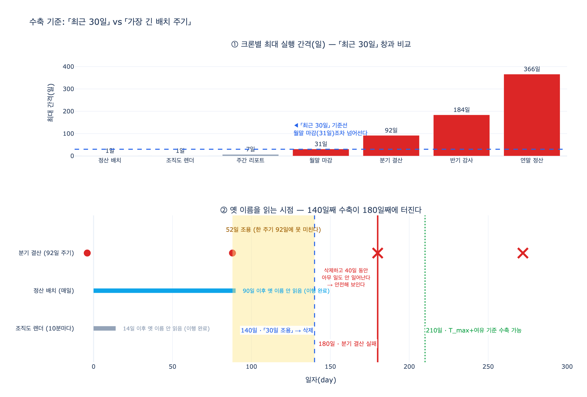

# 수축 기준은 무엇으로 잡아야 하는가?

> **답**: '최근 30일'이 아니라 '가장 긴 배치 주기'다. 분기 배치면 92일, 연말 정산이면 365일이며 크론 표현식을 파싱해 계산한다.

출처: 32장 「스키마를 바꾸는 날」 3절 — 「아무도 안 쓴다」를 어떻게 아나 (`ex3_when_to_contract.py`, `ex5_migration_plan.py`)

---

## 1. 「수축」이 무엇인지부터

확장-수축(expand and contract, 병행 변경 parallel change)은 돌아가는 시스템의 스키마를 멈추지 않고 바꾸는 방법입니다. 세 국면입니다.

| 국면 | 하는 일 |
|---|---|
| **확장(expand)** | 새것을 *더한다*. 옛것은 그대로 둔다 |
| **이행(migrate)** | 읽기를 옮기고, 그다음 쓰기를 옮긴다 |
| **수축(contract)** | 아무도 안 쓰는 게 확인되면 옛것을 지운다 |

확장과 이행은 기계적입니다. 절차가 정해져 있고 실수하면 바로 압니다.
**어려운 건 수축입니다.** 「아무도 안 쓴다」를 언제 확신할 수 있느냐의 문제이고, 이건 관측의 문제입니다. 32장이 "이 장의 절반은 「어떻게 바꾸나」가 아니라 「언제 옛것을 지워도 되나」다. 그게 훨씬 어렵다"고 말하는 이유입니다.

## 2. 흔히 쓰는 「최근 30일」 기준과 그 함정

수축 판정에 가장 많이 쓰이는 규칙은 이렇습니다.

> 최근 30일 동안 옛 스키마 읽기가 0건이면 지운다.

`ex3_when_to_contract.py`의 데이터로 이 규칙을 돌려 보면 무슨 일이 생기는지 보입니다. 오늘은 140일째이고, 옛 이름(`이끔`)을 읽은 기록은 이렇습니다.

| 읽는 주체 | 마지막 사용 | 경과일 | 잡 주기 | 한 주기 지났나 |
|---|---|---|---|---|
| 조직도 렌더 | 14일째 | 126일 | 10분 | 예 |
| 정산 배치 | 90일째 | 50일 | 1일 | 예 |
| 월말 마감 | 82일째 | 58일 | 31일 | 예 |
| **분기 결산** | **88일째** | **52일** | **92일** | **아니오** |

세 가지 판정 방법을 나란히 놓으면 이렇게 갈립니다.

| 판정 방법 | 결론 | 실제로 맞나 |
|---|---|---|
| 최근 30일 건수가 0인가 | 지워도 됨 | ✗ **틀렸다** |
| 모든 주체가 30일 이상 조용한가 | 지워도 됨 | ✗ **틀렸다** |
| **가장 긴 주기(92일)보다 오래 조용한가** | 아직 | ○ 맞다 |

앞의 둘이 틀린 이유는 하나입니다. **드물게 도는 잡을 놓칩니다.**

분기 결산은 92일마다 돕니다. 52일째 조용하니 「안 쓰는 것처럼」 보이지만, 아직 한 주기가 지나지 않았습니다. 여기서 지우면 **40일 뒤에 깨어나서 없어진 이름을 찾습니다.**

그리고 그 40일 동안은 아무 일도 안 일어납니다. 그게 이 함정의 성질입니다. 삭제 직후에는 조용하고, 문제는 사람이 그 배포를 다 잊었을 때 터집니다.

## 3. 그래서 기준은 「시간」이 아니라 「주기」다

$$\text{safe} \iff \min_{r \in R}\big(\text{today} - \text{lastUse}(r)\big) > T_{\max} + \text{margin}$$

- $R$: 옛 스키마를 읽는 주체 집합
- $T_{\max}$: 시스템에서 제일 드물게 도는 잡의 실행 간격 최댓값
- $\text{margin}$: 여유. 크론에 없는 것(사람이 손으로 도는 것)을 위한 관측 창

핵심은 임계값이 **상수가 아니라 시스템에서 측정된 값**이라는 점입니다. 30일이든 90일이든 사람이 정한 숫자는 그 시스템의 배치 주기와 아무 관계가 없습니다.

`ex5_migration_plan.py`의 `contract` 게이트가 정확히 이 조건입니다.

```python
"contract":   [("가장 긴 주기보다 오래 조용한가",
                lambda s: s["옛것_마지막_읽기_경과일"]
                          > s["가장_긴_주기_일"])],
```

## 4. $T_{\max}$를 어떻게 구하나 — 크론 표현식 파싱

「제일 드물게 도는 잡의 주기」를 사람이 눈으로 세면 안 됩니다. 크론 표현식을 파싱해서 계산합니다.

절차는 이렇습니다.

1. crontab에서 표현식을 읽는다
2. 각 표현식의 **다음 실행 시각들**을 충분히 긴 구간에서 시뮬레이션한다
3. 인접 실행 사이의 간격 중 **최댓값**을 취한다
4. 모든 잡에 대해 다시 최댓값을 취하면 $T_{\max}$

$$T_{\max} = \max_{c \in \text{crontab}} \; \max_i \big(t_{i+1}(c) - t_i(c)\big)$$

`expy.py`가 croniter 같은 외부 라이브러리 없이 표준 라이브러리로 이걸 합니다. 결과입니다.

| 잡 | 크론 | 최대 간격 |
|---|---|---|
| 정산 배치 | `0 3 * * *` | 1일 |
| 조직도 렌더 | `*/10 * * * *` | 1일 |
| 주간 리포트 | `0 4 * * 1` | 7일 |
| 월말 마감 | `0 5 1 * *` | **31일** |
| 분기 결산 | `0 6 1 1,4,7,10 *` | **92일** |
| 반기 감사 | `0 6 1 1,7 *` | 184일 |
| 연말 정산 | `0 7 31 12 *` | **365일** (윤년을 끼면 366일) |

### 왜 분기 배치가 정확히 92일인가

`0 6 1 1,4,7,10 *`은 1·4·7·10월 1일에 돕니다. 네 구간의 길이가 다릅니다.

| 구간 | 일수 |
|---|---|
| 1월 1일 → 4월 1일 | 90일 (평년) / 91일 (윤년) |
| 4월 1일 → 7월 1일 | 91일 |
| 7월 1일 → 10월 1일 | 92일 |
| **10월 1일 → 1월 1일** | **92일** |

「분기니까 90일쯤」이 아니라 최댓값 **92일**을 써야 합니다. 90으로 잡으면 10월 결산 뒤에 지운 스키마가 1월에 터집니다.

### 「최근 30일」은 이 표에서 3줄만 통과시킨다

월말 마감(31일)조차 30일 창을 넘어섭니다. 「30일」은 월간 배치가 하나만 있어도 이미 틀린 기준입니다.

### 연말 정산이면 365일, 정확히는 366일

`0 7 31 12 *`을 시뮬레이션하면 366이 나옵니다. 버그가 아니라 윤년(2023-12-31 → 2024-12-31)이 366일이기 때문입니다. 수축 기준은 최악의 간격을 써야 하니 365가 아니라 366이 맞습니다. 「1년 조용했으니 지워도 되겠지」로 지우면 윤년에는 하루 차이로 터집니다.

그리고 이 말은 곧 **연 1회 잡이 하나만 있어도 수축은 1년 넘게 기다려야 한다**는 뜻입니다. 그게 불편해서 기준을 「최근 30일」로 줄이면, 그 잡이 깨어나는 날 조용히 터집니다. 기준을 줄이는 대신 **범위를 줄이는** 게 옳은 대응입니다. 문제되는 잡만 골라 먼저 새 스키마로 옮기고, 그 잡을 목록에서 제외한 뒤 $T_{\max}$를 다시 계산하면 임계값이 내려갑니다.

### 파싱할 때 틀리기 쉬운 곳: 일 · 요일 필드는 OR다

표준 cron(Vixie cron)은 `일`과 `요일`이 **둘 다** 제한되어 있으면 **OR**로 판정합니다. 하나가 `*`면 나머지만 봅니다.

```
0 0 1 * 1     → 매월 1일 «또는» 매주 월요일 (AND 아님)
```

이 규칙을 AND로 잘못 구현하면 실행 횟수가 실제보다 적게 나와서 최대 간격이 과대평가됩니다. 수축 기준으로 쓰면 필요 이상으로 보수적이 되고, 반대 방향의 실수(OR을 AND로 착각해 간격을 과소평가)는 곧바로 사고로 이어집니다.

## 5. 크론으로 못 잡는 것 — 그래서 하나 더 둔다

크론 목록으로 $T_{\max}$를 구하는 방법에는 구멍이 있습니다. **크론에 없는 것은 못 잡습니다.**

- 사람이 손으로 돌리는 스크립트
- 이벤트 기반으로 도는 잡 (주기가 없다)
- 애드혹 분석 쿼리, BI 대시보드
- 외부 팀이 API로 부르는 것

그래서 32장은 두 가지 보완 장치를 둡니다.

1. **옛 이름을 읽으면 경고 로그를 남기게 하고, 그 로그를 본다.**
   크론에 없는 읽기도 여기서 잡힙니다. 29장의 `Reads` 엣지가 바로 이 기록입니다. 코드 검색으로는 동적으로 만든 쿼리를 못 찾지만, 실제 읽은 기록에는 남습니다.
2. **지우기 전 마지막 한 달은 「읽으면 알림」까지 켠다.**
   로그를 보는 사람이 없을 수 있으니, 마지막 구간에는 능동적으로 깨웁니다.

## 6. 되돌릴 수 있게 지운다

기준을 통과해도 바로 `DROP` 하지 않습니다.

```
1단계: 이끔 → _deprecated_이끔   (이름만 바꾼다)
2단계: 한 주기 더 기다린다
3단계: 진짜로 지운다
```

개명은 되돌리기가 즉시 가능합니다. `DROP`은 아닙니다. 그리고 $T_{\max}$ 계산이 틀렸을 가능성은 항상 남아 있으니, 틀렸을 때 값이 싼 쪽을 먼저 씁니다.

## 7. 드물게 도는 잡일수록 알림을 세게 건다

같은 장의 다른 규칙이 여기에 붙습니다.

> 매일 도는 건 내일 알지만 2년에 한 번 도는 건 2년 뒤에 압니다.

주기가 길수록 실패의 **발견 지연**이 커집니다. 그래서 알림 강도는 실행 빈도에 **반비례**해야 합니다.

| 주기 | 실패 알림 |
|---|---|
| 매일 | 대시보드 카운터로 충분 |
| 월간 | 채널 알림 |
| 분기 | 담당자 호출(page) |
| 연 1회 | 호출 + 실행 예정일 사전 리허설 |

그리고 이 규칙은 수축과 짝을 이룹니다. 드물게 도는 잡은 (a) 수축 기준을 길게 만들고, (b) 깨졌을 때 늦게 발견됩니다. 둘 다 같은 원인에서 나옵니다.

## 8. 이행 상태의 다른 게이트와의 관계

수축은 마이그레이션의 마지막 단계일 뿐입니다. `ex5`의 여섯 게이트 중 세 개가 서로 다른 것을 봅니다.

| 게이트 | 보는 것 | 나온 곳 |
|---|---|---|
| 양쪽 쓰기 100% | 새 데이터가 빠지지 않나 | 예제 2의 3단계 |
| 불일치 0 | 옛것과 새것이 어긋나지 않나 | 예제 4의 「둘 다 읽고 비교」 |
| **가장 긴 주기보다 오래 조용** | **아무도 안 읽나** | **예제 3의 분기 결산** |
| 롤백 가능 | 되돌릴 수 있나 | cutover 직전 |

이 조건들을 문서에 적으면 사람이 「대충 된 것 같은데」로 넘어갑니다. **코드로 적으면 넘어갈 수 없습니다.** CI에 넣으면 마이그레이션이 상태 기계가 되고, 상태 기계는 사람의 낙관을 안 탑니다.

---

## 한 줄로

**수축 기준은 사람이 정한 시간 상수가 아니라, 크론을 파싱해서 얻은 시스템의 최대 배치 주기다. 분기면 92일, 연말이면 365(366)일이고, 크론에 없는 읽기는 경고 로그로 따로 잡는다.**

## 시각화



위쪽은 크론별 최대 실행 간격입니다. 「최근 30일」선(파란 점선)을 넘어서는 잡이 넷입니다.
아래쪽은 옛 이름을 읽는 시점 타임라인입니다. 자주 도는 잡은 이미 새 이름으로 옮겨 가 점이 끊겼고, 분기 결산만 88일째에 마지막으로 읽었습니다. 140일째에 「52일 조용」을 근거로 지우면 그 뒤 40일 동안 아무 일도 안 일어나고, 180일째에 분기 결산이 깨집니다. 안전한 시점은 210일째(88 + 92 + 여유 30) 이후입니다.
