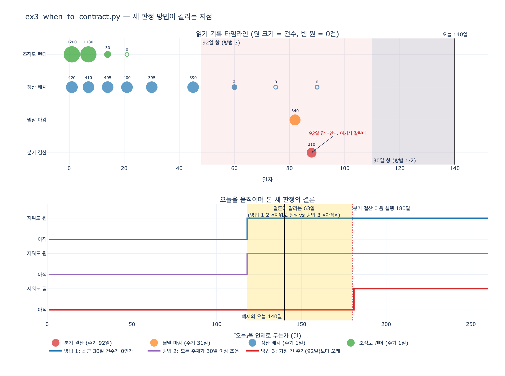

# `ex3_when_to_contract.py` — 세 판정 방법의 결론이 갈리는 지점

## 질문

`ex3_when_to_contract.py`에서 세 판정 방법의 결론은 어떻게 갈리는가?

## 답

'최근 30일 0건'과 '모든 주체 30일 조용'은 **지워도 된다**고 하고, '가장 긴 주기보다 오래'만 **아직**이라고 한다. 세 번째가 맞다.

---

## 1. 입력 데이터 — 무엇을 보고 판정하는가

예제는 「옛 이름(`이끔`)을 읽은 기록」 한 덩어리를 놓고 세 가지 규칙을 각각 돌린다. 판정 대상은 같고, 규칙만 다르다.

```python
# (일자, 읽은 주체, 건수)
READS = [
    (1,  "정산 배치",   420), (1,  "조직도 렌더", 1200),
    (7,  "정산 배치",   410), (7,  "조직도 렌더", 1180),
    (14, "정산 배치",   405), (14, "조직도 렌더",   30),
    (21, "정산 배치",   400), (21, "조직도 렌더",    0),
    (30, "정산 배치",   395),
    (45, "정산 배치",   390),
    (60, "정산 배치",     2),
    (75, "정산 배치",     0),
    (82, "월말 마감",    340),      # 월말에만 도는 배치
    (88, "분기 결산",    210),      # 분기에 한 번 도는 배치
    (90, "정산 배치",     0),
]
TODAY = 140
```

기록은 90일째까지만 있고 오늘은 140일째다. 즉 **최근 50일은 아예 기록이 없다.** 이게 함정의 절반이다.

`last_use`는 건수가 0보다 큰 마지막 날이다 (0건 기록은 「돌았지만 안 읽었다」이므로 사용으로 세지 않는다).

| 읽는 주체 | 마지막 사용 | 경과일 (`TODAY - last_use`) | 최근 30일 건수 |
|---|---:|---:|---:|
| 조직도 렌더 | 14 | 126 | 0 |
| 정산 배치 | 60 | 80 | 0 |
| 월말 마감 | 82 | 58 | 0 |
| 분기 결산 | 88 | **52** | 0 |

`분기 결산`의 52일이 이 카드의 전부다. 이 값 하나가 30보다 크고 92보다 작기 때문에 결론이 둘로 갈린다.

---

## 2. 세 판정 규칙을 나란히

### 방법 1 — 최근 30일 건수가 0인가

```python
quiet30 = all(sum(n for day, n in h if day > TODAY - 30) == 0
              for h in d.values())
```

창은 `day > 110`. 데이터의 마지막 날이 90이므로 창 안에 아무 기록도 없다. 합은 0. → **지워도 됨**

수식으로 쓰면

$$\text{quiet30} \iff \sum_{\substack{(d,\,n) \in \text{READS} \\ d > T - 30}} n = 0$$

### 방법 2 — 모든 주체가 30일 이상 조용한가

```python
all_quiet = all((TODAY - last_use(w, h)) >= 30 if last_use(w, h) else True
                for w, h in d.items())
```

경과일 최소값은 분기 결산의 52일. $52 \ge 30$ 이므로 모두 통과. → **지워도 됨**

$$\text{all\_quiet} \iff \min_{r}\,(T - \text{last\_use}(r)) \ge 30$$

### 방법 3 — 가장 긴 주기보다 오래 조용한가

```python
LONGEST_CYCLE = 92          # 제일 드문 것 — 분기 결산
safe = all((TODAY - last_use(w, h)) > LONGEST_CYCLE if last_use(w, h)
           else True for w, h in d.items())
```

$52 > 92$ 는 거짓. 분기 결산 하나 때문에 걸린다. → **아직**

$$\text{safe} \iff \min_{r}\,(T - \text{last\_use}(r)) > C_{\max}, \quad C_{\max} = 92$$

출력의 이유 칸: `분기 결산이 52일 전. 아직 한 주기가 안 지났다`

---

## 3. 왜 앞의 둘은 같은 결론을 내는가 — 핵심

여기가 시험에 잘 나오는 부분이다. 방법 1과 방법 2가 「우연히」 같은 답을 낸 게 아니다. **두 규칙은 사실상 같은 규칙이다.**

- 방법 1: 전체 합계가 30일 창 안에서 0인가
- 방법 2: 각 주체의 마지막 사용이 30일 창 밖인가

「창 안에 0건」 $\iff$ 「창 안에 사용한 주체가 없다」 $\iff$ 「모든 주체의 마지막 사용이 창 밖」. 집계 단위(전체 합 vs 주체별)만 다르고 **임계값 30일이 같다.** 그래서 같은 데이터에서 언제나 같은 방향으로 뒤집힌다.

실제로 임계값을 확인해 보면:

| 방법 | 기준 | 「지워도 됨」이 되는 최소 오늘 |
|---|---|---:|
| 1. 최근 30일 0건 | 창 30일 | $T \ge 118$ |
| 2. 모든 주체 30일 조용 | 창 30일 | $T \ge 118$ |
| 3. 가장 긴 주기보다 오래 | 창 92일 | $T \ge 181$ |

($88 + 30 = 118$, $88 + 92 = 180$, 방법 3은 등호를 안 주므로 181)

즉 **$T \in [118, 180]$ 인 구간 63일 동안 방법 1·2는 「지워도 됨」, 방법 3은 「아직」이라고 말한다.** 예제의 `TODAY = 140`은 일부러 이 구간 가운데에 박아 놓은 값이다.

세 방법의 진짜 차이는 판정 로직이 아니라 **창의 길이**다. 30일이냐 92일이냐. 앞의 둘은 창 길이를 「관습」으로 정했고, 세 번째는 「시스템에서 관측한 가장 긴 배치 주기」로 정했다.

---

## 4. 왜 세 번째가 맞는가

`분기 결산`은 88일째에 돌았고 주기는 92일이다. 다음 실행은 $88 + 92 = 180$일째다. 오늘이 140일이니 **40일 뒤에 깨어난다.** 지금 옛 이름을 지우면 40일 뒤에 없어진 이름을 찾다가 죽는다.

- 52일 조용한 것은 「안 쓴다」가 아니라 「아직 주기가 안 왔다」다.
- 드물게 도는 잡은 조용한 기간이 길다. 조용함의 길이로 사용 여부를 판단할 수 없다.
- 연말 정산이면 주기가 365일이다. 그러면 **1년 조용해도 지우면 안 된다.**

따라서 수축 기준은 「시간(30일)」이 아니라 **「가장 긴 주기」**여야 한다. 시스템에서 제일 드물게 도는 잡의 주기를 찾고 그보다 길게 기다린다. 주기는 크론 표현식을 파싱해서 계산한다.

### 30일 창이 놓치는 두 종류의 잡

| 주체 | 성격 | 30일 창으로 보면 | 실제 |
|---|---|---|---|
| 조직도 렌더 | 매일 | 조용 | 진짜로 새 코드로 옮겨 갔다 (1200 → 1180 → 30 → 0) |
| 정산 배치 | 매일 | 조용 | 진짜로 이행됐다 (395 → 390 → 2 → 0) |
| 월말 마감 | 월 1회 (~31일) | 조용 | 경과 58일. 자기 주기는 넘겼다 |
| 분기 결산 | 분기 1회 (92일) | 조용 | 경과 52일. **아직 한 주기도 안 지났다** |

30일 창에서는 네 줄이 전부 「조용」으로 보인다. 구분이 안 된다. 그게 방법 1·2가 틀리는 이유다. 92일 창으로 보면 조직도 렌더(126일)만 「조용」이고 나머지 셋은 「사용중」이 된다 — 분기 결산을 정확히 잡되 이미 이행이 끝난 월말 마감·정산 배치까지 함께 막는, 보수적이지만 안전한 판정이다.

참고로 방법 3은 **가장 긴 주기 하나를 모든 주체에 공통 적용**하는 보수적 규칙이다. 주체별 주기를 알고 있다면 「각 주체가 자기 주기보다 오래 조용한가」로 더 정확하게 물을 수 있는데, 이 데이터에서는 결론이 같다(분기 결산만 걸린다). 다만 걸리는 이유가 훨씬 정확해진다.

---

## 5. 0건 기록의 의미 — 이행이 잘 되고 있다는 신호

`조직도 렌더`: 1,200 → 1,180 → 30 → 0. `정산 배치`: 395 → 390 → 2 → 0.

건수가 0으로 기록된 줄은 「잡이 돌았지만 옛 이름을 안 읽었다」다. 즉 **새 코드로 옮겨 갔다는 증거**다. 그래서 `last_use`가 0건 줄을 사용으로 세지 않는 게 맞다. 이런 하강 곡선이 보이면 이행이 잘 되고 있는 것이다.

반대로 `월말 마감`(82일, 340건)과 `분기 결산`(88일, 210건)은 **떨어지는 곡선 없이 갑자기 한 번 튀어나온다.** 데이터 점이 하나뿐이면 그건 「이행 완료」가 아니라 「아직 한 번밖에 안 돌았다」는 뜻이다.

---

## 6. 크론으로도 못 잡는 것

크론 목록을 파싱해도 못 잡는 게 남는다. **사람이 손으로 도는 것.** 그래서 안전장치를 하나 더 둔다.

- 옛 이름을 읽으면 **경고 로그**를 남기게 하고 그 로그를 본다.
- 지우기 전 마지막 한 달은 **읽으면 알림**까지 켠다.
- 지울 때는 **되돌릴 수 있게** 지운다. 바로 `DROP` 하지 말고 이름만 바꿔 두고(`이끔` → `_deprecated_이끔`) 한 주기 더 기다린 다음 진짜로 지운다.
- 드물게 도는 잡일수록 실패 알림을 세게 건다. 매일 도는 건 내일 알지만 2년에 한 번 도는 건 2년 뒤에 안다.

---

## 7. 연결 지점

- `ex2_expand_contract.py`의 5단계(수축 — 옛 이름 삭제)를 **언제** 하느냐가 바로 이 예제의 주제다.
- `ex5_migration_plan.py`의 `contract` 게이트가 이 판정을 코드로 못 박는다:

  ```python
  "contract": [("가장 긴 주기보다 오래 조용한가",
                lambda s: s["옛것_마지막_읽기_경과일"] > s["가장_긴_주기_일"])],
  ```

  `STATE`에는 `옛것_마지막_읽기_경과일: 52`, `가장_긴_주기_일: 92`가 들어 있다. 예제 3의 숫자 그대로다. 문서로 적으면 사람이 「대충 된 것 같은데」로 넘어가지만, 코드로 적으면 넘어갈 수 없다.

## 한 줄 정리

방법 1과 2는 임계값이 똑같은 30일이라 언제나 같은 답을 내고(둘 다 「지워도 됨」), 방법 3만 임계값을 「관측된 가장 긴 배치 주기(92일)」로 두어 「아직」이라고 한다. 분기 결산의 경과 52일이 30과 92 사이에 있는 것이 갈림점이며, 그 잡은 40일 뒤에 깨어나므로 세 번째가 맞다.

## 시각화


