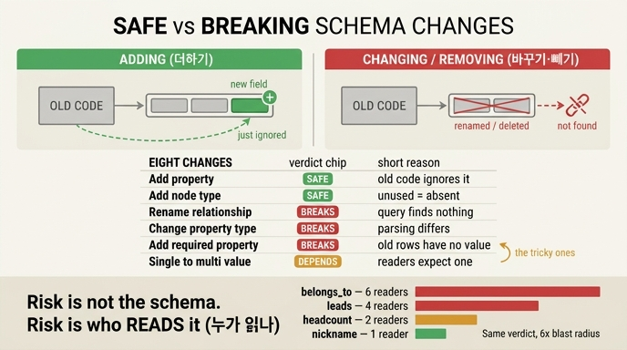

# 어떤 스키마 변경이 깨지고 어떤 변경이 안 깨지는가?

> **답**: 더하는 변경은 안 깨지고 바꾸거나 빼는 변경은 깨진다. 위험은 스키마가 아니라 「그 스키마를 어떻게 읽고 있느냐」에 있다.

## 한 줄로 압축한 규칙

스키마 변경의 안전 여부를 가르는 축은 딱 하나다.

| 축 | 판정 | 왜 |
|---|---|---|
| **더하기 (add)** | 안 깨짐 | 옛 코드는 새로 생긴 것을 *모르므로* 그냥 무시한다 |
| **바꾸기 (change)** | 깨짐 | 옛 코드가 기대한 모양과 실제 모양이 어긋난다 |
| **빼기 (remove)** | 깨짐 | 옛 코드가 찾던 게 사라진다 |

핵심은 「없는 걸 무시하는 건 공짜지만, 있던 걸 못 찾는 건 사고」라는 비대칭이다.
Protobuf의 [필드 추가는 호환, 필드 제거·타입 변경은 비호환](https://protobuf.dev/programming-guides/proto3/#updating)
규칙, Avro의 [schema resolution](https://avro.apache.org/docs/current/specification/#schema-resolution)에서도
같은 비대칭이 그대로 나타난다. 그래프 스키마도 예외가 아니다.

## 32장의 여덟 가지 변경 판정표

`ex1_breaking_change.py`의 `CHANGES` 표가 이 카드의 원문이다.

| 변경 | 예 | 판정 | 이유 |
|---|---|---|---|
| 관계 이름 바꾸기 | `이끔 → 리드` | **깨짐** | 쿼리가 못 찾는다 |
| 속성 추가 | `Person.email` 추가 | 안 깨짐 | 옛 코드는 그냥 무시한다 |
| 속성 제거 | `Person.nickname` 제거 | **깨짐** | 읽던 코드가 죽는다 |
| 속성 타입 변경 | `인원 STRING → INT64` | **깨짐** | 파싱이 달라진다 |
| 필수 속성 추가 | `Team.owner` 필수 | **깨짐** | 기존 노드에 값이 없다 |
| 관계 방향 뒤집기 | `속함` 방향 반전 | **깨짐** | 순회가 전부 어긋난다 |
| 새 노드 종류 추가 | `Project` 추가 | 안 깨짐 | 안 쓰면 없는 것과 같다 |
| 단일값 → 다중값 | `이끔`을 여러 개 허용 | **조건부** | 읽는 쪽이 한 개를 기대하면 깨짐 |

여기서 두 줄을 눈여겨볼 것.

- **「필수 속성 추가」가 깨진다**는 게 규칙의 정확한 경계를 보여준다. 겉보기로는
  「더하기」인데 깨진다. 왜냐면 필수(required)를 더하는 건 사실 *기존 데이터에 대한
  제약을 바꾸는 일*이기 때문이다. 그래서 더할 때는 반드시 **optional**로 더한다.
  이게 확장-수축(expand-contract)에서 「확장」이 항상 옵셔널 추가인 이유다.
- **「단일값 → 다중값」이 조건부**라는 게 답 후반부의 복선이다. 스키마만 보면
  판정이 안 나온다. 읽는 쪽 코드가 「하나」를 기대하고 `[0]`을 꺼내 쓰는지,
  리스트를 순회하는지에 따라 결과가 갈린다.

## 그래서 위험은 스키마가 아니라 「읽는 쪽」에 있다

같은 「깨지는 변경」이라도 폭발 반경이 다르다. 32장은 29장에서 쌓아둔
`Reads` 엣지(어느 실행이 어느 필드를 읽었는지의 기록)로 그 반경을 센다.

| 필드 | 읽는 실행 수 | 읽는 것들 |
|---|---|---|
| `속함` | **6** | 보고서 발송, 조직도 렌더, 권한 계산, 정산 배치, 온보딩, 감사 리포트 |
| `이끔` | 4 | 보고서 발송, 조직도 렌더, 권한 계산, 알림 라우팅 |
| `인원` | 2 | 정산 배치, 대시보드 |
| `nickname` | **1** | 인사말 생성 |

`속함`을 바꾸면 실행 6개가 깨지고 `nickname`을 바꾸면 1개가 깨진다.
판정표상 둘 다 똑같이 「깨짐」인데 **값이 여섯 배 다르다.** 그래서 판정표는
1단계고, 실제 결정은 「누가 읽나」를 센 다음에 나온다.

32장이 제시하는 순서:

```
1. 바꾸려는 필드를 «누가 읽는지» 센다
2. 그 수가 1~2 면 그냥 바꾼다
3. 여섯이면 확장-수축(expand-contract)으로 간다
```

> 세는 데 5분 걸리고, 안 세면 배포하고 나서 안다.

### 왜 코드 검색으로는 부족한가

「이 필드를 누가 쓰나」를 grep으로 찾으려 하면 **동적으로 조립된 쿼리**를 놓친다.
문자열 결합, 설정 파일에서 온 필드명, 템플릿으로 만든 Cypher는 검색에 안 걸린다.
`Reads` 엣지는 *실제로 읽은 기록*이라 검색에 안 걸리는 것까지 잡힌다.
이게 31장(같은 필드를 두고 다투는 문제)과 32장(필드 자체가 바뀌는 문제)을
잇는 지점이다.

## 깨지는 변경을 「안 깨지게」 바꾸는 법: 확장-수축

깨지는 변경도 **더하기의 연쇄로 분해**하면 무중단으로 넘길 수 있다.
`이끔 → 리드` 이름 변경을 여섯 단계로 쪼갠 `ex2`의 골자.

| 단계 | 하는 일 | 옛 코드 | 새 코드 |
|---|---|---|---|
| 0. 시작 | 옛 이름만 존재 | 동작 | ✗ |
| 1. **확장** | 새 이름을 *같이* 쓴다 (더하기) | 동작 | 동작 |
| 2. 새 코드 배포 (읽기만) | 둘 다 산다 | 동작 | 동작 |
| 3. 쓰기를 새 이름으로 | 신규는 새 이름으로만 | 동작 | 동작 |
| 4. 옛 코드 제거 | 읽는 쪽이 사라진다 | — | 동작 |
| 5. **수축** | 옛 이름 삭제 (빼기) | ✗ | 동작 |

한 번에 바꾸면 배포 순간에 반드시 하나가 죽는다.

```
DB 를 먼저 바꾸면  → 옛 코드가 죽는다
코드를 먼저 바꾸면 → 새 코드가 죽는다
```

확장-수축은 그 사이에 **둘 다 되는 구간**을 만드는 방법이다
([Martin Fowler, ParallelChange](https://martinfowler.com/bliki/ParallelChange.html)).
순서는 **읽기 먼저, 쓰기 나중**이다. 거꾸로 하면 새 이름으로 쓴 데이터를
옛 코드가 못 읽는다.

그리고 어려운 건 확장이 아니라 **5단계를 언제 하느냐**다. 「아무도 안 쓴다」의
기준은 「최근 30일」이 아니라 **가장 긴 배치 주기**여야 한다 —
분기 결산이면 92일, 연말 정산이면 365일.

## 시험에 나오는 포인트

1. **가르는 축은 add vs change/remove.** 「더하기는 안전, 바꾸기·빼기는 위험」.
2. **예외처럼 보이는 것들**: 필수 속성 추가(= 제약 변경이라 깨짐),
   단일값→다중값(= 읽는 쪽에 따라 조건부).
3. **답의 후반부가 진짜 요지**: 위험은 스키마 자체가 아니라
   *그 스키마를 어떻게 읽고 있느냐*다. 같은 판정이라도 리더 수에 따라
   6배 차이가 난다.
4. **깨지는 변경 = 더하기 + 기다리기 + 빼기** 로 분해할 수 있다(확장-수축).

## 함께 볼 것

- 32.1 무엇이 깨지고 무엇이 안 깨지나 — `code/ex1_breaking_change.py`
- 32.2 둘 다 되는 구간을 만든다 — `code/ex2_expand_contract.py`
- 29장 `Reads` 엣지 — 「누가 읽나」를 세는 데이터의 출처
- [ParallelChange (expand-contract)](https://martinfowler.com/bliki/ParallelChange.html)
- [Protobuf: updating a message type](https://protobuf.dev/programming-guides/proto3/#updating)
- [Avro schema resolution](https://avro.apache.org/docs/current/specification/#schema-resolution)

## 인포그래픽


