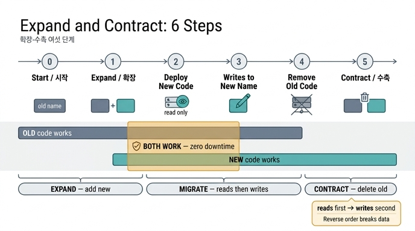

# 확장-수축(expand and contract)의 여섯 단계

## 질문과 답

**Q.** 확장-수축의 여섯 단계는 무엇인가?

**A.** 시작, 확장(새 이름 같이 쓰기), 새 코드 배포(읽기만), 쓰기를 새 이름으로, 옛 코드 제거, 수축(옛 이름 삭제)이다.

## 왜 여섯 단계로 쪼개나

돌아가는 시스템에서 스키마 이름을 「한 번에」 바꾸면 배포 순간에 반드시 한쪽이 죽는다. 32장 예제 2(`ex2_expand_contract.py`)가 이걸 두 줄로 정리한다.

- DB를 먼저 바꾸면 → **옛 코드가 죽는다** (옛 이름을 못 찾는다)
- 코드를 먼저 바꾸면 → **새 코드가 죽는다** (새 이름이 아직 DB에 없다)

즉 「원자적 스위치」라는 건 존재하지 않는다. 그래서 옛것과 새것이 **둘 다 되는 구간**을 일부러 만들어 두고, 그 구간을 지나가는 방식으로 바꾼다. 이것이 확장-수축(Martin Fowler는 이를 Parallel Change라고 부른다)이다.

## 여섯 단계

책의 예제는 관계 이름 `이끔 → 리드` 변경을 다음 여섯 단계로 나눈다.

| # | 단계 | 하는 일 | 옛 코드 | 새 코드 |
|---|---|---|---|---|
| 0 | **시작** | 아직 아무것도 안 했다. 옛 이름만 존재 | 동작 | ✗ 안 됨 |
| 1 | **확장 — 새 이름을 「같이」 쓴다** | 옛 이름을 지우지 않고 새 이름을 *더한다* (기존 엣지를 새 이름으로 복사) | 동작 | 동작 |
| 2 | **새 코드 배포 (읽기만)** | 새 이름을 읽는 코드를 배포. 쓰기는 아직 옛 이름 | 동작 | 동작 |
| 3 | **쓰기를 새 이름으로** | 새로 들어오는 데이터는 새 이름으로 쓴다 | 동작 | 동작 |
| 4 | **옛 코드 제거** | 옛 이름을 읽는 코드를 걷어낸다 | (제거됨) | 동작 |
| 5 | **수축 — 옛 이름 삭제** | 아무도 안 쓰는 게 확인되면 옛 이름을 지운다 | ✗ | 동작 |

핵심은 **1~3단계가 겹침 구간**이라는 점이다. 특히 2단계와 3단계에서는 옛 코드와 새 코드가 *둘 다* 동작한다. 그 구간이 있어야 무중단 배포가 된다. 배포 중에 옛 버전 인스턴스와 새 버전 인스턴스가 동시에 떠 있어도 아무도 죽지 않는다.

## 세 국면으로 묶어 보기

여섯 단계는 크게 세 국면으로 묶인다.

- **확장(expand)** — 새것을 *더한다*. 옛것은 그대로 둔다. (1단계)
- **이행(migrate)** — 읽기를 옮기고, 그다음 쓰기를 옮긴다. (2~4단계)
- **수축(contract)** — 아무도 안 쓰는 게 확인되면 옛것을 지운다. (5단계)

## 순서가 왜 「읽기 먼저, 쓰기 나중」인가

이 장이 반복해서 강조하는 규칙이다.

> 읽기 먼저, 쓰기 나중.

거꾸로 하면(쓰기를 먼저 새 이름으로 옮기면) 새 이름으로 쓴 데이터를 아직 살아 있는 옛 코드가 못 읽는다. 데이터는 들어가는데 읽는 쪽에서는 「없는 것」이 되는, 조용한 데이터 유실이 생긴다. 반대로 읽기를 먼저 옮겨 두면 새 코드는 이미 새 이름을 볼 준비가 되어 있으므로, 쓰기가 새 이름으로 넘어가는 순간에도 아무것도 깨지지 않는다.

## 가장 어려운 단계는 5번(수축)

「어떻게 바꾸나」는 위 여섯 줄로 끝난다. 실무의 어려움은 *「언제 5단계를 해도 되나」*, 즉 「아무도 안 쓴다」를 어떻게 확인하느냐다. 32장 예제 3의 결론은 이렇다.

- 기준은 「최근 30일」이 아니라 **「가장 긴 배치 주기」**다. 분기 결산이면 92일, 연말 정산이면 365일.
- 52일째 조용해도, 그게 92일마다 도는 잡이면 40일 뒤에 깨어나서 없어진 이름을 찾는다.
- 주기는 크론 표현식을 파싱해서 계산한다. 크론에 없는 것(사람이 손으로 도는 것)은 옛 이름을 읽을 때 **경고 로그/알림**을 걸어서 잡는다.
- 지울 때도 **되돌릴 수 있게** 지운다. 바로 DROP하지 않고 `이끔 → _deprecated_이끔`처럼 이름만 바꿔 두고 한 주기 더 기다린 다음 진짜로 지운다.

## 관련 확장 개념

예제 5(`ex5_migration_plan.py`)는 같은 흐름을 게이트가 붙은 여섯 단계 상태 기계로 재정리한다. 카드의 여섯 단계와 이름이 조금 다르니 헷갈리지 않도록 비교해 두면 좋다.

| 예제 5의 단계 | 다음으로 가려면 |
|---|---|
| expand | 새 스키마가 있나 |
| dual-write | 양쪽 쓰기가 100%인가 |
| backfill | 백필이 끝났나 |
| dual-read | 불일치가 0인가 |
| cutover | 옛것 읽기가 0인가 / 롤백이 가능한가 |
| contract | 가장 긴 주기보다 오래 조용한가 |

이행 중에는 데이터가 어긋난다(예제 4). 안 어긋나는 이행은 없다. 중요한 건 어긋나는 것을 *막는* 게 아니라 *아는* 것이고, 그래서 이행 구간에는 「둘 다 읽고 비교」로 돌려 불일치를 지표로 세고, **0이 될 때까지 수축하지 않는다**.

## 암기 팁

「**시-확-읽-쓰-철-삭**」 순으로 외운다.

1. 시작
2. 확장 (새 이름 같이)
3. 읽기 옮김 (새 코드 배포, 읽기만)
4. 쓰기 옮김 (새 이름으로 쓰기)
5. 철거 (옛 코드 제거)
6. 삭제 (수축, 옛 이름 삭제)

가운데 「읽기 → 쓰기」 순서와, 양 끝의 「더하기(확장) ↔ 지우기(수축)」 대칭만 붙잡으면 전체가 복원된다.

## 인포그래픽

