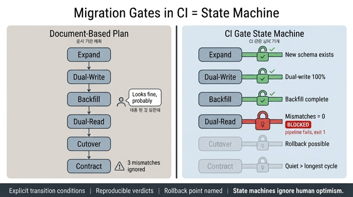

# 마이그레이션 관문을 CI에 넣으면 무엇이 되는가

**답**: 마이그레이션이 **상태 기계**가 된다. 상태 기계는 사람의 낙관을 타지 않는다.

---

## 1. 왜 이 말이 나오는가

32장의 마지막 예제(`ex5_migration_plan.py`)는 확장-수축 마이그레이션 여섯 단계를
"문서"가 아니라 "코드"로 적는다. 그 파일의 마지막 두 줄이 그대로 이 카드의 답이다.

> 이 파일을 CI 에 넣으면 마이그레이션이 «상태 기계»가 된다.
> 그리고 상태 기계는 사람의 낙관을 안 탄다.

앞부분에 문제 진단이 붙어 있다.

> 계획을 문서로 적으면 「지금 어디쯤인가」를 사람이 판단하게 된다.
> 그리고 사람은 「대충 된 것 같은데」로 다음 단계로 넘어간다.
> 조건을 코드로 적으면 «넘어갈 수 없다». 불일치 3건이 남아 있으면 막힌다.

핵심 대비는 이것이다.

| | 문서 기반 계획 | CI 관문 (상태 기계) |
|---|---|---|
| 현 단계 판정 | 사람의 기억·감 | 관측값 + 조건식 |
| 전이 허용 | "대충 된 것 같은데" | 조건 미충족이면 파이프라인 실패 |
| 재현성 | 판단하는 사람마다 다름 | 같은 입력 → 같은 판정 |
| 놓치는 것 | 드물게 도는 배치, 남은 불일치 | 조건에 박혀 있으므로 못 넘어감 |

## 2. 여섯 단계와 관문 조건

예제의 단계(PHASES)와 각 단계를 **떠나기 위해** 통과해야 하는 조건(GATES)이다.
조건은 "그 단계에 들어가는 조건"이 아니라 **"그 단계를 졸업하는 조건"**이라는 점이 중요하다.

| # | 단계 | 하는 일 | 떠날 조건 (게이트) |
|---|---|---|---|
| 1 | `expand` | 새 스키마를 더한다. 옛것 그대로 | 새 스키마가 있나 |
| 2 | `dual-write` | 쓰기를 양쪽에 한다 | 양쪽 쓰기가 100%인가 |
| 3 | `backfill` | 옛 데이터를 새 스키마로 복사 | 백필이 끝났나 (진행률 ≥ 1.0) |
| 4 | `dual-read` | 읽기를 둘 다 하고 비교 | **불일치가 0인가** |
| 5 | `cutover` | 읽기를 새것으로. 옛것은 검증용 | 옛것 읽기가 0인가 **AND 롤백이 가능한가** |
| 6 | `contract` | 옛 스키마 삭제 | 가장 긴 주기보다 오래 조용한가 |

조건 여섯 개가 전부 앞 예제들에서 유도된 것이라는 점이 이 설계의 요지다.

- 양쪽 쓰기 100% → 예제 2(확장-수축)의 3단계 "쓰기를 새 이름으로"
- 불일치 0 → 예제 4의 "둘 다 읽고 비교" 전략이 세는 지표
- 가장 긴 주기 → 예제 3의 분기 결산(92일). "최근 30일"이 아니다
- 롤백 가능 → cutover가 되돌리기 제일 어려운 단계라 **그 앞에서** 묻는다

## 3. CI에 넣는 구체적인 형태

책의 예제는 세 조각으로 나뉜다. 실무 형태로 옮기면 다음과 같다.

### (a) 단계 상태를 저장하는 곳

예제에서는 `PHASES` 리스트가 단계 정의를, 관측값 딕셔너리 `STATE`가 현재 상태를 갖는다.

```python
STATE = {
    "새_스키마_존재": True,
    "양쪽_쓰기_비율": 1.00,
    "백필_진행률": 1.00,
    "불일치_건수": 3,          # ← 여기서 막힌다
    "옛것_읽기_건수_최근": 0,
    "가장_긴_주기_일": 92,
    "옛것_마지막_읽기_경과일": 52,
    "롤백_가능": True,
}
```

실무에서 이 자리에 오는 것들:

- **레포에 커밋되는 선언 파일** — `migration.yaml`/`migration.py`에 "현재 목표 단계"를 적고
  PR로 바꾼다. 단계 전진 자체가 리뷰 대상이 되고 git 히스토리가 남는다.
- **메타데이터 테이블/그래프 노드** — 마이그레이션 노드에 `phase` 속성을 두고
  전이 시각을 엣지로 기록한다(29장의 `Reads` 엣지와 같은 계열의 사실 기록).
- **관측값은 저장하지 않고 매번 읽는다** — 백필 진행률, 불일치 건수, 옛것 읽기 건수는
  스냅샷을 손으로 적어 두면 그 순간 다시 "문서"가 된다. 잡이 실행 시점에 조회해야 한다.

### (b) 지표를 읽어 판정하는 잡

`GATES`는 라벨과 판정 함수의 쌍이다. 함수는 `STATE`만 받고 부수효과가 없다.

```python
GATES = {
    "dual-read": [("불일치가 0인가", lambda s: s["불일치_건수"] == 0)],
    "cutover":   [("옛것 읽기가 0인가", lambda s: s["옛것_읽기_건수_최근"] == 0),
                  ("롤백이 가능한가",   lambda s: s["롤백_가능"])],
    "contract":  [("가장 긴 주기보다 오래 조용한가",
                   lambda s: s["옛것_마지막_읽기_경과일"] > s["가장_긴_주기_일"])],
}
```

CI 잡이 하는 일은 순서대로 이렇다.

1. 지표를 실제 원천에서 읽는다 — 불일치 카운터(예제 4의 `compare_both`가 올리는 메트릭),
   백필 체크포인트, 옛 필드 읽기 로그, 크론 표현식을 파싱해 얻은 가장 긴 주기.
2. 선언된 목표 단계까지 각 게이트를 평가한다.
3. 첫 번째로 실패한 게이트를 `blocked_at`으로 보고한다.

```python
blocked_at = None
for name, what in PHASES:
    oks = [(label, fn(STATE)) for label, fn in GATES[name]]
    if not all(v for _l, v in oks) and blocked_at is None:
        blocked_at = name
```

출력이 "막혀 있는 곳: dual-read → 불일치가 0인가 : 아니오" 형태로 나오는 것이 중요하다.
사람이 다음에 무엇을 해야 하는지 한 줄로 알 수 있어야 관문이 우회 대상이 되지 않는다.

### (c) 실패 시 파이프라인 차단

예제는 출력만 하지만 CI에서는 **비영점 종료 코드**가 되어야 한다.

- 목표 단계의 게이트가 하나라도 실패하면 `exit 1` → 해당 단계로 전진시키는 PR이 머지되지 않는다.
- 특히 `contract`(옛 스키마 DROP) 마이그레이션을 담은 PR은 이 잡이 초록일 때만 통과한다.
  DDL을 실행하는 배포 잡의 선행 조건으로 걸어 두면 "관문을 안 보고 지웠다"가 구조적으로 불가능해진다.
- 잡을 **스케줄로도 돌린다.** PR 때만 돌면 "관문이 초록이었을 때"가 과거 시점이 된다.
  매일 돌면서 불일치가 다시 생기면 알려 준다. 예제 3의 교훈대로,
  드물게 도는 잡일수록 실패 알림을 세게 걸어야 한다.

## 4. "상태 기계"라는 말의 성질

관문 코드를 CI에 넣으면 마이그레이션이 다음 세 가지 성질을 얻는다.
그래서 "상태 기계"라고 부를 수 있는 것이다.

### 전이 조건이 명시적이다

상태 기계는 상태 집합과 전이 규칙으로 정의된다. 여기서 상태는 여섯 단계이고,
전이는 `phase_i → phase_{i+1}`뿐이며, 각 전이에는 가드(guard)가 붙어 있다.
"다음 단계로 갈 조건"이 코드로 한 줄씩 적혀 있으므로 해석의 여지가 없다.
문서 계획에는 이 가드가 없거나, 있어도 강제력이 없다.

### 판정이 재현 가능하다

게이트 함수는 `STATE`의 순수 함수다. 같은 관측값이면 누가 언제 돌려도 같은 답이 나온다.
사람의 판단은 재현되지 않는다. 마감이 급하면 같은 상황을 다르게 판정한다.
이것이 "사람의 낙관을 안 탄다"의 실제 내용이다 —
낙관은 관측값을 바꾸지 못하고, 판정은 관측값만 본다.

### 되돌아갈 수 있는 지점이 명시된다

전이는 앞으로만 가지만, 되돌리기 가능성은 게이트 조건 자체에 들어 있다.

- `expand` ~ `dual-read`는 되돌리기 쉽다. 새것을 더했을 뿐 옛것이 그대로 살아 있다.
- `cutover`는 되돌리기 제일 어려운 단계다. 그래서 이 단계를 떠나기 전에
  `롤백_가능`을 명시적으로 묻는다. "옛 스키마가 아직 살아 있고 데이터가 최신이면 되돌릴 수 있다."
- `contract`는 사실상 되돌릴 수 없다. 그래서 게이트가 가장 보수적이다(가장 긴 주기 초과).
  예제 3의 조언대로 삭제도 2단계로 쪼갠다 —
  먼저 `이끔 → _deprecated_이끔`으로 이름만 바꿔 한 주기 더 기다린 뒤 진짜로 지운다.
  이름 변경 단계는 되돌릴 수 있는 상태이므로, 사실상 되돌릴 수 없는 전이 앞에
  되돌릴 수 있는 전이를 하나 더 끼워 넣는 것이다.

## 5. 한 문장 정리

마이그레이션 계획을 문서로 적으면 사람이 "대충 된 것 같은데"로 단계를 넘기지만,
게이트 조건을 코드로 적어 CI에서 실패하게 만들면 조건을 못 채운 전이가 물리적으로 불가능해진다.
그래서 마이그레이션은 상태 기계가 되고, 상태 기계는 사람의 낙관을 타지 않는다.

> 참고: 예제 5는 일부러 `dual-read`에서 막히게 되어 있다.
> `STATE["불일치_건수"]`를 0으로 바꾸면 다음 단계로 넘어간다.

## 인포그래픽


