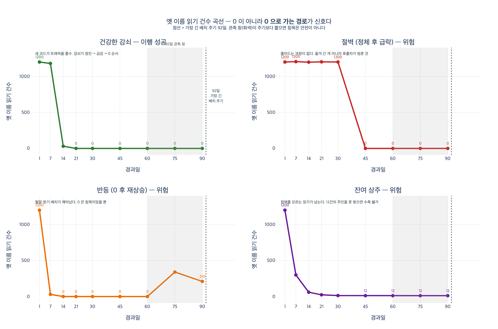

# 이행이 잘 되고 있다는 신호는 무엇인가?

**답:** 옛 이름 읽기 건수가 **1,200 → 1,180 → 30 → 0**으로 떨어지는 곡선이다. 새 코드로 옮겨 간 흔적이다.

---

## 1. 왜 "곡선"이 신호인가

32장은 「이끔 → 리드」로 관계 이름 하나를 바꾸는 데 6주가 걸린 이야기다. 그 6주의 절반은 *어떻게 바꾸나*가 아니라 **「언제 옛것을 지워도 되나」**에 쓰인다. 그리고 그 질문에 답할 수 있는 유일한 근거는 **관측된 읽기 건수**다.

이행 진척을 확인하는 방법으로 흔히 쓰는 것들은 다 증거가 못 된다.

| 근거 | 왜 부족한가 |
|---|---|
| "새 코드를 배포했다" | 배포는 **의도**다. 옛 경로가 아직 살아 있을 수 있다 |
| "코드 검색에 옛 이름이 안 나온다" | 동적으로 조립한 쿼리는 그렙에 안 걸린다 (32.1 / 29장) |
| "담당자가 다 옮겼다고 했다" | 사람의 낙관이다. `ex5`가 게이트를 코드로 박아 두는 이유 |
| **옛 이름 읽기 건수가 줄어드는 곡선** | **실제로 읽은 기록**이다. 검색에 안 걸리는 것도 잡힌다 |

29장에서 만들어 둔 `Reads` 엣지가 여기서 값을 한다. "이 필드를 누가 읽는가"를 그래프에 물을 수 있고, 그 답이 시간에 따라 어떻게 줄어드는지가 곧 이행의 진척률이다.

## 2. 원문 데이터 — 조직도 렌더의 곡선

`ex3_when_to_contract.py`의 `READS`에서 조직도 렌더만 뽑으면 이렇다.

| 일자 | 건수 | 감쇠율 |
|---:|---:|---:|
| 1일 | 1,200 | — |
| 7일 | 1,180 | 1.7% |
| 14일 | **30** | **97.5%** |
| 21일 | **0** | 100% |

읽는 법:

- **1일 → 7일 (1.7% 감소)** — 아직 옛 코드가 트래픽을 다 받고 있다. 확장(expand)은 끝났지만 읽기는 안 옮겨졌다.
- **7일 → 14일 (97.5% 감소)** — 이 구간에서 새 코드 배포가 롤아웃됐다. **트래픽이 새 이름으로 흡수된 순간**이 곡선에 찍힌다.
- **14일 → 21일 (30건 → 0)** — 남은 30건은 캐시된 인스턴스, 롤링 배포의 잔여 파드, 재시도 큐 같은 꼬리다. 그게 마르면 0이다.

같은 파일의 **정산 배치**와 대조하면 의미가 뚜렷해진다. 420 → 410 → 405 → 400 → 395 → 390. 60일까지 **7%밖에 안 줄었다.** 이 곡선은 "이행 중"이 아니라 **"손 안 댐"**이다. 곡선 모양만 보고도 어느 호출자가 아직 남았는지 짚을 수 있다.

## 3. 핵심 — 0이 신호가 아니다, **0으로 가는 경로**가 신호다

마지막 값이 0인 곡선은 여러 가지가 있는데 그중 하나만 이행 성공이다.

| 모양 | 예 | 실제로 벌어진 일 | 판정 |
|---|---|---|---|
| **건강한 감쇠** | 1200 → 1180 → 30 → 0 | 새 코드가 트래픽을 흡수 | 이행 성공 |
| 절벽 (정체 후 급락) | 1200 → 1200 → 1200 → 0 | 옮겨 간 게 아니라 **호출자가 죽었다**. 장애·잡 실패·피처플래그 오프 | 위험 |
| 반등 (0 찍고 재상승) | 1200 → 30 → 0 → 340 | 월말 마감·분기 결산이 깨어났다. 0은 **침묵**이었을 뿐 | 위험 |
| 잔여 상주 | 1200 → 60 → 14 → 12 | 정체를 모르는 읽기가 남는다. 12건의 주인을 못 찾으면 수축 불가 | 위험 |

'절벽'이 특히 위험한 건 **마지막 값과 재상승 여부만으로는 건강한 곡선과 구별이 안 되기 때문**이다. 둘 다 끝값이 0이고 반등도 없다. 구별하려면 *0에 닿기 직전까지 얼마나 줄었나*를 봐야 한다.

- 건강한 곡선: 0 직전 값이 30 → 초기값 대비 **97.5% 감쇠**. 사라지는 과정이 있었다.
- 절벽 곡선: 0 직전 값이 1,200 → **0% 감쇠**. 아무것도 안 줄다가 그냥 끊겼다.

정리하면 판정은 세 조건의 논리곱이다.

```
healthy ⟺ (0에 닿는다) ∧ (0 이후 재상승 없다) ∧ (0 직전까지의 감쇠 > 50%)
```

## 4. 침묵은 안전이 아니다 — 관측 창 vs 배치 주기

곡선이 0으로 떨어졌다고 바로 지우면 안 된다. 32.3의 핵심이 여기다. `ex3`은 같은 데이터에 세 가지 판정을 돌린다 (오늘 = 140일째).

| 읽는 주체 | 마지막 사용 | 경과일 | 최근 30일 건수 |
|---|---:|---:|---:|
| 조직도 렌더 | 14일 | 126 | 0 |
| 정산 배치 | 60일 | 80 | 0 |
| 월말 마감 | 82일 | 58 | 0 |
| 분기 결산 | 88일 | 52 | 0 |

| 판정 방법 | 결론 | 왜 |
|---|---|---|
| 최근 30일 건수가 0인가 | 지워도 됨 | 관측 창 안에는 아무도 안 읽었다 |
| 모든 주체가 30일 이상 조용한가 | 지워도 됨 | 제일 최근이 52일 전 |
| **가장 긴 주기(92일)보다 오래 조용한가** | **아직** | **분기 결산이 52일 전. 한 주기가 안 지났다** |

**앞의 둘이 틀리고 세 번째가 맞다.** 분기 결산은 92일마다 도는 잡이다. 52일째 조용한 건 안 쓰는 게 아니라 **아직 깨어날 차례가 아닌 것**이다. 지금 지우면 40일 뒤에 없어진 이름을 찾으며 죽는다. 연말 정산이면 365일이니 «1년 조용»해도 지워선 안 된다.

$$ \text{safe} \iff (t_{\text{now}} - t_{\text{last read}}) > T_{\max\ \text{cycle}} $$

즉 기준은 **시간이 아니라 주기**다. 30일·90일 같은 관습적 숫자가 아니라, 시스템에서 제일 드물게 도는 잡의 주기를 찾아 그보다 길게 기다린다. 그 주기는 **크론 표현식을 파싱해서** 계산한다.

### 크론에 없는 것들

사람이 손으로 도는 것, 외부 팀이 호출하는 것은 크론에 없다. 그래서 안전장치를 더 둔다.

1. 옛 이름을 읽으면 **경고 로그**를 남기고 그 로그를 본다.
2. 지우기 전 마지막 한 달은 **읽으면 알림**까지 켠다.
3. 드물게 도는 잡일수록 **실패 알림을 세게** 건다 — 매일 도는 건 내일 알지만 2년에 한 번 도는 건 2년 뒤에 안다.
4. 지울 때는 **되돌릴 수 있게** 지운다. 바로 `DROP` 하지 않고 이름만 바꿔 두고(`이끔` → `_deprecated_이끔`) 한 주기 더 기다린 다음 진짜로 지운다.

## 5. 곡선은 확장-수축의 어디에 찍히나

`ex2`의 여섯 단계 위에 곡선을 겹쳐 놓으면 이렇게 대응된다.

| 단계 | 하는 일 | 옛 이름 읽기 건수 |
|---|---|---|
| 0. 시작 | — | 1,200 (100%) |
| 1. 확장 | 새 이름을 **같이** 쓴다 | 1,200 — 안 변한다 |
| 2. 새 코드 배포 (읽기만) | 읽기를 새 이름으로 | **1,180 → 30 → 0** ← 감쇠는 여기서 일어난다 |
| 3. 쓰기를 새 이름으로 | 쓰기 이전 | 0 유지 |
| 4. 옛 코드 제거 | 코드 삭제 | 0 유지 |
| 5. 수축 | 옛 이름 삭제 | 한 주기 이상 0을 유지한 뒤에만 |

순서는 **읽기 먼저, 쓰기 나중**이다. 거꾸로 하면 새 이름으로 쓴 데이터를 옛 코드가 못 읽는다. 그리고 감쇠 곡선은 정확히 2단계의 증거다 — 확장 단계에서 곡선이 안 움직이는 건 정상이고, **2단계에서도 안 움직이면 배포가 실제로는 안 먹은 것**이다.

## 6. 곡선 하나로는 부족하다 — 함께 봐야 하는 지표

`ex5_migration_plan.py`는 관측값을 게이트로 코드에 박는다. 읽기 건수 0은 그 게이트 중 **하나**일 뿐이다.

| 단계 | 통과 조건 | 근거 예제 |
|---|---|---|
| dual-write | 양쪽 쓰기가 100%인가 | ex2의 3단계 |
| backfill | 백필이 끝났나 | 32.4 — 쪼개서, 진척 남기고, 멱등하게 |
| dual-read | **불일치가 0인가** | ex4의 «둘 다 읽고 비교» |
| cutover | **옛것 읽기가 0인가** / 롤백이 가능한가 | ex3의 곡선 |
| contract | **가장 긴 주기보다 오래 조용한가** | ex3의 분기 결산 |

`ex5`는 일부러 `dual-read`에서 막혀 있다 (`불일치_건수: 3`). 읽기 건수가 0이어도 **불일치 3건이 남아 있으면 넘어갈 수 없다.** 이행 중에는 데이터가 어긋난다 — 안 어긋나는 이행은 없다. 중요한 건 어긋나는 것을 *막는* 게 아니라 *아는* 것이고, `ex4`의 네 전략 중 «둘 다 읽고 비교»만 그걸 알려 준다.

계획을 문서로 적으면 사람이 "대충 된 것 같은데"로 넘어간다. 코드로 적으면 **넘어갈 수 없다.** 상태 기계는 사람의 낙관을 안 탄다.

## 7. 한 줄 정리

**이행이 잘 되고 있다는 신호는 옛 이름 읽기 건수의 점진적 감쇠 곡선(1,200 → 1,180 → 30 → 0)이다.** 다만 그 0이 안전을 뜻하려면 세 가지가 함께 성립해야 한다.

1. 곡선이 **점진적으로** 떨어져 0에 닿는다 (절벽이 아니다)
2. 0에 닿은 뒤 **가장 긴 배치 주기보다 오래** 0을 유지한다 (반등이 없다)
3. 그 사이 «둘 다 읽고 비교»의 **불일치 건수도 0**이다

하나라도 빠지면 0은 이행의 증거가 아니라 **관측 실패의 증거**다.

## 시각화


