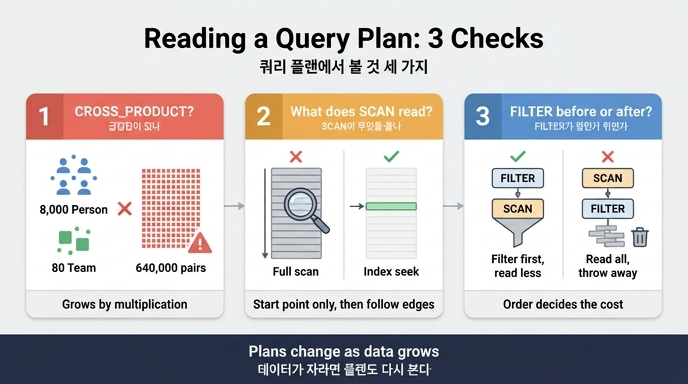

# 쿼리 플랜에서 봐야 할 세 가지

**질문**: 쿼리 플랜에서 봐야 할 세 가지는 무엇인가?

**답**: `CROSS_PRODUCT`가 있나, `SCAN`이 무엇을 훑나, `FILTER`가 SCAN 앞인가 뒤인가다.

---

## 왜 「세 가지」인가

쿼리 플랜(query plan)은 엔진이 「이 쿼리를 이렇게 실행하겠다」고 내놓는 연산자 트리입니다. `EXPLAIN`을 붙이면 실행하지 않고 계획만 보여줘요. 문제는 원문 출력이 폭도 넓고 항목도 많아서, 처음 보면 어디를 봐야 할지 모른다는 겁니다.

33장은 그 중에서 **비용을 실제로 갈라놓는 신호 셋**만 뽑았습니다. 나머지는 대개 엔진이 알아서 잘합니다. 특히 「작은 쪽에서 시작하라」 같은 옛 규칙은 요즘 플래너에서 대개 상관없습니다 — 플래너가 알아서 시작점을 고릅니다.

정리하면 체크 순서는 이렇습니다.

1. **`CROSS_PRODUCT`가 있나** — 있으면 거기부터 고친다
2. **`SCAN`이 무엇을 훑나** — 인덱스를 타나, 전체를 훑나
3. **`FILTER`가 SCAN 「앞」인가 「뒤」인가** — 뒤면 훑고 나서 버리는 것이다

---

## 1. `CROSS_PRODUCT`가 있나 — 제일 먼저 찾을 단어

곱집합(cartesian product)입니다. 두 집합을 각각 만들어 놓고 모든 조합을 붙인 다음 거기서 거르는 방식이에요. 데이터가 자라면 비용이 **곱으로** 커집니다.

플랜에 이 단어가 보이면 「두 끝을 따로 찾아서 붙이고 있다」는 뜻입니다. 대개 원인은 쿼리에서 두 패턴을 콤마로 나열해 놓고 관계 조건을 나중에 붙인 경우입니다.

33장 `ex1_read_plan.py`가 같은 답을 내는 쿼리 셋을 나란히 잽니다. 사람 8,000명, 팀 80개, 소속 엣지 8,000개인 KùzuDB에서 「마포에 사는 팀7 구성원 수」를 셉니다.

```cypher
-- A. 두 끝을 따로 찾음  → 플랜에 CROSS_PRODUCT
MATCH (p:Person), (t:Team)
WHERE t.name = '팀7' AND p.city = '마포'
  AND EXISTS { MATCH (p)-[:Member]->(t) }
RETURN count(p)

-- B. 팀에서 시작
MATCH (t:Team {name:'팀7'})<-[:Member]-(p:Person)
WHERE p.city = '마포' RETURN count(p)

-- C. 사람에서 시작
MATCH (p:Person {city:'마포'})-[:Member]->(t:Team)
WHERE t.name = '팀7' RETURN count(p)
```

세 쿼리 모두 답은 100으로 같습니다. 그런데 **A가 B·C의 3.4배** 걸립니다. A는 사람 8,000명 × 팀 80개 = 64만 조합을 만들어 놓고 거기서 거르기 때문이에요.

그리고 여기 두 가지 교훈이 겹칩니다.

- **B와 C는 거의 같다.** 「사람에서 시작할까, 팀에서 시작할까」는 요즘 엔진에서 튜닝 포인트가 아닙니다. 플래너가 알아서 정해요. 저자도 오랫동안 이걸 튜닝 포인트로 알았는데 재 보니 아니었다고 적고 있습니다.
- **차이를 만든 건 A뿐이다.** 그리고 그 차이는 데이터가 자랄수록 벌어집니다. 지금은 3.4배지만 사람이 80만 명이면 배수가 훨씬 커집니다. 곱집합은 **선형이 아니라 곱**으로 자라니까요.

> 요령: `EXPLAIN` 원문에서 연산자 이름만 정규식(`[A-Z_]{4,}\[\d+\]` 같은)으로 뽑아서, **아래에서 위로** 읽으면 실행 순서가 나옵니다. `ex1_read_plan.py`가 실제로 그렇게 합니다.

---

## 2. `SCAN`이 무엇을 훑나 — 인덱스를 타나, 전체를 훑나

`SCAN` 자체는 죄가 아닙니다. 문제는 **무엇을 훑느냐**예요. 기본 키/인덱스로 한 건을 집는 스캔과, 테이블 전체를 훑는 스캔은 이름은 비슷해도 성격이 완전히 다릅니다.

여기서 33장이 짚는 함정이 두 개 있습니다.

### (a) 인덱스 효과를 재려면 규모를 충분히 키워야 한다

`ex2_index_effect.py`는 2,000 / 8,000 / 32,000 / 128,000 노드에서 기본 키 조회와 속성 조회를 나란히 잽니다. 기대는 「기본 키는 평평하고 속성은 비례해서 는다」였는데, 실제로는 **배수가 1.1 언저리에서 거의 안 변합니다.**

이유는 이 규모에서는 **쿼리를 파싱하고 계획을 세우는 고정 비용이 지배**하기 때문입니다. 실제 찾기는 둘 다 1ms도 안 걸리는데 그 앞뒤에 붙는 값이 훨씬 커요. 그래서 수천 개짜리 데이터로 재고 「인덱스가 별 효과 없네」라고 결론 내면 틀립니다. 반대로 수천 개짜리 데이터에 인덱스를 붙이며 튜닝하는 것도 헛일입니다.

### (b) 인덱스는 「찾는 방식」에 맞아야 듣는다

「인덱스를 걸면 다 빨라진다」가 아닙니다.

| 찾는 방식 | 듣는 인덱스 |
|---|---|
| 같음 비교 (`=`) | 해시 인덱스 |
| 범위 비교 (`<`, `>`) | 정렬 인덱스 (해시는 안 듣는다) |
| 앞부분 일치 (`STARTS WITH`) | 정렬 인덱스 |
| 가운데 일치 (`CONTAINS`) | 어느 것도 안 듣는다 — 전문 검색이 필요 |

### (c) 그래프에서는 하나 더 있다

**관계를 따라가는 데는 인덱스가 필요 없습니다.** 이미 이어져 있으니까요. 그래서 그래프 튜닝의 첫 질문은 「인덱스를 걸까」가 아니라 **「시작점을 인덱스로 찾고 나머지는 관계로 갈 수 있나」**입니다. 시작점 하나만 인덱스로 찾으면 그다음은 공짜입니다.

이게 위 A/B/C 예제와 연결됩니다. B·C가 빠른 건 시작점(팀7 또는 마포 사람) 하나를 잡고 관계를 따라갔기 때문이고, A가 느린 건 두 끝을 각각 스캔해서 붙였기 때문입니다.

---

## 3. `FILTER`가 SCAN 앞인가 뒤인가

세 번째는 **연산자의 순서**입니다. 같은 두 연산자라도 순서가 비용을 가릅니다.

- `FILTER` → `SCAN` (필터가 앞): 훑기 전에 조건을 밀어 넣은 것. 애초에 읽는 양이 줄어듭니다. 흔히 술어 하강(predicate pushdown)이라고 부르는 형태예요.
- `SCAN` → `FILTER` (필터가 뒤): **다 훑고 나서 버리는 것**입니다. 100만 건을 읽어서 100건만 남기고 999,900건을 버려도, 읽는 비용은 이미 다 냈습니다.

플랜에서 FILTER가 SCAN 뒤에 있으면 「엔진이 조건을 스캔 안으로 밀어 넣지 못했다」는 신호입니다. 조건을 패턴 안으로 옮기거나(`MATCH (p:Person {city:'마포'})`), 인덱스가 탈 수 있는 형태로 조건을 바꾸면 순서가 바뀌기도 합니다.

읽을 때 헷갈리기 쉬운 점: 대부분의 플랜 출력은 **트리 형태라 위에서 아래로 인쇄되지만 실행은 아래에서 위**입니다. 「앞/뒤」를 판단할 때는 인쇄 순서가 아니라 실행 순서로 봐야 합니다.

---

## 이건 「한 번 보고 끝」이 아니다

33장이 마지막에 덧붙이는 말이 중요합니다. **팀이 80개가 아니라 80만 개가 되면 엔진의 선택이 바뀝니다.** 데이터 통계가 달라지면 플래너의 판단도 달라져요. 지금 좋은 플랜이 6개월 뒤에도 좋은 플랜이라는 보장이 없습니다. 데이터가 자라면 플랜도 다시 봐야 합니다.

---

## 그런데 — 플랜을 잘 읽어도 청구서는 안 줄 수 있다

이 카드는 33.1절이지만, 33장 전체의 결론은 여기서 한 겹 더 나갑니다. 세 가지를 다 챙겨서 쿼리를 빠르게 만들어도 **비용은 거의 그대로**일 수 있어요.

- `ex3_cost_model.py`: 그래프 조회가 월 3억 6천만 회로 제일 많이 도는데 청구서 비중은 아주 작습니다. 모델 호출은 월 158만 회(전체의 0.1% 미만)인데 비중이 압도적이에요. **쿼리 튜닝은 「지연」을 줄이고, 토큰 줄이기는 「비용」을 줄입니다. 다른 작업입니다.**
- `ex4_hot_query.py`: 「제일 느린 것」(커뮤니티 탐지, 31초 × 하루 2회)과 「제일 아픈 것」(권한 계산, 3.4ms × 하루 280만 회 = 전체의 32%)은 다릅니다. **총 시간 = 1회 지연 × 호출 수**로 줄 세워야 하고, 느린 쿼리 로그는 임계값 아래의 제일 아픈 쿼리를 아예 못 잡습니다.
- `ex5_where_time_goes.py`: 한 요청 1,919ms 중 모델 호출이 94.8%. 나머지 여섯 구간을 전부 최대로 줄여도 3%밖에 안 줍니다. 60년 된 암달의 법칙(Amdahl's law)이 그대로 적용됩니다.

그래서 순서는 「플랜을 읽는다 → 세 가지를 고친다」로 끝나는 게 아니라, **먼저 구간별로 쪼개서 어디가 큰지 보고 나서** 플랜을 읽는 겁니다. 재고 나서 고치기 — 그게 운영의 첫 규칙입니다.

---

## 한 줄 암기

> 플랜에서는 셋만 본다 — **곱집합이 있나(`CROSS_PRODUCT`), 무엇을 훑나(`SCAN`), 언제 거르나(`FILTER` 앞/뒤).**

## 관련 출처

- [Neo4j — Execution plans](https://neo4j.com/docs/cypher-manual/current/planning-and-tuning/execution-plans/)
- [Neo4j — Planning and tuning (EXPLAIN)](https://neo4j.com/docs/cypher-manual/current/planning-and-tuning/)
- [PostgreSQL — Table expressions (cartesian product)](https://www.postgresql.org/docs/current/queries-table-expressions.html)
- [Neo4j — Indexes](https://neo4j.com/docs/cypher-manual/current/indexes/)

## 인포그래픽


