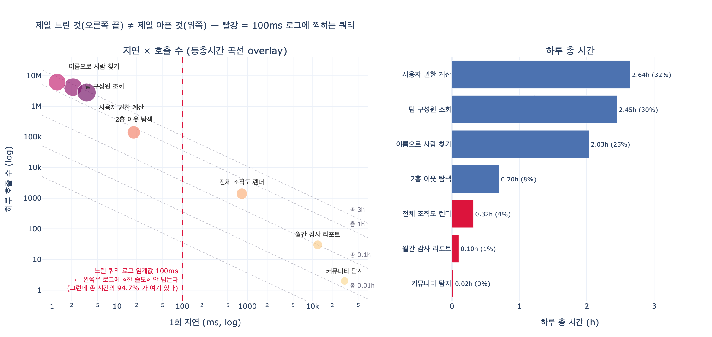

# `ex4_hot_query.py` — 가장 느린 쿼리와 가장 아픈 쿼리

## 한 줄 답

| 구분 | 쿼리 | 1회 지연 | 하루 호출 | 하루 총 시간 | 비중 |
|---|---|---:|---:|---:|---:|
| **가장 느린 것** | 커뮤니티 탐지 | 31,000ms (31초) | 2회 | **0.02시간** | 0.2% |
| **가장 아픈 것** | 사용자 권한 계산 | 3.4ms | 2,800,000회 | **2.64시간** | **32%** |

31초짜리 쿼리가 하루 종일 잡아먹는 시간은 **1분 남짓**이고,
3.4ms짜리 쿼리가 잡아먹는 시간은 **2시간 38분**이다.
1만 배 가까이 빠른 쿼리가 150배 더 아프다.

---

## 1. 지표는 하나뿐이다 — 총 시간 = 1회 지연 × 호출 수

`ex4_hot_query.py`가 하는 계산은 사실상 한 줄이다.

```python
rows = [(name, ms, n, ms * n / 1000 / 3600) for name, ms, n in QUERIES]
by_total = sorted(rows, key=lambda r: -r[3])
```

수식으로 쓰면

$$ T_{\text{total}} = L \times N $$

- $L$ = 1회 지연(latency)
- $N$ = 호출 수(calls)
- $T_{\text{total}}$ = 그 쿼리가 하루 동안 인프라를 점유한 총 시간

$L$ 하나만 보면 «느린 것»이 보이고, $L \times N$ 을 보면 «아픈 것»이 보인다.
그리고 대부분의 실제 워크로드에서 **$N$ 의 분산이 $L$ 의 분산보다 훨씬 크다.**
이 예제만 봐도 지연은 1.2ms ~ 31,000ms(약 2.6만 배)인데
호출 수는 2회 ~ 610만 회(약 305만 배)다. 그래서 곱의 순위는 대개 $N$ 이 지배한다.

> 이 지표는 새로운 게 아니다. 성능 공학에서 오래된 이름이 여럿 있다.
> USE 방법론의 «utilization», 프로파일러의 «total time vs self time»,
> 그리고 데이터베이스 쪽에서는 Postgres `pg_stat_statements` 의 `total_exec_time`,
> Oracle의 «DB Time»이 정확히 같은 것을 잰다.
> `pg_stat_statements` 를 `ORDER BY mean_exec_time` 이 아니라
> `ORDER BY total_exec_time` 으로 정렬해야 하는 이유가 이것이다.

---

## 2. ex4의 전체 표 — 총 시간 순으로 재구성

원본 `QUERIES` 는 이렇게 정의돼 있다.

```python
QUERIES = [
    # 이름                    1회 ms   하루 호출 수
    ("팀 구성원 조회",            2.1,   4_200_000),
    ("2홉 이웃 탐색",           18.0,     140_000),
    ("전체 조직도 렌더",        820.0,       1_400),
    ("사용자 권한 계산",          3.4,   2_800_000),
    ("월간 감사 리포트",      12_000.0,          30),
    ("이름으로 사람 찾기",        1.2,   6_100_000),
    ("커뮤니티 탐지",         31_000.0,           2),
]
```

이걸 **총 시간 순**으로 다시 세우면 이렇다. 괄호 안은 «1회 지연 순위»다.

| 총시간 순위 | 쿼리 | 1회 ms | 하루 호출 | 하루 총 시간 | 비중 | (지연 순위) |
|---:|---|---:|---:|---:|---:|---:|
| 1 | 사용자 권한 계산 | 3.4 | 2,800,000 | 2.644h | 32% | (5위) ↑4 |
| 2 | 팀 구성원 조회 | 2.1 | 4,200,000 | 2.450h | 30% | (6위) ↑4 |
| 3 | 이름으로 사람 찾기 | 1.2 | 6,100,000 | 2.033h | 25% | (7위) ↑4 |
| 4 | 2홉 이웃 탐색 | 18.0 | 140,000 | 0.700h | 8% | (4위) = |
| 5 | 전체 조직도 렌더 | 820.0 | 1,400 | 0.319h | 4% | (3위) ↓2 |
| 6 | 월간 감사 리포트 | 12,000.0 | 30 | 0.100h | 1% | (2위) ↓4 |
| 7 | 커뮤니티 탐지 | 31,000.0 | 2 | 0.017h | 0% | (1위) ↓6 |
| | **합계** | | | **8.264h** | 100% | |

일곱 개 중 **다섯 개**가 3계단 이상 움직인다. 그리고 정확히 거꾸로다.
지연 1위(커뮤니티 탐지)가 총 시간 꼴찌, 지연 꼴찌(이름으로 사람 찾기)가 총 시간 3위다.

**상위 셋이 87%를 먹는다.** (권한 계산 32% + 팀 구성원 30% + 이름 찾기 25%)
그리고 셋 다 «빠른» 쿼리다. 1.2ms, 2.1ms, 3.4ms.

> 소수점 얘기 하나. 정확한 합은 $7.128 / 8.264 = 86.25\%$ 라서 86%인데,
> 개별 비중을 각각 반올림해서 더하면 $32 + 30 + 25 = 87\%$ 가 된다.
> 원본 예제의 «87%»는 후자다. 반올림 순서의 차이일 뿐 결론은 같다.

### 튜닝 효과를 비교하면

지연을 절반으로 줄였을 때 절감되는 시간은 총 시간에 정확히 비례한다.

$$ \Delta T = \frac{L}{2} \times N = \frac{T_{\text{total}}}{2} $$

| 작업 | 줄이는 시간 | 전체 대비 |
|---|---:|---:|
| 권한 계산 3.4ms → 1.7ms | **1.32시간/일** | 16.0% |
| 커뮤니티 탐지 31초 → 15초 | 0.0086시간/일 (약 31초) | 0.1% |

같은 «절반»인데 절감량이 **154배** 차이 난다.
그런데 후자는 «31초 걸리는 쿼리를 반으로 줄였다»는, 보고하기 훨씬 좋은 문장이다.
33장 도입부의 «3주 동안 튜닝해서 9ms를 4ms로 줄였습니다»가 이 함정이다.

---

## 3. 느린 쿼리 로그의 사각지대

느린 쿼리 로그(slow query log)는 임계값 $\theta$ 를 넘는 쿼리만 기록한다.
그 로그가 커버하는 총 시간의 비율은

$$ C(\theta) = \frac{\sum_{i:\,L_i \ge \theta} L_i N_i}{\sum_i L_i N_i} $$

이 워크로드에 대입하면 이렇게 된다.

| 임계값 $\theta$ | 찍히는 쿼리 수 | 커버 총 시간 | 커버 비율 $C(\theta)$ | 놓치는 1위 |
|---:|---:|---:|---:|---|
| 10,000ms | 2 | 0.12h | 1.4% | 사용자 권한 계산 |
| 1,000ms | 2 | 0.12h | 1.4% | 사용자 권한 계산 |
| **100ms** | **3** | **0.44h** | **5.3%** | **사용자 권한 계산** |
| 50ms | 3 | 0.44h | 5.3% | 사용자 권한 계산 |
| 10ms | 4 | 1.14h | 13.7% | 사용자 권한 계산 |
| 3ms | 5 | 3.78h | 45.7% | 팀 구성원 조회 |
| 1ms | 7 | 8.26h | 100.0% | — |

**임계값 100ms짜리 로그는 총 시간의 5.3%만 본다.**
나머지 94.7%는 로그에 한 줄도 안 남는다.
1.2ms짜리 «이름으로 사람 찾기»는 하루 610만 번 돌면서 2시간을 먹는데,
100ms 로그에는 **영원히 안 찍힌다.**

임계값을 3ms까지 낮춰야 절반(45.7%)이 겨우 보인다.
그런데 그렇게 낮추면 로그가 하루 294만 줄, 전부 다 보려고 1ms로 내리면 1,324만 줄이 쌓인다.
즉 «임계값을 낮추면 되지 않나»는 답이 아니다. **다른 지표를 봐야 한다.**

---

## 4. p99 지연 관점 vs 총 시간 관점

이 둘은 서로 다른 질문에 답한다. 그래서 서로 다른 우선순위를 낳는다.

| | p99 지연 / 느린 쿼리 로그 | 총 시간 $L \times N$ |
|---|---|---|
| 무엇을 재나 | 한 «요청»의 최악 경험 | 시스템 전체의 «점유» |
| 누구를 위한 지표인가 | 사용자 (SLO, 이탈률) | 인프라 (코어 수, 청구서, 커넥션 풀) |
| 가중치 | 호출 수와 **무관** (분위수는 건수를 지운다) | 호출 수에 **선형 비례** |
| 이 예제의 1위 | 커뮤니티 탐지 (31초) | 사용자 권한 계산 (2.64h, 32%) |
| 놓치는 것 | 총 시간의 94.7% (100ms 기준) | 드물지만 치명적인 지연 스파이크 |
| 고쳐서 얻는 것 | 사용자 체감 개선 | 코어 절감, 큐 대기 감소, 헤드룸 |

핵심은 **분위수가 건수 정보를 지운다**는 점이다.
p99는 «100건 중 1건이 이만큼 느리다»는 말이지, «이게 몇 건이나 되나»는 말이 아니다.
그래서 하루 2번 도는 31초짜리와 하루 280만 번 도는 3.4ms짜리를
p99는 «전자가 심각»이라고 답하고, 총 시간은 «후자가 심각»이라고 답한다. **둘 다 맞다.**

### 그래서 순서는

원본 예제의 결론은 «둘 다 봐야 하고, 고치는 순서는 대개 후자가 먼저»다. 이유는 셋이다.

1. **총 시간 상위 쿼리를 고치면 p99도 같이 좋아진다.**
   총 시간이 큰 쿼리는 CPU·커넥션·락을 점유해서 다른 모든 쿼리의 대기를 늘린다.
   대기열 이론에서 이용률 $\rho$ 가 1에 가까워지면 대기 시간은
   $\frac{\rho}{1-\rho}$ 로 발산한다. 총 시간을 줄이는 것은 $\rho$ 를 줄이는 것이다.
   반대는 성립하지 않는다. 하루 2번 도는 31초 쿼리를 고쳐도 $\rho$ 는 그대로다.
2. **총 시간 상위 쿼리는 대개 «자주 도는 단순한 쿼리»라 고치기도 쉽다.**
   캐시, 배치, 인덱스, 결과 재사용이 다 통한다.
   반면 31초짜리 분석 쿼리는 원래 무거운 일을 하는 것이라 절반으로 줄이기가 훨씬 어렵다.
3. **총 시간이 곧 돈이다.** 필요한 코어 수가 $\sum L_i N_i$ 에 비례한다
   (같은 장의 `ex3_cost_model.py` 가 정확히 이 식으로 코어를 계산한다).

다만 예외가 있다. 그 31초짜리가 **사용자 요청 경로 위**에 있다면
총 시간이 0.02시간이어도 1순위다. 아무도 31초를 기다려 주지 않는다.
`ex4` 의 커뮤니티 탐지는 배치 성격이라 그렇지 않을 뿐이다.
**즉 총 시간은 «인프라 우선순위»를, p99는 «사용자 우선순위»를 정한다.**

---

## 5. 실무에서 어떻게 재나

| 시스템 | 총 시간을 주는 것 |
|---|---|
| PostgreSQL | `pg_stat_statements.total_exec_time` (`calls` × `mean_exec_time`) |
| MySQL | Performance Schema `events_statements_summary_by_digest.SUM_TIMER_WAIT` |
| Neo4j | `dbms.listQueries` / query log 집계 (쿼리 다이제스트별 합) |
| APM (Datadog·NewRelic 등) | «throughput × avg latency» 로 나오는 시간 기여도 차트 |
| 프로파일러 일반 | flame graph의 **폭** (self time이 아니라 total time) |

공통 원칙은 **「쿼리 텍스트를 정규화(다이제스트)해서 묶고, 지연의 합을 낸다」**이다.
개별 실행 로그를 보는 순간 이미 «느린 것»만 보이게 된다.

---

## 시각화



왼쪽은 로그-로그 평면의 지연 × 호출 수 산점도다.
점선 대각선은 «총 시간이 같은 선»(iso-cost)으로, $L \cdot N = C$ 를 로그로 취하면

$$ \log N = \log C - \log L $$

즉 기울기 $-1$ 인 직선이 된다. **위쪽 대각선에 있을수록 아프다.**
빨간 세로선이 느린 쿼리 로그 임계값 100ms인데,
가장 아픈 셋은 전부 그 **왼쪽**에 몰려 있다. 로그가 못 보는 영역이다.

오른쪽은 총 시간 막대다. 빨간 막대가 100ms 로그에 찍히는 쿼리인데,
셋을 다 합쳐도 파란 막대 하나(0.44h vs 2.64h)에 못 미친다.
