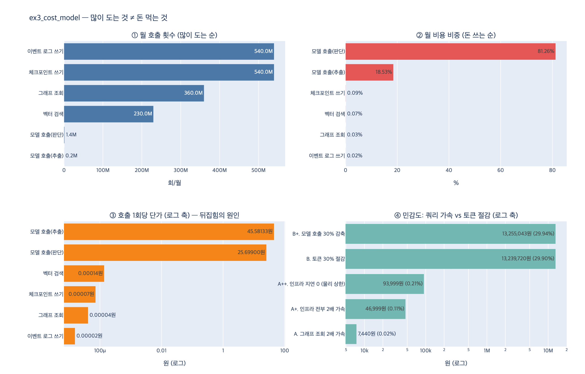

# `ex3_cost_model.py` — 가장 많이 도는 항목 vs 비용 비중이 큰 항목

> **Q.** `ex3_cost_model.py`의 워크로드에서 가장 많이 도는 항목과 비용 비중이 큰 항목은 각각 무엇인가?
>
> **A.** 그래프 조회가 월 3억 6천만 회로 가장 많이 돌지만 비중은 작고, 모델 호출은 월 158만 회뿐인데 비중이 압도적이다.

이 카드는 33장 33.4절 「청구서의 큰 칸은 대개 다른 곳이다」의 예제다.
한 장 요약에 이렇게 적혀 있다.

> 청구서의 큰 칸은 대개 토큰입니다. 쿼리를 *빠르게* 해도 비용은 거의 그대로예요.
> 다만 쿼리를 *정확하게* 하면 토큰이 크게 줍니다. 둘은 다른 작업입니다.

---

## 1. 워크로드 정의 — 세 개의 숫자로 한 항목을 기술한다

`ex3_cost_model.py`는 그래프 시스템의 한 달치 부하를 항목 여섯 개로 쪼갠다.
각 항목은 **월 호출 수 · 1회 지연(ms) · 1회 입력 토큰** 세 값으로만 기술된다.

```python
KRW = 1_380

# 월 호출 수 · 1회 지연 · 1회 입력 토큰
WORKLOAD = {
    "그래프 조회":     dict(calls=360_000_000, ms=2.4,  tokens=0),
    "벡터 검색":       dict(calls=230_000_000, ms=8.0,  tokens=0),
    "모델 호출(판단)":  dict(calls=1_400_000,   ms=1800, tokens=6_200),
    "모델 호출(추출)":  dict(calls=180_000,     ms=2400, tokens=11_000),
    "체크포인트 쓰기":  dict(calls=540_000_000, ms=4.2,  tokens=0),
    "이벤트 로그 쓰기": dict(calls=540_000_000, ms=0.9,  tokens=0),
}

# 단가
CPU_KRW_PER_CORE_HOUR = 62
TOKEN_KRW_PER_1K = 3.0 / 1000 * KRW      # 입력 기준 → 4.14원/1K 토큰
STORAGE_KRW_PER_GB_MONTH = 33
HOURS = 24 * 30                          # 720시간
```

토큰 값이 `0`인 항목은 순수 인프라 비용만 낸다. 그래프 조회·벡터 검색·체크포인트·이벤트 로그가 그렇다.
토큰 값이 있는 항목은 인프라 + 토큰 둘 다 낸다. 모델 호출 두 개가 그렇다.
**이 `tokens=0` / `tokens=6_200` 한 칸이 순위를 통째로 뒤집는 스위치다.**

---

## 2. 비용 모델을 세우는 절차

### 절차 자체가 요점이다

책이 실행 가이드에서 못 박아 둔 문장이 있다.

> `ex3`~`ex5`의 숫자는 저자 환경의 실측을 단순화한 "예시 워크로드"입니다.
> 여러분 시스템의 값을 넣어서 다시 돌려 보세요. **구조가 요점이지 숫자가 요점이 아닙니다.**

그러니까 외울 것은 3.6억이라는 수가 아니라 **절차**다. 절차는 세 단계다.

### 단계 1 — 항목마다 (월 호출 수 × 단가)를 구한다

토큰 쪽은 곱셈 한 번이면 끝난다.

$$ C^{\text{tok}}_i = \frac{n_i \times t_i}{1000} \times p_{\text{tok}} $$

- $n_i$ : 월 호출 수
- $t_i$ : 호출 1회당 입력 토큰
- $p_{\text{tok}}$ : 1K 토큰당 단가 = $3.0/1000 \times 1380 = 4.14$원

### 단계 2 — 인프라는 「코어 시간」으로 환산한다

인프라에는 「1회 단가」가 직접 붙어 있지 않다. 클라우드가 파는 단위는 호출이 아니라 **코어-시간**이다.
그래서 「호출 수 × 지연」을 먼저 시간으로 바꾸고, 그걸 월 720시간으로 나눠 **평균 코어 수**를 구한다.

$$ \text{cores}_i = \frac{n_i \times m_i / 1000}{H \times 3600}, \qquad H = 24 \times 30 = 720 $$

```python
def cpu_cores(calls, ms):
    """월 calls 회 × ms 밀리초를 처리하려면 평균 코어가 몇 개 필요한가."""
    return calls * ms / 1000.0 / (HOURS * 3600)
```

분자 `calls * ms / 1000`은 「한 달 동안 이 항목이 잡아먹는 CPU 초」다.
분모 `HOURS * 3600`은 「코어 하나가 한 달에 제공하는 초」다.
나누면 **한 달 내내 몇 개의 코어가 이 항목에만 붙어 있어야 하는가**가 나온다.

$$ C^{\text{infra}}_i = \text{cores}_i \times p_{\text{cpu}} \times H $$

이 환산이 중요한 이유는, 이렇게 해야 밀리초와 토큰을 **같은 원화 축**에 올려서 비교할 수 있기 때문이다.
비용 모델의 전부는 사실 "서로 단위가 다른 것들을 원으로 통일하는 일"이다.

### 단계 3 — 더하고, 비중으로 줄 세운다

$$ C_i = C^{\text{infra}}_i + C^{\text{tok}}_i, \qquad \text{비중}_i = \frac{C_i}{\sum_j C_j} $$

---

## 3. 계산 결과 — 두 순위가 정반대다

| 항목 | 월 호출 | 1회 ms | 1회 토큰 | 코어 | 월 인프라 | 월 토큰 | 합계 | 비중 |
|---|---:|---:|---:|---:|---:|---:|---:|---:|
| 그래프 조회 | 360,000,000 | 2.4 | 0 | 0.3 | 14,880원 | 0원 | **14,880원** | 0.03% |
| 벡터 검색 | 230,000,000 | 8.0 | 0 | 0.7 | 31,689원 | 0원 | 31,689원 | 0.07% |
| 모델 호출(판단) | 1,400,000 | 1,800 | 6,200 | 1.0 | 43,400원 | 35,935,200원 | **35,978,600원** | **81.26%** |
| 모델 호출(추출) | 180,000 | 2,400 | 11,000 | 0.2 | 7,440원 | 8,197,200원 | **8,204,640원** | **18.53%** |
| 체크포인트 쓰기 | 540,000,000 | 4.2 | 0 | 0.9 | 39,060원 | 0원 | 39,060원 | 0.09% |
| 이벤트 로그 쓰기 | 540,000,000 | 0.9 | 0 | 0.2 | 8,370원 | 0원 | 8,370원 | 0.02% |
| **합계** | 1,671,580,000 | | | 3.3 | 144,839원 | 44,132,400원 | **44,277,239원** | 100% |

두 순위를 나란히 놓으면 이렇다.

| 순위 | 호출 횟수 순 | 월 호출 | 비용 비중 순 | 비중 |
|---:|---|---:|---|---:|
| 1 | 체크포인트 쓰기 | 540,000,000 | 모델 호출(판단) | 81.26% |
| 2 | 이벤트 로그 쓰기 | 540,000,000 | 모델 호출(추출) | 18.53% |
| 3 | **그래프 조회** | **360,000,000** | 체크포인트 쓰기 | 0.09% |
| 4 | 벡터 검색 | 230,000,000 | 벡터 검색 | 0.07% |
| 5 | **모델 호출(판단)** | **1,400,000** | **그래프 조회** | **0.03%** |
| 6 | **모델 호출(추출)** | **180,000** | 이벤트 로그 쓰기 | 0.02% |

**호출 순위 하위 두 칸이 비용 순위 상위 두 칸이다.** 완전히 뒤집혔다.

- 모델 호출 합계 = 1,400,000 + 180,000 = **158만 회**. 전체 16.7억 회의 **0.09%**.
- 그런데 비용은 35,978,600 + 8,204,640 = 44,183,240원으로 **전체의 99.79%**.
- 그래프 조회는 모델 호출보다 **228배 더 많이** 도는데 비용은 **2,969배 적다**.

> ### 답에서 「그래프 조회」인 이유
> 표만 보면 절대 호출 수 1위는 체크포인트/이벤트 로그 쓰기(각 5.4억 회)다.
> 그런데 본문이 대비의 축으로 고른 것은 **그래프 조회(3.6억 회)** 다.
> 이 장의 주제가 「쿼리 튜닝 vs 청구서」이기 때문이다.
> 체크포인트·로그는 *쓰기*이고, 팀이 실제로 튜닝 대상으로 삼는 *읽기 쿼리*의 대표가 그래프 조회다.
> 예제의 마지막 문단도 정확히 이 짝을 집어서 말한다.
>
> > 그래프 조회가 월 3억 6천만 회로 제일 많이 도는데 비중은 아주 작다.
> > 모델 호출은 월 158만 회뿐인데(전체 호출의 0.1%도 안 된다) 비중이 압도적이다.

---

## 4. 왜 어긋나나 — 단가 차이 하나로 전부 설명된다

호출 횟수 순위와 비용 순위가 어긋나는 이유는 단 하나다. **호출 1회당 단가가 극단적으로 다르다.**

$$ \text{단가}_i = \frac{C_i}{n_i} $$

| 항목 | 월 호출 | 비용 유형 | **호출 1회당 단가** | 최저가 대비 |
|---|---:|---|---:|---:|
| 모델 호출(추출) | 180,000 | 인프라 + 토큰(11,000) | **45.581333원** | 2,940,731× |
| 모델 호출(판단) | 1,400,000 | 인프라 + 토큰(6,200) | **25.699000원** | 1,658,000× |
| 벡터 검색 | 230,000,000 | 인프라만 (8.0ms) | 0.000138원 | 9× |
| 체크포인트 쓰기 | 540,000,000 | 인프라만 (4.2ms) | 0.000072원 | 5× |
| 그래프 조회 | 360,000,000 | 인프라만 (2.4ms) | **0.000041원** | 3× |
| 이벤트 로그 쓰기 | 540,000,000 | 인프라만 (0.9ms) | 0.000016원 | 1× |

**모델 호출(판단) 1회 ÷ 그래프 조회 1회 ≈ 62만 배.**

호출 수 격차는 228배에 그친다. 228배로는 62만 배를 절대 못 따라잡는다.
두 순위가 어긋나는 것이 아니라, **어긋나는 것이 당연한 구조**다.

모델 호출(판단) 하나만 그래프 조회와 맞대 보면 이렇게 딱 떨어진다.

$$ \frac{C_{\text{모델(판단)}}}{C_{\text{그래프}}}
 = \underbrace{\frac{1{,}400{,}000}{360{,}000{,}000}}_{\text{호출 수 } 1/257}
 \times \underbrace{\frac{25.699}{0.0000413}}_{\text{단가 } 621{,}750\times}
 \approx 2{,}418 $$

실제로 $35{,}978{,}600 \div 14{,}880 = 2{,}418$ 이다. 모델 호출 둘을 합치면 2,969배가 된다.

### 단가가 왜 이렇게 벌어지나

두 비용의 성질이 다르기 때문이다.

| | 인프라(쿼리) | 토큰(모델) |
|---|---|---|
| 파는 단위 | 코어-시간 | 1K 토큰 |
| 1회당 소비량 | 2.4 밀리초 | 6,200 토큰 |
| 단위 단가 | 62원 / 코어-시간 | 4.14원 / 1K 토큰 |
| 1회 환산 | 62 ÷ 3,600,000 × 2.4 ≈ **0.00004원** | 4.14 × 6.2 ≈ **25.7원** |
| 성질 | 시간을 잘게 쪼개 나눠 쓸 수 있음 | 쪼갤 수 없음. 토큰 하나가 곧 돈 |

밀리초는 3,600,000분의 1시간이라 아무리 많이 곱해도 잘 안 커진다.
반면 토큰은 「1K에 4원」이 곧바로 호출 하나에 6.2K씩 붙는다. **압축이 안 되는 비용**이다.

---

## 5. 민감도 분석 — 3주짜리 쿼리 튜닝의 값어치

33장은 이런 문장으로 시작한다.

> 3주 동안 쿼리를 튜닝했습니다. 평균 지연이 9ms에서 4ms로 줄었어요.

그 3주가 청구서에서 얼마인지 계산해 보자.

| 시나리오 | 월 비용 | 절감액 | 절감률 |
|---|---:|---:|---:|
| 기준선 | 44,277,239원 | — | — |
| **A. 그래프 조회 2배 가속** (2.4 → 1.2ms) | 44,269,799원 | 7,440원 | **0.02%** |
| A+. 인프라 항목 **전부** 2배 가속 | 44,230,239원 | 46,999원 | 0.11% |
| A++. 인프라 지연을 **0으로** (물리적 상한) | 44,183,240원 | 93,999원 | **0.21%** |
| **B. 토큰 30% 절감** (컨텍스트 다이어트) | 31,037,519원 | **13,239,720원** | **29.90%** |
| B+. 모델 호출 횟수 30% 감축 | 31,022,196원 | 13,255,043원 | 29.94% |

- 토큰 30% 절감은 그래프 조회 2배 가속보다 **1,780배** 효과가 크다.
- 인프라 지연을 마법으로 **0으로** 만들어도 절감률 상한은 **0.21%** 다.
- 이게 33.5절이 부르는 **암달의 법칙**이다. 99.8%를 차지하는 구간을 안 건드리면
  나머지를 전부 최적화해도 상한이 0.2%다. (`ex5_where_time_goes.py`가 지연 축에서 같은 얘기를 한다 — 모델 호출이 94.8%, 나머지 여섯 구간 전부 최대로 줄여도 3%)

### 그렇다고 쿼리 튜닝이 쓸모없다는 뜻은 아니다 — 목적이 다르다

| | 무엇을 줄이나 | 누가 아파하나 | 언제 하나 |
|---|---|---|---|
| **쿼리 튜닝** | **지연** | 사용자 (기다리는 시간) | "느리다"고 불평이 올 때 |
| **토큰 줄이기** | **비용** | 재무 (청구서) | 청구서가 아플 때 |

> 둘을 헷갈리면 엉뚱한 데 시간을 쓴다.
> 느리다고 불평이 오면 쿼리를 보고, 청구서가 아프면 토큰을 본다.

그리고 이 둘을 잇는 다리가 하나 있다. **쿼리를 「정확하게」 만들면 토큰이 준다.**
쓸데없이 넓게 긁어 온 결과를 프롬프트에 그대로 싣지 않게 되기 때문이다.
24장의 컨텍스트 얘기가 여기서 돈으로 돌아온다.

---

## 6. 단 하나의 예외 — 체크포인트 쓰기

지금 표에서 체크포인트 쓰기는 39,060원(0.09%)으로 무시할 만하다.
그런데 **월 5억 4천만 회**다. 이 숫자는 슈퍼스텝 수에 비례해서 늘어난다(21장).

- 호출 수가 10배가 되면 인프라 비용도 10배 → 390,600원.
- 지연이 4.2ms에서 40ms로 늘면(디스크 압박) 또 10배.
- 둘이 겹치면 3,906,000원. 그 시점에는 무시할 수 없는 칸이 된다.

그리고 이건 쿼리 튜닝으로 못 줄인다.

> 이건 «쿼리»가 아니라 «구조»를 고쳐야 준다. 슈퍼스텝을 줄이는 것이다.

---

## 7. 자기 시스템에 적용하는 체크리스트

1. 항목을 나눈다. 「호출 단위가 같고 단가 성질이 같은 것」끼리 묶는다.
2. 항목마다 세 값을 잰다 — **월 호출 수 · 1회 지연 · 1회 토큰**.
3. 인프라는 코어 시간으로, 토큰은 1K 단가로 각각 원화 환산한다.
4. 비중으로 줄 세운다. **호출 수 순위와 비교해서 어긋나는 곳을 찾는다.**
5. 어긋나는 지점이 곧 "직관이 틀리는 지점"이고, 거기가 개선 여지다.
6. 개선안마다 민감도를 계산한다. **상한이 1% 미만이면 그 작업은 비용 작업이 아니다** (지연 작업일 수는 있다).

---

## 한 줄 정리

**많이 도는 것과 돈 먹는 것은 다르다.** 호출 수 × 단가가 비용인데,
그래프 조회는 호출 수는 크고 단가가 0.00004원, 모델 호출은 호출 수는 작고 단가가 25.7원이다.
62만 배 단가 차이 앞에서 228배 호출 수 차이는 아무것도 아니다.

## 시각화



- ①과 ②를 비교하면 순위가 뒤집히는 것이 한눈에 보인다. ①에서 바닥에 붙어 있던 모델 호출 둘이 ②에서는 전체를 채운다.
- ③은 그 원인이다. 로그 축이라야 그릴 수 있을 만큼(0.00002원 ~ 45.58원, 약 300만 배) 단가가 벌어져 있다.
- ④는 민감도. 인프라 지연을 0으로 만들어도(A++) 토큰 30% 절감(B)의 140분의 1이다.
