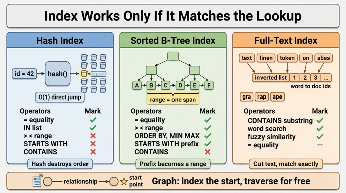

# 인덱스는 찾는 방식에 따라 어떻게 다르게 작동하는가?

> **답**: 같음 비교는 해시 인덱스, 범위 비교와 앞부분 일치는 정렬 인덱스가 듣고, 가운데 일치(CONTAINS)는 어느 것도 안 들어 전문 검색이 필요하다.

---

## 1. 흔한 오해 — 「인덱스를 걸면 다 빨라진다」

33장 `ex2_index_effect.py`가 정면으로 깨는 오해가 두 개 있습니다.

1. **규모 오해**: 수천 개짜리 데이터에서 인덱스 효과를 재면 아무것도 안 보입니다. 파싱·계획 수립의 고정 비용이 지배해서 기본 키 조회와 속성 조회의 배수가 1.1배 언저리에 머뭅니다. 「인덱스 별 효과 없네」는 규모가 작아서 나온 결론입니다.
2. **방식 오해**: 인덱스는 **걸었느냐**가 아니라 **찾는 방식에 맞느냐**로 듣습니다. 이 카드가 다루는 게 두 번째입니다.

책의 원문 정리는 이렇습니다.

```
  같음 비교(=)          → 해시 인덱스가 듣는다
  범위 비교(<, >)       → 정렬 인덱스가 듣는다. 해시는 안 듣는다
  앞부분 일치(STARTS)   → 정렬 인덱스가 듣는다
  가운데 일치(CONTAINS) → 어느 것도 안 듣는다. 전문 검색이 필요하다
```

인덱스는 만능 가속기가 아니라 **특정 접근 패턴에 맞춰진 자료 구조**입니다. 패턴이 어긋나면 옵티마이저는 인덱스를 아예 후보에서 빼고 풀 스캔(`SCAN`)으로 되돌아갑니다. 쿼리 플랜에서 `SCAN`이 무엇을 훑는지 보라는 33.1절의 두 번째 항목이 바로 이 얘기입니다.

---

## 2. 해시 인덱스 — 같음 비교 전용, 대신 O(1)

### 원리

해시 인덱스는 키에 해시 함수를 적용해 **버킷 번호**를 계산하고, 그 버킷에 레코드 포인터를 넣어 둡니다.

```
"P4000"  --hash()-->  0x8f3a...  --mod buckets-->  버킷 #217  -->  row ptr
```

조회할 때도 똑같이 해시를 한 번 계산하면 곧바로 버킷 주소가 나옵니다. 트리를 내려가며 비교할 필요가 없어서 데이터가 100배 늘어도 조회 단계 수는 그대로입니다. 이게 평균 **O(1)** 의 의미입니다.

### 왜 범위 조회는 못 하나

좋은 해시 함수의 목표는 **입력을 균등하게 흩뿌리는 것**입니다. 즉 원래 값의 순서를 의도적으로 파괴합니다.

```
값     : 100      101      102      103
해시   : 버킷 12   버킷 891  버킷 3    버킷 447
```

`101`과 `102`가 값으로는 이웃이지만 버킷으로는 아무 관계가 없습니다. 그래서 `WHERE age > 30` 같은 질문에 대해 해시 인덱스는 "30보다 큰 값들이 모여 있는 곳"을 가리킬 수 없습니다. **순서 정보가 인덱스에 남아 있지 않기 때문**입니다. 결국 모든 버킷을 다 훑어야 하는데, 그럴 바엔 테이블을 순차로 읽는 게 낫습니다. 같은 이유로 해시 인덱스는 `ORDER BY` 가속에도, `STARTS WITH` 에도, 복합 인덱스의 부분 사용에도 쓸 수 없습니다.

정리하면 해시 인덱스가 답할 수 있는 질문은 딱 하나, **"이 값과 정확히 같은 것 어디 있어?"** 입니다.

---

## 3. 정렬 인덱스(B-트리) — 범위와 앞부분 일치의 주역

### 원리

B-트리(실무에서는 대개 B+트리)는 키를 **정렬된 순서로** 유지합니다. 리프 노드들이 정렬 순서대로 연결 리스트처럼 이어져 있어서, 시작점을 찾은 다음 옆으로 쭉 읽으면 범위가 나옵니다.

```
                    [ M ]
                   /     \
              [ F   J ]   [ R   W ]
              /   |   \      ...
         A→B→C→ D→E→F→ G→H→I→ ...   (리프는 정렬 순서로 연결)
              └─────── 범위 스캔은 여기서 옆으로 걷기 ────────┘
```

- **탐색 비용**: 루트에서 리프까지 O(log n). 해시보다 상수는 크지만 수십억 건에서도 깊이는 서너 단계입니다.
- **범위 비용**: 시작점 O(log n) + 결과 개수만큼의 순차 읽기. `WHERE age BETWEEN 30 AND 40`이 딱 이 모양입니다.

### 앞부분 일치(prefix / STARTS WITH)가 되는 이유

문자열을 사전순으로 정렬해 두면, 같은 접두사를 가진 값들은 **반드시 연속 구간에 모입니다**.

```
"Pa..." 로 시작하는 값들
  ...
  P39999
  P4000     ← 시작
  P40001
  P40002
  ...
  P4999     ← 끝
  P5000     ← 접두사 벗어남, 여기서 멈춤
```

즉 `name STARTS WITH 'P4000'`은 내부적으로 `name >= 'P4000' AND name < 'P4001'` 이라는 **범위 조회로 재작성**됩니다. 앞부분 일치는 별도 기능이 아니라 범위 조회의 특수한 형태인 셈입니다. `LIKE 'abc%'` 가 인덱스를 타는 것도 같은 원리입니다.

> 주의: 정렬 순서는 **콜레이션(collation)** 에 종속됩니다. 로케일 콜레이션을 쓰는 PostgreSQL에서는 `LIKE 'abc%'`가 인덱스를 타려면 `text_pattern_ops` 같은 연산자 클래스를 지정해야 하는 경우가 있습니다.

### 복합 인덱스의 왼쪽 접두사 규칙

같은 원리가 여러 컬럼에도 적용됩니다. `INDEX(a, b, c)` 는 `(a)`, `(a, b)`, `(a, b, c)` 조건에는 듣지만 `(b)` 나 `(c)` 단독에는 안 듭니다. 정렬 기준의 **왼쪽부터 이어져야** 연속 구간이 만들어지기 때문입니다. 그리고 범위 조건이 나온 컬럼 **이후**의 컬럼은 인덱스로 좁힐 수 없습니다 — `a = 1 AND b > 5 AND c = 3` 이면 `c`는 필터로만 쓰입니다.

---

## 4. 가운데 일치(CONTAINS / LIKE '%x%') — 왜 어느 인덱스도 안 듣나

`WHERE name CONTAINS '4000'` 또는 `WHERE name LIKE '%4000%'` 을 생각해 봅시다.

- **해시 인덱스**: 해시는 값 전체에 대해 계산됩니다. `"P40001"` 의 해시와 부분 문자열 `"4000"` 의 해시 사이에는 아무 관계가 없습니다. 애초에 부분 문자열로는 버킷을 계산할 수 없습니다.
- **정렬 인덱스**: `4000` 을 포함하는 값들은 정렬 순서 어디에나 흩어져 있습니다. `P4000`, `X4000Z`, `abc4000` 이 사전순으로 전혀 인접하지 않습니다. **연속 구간을 만들 수 없으니 시작점도 끝점도 없습니다.**

두 인덱스의 공통 전제는 "찾을 값에서 **위치를 계산하거나 경계를 정할 수 있어야 한다**" 입니다. 가운데 일치는 그 전제를 깹니다. 결과는 전체 스캔 후 문자열 비교 — 플랜에서 `SCAN` 뒤에 `FILTER` 가 붙는 그 모양(33.1절의 세 번째 항목: "FILTER가 SCAN 뒤면 훑고 나서 버리는 것")입니다.

같은 이유로 **접미사 일치(`LIKE '%abc'`)** 도 안 됩니다. 다만 이건 우회로가 있습니다 — 문자열을 뒤집은 값에 인덱스를 걸면(reverse index / 표현식 인덱스) 접미사가 접두사가 되어 정렬 인덱스가 다시 듣습니다.

### 함수·형변환이 인덱스를 죽이는 것도 같은 원리

```sql
WHERE LOWER(name) = 'kim'      -- name 인덱스 안 듣는다
WHERE created_at::date = ...   -- created_at 인덱스 안 듣는다
WHERE price * 1.1 > 1000       -- price 인덱스 안 듣는다
```

인덱스에는 **원본 값**이 정렬되어 있는데 조건은 **변형된 값**을 요구하니 경계를 계산할 수 없습니다. 이런 조건을 비-**SARGable**(Search ARGument able) 조건이라고 부릅니다. 해법은 조건을 뒤집어 컬럼을 맨몸으로 남기거나(`price > 1000/1.1`), 표현식 인덱스(`CREATE INDEX ... ON t (LOWER(name))`)를 만드는 것입니다.

---

## 5. 전문 검색(full-text search) — 문제를 뒤집는 해법

가운데 일치가 필요하면 **인덱스의 단위를 바꿔야** 합니다.

### 역색인(inverted index)

문서를 토큰(단어)으로 쪼갠 뒤, **단어 → 그 단어를 포함한 문서 목록** 방향으로 뒤집어 저장합니다.

```
문서1: "그래프 쿼리 플랜"
문서2: "쿼리 튜닝 비용"

역색인
  그래프 → [1]
  쿼리   → [1, 2]
  플랜   → [1]
  튜닝   → [2]
  비용   → [2]
```

이제 "쿼리"를 찾는 것은 **단어에 대한 같음 비교**가 되고, 다시 해시/정렬 인덱스가 듣습니다. 가운데 일치를 앞부분 일치 문제로 되돌려 놓은 셈입니다. Neo4j의 `db.index.fulltext.*`, Lucene/Elasticsearch, PostgreSQL의 `tsvector` + GIN 인덱스가 모두 이 방식입니다.

**한계**: 역색인은 토크나이저가 자른 **단어 경계**에서만 맞습니다. `"쿼리"`는 찾지만 `"리플"` 같은 단어 중간 조각은 못 찾습니다. 한국어는 형태소 분석기(nori 등)가 얼마나 잘 자르느냐에 성능이 좌우됩니다.

### 트라이그램 인덱스(n-gram)

임의의 부분 문자열까지 지원하려면 단어가 아니라 **고정 길이 조각**으로 쪼갭니다.

```
"grape"  →  "  g", " gr", "gra", "rap", "ape"
검색어 "rap" → 트라이그램 "rap" 을 포함하는 후보를 인덱스에서 뽑고
             → 후보에 대해서만 실제 LIKE 검사 (recheck)
```

PostgreSQL의 `pg_trgm` + GIN/GiST 인덱스가 대표적이고, `LIKE '%rap%'` 과 오타 허용 유사 검색(`similarity()`)까지 인덱스로 가속합니다. 대신 인덱스 크기가 커지고 쓰기 비용이 올라갑니다.

정리: **정확 일치는 해시, 순서가 필요한 것은 트리, 텍스트 내부는 토큰/조각으로 잘라 다시 정확 일치로 만든다.**

---

## 6. 연산자별 적용 인덱스 표

| 조건 / 연산자 | 예시 | 해시 인덱스 | 정렬 인덱스(B-트리) | 전문 검색(역색인/트라이그램) | 비고 |
|---|---|:---:|:---:|:---:|---|
| 같음 비교 | `p.id = 42` | O (평균 O(1)) | O (O(log n)) | △ | 해시가 가장 빠름 |
| IN 목록 | `p.id IN (1,2,3)` | O | O | △ | 같음 비교 여러 번 |
| 범위 비교 | `p.age > 30`, `BETWEEN` | **X** | O | X | 해시엔 순서 정보 없음 |
| 정렬 / ORDER BY | `ORDER BY p.age` | **X** | O | X | 리프가 이미 정렬됨 |
| MIN / MAX | `min(p.age)` | **X** | O | X | 인덱스 양 끝만 읽음 |
| 앞부분 일치 | `STARTS WITH 'P4'`, `LIKE 'P4%'` | **X** | O | O | 범위 조회로 재작성 |
| 뒷부분 일치 | `ENDS WITH 'x'`, `LIKE '%x'` | X | **X** | O | 역순 인덱스로 우회 가능 |
| 가운데 일치 | `CONTAINS 'x'`, `LIKE '%x%'` | X | **X** | **O** | 트라이그램/n-gram 필요 |
| 단어 검색 | `"쿼리 튜닝"` 포함 문서 | X | X | **O** | 역색인의 본령 |
| 유사도 / 오타 허용 | `similarity(a,b) > 0.4` | X | X | O | pg_trgm, 퍼지 검색 |
| 함수 적용 | `LOWER(name) = 'kim'` | X | X | - | 표현식 인덱스로만 |
| 복합 인덱스 왼쪽 접두사 | `INDEX(a,b,c)` 에 `a=1 AND b=2` | △ | O | - | 왼쪽부터 이어져야 함 |
| 복합 인덱스 중간 컬럼만 | 같은 인덱스에 `b=2` 단독 | X | **X** | - | 연속 구간이 안 생김 |
| NULL 검사 | `IS NULL` | 대개 X | 엔진별 | - | 구현 의존 |

(O = 인덱스가 듣는다, △ = 제한적으로 듣는다, X = 안 든다 → 풀 스캔 + 필터)

---

## 7. 그래프에서 추가되는 규칙 — 관계 순회에는 인덱스가 필요 없다

33장이 이 표에 하나를 더 붙입니다.

> **«관계를 따라가는 것»에는 인덱스가 필요 없다. 이미 이어져 있으니까.**

관계형 DB에서 조인은 "다른 테이블에서 매칭되는 행을 **찾는**" 작업이라 인덱스가 필수입니다. 반면 그래프 DB는 노드가 자신의 인접 관계 목록을 **물리적으로 들고** 있습니다(index-free adjacency). 이웃으로 가는 비용은 전체 데이터 크기와 무관하게 그 노드의 차수(degree)에만 비례합니다.

그래서 그래프 튜닝의 첫 질문이 바뀝니다.

- (X) "어디에 인덱스를 걸까?"
- (O) "**시작점을 인덱스로 찾고, 나머지는 관계로 갈 수 있나?**"

시작점 하나만 인덱스로 잡으면 그다음 홉은 사실상 공짜입니다. 반대로 시작점을 못 잡으면 라벨 전체를 스캔하게 되고, 두 개의 시작점을 따로 잡으면 33.1절의 그 `CROSS_PRODUCT` 가 플랜에 등장합니다.

---

## 8. 실무 체크리스트

1. **플랜부터 본다.** `SCAN`이 인덱스를 타는지, 라벨 전체를 훑는지. `FILTER`가 `SCAN` 앞인지 뒤인지.
2. **조건의 모양을 본다.** `=` 인지 `>` 인지 `CONTAINS` 인지에 따라 걸어야 할 인덱스가 다르다.
3. **컬럼을 맨몸으로 둔다.** 함수·형변환·연산을 컬럼 쪽에 붙이면 인덱스가 죽는다(비-SARGable).
4. **`CONTAINS`가 요구사항이면 인덱스가 아니라 검색 엔진 문제다.** 전문 검색 인덱스를 따로 만든다.
5. **규모를 키워서 잰다.** 수천 건에서는 파싱 비용이 지배해 인덱스 효과가 안 보인다.
6. **인덱스는 공짜가 아니다.** 읽기를 위해 쓰기·저장 비용을 지불하는 거래다. 특히 트라이그램 인덱스는 비싸다.
7. **그래프에서는 시작점만 인덱스로.** 나머지는 관계를 따라간다.
8. **그리고 33.4절**: 쿼리를 빠르게 해도 청구서는 거의 그대로다. 인덱스 튜닝의 목적은 **지연**이지 **비용**이 아니다.

---

## 한 줄 요약

인덱스는 "값의 위치를 계산할 수 있는가(해시)" 또는 "값들이 연속 구간을 이루는가(정렬)"에 기대어 동작한다. 같음 비교는 위치가 계산되니 해시가, 범위와 앞부분 일치는 연속 구간이 생기니 정렬 인덱스가 듣는다. 가운데 일치는 둘 다 성립하지 않아 어느 인덱스도 못 쓰고, 텍스트를 토큰이나 n-gram으로 잘라 다시 같음 비교로 바꾸는 전문 검색이 필요하다.

---

## 인포그래픽


