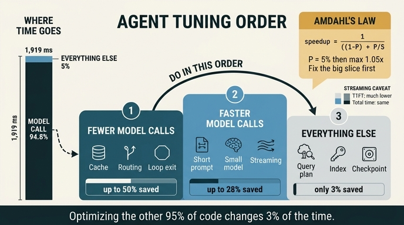

# 에이전트 성능 개선의 올바른 순서

> **Q.** 에이전트 성능 개선의 올바른 순서는 무엇인가?
>
> **A.** 모델 호출 **횟수**를 줄이고(캐시·라우팅·종료 조건), 모델 호출 **시간**을 줄이고(짧은 프롬프트·작은 모델·스트리밍), **그다음에** 나머지를 본다.

---

## 1. 왜 이 순서인가 — 숫자부터 본다

33장 `ex5_where_time_goes.py`는 에이전트 요청 한 건의 시간을 구간별로 쪼갭니다.

| 구간 | ms | 비중 | 최대 절감률 | 절감 가능 | 방법 |
|---|---:|---:|---:|---:|---|
| 입력 검증 | 3 | 0.2% | 0% | 0ms | 이미 최소 |
| 그래프 조회 ×4 | 9 | 0.5% | 50% | 4.5ms | 인덱스·플랜 |
| 벡터 검색 | 11 | 0.6% | 40% | 4.4ms | 차원 축소·근사 |
| 컨텍스트 조립 | 18 | 0.9% | 70% | 12.6ms | 참조만 싣기(24장) |
| **모델 호출** | **1,820** | **94.8%** | 30% | **546ms** | 짧은 프롬프트·작은 모델 |
| 응답 후처리 | 24 | 1.3% | 60% | 14.4ms | 스트리밍 |
| 체크포인트 쓰기 | 34 | 1.8% | 80% | 27.2ms | 상태·슈퍼스텝 줄이기 |
| **합계** | **1,919** | 100% | | | |

모델 호출을 뺀 여섯 구간을 **전부 최대치로** 줄여도 63ms. 1,919ms의 **3.3%**입니다.
사용자는 1,919ms가 1,856ms 되는 것을 느끼지 못합니다.

그런데 이 3.3%가 바로 대부분의 팀이 3주를 쓰는 곳입니다. 익숙하고, 재기 쉽고,
「쿼리를 9ms에서 4ms로 줄였습니다」는 보고하기 좋은 문장이니까요.

## 2. 암달의 법칙이 순서를 정한다

암달의 법칙(Amdahl's law, 1967)은 이렇게 말합니다.

```
전체 speedup = 1 / ( (1 - P) + P / S )

  P = 개선하려는 구간이 전체에서 차지하는 비중
  S = 그 구간을 몇 배 빠르게 만들었는가
```

핵심은 **S를 무한대로 보내도 상한이 (1 - P)의 역수**라는 것입니다.

### 케이스 A — 모델 호출 말고 전부 최적화

P = 0.052 (모델 호출 제외 99ms / 1,919ms). S = ∞ (그 구간을 0ms로 만든다고 치자)

```
speedup ≤ 1 / (1 - 0.052) = 1.055배
```

**마법을 부려도 5.5% 개선이 천장입니다.** 인덱스를 완벽하게 걸고, 벡터 검색을
근사로 바꾸고, 체크포인트를 없애도 여기를 못 넘습니다.

### 케이스 B — 모델 호출 횟수를 절반으로

이건 P를 줄이는 게 아니라 **P 자체를 잘라내는** 일입니다.
루프가 3회 돌던 것을 2회로 줄이면 모델 호출 1,820ms 중 한 번치가 통째로 사라집니다.

```
1,820ms → 1,213ms  (3회 → 2회)
총 1,919ms → 1,312ms = 1.46배
```

캐시가 맞아서 호출이 아예 스킵되면 그 구간 시간이 **0에 수렴**합니다.
S = ∞를 P = 0.948짜리 구간에 적용하는 셈이고, 이건 케이스 A와 차원이 다릅니다.

### 그래서 순서는 이렇게 굳는다

1. **비중이 큰 구간을 먼저 건드린다** (암달)
2. **같은 구간이면 "안 하기 > 빨리 하기"** — 호출을 없애는 게 호출을 짧게 하는 것보다 항상 크다
3. 그다음에 나머지

이 세 줄이 문제의 답이 되는 1-2-3 순서입니다.

---

## 3. STEP 1 — 모델 호출 **횟수**를 줄인다

가장 큰 레버입니다. 안 부른 호출은 0ms이고 0원입니다.

### 3-1. 캐시

- **프롬프트 캐싱(prompt caching)**: 시스템 프롬프트·툴 정의·검색 결과처럼 요청마다
  반복되는 앞부분을 서버가 캐시해 두는 방식. 호출 횟수 자체가 주는 건 아니지만,
  캐시 히트 구간은 재처리하지 않으므로 **TTFT와 입력 토큰 비용이 크게 준다**.
  Anthropic API 기준 캐시 히트 읽기는 기본 입력가의 일부이고, 캐시 쓰기에는 프리미엄이 붙습니다.
  → 캐시가 이득이 되려면 **접두사가 안정적**이어야 합니다. 프롬프트 앞부분에
  타임스탬프·요청 ID 같은 걸 넣으면 매번 캐시가 깨집니다. 변하는 것은 뒤로 보내세요.
- **의미 캐시(semantic cache)**: 질문 임베딩이 충분히 가까우면 이전 답을 재사용.
  FAQ성 트래픽이 많은 에이전트에서 호출 수를 직접 깎습니다.
- **결과 캐시**: 툴 호출(그래프 조회·벡터 검색) 결과를 캐시해서, 같은 근거로 같은
  판단을 다시 시키지 않도록 만드는 것.

### 3-2. 라우팅 (25장)

모든 요청을 최상위 모델에 보내지 않습니다.

- **분류 → 분기**: 값싼 분류기(작은 모델 또는 규칙)로 난이도를 판정하고,
  쉬운 것은 작은 모델·템플릿·순수 코드 경로로 보냅니다.
- **모델 없이 끝나는 경로를 만든다**: "이 요청은 그래프 조회 한 방이면 답이 나온다"면
  모델을 아예 부르지 않는 것이 최고의 라우팅입니다.
- **에스컬레이션**: 작은 모델이 신뢰도 낮게 답할 때만 큰 모델로 올립니다.
  대부분의 트래픽에서 큰 모델 호출이 사라집니다.

### 3-3. 종료 조건 (20장)

에이전트 루프는 **끝나지 않으면 호출이 무한히 는다**는 성질이 있습니다.

- **최대 반복 수(max iterations)** 하드 캡
- **진전 없음 감지**: 같은 툴을 같은 인자로 두 번 부르면 중단
- **신뢰도/충분성 판정**: "답할 근거가 모였다"는 조건이 충족되면 즉시 종료
- **예산 캡**: 요청당 토큰·비용·시간 상한을 두고 초과 시 부분 답변 반환

루프가 평균 4회에서 2.5회로 줄면 그 자체로 **모델 시간이 37% 줄고**,
전체가 94.8% 모델이므로 총 지연도 거의 그만큼 줍니다.

### 3-4. 배치와 병렬 — 주의점

같은 프롬프트에 여러 항목을 묶어 한 번에 처리하면 호출 수가 줍니다.
반대로 **병렬 호출은 호출 수를 안 줄입니다.** 지연은 줄지만 비용은 그대로거나 늡니다.
비용과 지연을 헷갈리면 여기서 틀립니다.

---

## 4. STEP 2 — 모델 호출 **시간**을 줄인다

호출을 없앨 수 없다면, 한 번의 호출을 짧게 만듭니다.

### 4-1. 짧은 프롬프트 (프롬프트 압축)

- 입력 토큰이 늘면 **prefill 시간과 비용이 같이** 늡니다.
- 24장의 "참조만 싣기": 문서 전문을 넣지 말고 ID·요약·인용 조각만 넣습니다.
  33장 표에서 컨텍스트 조립 구간이 70% 절감 가능하다고 적힌 이유입니다.
- **정확한 쿼리 = 적은 토큰**: 33.4절이 강조하는 부분입니다.
  쿼리를 *빠르게* 해도 비용은 그대로지만, 쿼리를 *정확하게* 해서 넣을 근거가
  20개에서 3개로 줄면 토큰이 크게 줍니다.
- **출력 토큰이 지연의 주범인 경우가 많다**: 디코딩은 토큰당 순차적입니다.
  "3문장 이내", 구조화 출력(JSON 스키마)으로 출력 길이를 제한하는 것이
  입력을 줄이는 것보다 지연에 더 크게 듣는 경우가 흔합니다.

### 4-2. 작은 모델

- 같은 작업을 작은 모델이 해내면 지연이 몇 배 줄고 단가도 몇 배 쌉니다.
- 단, **품질 하락이 재호출을 유발하면 역효과**입니다.
  작은 모델이 틀려서 루프가 한 번 더 돌면 STEP 1을 거꾸로 한 셈이 됩니다.
  그래서 라우팅(작은 모델 + 에스컬레이션)과 짝지어 씁니다.
- 증류(distillation)·파인튜닝으로 특정 작업만 작은 모델에 고정하는 것도 같은 계열.

### 4-3. 스트리밍 — TTFT vs 총 지연

여기서 반드시 구분해야 하는 것이 있습니다.

| 지표 | 의미 | 스트리밍의 효과 |
|---|---|---|
| **TTFT** (Time To First Token) | 첫 토큰이 도착할 때까지 | **크게 준다** |
| **총 지연** (end-to-end) | 마지막 토큰까지 | **거의 안 준다** (오히려 미세하게 늘 수도) |

스트리밍은 **총 계산량을 줄이지 않습니다.** 같은 토큰을 같은 속도로 생성하되
다 만들어질 때까지 기다리지 않고 흘려보낼 뿐입니다.
그러니까 스트리밍은 **체감 지연(perceived latency) 최적화**이지 처리량 최적화가 아닙니다.

- 사용자가 읽는 화면 → 스트리밍이 매우 효과적 (1,820ms 기다림이 200ms 만에 첫 글자)
- 다음 단계가 **완성된 출력 전체**를 필요로 하는 파이프라인 중간 단계 → 스트리밍 효과 없음
- 33장 표의 "응답 후처리 24ms, 스트리밍으로 60% 절감"은 후처리를 생성과 **겹치게**
  만들어서 얻는 이득입니다. 이것도 총 시간이 아니라 겹침(overlap)으로 얻는 것.

에이전트 내부 판단 호출에는 스트리밍이 의미가 거의 없고, 최종 사용자 응답에는 큽니다.
어디에 쓰는 호출인지에 따라 갈립니다.

---

## 5. STEP 3 — 그다음에 나머지

여기가 쿼리 튜닝, 인덱스, 플랜, 벡터 검색, 체크포인트입니다.
**쓸모없다는 뜻이 아니라 순서가 뒤라는 뜻입니다.**

33장의 나머지 도구들이 여기서 쓰입니다.

- **플랜에서 볼 것 셋**: `CROSS_PRODUCT`가 있나 / `SCAN`이 무엇을 훑나 /
  `FILTER`가 SCAN 앞인가 뒤인가
- **인덱스는 "찾는 방식"에 맞아야 든다**: `=` → 해시, `<`/`>`/`STARTS WITH` → 정렬,
  `CONTAINS` → 어느 것도 안 듦(전문 검색 필요)
- **그래프에서는 관계 따라가기에 인덱스가 필요 없다**: 시작점 하나만 인덱스로
  찾으면 그다음은 공짜
- **총 시간(1회 지연 × 호출 수)으로 줄 세우기**: `ex4`에서 제일 느린 건
  커뮤니티 탐지(31초)지만 하루 2번이라 총 0.02시간. 제일 아픈 건 3.4ms짜리
  권한 계산인데 하루 280만 번 돌아 전체의 32%. **느린 쿼리 로그는 제일 아픈 것을 못 잡습니다.**
- **체크포인트 쓰기**는 예외적으로 크다: 표에서 34ms로 2위이고, 월 5.4억 회.
  다만 이건 쿼리 튜닝이 아니라 **구조**(슈퍼스텝 줄이기, 21장)로 고칩니다.

STEP 3 안에서도 같은 원칙이 다시 적용됩니다. **비중 큰 것부터, 총 시간 순으로.**

---

## 6. 지연과 비용은 다른 축이다 — 순서가 같아서 헷갈린다

33.4절의 비용 분해(`ex3`)를 보면 재미있는 일이 생깁니다.

- 그래프 조회: 월 **3.6억 회** — 비중 아주 작음
- 모델 호출: 월 **158만 회**(전체 호출의 0.1% 미만) — **비중 압도적**

지연 축에서도 모델이 94.8%, 비용 축에서도 모델이 압도적입니다.
**우연히 두 축의 1위가 같아서** 이 1-2-3 순서가 양쪽에 다 통합니다.

다만 목적은 구분해야 합니다.

| 하는 일 | 줄어드는 것 |
|---|---|
| 쿼리 튜닝 | **지연** — 사용자가 기다리는 시간 |
| 토큰 줄이기 | **비용** — 청구서 |
| 모델 호출 횟수 줄이기 | **둘 다** |

「느리다」는 불평이 오면 쿼리를 보고, 「청구서가 아프다」면 토큰을 봅니다.
그런데 STEP 1(호출 횟수)은 두 불평 모두에 듣습니다. 그래서 1번입니다.

---

## 7. 한 줄 정리

> 전체의 95%를 차지하는 구간이 있으면, 나머지를 **전부** 최적화해도 3%다.
> 60년 된 암달의 법칙이 에이전트 시스템에도 그대로 적용된다.
> 그러니까 **안 부르기 → 짧게 부르기 → 나머지** 순서다.

## 8. 흔한 함정

| 함정 | 왜 틀렸나 |
|---|---|
| 쿼리부터 튜닝한다 | 익숙하고 재기 쉽지만 상한이 3~5% |
| 스트리밍 붙였으니 빨라졌다 | TTFT만 줄었다. 총 지연·비용은 그대로 |
| 병렬 호출로 비용을 줄였다 | 병렬은 지연만 줄인다. 호출 수는 그대로 |
| 작은 모델로 바꿨는데 더 비싸졌다 | 품질 하락 → 재시도·루프 증가. STEP 1을 역행 |
| 프롬프트 캐싱을 켰는데 효과가 없다 | 접두사가 매 요청 달라져 캐시가 안 맞는다 |
| 느린 쿼리 로그로 병목을 찾는다 | 임계값 100ms면 1.2ms짜리 최대 병목이 아예 안 찍힌다 |
| 측정 없이 최적화한다 | 어느 구간이 P인지 모르면 암달을 적용할 수 없다. **재고 나서 고치기** |

## 인포그래픽


