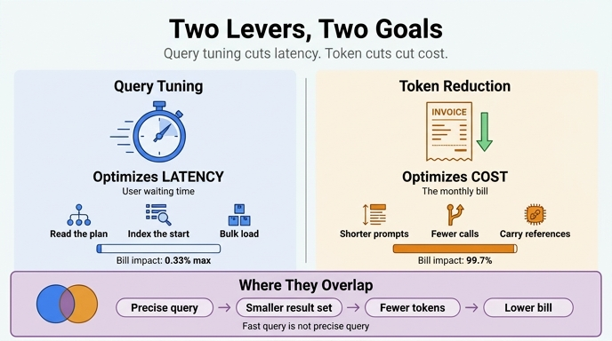

# 쿼리 튜닝과 토큰 줄이기의 목적은 각각 무엇인가?

**답:** 쿼리 튜닝은 **지연**(사용자가 기다리는 시간)을 줄이고, 토큰 줄이기는 **비용**(청구서)을 줄인다.

33장 `ex3_cost_model.py`가 한 줄로 못 박는 문장이 이것입니다.

```
쿼리 튜닝  → «지연»을 줄인다. 사용자가 기다리는 시간
토큰 줄이기 → «비용»을 줄인다. 청구서
```

핵심은 "둘 중 뭐가 더 좋냐"가 아닙니다. **두 레버가 서로 다른 목적 함수를 최적화한다**는 것입니다. 헷갈리면 엉뚱한 데 3주를 씁니다.

---

## 1. 두 개의 서로 다른 목적 함수

같은 시스템을 두고 두 가지 질문을 던질 수 있습니다.

| | 쿼리 튜닝 | 토큰 줄이기 |
|---|---|---|
| 최적화 대상 | **지연**(latency, ms) | **비용**(cost, 원) |
| 누가 아파하나 | 사용자 — "느려요" | 재무 — "청구서가 왜 이래요" |
| 관찰하는 지표 | p99 지연, 쿼리별 총 시간 | 호출당 입력 토큰, 월 모델 호출 수 |
| 손대는 것 | 플랜(`CROSS_PRODUCT`/`SCAN`/`FILTER`), 인덱스, 일괄 적재 | 프롬프트 길이, 컨텍스트 조립, 호출 횟수·라우팅 |
| 참조 장 | 33.1~33.3 | 24장(컨텍스트), 25장(라우팅), 20장(종료 조건) |

책의 처방도 정확히 대칭입니다.

> 느리다고 불평이 오면 쿼리를 보고, 청구서가 아프면 토큰을 본다.

두 레버는 **서로의 목표를 거의 건드리지 못합니다.** 아래에서 각각의 상한(최대로 밀어붙였을 때 얼마나 좋아지나)을 실제 숫자로 계산해 봅니다.

---

## 2. 비용 축에서의 상한 — `ex3_cost_model.py`

`ex3`은 월 워크로드를 인프라비(CPU 코어)와 토큰비로 쪼갭니다. 단가는 코어시당 62원, 입력 1K 토큰당 3.0 × 1,380원 = **4.14원**, 한 달 720시간입니다.

```
코어 수 = 월 호출 수 × 1회 ms / 1000 / (720 × 3600)
```

계산 결과:

| 항목 | 월 호출 | 1회 ms | 코어 | 월 인프라 | 월 토큰 | 합계 | 비중 |
|---|---:|---:|---:|---:|---:|---:|---:|
| 그래프 조회 | 360,000,000 | 2.4 | 0.33 | 14,880원 | 0원 | 14,880원 | **0.034%** |
| 벡터 검색 | 230,000,000 | 8.0 | 0.71 | 31,689원 | 0원 | 31,689원 | 0.072% |
| 모델 호출(판단) | 1,400,000 | 1,800 | 0.97 | 43,400원 | 35,935,200원 | 35,978,600원 | **81.26%** |
| 모델 호출(추출) | 180,000 | 2,400 | 0.17 | 7,440원 | 8,197,200원 | 8,204,640원 | **18.53%** |
| 체크포인트 쓰기 | 540,000,000 | 4.2 | 0.88 | 39,060원 | 0원 | 39,060원 | 0.088% |
| 이벤트 로그 쓰기 | 540,000,000 | 0.9 | 0.19 | 8,370원 | 0원 | 8,370원 | 0.019% |
| **합계** | | | | **144,839원** | **44,132,400원** | **44,277,239원** | |

**인프라 전체가 0.327%, 토큰이 99.673%입니다.**

### 쿼리 튜닝의 비용 상한

- 그래프 조회를 2.4ms → 1.2ms로 **반토막** 내면: 7,440원 절감 = 청구서의 **0.017%**
- 그래프 조회를 2.4ms → **0ms**(물리적으로 불가능)로 만들면: 14,880원 = **0.034%**
- 인프라 여섯 항목을 **전부 0원**으로 만들면: 144,839원 = **0.327%**

즉 **쿼리 튜닝으로 도달할 수 있는 비용 절감의 절대 상한이 0.33%**입니다. 3억 6천만 회로 제일 많이 도는 게 그래프 조회인데도 그렇습니다.

### 토큰 줄이기의 비용 상한

- 토큰을 **1%**만 줄이면: 441,324원 절감 — 인프라를 통째로 없앤 것(144,839원)보다 **3배 큽니다.**
- 판단 호출의 입력을 6,200 → 3,100 토큰으로 줄이면: 17,967,600원 = 청구서의 **40.6%**

한 줄로: **인프라를 전부 없애도 토큰 1% 줄이기보다 못합니다.**

> 그래프 조회가 월 3억 6천만 회로 제일 많이 도는데 비중은 아주 작다.
> 모델 호출은 월 158만 회뿐인데(전체 호출의 0.1%도 안 된다) 비중이 압도적이다.

### 왜 이렇게 벌어지나

쿼리 비용은 **시간**에 비례하고, 토큰 비용은 **토큰 수**에 비례합니다. 단위가 다르니 절감액도 단위가 다릅니다.

- 그래프 조회 1회 = 2.4ms × (62원 / 3600초 / 코어) ≈ **0.00004원**
- 판단 호출 1회 = 6,200토큰 × 4.14원/1K ≈ **25.7원**

호출 한 번의 가격 차이가 **60만 배** 넘습니다. 호출 수가 257배 많아도(3.6억 대 140만) 그 차이를 메우지 못합니다.

---

## 3. 지연 축에서의 상한 — `ex5_where_time_goes.py`

그러면 쿼리 튜닝의 본래 목적인 **지연**은 어떨까요. `ex5`는 한 요청을 구간별로 쪼갭니다. 총 **1,919ms**.

| 구간 | ms | 비중 | 최대 절감률 | 줄이면 | 총 지연 대비 |
|---|---:|---:|---:|---:|---:|
| 입력 검증 | 3 | 0.16% | 0% | 0ms | 0.00% |
| 그래프 조회 ×4 | 9 | **0.47%** | 50% | 4.5ms | **0.23%** |
| 벡터 검색 | 11 | 0.57% | 40% | 4.4ms | 0.23% |
| 컨텍스트 조립 | 18 | 0.94% | 70% | 12.6ms | 0.66% |
| 모델 호출 | 1,820 | **94.84%** | 30% | 546ms | **28.45%** |
| 응답 후처리 | 24 | 1.25% | 60% | 14.4ms | 0.75% |
| 체크포인트 쓰기 | 34 | 1.77% | 80% | 27.2ms | 1.42% |

- 전부 다 줄이면: **609.1ms (31.7%)**
- **모델 호출만 빼고** 전부 줄이면: **63.1ms (3.3%)**

여기서 중요한 반전이 나옵니다. **쿼리 튜닝이 지연을 줄이는 건 맞지만, 그 지연이 전체 지연 예산에서 얼마를 차지하는지는 별개 문제입니다.**

이 워크로드에서 그래프 조회 4회는 9ms, 전체의 0.47%입니다. 완벽하게 튜닝해도(50% 절감) **4.5ms, 0.23%**밖에 못 줄입니다. 사용자는 1,919ms가 1,914.5ms 된 것을 느끼지 못합니다.

이것이 **암달의 법칙**(Amdahl's law, 1967)입니다. 전체 중 비율 *p*를 차지하는 구간을 *s*배 빠르게 만들었을 때 전체 속도 향상은

```
1 / ((1 - p) + p/s)
```

로 묶입니다. p = 0.0047이면 s를 무한대로 보내도 전체 향상은 1.0047배가 끝입니다. 60년 된 법칙이 에이전트 시스템에도 그대로 적용됩니다.

> 「쿼리를 9ms 에서 4ms 로 줄였습니다」는 보고하기 좋은 문장이다.
> 그런데 사용자는 1,919ms 를 1,914ms 로 줄인 것을 못 느낀다.

### 그렇다고 쿼리 튜닝이 무의미한 건 아니다 — `ex4_hot_query.py`

`ex4`는 쿼리 튜닝이 **실제로 효과를 내는 축**을 보여줍니다. 하루 총 시간(1회 지연 × 호출 수) 기준입니다.

| 쿼리 | 1회 ms | 하루 호출 | 하루 총 시간 | 비중 |
|---|---:|---:|---:|---:|
| 사용자 권한 계산 | 3.4 | 2,800,000 | 2.64h | **32%** |
| 팀 구성원 조회 | 2.1 | 4,200,000 | 2.45h | 30% |
| 이름으로 사람 찾기 | 1.2 | 6,100,000 | 2.03h | 25% |
| 2홉 이웃 탐색 | 18.0 | 140,000 | 0.70h | 8% |
| 전체 조직도 렌더 | 820.0 | 1,400 | 0.32h | 4% |
| 월간 감사 리포트 | 12,000.0 | 30 | 0.10h | 1% |
| 커뮤니티 탐지 | 31,000.0 | 2 | 0.017h | 0.2% |

제일 **느린** 것(커뮤니티 탐지, 31초)은 하루 두 번 돌아 총 0.017시간입니다. 제일 **아픈** 것은 3.4ms짜리 권한 계산으로, 하루 280만 번 돌아 32%를 먹습니다. 상위 셋이 87%인데 셋 다 1~3ms짜리 "빠른" 쿼리입니다.

여기서 쿼리 튜닝의 진짜 값어치가 나옵니다.

- 권한 계산 3.4ms → 1.7ms: 하루 **1.3시간** 절감
- 커뮤니티 탐지 31초 → 15초: 하루 **0.00003시간** 절감

정리하면 쿼리 튜닝은 두 가지를 줍니다. **(a) 사용자 체감 지연** — 단 전체 지연에서 쿼리 몫이 클 때만. **(b) 인프라 점유 시간** — 총 시간이 큰 쿼리를 고쳤을 때. 하지만 (b)도 `ex3`이 보여주듯 청구서에서는 0.33%짜리 항목입니다.

> 느린 쿼리 로그  → 사용자가 «기다린다»고 느끼는 것을 찾는다
> 총 시간 순위    → 인프라를 «먹는» 것을 찾는다

---

## 4. 두 레버가 만나는 지점 — 정확한 쿼리는 토큰까지 줄인다

여기가 이 카드의 가장 중요한 뉘앙스입니다. `ex3`의 원문을 정확히 읽으면 이렇게 되어 있습니다.

> 청구서의 큰 칸은 대개 토큰입니다. 쿼리를 **빠르게** 해도 비용은 거의 그대로예요.
> 다만 쿼리를 **정확하게** 하면 토큰이 크게 줍니다. 둘은 다른 작업입니다.

**"빠른 쿼리"와 "정확한 쿼리"는 다릅니다.**

- **빠르게 한다** = 같은 결과를 더 짧은 시간에. → 지연만 준다. 비용은 0.03% 움직인다.
- **정확하게 한다** = **결과 집합 자체를 줄인다.** → 프롬프트에 실릴 행이 줄고, 토큰이 줄고, 청구서가 준다.

에이전트 시스템의 파이프라인은 이렇게 이어져 있습니다.

```
그래프 쿼리 → 결과 행 N개 → 컨텍스트 조립 → 프롬프트 입력 토큰 → 모델 호출 → 청구서
```

쿼리가 필요 없는 500행을 가져오면 그 500행은 컨텍스트를 타고 그대로 청구서에 도착합니다. 이 경로에서는 **쿼리 작업이 비용 레버가 됩니다.** 단, 튜닝하는 대상이 "속도"가 아니라 "결과 집합의 크기와 정확도"라는 조건에서요.

### 구체적으로 어떤 작업인가

1. **`CROSS_PRODUCT` 제거** — `ex1`의 쿼리 A는 사람 8,000명 × 팀 80개 = 640,000행 곱집합을 만들어 놓고 거기서 거릅니다. 시간이 B·C의 3.4배인 것도 문제지만, 이런 형태의 쿼리가 필터를 덜 걸고 나가면 그대로 프롬프트로 흘러갑니다.
2. **`FILTER`를 `SCAN` 앞으로** — 뒤에 있으면 훑고 나서 버리는 것입니다. 앞으로 당기면 나오는 행 자체가 줄어듭니다.
3. **`LIMIT`과 투영(projection)** — 노드 전체(`RETURN p`)가 아니라 필요한 속성만(`RETURN p.name, p.city`) 반환하면 직렬화되어 프롬프트에 실리는 문자 수가 줄어듭니다.
4. **참조만 싣기** — `ex5`의 "컨텍스트 조립, 최대 70% 절감, 24장 — 참조만 싣기"가 이것입니다. 본문 대신 ID/요약만 싣고, 모델이 필요할 때 도구로 다시 조회하게 합니다.

### 이 교집합이 얼마나 큰가

`ex3`의 판단 호출은 회당 6,200 입력 토큰입니다. 이 중 상당량이 그래프·벡터 조회 결과라고 하면, 쿼리를 정확하게 만들어 결과 집합을 절반으로 줄였을 때:

- 6,200 → 3,100 토큰 → **월 17,967,600원 절감 = 청구서의 40.6%**

**같은 사람이 쿼리를 만지는데, "빠르게" 만지면 0.017%, "정확하게" 만지면 40.6%입니다.** 이 배수 차이가 33장이 하고 싶은 말 전부입니다.

### 반대 방향의 교집합도 있다

토큰을 줄이면 **지연도** 줄어듭니다. `ex5`에서 모델 호출은 1,820ms로 94.8%인데, 짧은 프롬프트·작은 모델로 30%를 줄이면 546ms가 빠집니다. 나머지 여섯 구간을 전부 최대로 줄인 63ms의 **9배**입니다. 그러니까 "지연을 줄이고 싶다"는 목표조차도, 에이전트 시스템에서는 쿼리가 아니라 모델 호출부터 봐야 합니다.

---

## 5. 실무 판단 순서

**증상에서 출발하세요.**

| 증상 | 봐야 할 것 |
|---|---|
| "느려요" (사용자 불평) | 먼저 구간 분해(`ex5`). 모델 호출이 95%면 호출 **횟수**부터(캐시·라우팅·종료 조건). 그다음 시간(짧은 프롬프트·작은 모델). 쿼리는 세 번째. |
| "인프라가 터져요" | 쿼리별 **총 시간** 순위(`ex4`). p99·느린 쿼리 로그만 보면 제일 아픈 걸 놓칩니다(임계값 100ms면 1.2ms짜리는 한 번도 안 찍힘). 플랜에서 `CROSS_PRODUCT` → `SCAN` → `FILTER` 위치 순으로. |
| "청구서가 아파요" | 항목별 비용 분해(`ex3`). 거의 항상 토큰입니다. 모델 호출 **횟수**와 **호출당 토큰**. |
| "쿼리 결과가 프롬프트를 채워요" | **교집합 구간.** 결과 집합을 줄이는 쿼리 작업 = 지연도 줄고 비용도 줍니다. 여기부터 하세요. |

그리고 33장이 남기는 예외 하나: **체크포인트 쓰기**는 월 5억 4천만 회로 돌아 인프라 항목 중 제일 큽니다(39,060원). 이건 쿼리를 튜닝해서 줄지 않고 **구조**(슈퍼스텝, 21장)를 고쳐야 줍니다. `ex5`에서도 34ms로 두 번째 구간이고 80%까지 줄일 수 있다고 표시돼 있습니다. 쿼리 튜닝도 토큰 줄이기도 아닌 **세 번째 레버**입니다.

---

## 한 문장 요약

**쿼리 튜닝은 지연(사용자 대기 시간)을, 토큰 줄이기는 비용(청구서)을 최적화한다.** 예시 워크로드에서 쿼리 쪽 상한은 청구서의 0.33%·지연의 0.23%인 반면 토큰 쪽은 청구서의 99.7%·지연의 94.8%를 쥐고 있다. 다만 쿼리를 *빠르게*가 아니라 *정확하게* 만들어 결과 집합을 줄이면 그것이 곧 토큰 절감이 되어, 두 레버가 한 지점에서 만난다.

## 인포그래픽


