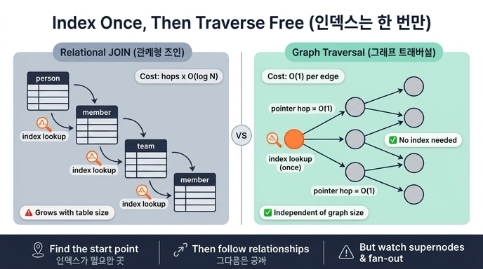

# 그래프에서 관계를 따라가는 데 인덱스가 필요한가?

**답: 필요 없다. 시작점 하나만 인덱스로 찾으면 그다음은 공짜다.**

---

## 1. 질문의 진짜 의미

「인덱스가 필요한가」라는 질문은 사실 두 개의 다른 작업을 하나로 묶고 있습니다. 그래프 쿼리는 언제나 이 둘로 쪼개집니다.

| 단계 | 하는 일 | 인덱스가 필요한가 |
|---|---|---|
| **① 진입점 찾기 (anchor)** | 8천만 개 노드 중 「id가 42인 사람」을 찾는다 | **필요하다.** 없으면 전체 스캔 |
| **② 관계 따라가기 (traverse)** | 그 사람의 소속 팀, 팀의 다른 구성원… | **필요 없다.** 이미 이어져 있다 |

33장 `ex2_index_effect.py`의 마지막 문단이 이 구분을 그대로 말합니다.

> 그래서 그래프 튜닝의 첫 질문은 «인덱스를 걸까»가 아니라
> «시작점을 인덱스로 찾고 나머지는 관계로 갈 수 있나»다.
> 시작점 하나만 인덱스로 찾으면 그다음은 공짜다.

즉 답은 「인덱스가 전혀 필요 없다」가 아니라 **「인덱스는 딱 한 번, 첫 노드를 잡을 때만 필요하다」**입니다. 이 미묘한 차이가 시험 포인트입니다.

---

## 2. 관계형 DB: 조인은 매번 인덱스를 다시 탄다

관계형 모델에는 「이어져 있다」는 개념이 물리적으로 존재하지 않습니다. 관계는 **값의 일치**로만 표현됩니다. `member.person_id == person.id` 라는 비교죠.

```sql
-- 사람 → 소속 → 팀 → 그 팀의 다른 사람 (2홉)
SELECT p2.name
FROM person p1
JOIN member m1 ON m1.person_id = p1.id      -- ① 인덱스 조회
JOIN team   t  ON t.id  = m1.team_id        -- ② 인덱스 조회
JOIN member m2 ON m2.team_id = t.id         -- ③ 인덱스 조회
JOIN person p2 ON p2.id = m2.person_id      -- ④ 인덱스 조회
WHERE p1.id = 42;                           -- 진입점
```

여기서 벌어지는 일:

- 조인 한 번마다 `member(person_id)`, `team(id)`, `member(team_id)`, `person(id)` 인덱스를 **각각 다시 탐색**합니다.
- B-tree 인덱스 탐색 한 번의 비용은 대략 **O(log N)**. N은 그 테이블의 전체 행 수입니다.
- 홉이 늘면 비용이 `홉 수 × O(log N)`로 쌓입니다. 그리고 중간 결과가 부풀면(팬아웃) 그 부푼 행마다 또 O(log N)을 냅니다.
- 인덱스가 하나라도 빠지면 그 자리에서 **전체 스캔 + 해시 조인**으로 떨어지고, 최악에는 `CROSS_PRODUCT`(곱집합)가 나옵니다. 33장 `ex1_read_plan.py`의 쿼리 A가 정확히 그 사례로, 사람 8,000명 × 팀 80개를 만들어 놓고 거르는 바람에 B·C보다 **3.4배** 느렸습니다.

핵심: **관계형에서 「관계를 따라간다」는 것은 매번 인덱스를 새로 조회하는 일**입니다. 데이터가 자라면 그 log N도 같이 자랍니다.

---

## 3. 그래프 DB: index-free adjacency

그래프 DB(Neo4j, Kùzu 등)는 **인접 정보를 노드 자체에 물리적으로 붙여 둡니다.** 이것을 **index-free adjacency(인덱스 없는 인접성)** 라고 부릅니다.

작동 방식은 이렇습니다.

- 노드 레코드 안에(또는 노드 ID로 O(1) 계산되는 위치에) **자기 관계 목록의 시작 포인터**가 들어 있습니다.
- 관계 레코드는 다시 「시작 노드 / 끝 노드 / 다음 관계」의 **물리 주소(또는 고정 크기 슬롯 오프셋)** 를 들고 있습니다.
- 그래서 「이 노드의 이웃」을 얻는 것은 **탐색이 아니라 포인터 역참조**입니다. 디스크/메모리 오프셋 계산 한 번이면 끝납니다.

비용으로 쓰면:

```
관계형 조인 1홉  :  O(log N)      ← N = 테이블 전체 크기에 의존
그래프 트래버설 1홉 :  O(1) per edge  ← 전체 크기와 무관, 실제 이웃 수에만 비례
```

가장 중요한 성질은 **「전체 데이터 크기와 무관하다」**는 것입니다. 노드가 1만 개든 10억 개든, 「내 이웃 5명」을 가져오는 비용은 똑같습니다. 관계형에서는 10억 행이 되면 log N이 커지고 캐시 적중률이 떨어져 실측 비용이 눈에 띄게 올라갑니다.

이 성질에는 이름이 있습니다. **local traversal / 쿼리 비용이 「그래프 전체 크기」가 아니라 「실제로 훑은 부분 그래프 크기」에 비례한다**는 것. 그래프 DB의 세일즈 포인트 대부분이 여기서 나옵니다.

---

## 4. 나란히 놓고 보기

| | 관계형 DB (JOIN) | 그래프 DB (traversal) |
|---|---|---|
| 관계의 표현 | 값의 일치 (FK == PK) | 물리 포인터 / 인접 리스트 |
| 1홉 비용 | O(log N) 인덱스 탐색 | O(1) 포인터 역참조 |
| 전체 크기 의존 | **있다** (N이 크면 느려짐) | **없다** (지역적) |
| 홉이 늘면 | 홉마다 인덱스 재조회, 중간 결과 폭발 | 이웃 수만큼만 선형 확장 |
| 인덱스 필요 시점 | **조인마다** | **시작점 한 번만** |
| 인덱스 빠지면 | 전체 스캔 → 곱집합, 재앙 | 진입점만 느려지고 트래버설은 그대로 |
| 쓰기 부담 | 인덱스 수만큼 유지 비용 | 인접 리스트 갱신 |

---

## 5. 그래서 실무에서 뭐가 달라지나

### (1) 인덱스는 「진입점 속성」에만 건다

```cypher
// 진입점: t.name 에 인덱스가 있으면 여기서 한 번 탄다
MATCH (t:Team {name:'팀7'})<-[:Member]-(p:Person)
WHERE p.city = '마포'
RETURN count(p)
```

`<-[:Member]-` 부분은 인덱스와 무관합니다. 팀7 노드를 잡은 순간 그 팀의 구성원 목록은 이미 노드에 매달려 있습니다. 그러니 `Member` 관계에 인덱스를 걸겠다는 발상 자체가 성립하지 않습니다.

반대로 33장 예제의 쿼리 A처럼 **양 끝을 각각 찾아서 나중에 붙이려 하면** 트래버설이 아니라 곱집합이 됩니다. 관계형식 사고를 그래프 쿼리에 그대로 옮겼을 때 생기는 전형적인 실패입니다.

### (2) 플랜에서 확인하는 법

`EXPLAIN`을 걸고 33장이 제시한 세 가지를 봅니다.

1. **`CROSS_PRODUCT`가 있나** — 있으면 진입점을 하나로 못 잡고 두 끝을 따로 찾고 있다는 뜻
2. **`SCAN`이 무엇을 훑나** — 진입점에서 인덱스를 타는지, 라벨 전체를 훑는지
3. **`FILTER`가 `SCAN` 앞인가 뒤인가** — 뒤면 훑고 나서 버리는 것

트래버설(`EXTEND` / `Expand(All)` 같은 연산자)에는 인덱스 얘기가 아예 등장하지 않습니다. 등장할 이유가 없기 때문입니다.

### (3) 인덱스는 「찾는 방식」에 맞아야 든다

진입점을 찾는 그 한 번마저도 인덱스 종류가 맞아야 합니다. 33장 `ex2`의 표:

| 찾는 방식 | 드는 인덱스 |
|---|---|
| 같음 비교 `=` | 해시 인덱스 |
| 범위 비교 `<`, `>` | 정렬 인덱스 (해시는 안 듦) |
| 앞부분 일치 `STARTS WITH` | 정렬 인덱스 |
| 가운데 일치 `CONTAINS` | 어느 것도 안 듦 → 전문 검색 필요 |

「인덱스를 걸면 다 빨라진다」는 오해입니다.

### (4) 측정할 때의 함정

`ex2`에서 저자가 2,000 ~ 128,000개 규모로 재 보니 기본 키 조회와 속성 조회의 배수가 **1.1 언저리에서 거의 안 변했습니다.** 이 규모에서는 실제 탐색보다 **쿼리 파싱·플래닝의 고정 비용이 지배**하기 때문입니다.

여기서 나오는 교훈이 둘입니다.

- 수천 개 규모에서 재고 「인덱스가 별 효과 없네」라고 결론 내면 틀립니다.
- 반대로 수천 개짜리 데이터에 인덱스를 붙이며 튜닝하는 것도 헛일입니다.

---

## 6. 「공짜」의 정확한 뜻과 한계

「그다음은 공짜다」는 표현은 **인덱스 조회 비용이 0**이라는 뜻이지, 트래버설이 무료라는 뜻이 아닙니다. 오해하기 쉬운 지점을 정리하면:

- **엣지를 읽는 비용은 든다.** 이웃이 10만 개인 슈퍼노드를 만나면 10만 번 역참조합니다. O(1)은 *엣지 하나당* 비용입니다.
- **홉이 깊어지면 폭발한다.** 팬아웃이 100이면 3홉은 100만 개 경로입니다. 인덱스가 없어서 싼 것이지, 조합 폭발이 사라지는 건 아닙니다.
- **캐시/디스크가 지배할 수 있다.** 워킹셋이 메모리를 넘어가면 포인터 역참조도 랜덤 I/O가 됩니다. 그래프 DB가 메모리를 중시하는 이유입니다.
- **모든 그래프 DB가 진짜 포인터를 쓰는 건 아니다.** RDBMS나 컬럼 스토어 위에 얹은 그래프 계층(가상 그래프)은 내부적으로 조인을 돌립니다. 「그래프 API」와 「index-free adjacency」는 다른 얘기입니다. 벤더가 무엇을 구현했는지 확인해야 합니다.
- **쓰기 쪽에는 비용이 있다.** 인접 리스트를 갱신해야 하고, 한 건씩 넣으면 매우 느립니다. 33장이 강조하듯 **일괄 적재(`COPY`, `neo4j-admin import`)가 수십 배 빠르며**, 「그래프 DB가 느리다」는 결론의 상당수가 여기서 나옵니다.

---

## 7. 한 줄 정리

> 그래프 쿼리의 튜닝 포인트는 **「진입점을 인덱스로 잡을 수 있나」** 하나뿐이다.
> 잡았으면 나머지 홉은 인덱스 없이 포인터로 간다. 관계형은 조인마다 O(log N)을 다시 낸다.
> 그래서 첫 질문은 「인덱스를 걸까」가 아니라 **「시작점을 인덱스로 찾고 나머지는 관계로 갈 수 있나」**다.

---

## 참고

- [Neo4j — Execution plans / query tuning](https://neo4j.com/docs/cypher-manual/current/planning-and-tuning/execution-plans/)
- [Neo4j — Indexes](https://neo4j.com/docs/cypher-manual/current/indexes/)
- [Neo4j — neo4j-admin import (bulk load)](https://neo4j.com/docs/operations-manual/current/tools/neo4j-admin/neo4j-admin-import/)
- [PostgreSQL — Table expressions / cartesian product](https://www.postgresql.org/docs/current/queries-table-expressions.html)

## 인포그래픽


