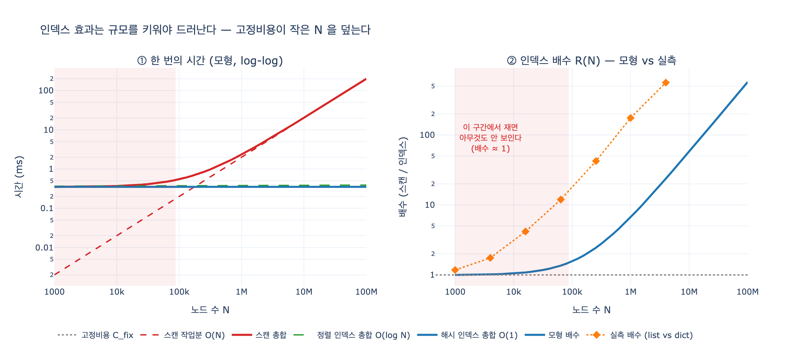

# 인덱스 효과를 재려면 무엇을 주의해야 하는가?

> **답** — 규모를 충분히 키워야 한다. 수천 개에서는 파싱 값이 지배해서 아무것도 안 보인다.

---

## 1. 무슨 일이 벌어지는가

33장 예제 2(`ex2_index_effect.py`)는 같은 표에서 한 사람을 세 가지 방법으로 찾는다.

| 찾는 방법 | 쿼리 | 기대되는 복잡도 |
|---|---|---|
| 기본 키로 | `MATCH (p:Person {id:$i})` | 인덱스를 탄다. $O(1)$ |
| 속성으로 | `WHERE p.name = $n` | 인덱스 없다. 전체 스캔 $O(N)$ |
| 앞부분 일치 | `WHERE p.name STARTS WITH $n` | 정렬 인덱스가 있으면 $O(\log N)$ |

노드 수를 2,000 → 8,000 → 32,000 → 128,000으로 키우면서 잰다.
저자가 기대한 결과는 **「기본 키는 평평하고 속성은 비례해서 는다」**였다.

실제 결과는 이랬다.

> 배수가 1.1 언저리에서 거의 안 변한다. 둘 다 비슷하게 늘어난다.

인덱스가 고장 난 게 아니다. **눈금이 잘못된 것**이다.

---

## 2. 왜 안 보이는가 — 고정비용이 분모·분자를 동시에 채운다

쿼리 한 번의 시간은 두 덩어리다.

$$
T(N) \;=\; \underbrace{C_{\text{fix}}}_{\text{파싱 + 플래닝 + 결과 래핑}} \;+\; \underbrace{W(N)}_{\text{실제 탐색}}
$$

- $C_{\text{fix}}$ — 쿼리 문자열을 토큰으로 쪼개고, 플랜을 세우고, 결과를 감싸 돌려주는 값.
  **N 과 완전히 무관한 상수**다. 임베디드 그래프 DB에서 대략 수십 μs ~ 수백 μs.
- $W(N)$ — 여기만 데이터 규모를 탄다. 인덱스가 건드리는 것도 **오직 여기뿐**이다.

우리가 재고 싶은 「인덱스 배수」는 이렇게 정의된다.

$$
R(N) \;=\; \frac{T_{\text{scan}}(N)}{T_{\text{index}}(N)} \;=\; \frac{C_{\text{fix}} + c_s N}{C_{\text{fix}} + c_h}
$$

**분자와 분모에 똑같은 $C_{\text{fix}}$ 가 들어 있다.** 그래서 $c_s N \ll C_{\text{fix}}$ 인 구간에서는

$$
R(N) \;\approx\; \frac{C_{\text{fix}}}{C_{\text{fix}}} \;=\; 1
$$

배수가 **1 에 눌러 붙는다**. 인덱스가 실제로는 완벽히 듣고 있어도,
전체 시간의 90%가 파싱·플래닝이면 측정값에는 나타날 수가 없다.

책의 문장 그대로다.

> 이 규모에서는 「쿼리를 파싱하고 계획을 세우는」 값이 지배하기 때문이다.
> 실제 찾기는 둘 다 1ms 도 안 걸리는데, 그 앞뒤에 붙는 고정 값이 훨씬 크다.

---

## 3. 그러면 얼마나 키워야 하나

식을 뒤집으면 「배수 $R$ 을 보려면 최소 몇 건이 필요한가」가 바로 나온다.

$$
N \;\ge\; \frac{(R-1)\,(C_{\text{fix}} + c_h)}{c_s}
$$

$C_{\text{fix}} = 0.35\ \text{ms}$, $c_s = 2\times10^{-6}\ \text{ms/노드}$ 로 두고 계산하면 (expy.py 실행 결과):

| 보고 싶은 배수 | 필요한 최소 N |
|---|---|
| 1.1x | 약 17,600 |
| 2x | 약 176,000 |
| 5x | 약 704,000 |
| 10x | 약 1,584,000 |
| 100x | 약 17,424,000 |

**「인덱스가 10배 빠르다」를 눈으로 확인하려면 150만 건 이상이 필요하다.**
2,000~128,000건 구간은 표의 첫 줄에도 못 미친다. 33장 예제 2가 딱 그 구간이다.

실무 감각으로 정리하면:

- **~수천 건** — 재지 마라. 재도 아무것도 안 나온다.
- **수만 건** — 어렴풋이 보이기 시작. 결론 내리기엔 아직 이르다.
- **수십만 ~ 백만 건 이상** — 여기서부터가 진짜 측정 구간이다.

---

## 4. 반대 방향의 함정 — 작은 데이터에 인덱스를 붙이는 것도 헛일

책이 같은 문단에서 곧바로 뒤집는 부분이다.

> 그리고 반대로, 수천 개짜리 데이터에 인덱스를 붙이며 튜닝하는 것도 헛일이다.

「안 보인다」와 「효과가 없다」는 다르지만, **작은 N 에서는 결과적으로 같다**.
인덱스로 줄일 수 있는 최대치가 애초에 몇 %뿐이기 때문이다.

$$
\text{최대 절감률} = \frac{T_{\text{scan}} - T_{\text{index}}}{T_{\text{scan}}} = \frac{c_s N - c_h}{C_{\text{fix}} + c_s N}
$$

| N | 인덱스로 줄일 수 있는 최대 |
|---|---|
| 1,000 | 0.0% |
| 10,000 | 4.9% |
| 100,000 | 36.0% |
| 1,000,000 | 85.0% |
| 100,000,000 | 99.8% |

이건 **암달의 법칙과 정확히 같은 모양**이다(33장 5절, 예제 5). 전체의 5%를 차지하는
구간을 아무리 최적화해도 전체는 5%밖에 못 준다. 작은 데이터에서 인덱스가 건드리는
구간이 바로 그 5%다.

그래서 결론이 양쪽으로 갈린다.

| 상황 | 해야 할 일 |
|---|---|
| 인덱스 효과를 **측정**하려는데 데이터가 작다 | 규모를 키워서 다시 재라. 작은 데이터의 결론을 믿지 마라 |
| 실제 **운영** 데이터가 작다(수천 건) | 인덱스 튜닝에 시간 쓰지 마라. 줄일 게 없다 |

---

## 5. 그래서 실측할 때 지켜야 할 것

1. **규모를 최소 수십만~백만 단위까지 키우고 잰다.** 로그 눈금으로 여러 점을 찍어
   추세를 봐야지, 한 점만 재고 배수를 말하면 안 된다.
2. **고정비용을 따로 잰다.** 아무 데이터도 안 건드리는 쿼리(예: `RETURN 1`)의 시간을
   먼저 재 두면, 측정값에서 「고정비용이 몇 %인가」를 항상 함께 볼 수 있다.
   이 비중이 50%를 넘으면 그 측정은 인덱스에 대해 아무 말도 안 하고 있는 것이다.
3. **워밍업 후에 반복 측정한다.** 첫 실행에는 플랜 캐시 미스, 페이지 캐시 미스가 섞인다.
   33장 예제들이 `c.execute(q)`를 한 번 먼저 부르고 나서 반복 측정하는 이유다.
4. **적재는 일괄로 한다.** 100만 건을 한 건씩 넣으면 측정 준비만 몇 시간이 걸린다.
   `COPY`/bulk load 를 쓰면 수십 배 빠르다. 33장이 예제 준비에서 `COPY` 를 쓰는 이유이자,
   「그래프 DB가 느리다」는 오해의 상당수가 나오는 지점이기도 하다.

---

## 6. 곁가지 — 「인덱스를 걸면 다 빨라진다」도 틀리다

규모를 충분히 키워도, **찾는 방식에 맞는 인덱스가 아니면** 안 듣는다.

| 찾는 방식 | 듣는 인덱스 |
|---|---|
| 같음 비교 (`=`) | 해시 인덱스 |
| 범위 비교 (`<`, `>`) | 정렬 인덱스. **해시는 안 듣는다** |
| 앞부분 일치 (`STARTS WITH`) | 정렬 인덱스 |
| 가운데 일치 (`CONTAINS`) | **어느 것도 안 듣는다.** 전문 검색이 필요 |

그리고 그래프에서는 한 가지가 더 있다.
**관계를 따라가는 데는 인덱스가 필요 없다.** 이미 이어져 있으니까.

> 그래프 튜닝의 첫 질문은 「인덱스를 걸까」가 아니라
> 「시작점을 인덱스로 찾고 나머지는 관계로 갈 수 있나」다.
> 시작점 하나만 인덱스로 찾으면 그다음은 공짜다.

---

## 한 줄 요약

인덱스는 $T(N) = C_{\text{fix}} + W(N)$ 에서 **$W(N)$ 만** 줄인다.
수천 건에서는 $C_{\text{fix}}$ 가 전체의 대부분이라 배수가 1에 붙어 버린다.
**규모를 키워야 인덱스가 보인다.**

---

## 시각화

왼쪽(①)은 절대 시간이다. 스캔의 «작업분»(빨간 점선)은 처음부터 $O(N)$ 으로 오르고 있지만,
$N \lesssim 10^5$ 구간에서는 고정비용(회색 점선) 아래에 깔려 있어서 **총합(빨간 실선)이
인덱스(파란·초록)와 겹쳐 보인다**.

오른쪽(②)은 배수다. 분홍 구간이 「재도 아무것도 안 보이는」 규모다.
모형(파란 실선)과 실측(주황 마름모, 파이썬 `list.index` vs `dict[]` 에 파싱 흉내를 붙인 것)이
같은 모양을 그린다. 왼쪽 끝에서 1에 눌러 붙어 있다가, $10^5$ 을 넘어서면서 갈라진다.
