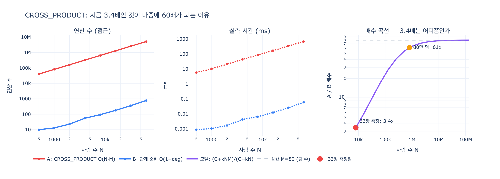

# CROSS_PRODUCT가 지금 3.4배 차이여도 심각한 이유

> **Q.** CROSS_PRODUCT가 지금 3.4배 차이여도 심각한 이유는 무엇인가?
>
> **A.** 데이터가 자라면 곱으로 커진다. 사람이 80만 명이면 배수가 훨씬 커진다.

---

## 1. 어떤 상황이었나

33장 `ex1_read_plan.py`는 **같은 답을 내는 세 쿼리**를 나란히 잰다. 데이터는 사람 8,000명, 팀 80개, 소속 엣지 8,000개. 셋 다 "마포에 사는 팀7 구성원 수"를 센다.

| 쿼리 | 형태 | 결과 |
|---|---|---|
| **A. 두 끝을 따로 찾음** | `MATCH (p:Person), (t:Team) WHERE t.name='팀7' AND p.city='마포' AND EXISTS { MATCH (p)-[:Member]->(t) }` | 답 100, **B·C의 3.4배** |
| **B. 팀에서 시작** | `MATCH (t:Team {name:'팀7'})<-[:Member]-(p:Person) WHERE p.city='마포'` | 답 100 |
| **C. 사람에서 시작** | `MATCH (p:Person {city:'마포'})-[:Member]->(t:Team) WHERE t.name='팀7'` | 답 100 |

B와 C는 거의 같다. 엔진이 어느 쪽에서 시작할지 알아서 정하기 때문이다. 「작은 쪽에서 시작하라」는 요즘 엔진에서는 대개 상관없다는 게 이 장의 발견 중 하나다.

차이를 만든 건 A다. A의 플랜에는 `CROSS_PRODUCT`가 있다. 사람 8,000명 × 팀 80개 = **64만 쌍**을 만들어 놓고 거기서 거른다.

---

## 2. 3.4배는 왜 「작은 숫자」가 아닌가 — 점근 대비

여기가 핵심이다. 3.4배는 **상수배 차이가 아니라, 데이터 크기에 붙어서 자라는 차이**다.

### 곱집합 플랜 A

두 끝을 따로 찾아서 붙이므로 모든 쌍을 만든다.

$$T_A = O(|P| \times |T|)$$

사람 수 $N$, 팀 수 $M$이라 하면 $O(N \cdot M)$이다. **곱**이다.

### 관계 순회 플랜 B/C

시작점 하나만 인덱스로 찾고, 그다음은 이미 이어져 있는 엣지를 따라간다.

$$T_B = O(|P| + E) \quad\text{— 실제로는 } O(\underbrace{\log|T|}_{\text{인덱스 조회}} + \underbrace{\deg(t)}_{\text{엣지 따라가기}})$$

33장 33.2절의 문장이 여기 그대로 걸린다.

> 그래프에서는 **관계를 따라가는 데 인덱스가 필요 없다.** 시작점 하나만 인덱스로 찾으면 그다음은 공짜다.

### 배수는 상수가 아니다

두 식의 비를 보자.

$$R(N) \;=\; \frac{T_A}{T_B} \;\sim\; \frac{N \cdot M}{N/M \;(\text{또는 } \deg t)} \quad\Longrightarrow\quad \text{배수가 } N \text{ 과 } M \text{ 을 따라 자란다}$$

즉 `CROSS_PRODUCT`는 **오늘 3.4배면 내일도 3.4배**인 종류의 문제가 아니다. 오늘 3.4배면 데이터가 100배 자랐을 때 수십~수백 배가 된다. 33장 본문이 딱 이렇게 적는다.

> `CROSS_PRODUCT`가 보이면 «두 끝을 따로 찾아서 붙이고 있다»는 뜻이고, **데이터가 자라면 곱으로 커진다.**
> 지금은 3.4배지만 **사람이 80만 명이면 배수가 훨씬 커진다.**

---

## 3. 그럼 왜 지금은 3.4배밖에 안 나오나 — 소규모 벤치마크의 함정

연산 수만 세면 A는 640,000, B는 100 남짓이다. **6,000배 이상** 차이다. 그런데 실측 시간은 3.4배밖에 안 났다. 왜?

측정한 시간은 이렇게 생겼기 때문이다.

$$T_{\text{측정}}(N) \;=\; \underbrace{C}_{\substack{\text{파싱 · 계획 수립 · 호출 왕복} \\ \text{(N과 무관한 고정 비용)}}} \;+\; \underbrace{k \cdot W(N)}_{\text{진짜 일}}$$

그래서 배수는

$$R(N) \;=\; \frac{C + k\,N M}{C + k\,N}$$

이고, 두 극단이 완전히 다르다.

$$C \gg k N M \;\Rightarrow\; R \to 1 \qquad\qquad C \ll k N M \;\Rightarrow\; R \to M$$

**작은 데이터에서는 고정 비용 $C$가 분자·분모를 둘 다 지배해서 배수를 1 쪽으로 눌러 버린다.** 알고리즘 차이가 6,000배여도 측정값은 3.4배로 나온다.

이건 33장이 `ex2_index_effect.py`에서 이미 한 번 얻어맞은 교훈과 같은 함정이다.

> 배수가 1.1 언저리에서 거의 안 변한다. (…) 이 규모에서는 «쿼리를 파싱하고 계획을 세우는» 값이 지배하기 때문이다.
> 실제 찾기는 둘 다 1ms도 안 걸리는데, 그 앞뒤에 붙는 고정 값이 훨씬 크다.
> 그래서 배운 게 하나 있다. **«인덱스 효과를 재려면 규모를 충분히 키워야 한다.»**

### 3.4배를 그대로 외삽하면

`ex1`의 조건($N = 8{,}000$, $M = 80$, 측정 배수 3.4)에서 $C$를 역산하면 $C \approx 2.55 \times 10^5$ (일 단위)가 나온다. 이 $C$를 고정하고 $N$만 키우면:

| 사람 수 $N$ | 예상 배수 $R(N)$ |
|---:|---:|
| 8,000 | **3.4x** ← 33장 측정점 |
| 80,000 | 19.8x |
| **800,000** | **60.9x** |
| 8,000,000 | 77.6x |
| 80,000,000 | 79.7x (→ 상한 $M = 80$) |

**사람이 80만 명이면 3.4배가 61배가 된다.** 그리고 상한이 80인 건 팀 수가 80개로 고정이라서다. 팀도 같이 자라면 그 상한 자체가 올라간다.

절대 시간으로 보면 더 무섭다. A는 $N$에 선형이지만 **기울기가 $M$배**다.

| 사람 수 | 플랜 A | 플랜 B |
|---:|---:|---:|
| 8,000 | 약 90ms | 0.01ms |
| 800,000 | 약 8.9초 | 0.8ms |
| 80,000,000 | 약 **15분** | 75ms |

---

## 4. 그래서 플랜을 읽을 때 무엇을 보나

숫자(ms)는 **오늘의 데이터 크기에 묶인 값**이다. 연산자는 **내일의 기울기**를 알려 준다. 그래서 33장은 플랜에서 볼 것을 셋으로 정리한다.

1. **`CROSS_PRODUCT`가 있나** — 있으면 거기부터 고친다. 배수가 작아 보여도 고친다.
2. **`SCAN`이 무엇을 훑나** — 인덱스를 타나, 전체를 훑나.
3. **`FILTER`가 `SCAN` 앞인가 뒤인가** — 뒤면 훑고 나서 버리는 것이다.

그리고 이건 한 번 보고 끝이 아니다.

> 팀이 80개가 아니라 80만 개가 되면 엔진의 선택이 바뀐다. **데이터가 자라면 플랜도 다시 봐야 한다.**

### 고치는 법

두 끝을 따로 찾지 말고, **시작점 하나를 인덱스로 찾고 나머지는 관계로 간다.** A를 B나 C 형태로 바꾸는 것이다. 그래프 튜닝의 첫 질문은 「인덱스를 걸까」가 아니라 「시작점을 인덱스로 찾고 나머지는 관계로 갈 수 있나」다.

---

## 5. 한 줄 요약

> `CROSS_PRODUCT`의 위험은 **오늘의 배수**가 아니라 **배수의 기울기**에 있다.
> $O(|P| \times |T|)$와 $O(|P| + E)$의 차이는 상수배가 아니고, 소규모 벤치마크는 고정 비용에 가려 그 차이를 3.4배로 축소해서 보여 준다.
> 3.4배라는 숫자 자체가 "아직 데이터가 작다"는 신호다.

---

## 시각화

