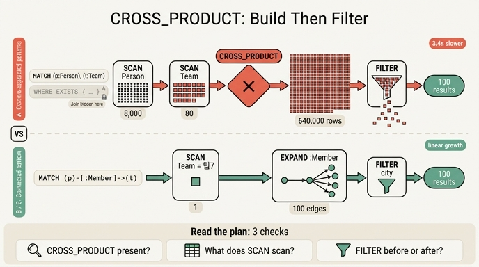

# 쿼리 A가 느린 이유 — 플랜에 `CROSS_PRODUCT`가 있다

## 한 줄 답

플랜에 `CROSS_PRODUCT`가 있다. **사람 8,000명 × 팀 80개**의 곱집합을 만들어 놓고 거기서 거른다.

---

## 1. 문제의 쿼리 A

`ex1_read_plan.py`의 세 쿼리는 **답이 완전히 같다**. 「마포에 사는 팀7 구성원 수」를 세고, 셋 다 `100`을 낸다. 그런데 A만 B·C의 **3.4배** 느리다.

```python
"A. 두 끝을 따로 찾음": (
    "MATCH (p:Person), (t:Team) "
    "WHERE t.name = '팀7' AND p.city = '마포' "
    "AND EXISTS { MATCH (p)-[:Member]->(t) } RETURN count(p)"),
```

읽기 좋게 펼치면 이렇다.

```cypher
MATCH (p:Person), (t:Team)          -- ① 쉼표로 나란히. 둘을 잇는 관계가 없다
WHERE t.name = '팀7'
  AND p.city = '마포'
  AND EXISTS { MATCH (p)-[:Member]->(t) }   -- ② 유일한 연결 조건이 여기 숨어 있다
RETURN count(p)
```

비교군은 이렇다.

```cypher
-- B. 팀에서 시작
MATCH (t:Team {name:'팀7'})<-[:Member]-(p:Person)
WHERE p.city = '마포' RETURN count(p)

-- C. 사람에서 시작
MATCH (p:Person {city:'마포'})-[:Member]->(t:Team)
WHERE t.name = '팀7' RETURN count(p)
```

데이터 규모는 `N_PEOPLE = 8000`, `N_TEAMS = 80`, `Member` 엣지 8,000개다.

---

## 2. 왜 플래너가 조인 조건을 못 찾나

### 쉼표는 「조인」이 아니라 「따로 찾아라」다

`MATCH (a), (b)`에서 쉼표는 **두 개의 독립된 패턴**을 뜻한다. SQL의 `FROM Person, Team`과 정확히 같다. 두 패턴이 **변수를 공유하거나 관계로 이어져 있지 않으면** 플래너가 쓸 수 있는 조인 키가 없다. 조인 키가 없는 두 입력을 붙이는 유일한 방법이 곱집합, 즉 `CROSS_PRODUCT`다.

B·C에는 `-[:Member]->`가 `MATCH` 패턴 **안에** 있다. 플래너는 이걸 보고 「Person과 Team은 Member 릴 테이블로 이어져 있다」는 걸 안다. 그래서 한쪽을 훑고 관계를 따라 반대쪽으로 넘어가는 확장(expand/join) 연산자를 고른다.

### `EXISTS { ... }`는 조인 조건이 아니라 술어(predicate)다

A에도 분명히 `(p)-[:Member]->(t)`가 적혀 있다. 문제는 **그게 있는 자리**다.

- `MATCH` 패턴에 있는 관계 → 플래너의 **조인 그래프**에 들어간다. 어느 쪽에서 출발할지, 어떤 인덱스를 탈지 계산 대상이 된다.
- `WHERE`의 `EXISTS { ... }` 서브쿼리 → 플래너에게는 **행 하나를 받아 참/거짓을 돌려주는 불투명한 필터**다. 바깥 쿼리의 두 스캔을 이어 붙일 근거로 쓰이지 않는다.

그래서 플래너는 이렇게 계획한다.

1. `Person`을 스캔한다 (8,000)
2. `Team`을 스캔한다 (80)
3. 둘을 `CROSS_PRODUCT`로 붙인다 → **8,000 × 80 = 640,000 행**
4. 그 위에 `FILTER`를 얹어 `t.name`, `p.city`, `EXISTS{...}`를 행마다 평가한다
5. 살아남은 100행을 센다

**만들어 놓고 거른다.** 답 100개를 얻으려고 64만 행을 흘려보낸 것이다. 이게 33장이 말하는 세 번째 체크 포인트 — 「`FILTER`가 `SCAN` 앞인가 **뒤**인가. 뒤면 훑고 나서 버리는 것이다」 — 의 교과서적 사례다.

> 참고: Neo4j는 같은 형태에 대해 실행 전에 경고를 띄운다. *"This query builds a cartesian product between disconnected patterns."* 엔진이 다르고 표현이 달라도, 쉼표로 끊긴 패턴 → 곱집합이라는 구조는 같다.

### `EXISTS`가 죄인은 아니다

`EXISTS { ... }` 자체가 나쁜 문법이 아니다. 문제는 **두 패턴을 잇는 유일한 조건을 거기에 숨긴 것**이다. 이미 관계로 이어진 패턴 위에서 「추가 조건」으로 쓰는 `EXISTS`는 정상적인 도구다.

---

## 3. 고치는 법

**관계를 `MATCH` 패턴 안으로 끌어올린다.** 그게 B와 C다.

```cypher
-- 고치기 전 (A)
MATCH (p:Person), (t:Team)
WHERE ... AND EXISTS { MATCH (p)-[:Member]->(t) }

-- 고친 뒤 (B / C)
MATCH (p:Person)-[:Member]->(t:Team)
WHERE p.city = '마포' AND t.name = '팀7'
```

한 줄 규칙: **쿼리에 등장하는 노드 변수들이 하나의 연결된 패턴으로 묶이는지 확인하라.** 묶이지 않으면 그 지점이 곱집합이다.

### B와 C 중 어느 쪽이 나은가 — 대개 상관없다

B는 팀7에서 출발해 100개 엣지를 따라가고, C는 마포 사람 2,000명에서 출발해 2,000개 엣지를 따라간다. 손으로 보면 B가 나아 보이는데, 실측하면 **둘이 거의 같다**. 요즘 플래너가 어느 쪽에서 시작할지 알아서 정하기 때문이다.

> 「작은 쪽에서 시작하라」는 요즘 엔진에서는 대개 상관없습니다. 플래너가 알아서 정해요. 순서를 고민하기 전에 플랜을 보세요.

즉 A와 B·C의 차이는 **「시작점 선택」이 아니라 「곱집합이 있느냐 없느냐」**다. 튜닝 포인트를 앞의 것으로 착각하기 쉬운데, 실제로 3.4배를 만든 건 뒤의 것이다.

---

## 4. 지금은 3.4배지만, 곱으로 커진다

곱집합이 무서운 이유는 **현재 배수가 아니라 성장 곡선**이다.

| 사람 수 | 팀 수 | A가 만드는 중간 행 | B·C가 만지는 엣지 |
|---|---|---|---|
| 8,000 | 80 | 640,000 | 100 ~ 2,000 |
| 80,000 | 80 | 6,400,000 | 1,000 ~ 20,000 |
| 800,000 | 80 | 640,000,000 | 10,000 ~ 200,000 |

B·C는 데이터에 **선형**으로 늘지만 A는 **곱**으로 는다. 그래서 책의 표현이 이렇다.

> 지금은 3.4배지만 사람이 80만 명이면 배수가 훨씬 커진다.

스테이징에서 "좀 느린데 쓸 만하네"였던 쿼리가 프로덕션에서 터지는 전형적인 경로다.

---

## 5. 플랜 읽기 3종 세트

`ex1_read_plan.py`는 `EXPLAIN` 출력에서 연산자 이름만 정규식으로 뽑아 **아래에서 위로**(실행 순서대로) 뒤집어 출력한다.

```python
r = c.execute("EXPLAIN " + QUERIES[name])
ops = re.findall(r"([A-Z_]{4,})\[\d+\]", text)
# 아래에서 위로 읽는 것이 실행 순서다
print("    " + "  →  ".join(reversed(ops)))
```

여기서 찾을 것은 셋이다.

| # | 볼 것 | 나쁜 신호 | 뜻 |
|---|---|---|---|
| 1 | `CROSS_PRODUCT`가 있나 | 있으면 거기부터 고친다 | 두 끝을 따로 찾아 붙이고 있다. 데이터가 자라면 곱으로 커진다 |
| 2 | `SCAN`이 무엇을 훑나 | 전체 스캔 | 인덱스를 타는가, 테이블을 통째로 훑는가 |
| 3 | `FILTER`가 앞인가 뒤인가 | `SCAN` 뒤 | 훑고 나서 버리는 것이다 |

**`CROSS_PRODUCT`는 플랜에서 제일 먼저 찾을 단어다.**

그리고 이건 한 번 보고 끝이 아니다. 팀이 80개가 아니라 80만 개가 되면 엔진의 선택이 바뀐다. **데이터가 자라면 플랜도 다시 봐야 한다.**

---

## 6. 한 걸음 물러나서 — 그래도 청구서는 안 바뀐다

33장의 반전은 여기다. A를 B로 고치면 지연은 3.4배 좋아지지만, `ex3_cost_model.py`가 보여주듯 **청구서의 큰 칸은 대개 토큰**이다. 쿼리를 2ms에서 1ms로 줄여도 월 비용은 거의 그대로다.

- 쿼리 튜닝 → **지연**을 줄인다 (사용자가 기다리는 시간)
- 토큰 줄이기 → **비용**을 줄인다 (청구서)

곱집합 제거는 후자가 아니라 전자다. 다만 곱집합은 「지금 3.4배」가 아니라 「나중에 터짐」의 문제라서, 비용 논리와 무관하게 발견 즉시 고치는 게 맞다.

---

## 요약

- 쿼리 A는 `MATCH (p:Person), (t:Team)`처럼 **쉼표로 두 패턴을 끊어 놓고**, 둘을 잇는 유일한 조건을 `WHERE`의 `EXISTS { MATCH (p)-[:Member]->(t) }` 안에 숨겼다.
- 플래너는 `EXISTS` 서브쿼리를 조인 조건이 아니라 **행 단위 필터**로 본다. 조인 키가 없으니 `CROSS_PRODUCT`로 떨어진다.
- 결과: 8,000 × 80 = **640,000행을 만들어 놓고** 필터로 100행만 남긴다.
- 고치는 법: 관계를 `MATCH` 패턴 안으로 옮겨 하나의 연결된 패턴으로 만든다 (B·C).
- 어느 쪽에서 시작할지는 플래너가 알아서 한다. 사람이 볼 것은 시작점이 아니라 **`CROSS_PRODUCT`의 유무**다.

## 인포그래픽


