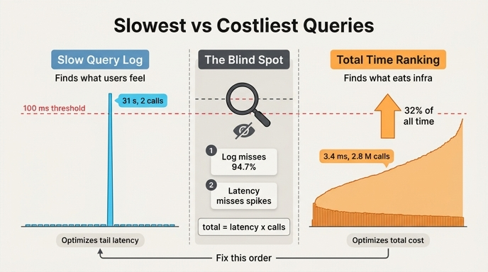

# 느린 쿼리 로그 vs 총 시간 순위 — 서로 다른 목적 함수

> **Q.** 느린 쿼리 로그와 총 시간 순위는 각각 무엇을 찾는 도구인가?
>
> **A.** 느린 쿼리 로그는 사용자가 기다린다고 느끼는 것을, 총 시간 순위는 인프라를 먹는 것을 찾는다. 고치는 순서는 대개 후자가 먼저다.

---

## 1. 한 줄로

두 도구는 「성능 도구」라는 같은 서랍에 들어 있지만 **최적화하는 대상이 다릅니다.**

- **느린 쿼리 로그(slow query log)** — `1회 지연 > 임계값`인 쿼리를 잡습니다. 최적화 대상은 **꼬리 지연(tail latency)**, 즉 *사용자 체감*입니다.
- **총 시간 순위(total time ranking)** — `1회 지연 × 호출 수`로 줄을 세웁니다. 최적화 대상은 **총 자원 소모**, 즉 *용량과 비용*입니다.

33.3절의 표현으로는 「제일 느린 것」과 「제일 아픈 것」입니다. 그리고 이 둘은 **대개 다른 쿼리**예요.

---

## 2. 대비표 — 두 도구가 실제로 재는 것

| | 느린 쿼리 로그 | 총 시간 순위 |
|---|---|---|
| **목적 함수** | `max(1회 지연)` — 꼬리를 깎는다 | `Σ(1회 지연 × 호출 수)` — 면적을 깎는다 |
| **찾아내는 것** | 사용자가 **기다린다고 느끼는** 쿼리 | 인프라를 **먹는** 쿼리 |
| **대표 지표** | p95 / p99 지연, 타임아웃 건수 | 쿼리별 누적 실행 시간, CPU 코어·점유율 |
| **개선하면 좋아지는 것** | 체감 반응 속도, SLO 준수, 이탈률 | 코어 수, 인스턴스 대수, 월 인프라 청구서, 여유(headroom) |
| **놓치는 것** | 빠르지만 엄청 자주 도는 쿼리(임계값 아래는 **한 번도 안 찍힌다**) | 드물지만 한 번에 30초 걸려 사용자를 붙잡는 쿼리 |
| **수집 방식** | 임계값 초과 이벤트를 로그로 남김 | 다이제스트별 실행 통계를 상시 집계 |
| **구현 예** | MySQL `slow_query_log` + `long_query_time`, PostgreSQL `log_min_duration_statement`, Neo4j `db.logs.query.threshold` | PostgreSQL `pg_stat_statements`(`total_exec_time`), MySQL `performance_schema.events_statements_summary_by_digest`(`SUM_TIMER_WAIT`), APM의 throughput × latency |
| **편향** | **희귀한 거인**에 끌린다 | **흔한 난쟁이 떼**를 드러낸다 |
| **잡는 그림** | 낮게 깔린 그래프에 솟은 **뾰족한 봉우리 하나** | 아주 낮지만 **끝없이 이어지는 넓은 띠** |

핵심은 마지막 줄입니다. 총 시간은 **면적**이고, 지연은 **높이**예요. 높이만 보면 면적을 못 봅니다.

---

## 3. ex4 수치로 확인하기

`code/ex4_hot_query.py`의 워크로드입니다. 일곱 개 쿼리를 두 기준으로 각각 줄 세우면 순위가 거의 뒤집힙니다.

### (가) 1회 지연 순 — 느린 쿼리 로그가 보는 세상

| 순위 | 쿼리 | 1회 지연 |
|---|---|---|
| 1 | 커뮤니티 탐지 | 31,000.0 ms |
| 2 | 월간 감사 리포트 | 12,000.0 ms |
| 3 | 전체 조직도 렌더 | 820.0 ms |
| 4 | 2홉 이웃 탐색 | 18.0 ms |

### (나) 하루 총 시간 순 — 총 시간 순위가 보는 세상

| 순위 | 쿼리 | 1회 ms | 하루 호출 | 하루 총 시간 | 비중 |
|---|---|---|---|---|---|
| 1 | 사용자 권한 계산 | 3.4 | 2,800,000 | 2.644 h | **32.0%** |
| 2 | 팀 구성원 조회 | 2.1 | 4,200,000 | 2.450 h | **29.6%** |
| 3 | 이름으로 사람 찾기 | 1.2 | 6,100,000 | 2.033 h | **24.6%** |
| 4 | 2홉 이웃 탐색 | 18.0 | 140,000 | 0.700 h | 8.5% |
| 5 | 전체 조직도 렌더 | 820.0 | 1,400 | 0.319 h | 3.9% |
| 6 | 월간 감사 리포트 | 12,000.0 | 30 | 0.100 h | 1.2% |
| 7 | 커뮤니티 탐지 | 31,000.0 | 2 | 0.017 h | 0.2% |
| | **합계** | | | **8.264 h** | 100% |

### 읽히는 세 가지

**① 1등이 완전히 다릅니다.**
지연 1등 「커뮤니티 탐지」(31초)는 총 시간에서 **꼴찌(0.2%)**입니다. 하루 두 번밖에 안 돌거든요. 반대로 총 시간 1등 「사용자 권한 계산」은 3.4ms짜리라 지연 순위에서는 아예 보이지도 않습니다.

**② 상위 셋이 전체의 86%를 먹는데, 셋 다 「빠른」 쿼리입니다.**
권한 계산·팀 구성원·이름 찾기의 합은 7.128시간, 전체 8.264시간의 **86.3%**. 1.2 ~ 3.4ms짜리들입니다.

**③ 느린 쿼리 로그의 임계값을 100ms로 잡으면, 총 시간의 5.3%만 보입니다.**
임계값 100ms를 넘는 쿼리는 조직도 렌더(820ms)·감사 리포트(12s)·커뮤니티 탐지(31s) 셋뿐입니다. 이 셋의 총 시간 합은 0.436시간 — **전체의 5.3%**. 나머지 **94.7%는 로그에 단 한 줄도 안 찍힙니다.**

> 임계값을 100ms로 잡으면 1.2ms 짜리는 「한 번도 안 찍힌다」. 제일 아픈 쿼리가 로그에 아예 안 나온다. — ex4

### ④ 노력 대비 효과가 자릿수로 갈립니다

| 튜닝 | 개선 폭 | 하루 절감 |
|---|---|---|
| 권한 계산 3.4ms → 1.7ms (절반) | 1.7ms | **1.322 h** |
| 커뮤니티 탐지 31s → 15s (절반) | 16s | **0.009 h** (32초) |

똑같이 「절반으로 줄이는」 작업인데 효과가 **약 150배** 차이 납니다. 게다가 31초 쿼리를 절반으로 줄이는 쪽이 대개 훨씬 어렵습니다. 어려운 일을 해서 아무것도 못 얻는 구조예요.

> *주: 원문 예제 텍스트에는 커뮤니티 탐지 절감이 「하루 0.00003시간」으로 적혀 있지만, `16s × 2회 = 32s = 0.0089h`가 실제 값입니다. 자릿수가 달라도 결론(무시할 만한 크기)은 그대로입니다.*

---

## 4. 왜 대개 총 시간이 먼저인가

### (1) 절감의 절대량 자체가 크다 — 암달의 법칙
33.5절/ex5와 같은 논리입니다. 전체의 0.2%를 차지하는 구간은 **완전히 0으로 만들어도 0.2%**입니다. 32%를 차지하는 구간을 절반만 깎아도 16%예요. 최적화의 상한은 「그 구간이 차지하는 비중」이 정합니다.

### (2) 총 시간이 곧 코어 수이고, 코어 수가 곧 청구서다
`ex3_cost_model.py`의 계산식이 그대로입니다.

```python
def cpu_cores(calls, ms):
    return calls * ms / 1000.0 / (HOURS * 3600)
```

필요한 코어 수는 `호출 수 × 지연`, 즉 **총 시간에 정비례**합니다. 1회 지연만 줄여도 호출 수가 적으면 코어가 안 줄어요. 총 시간 순위는 처음부터 「이 쿼리가 코어를 몇 개 먹나」를 재는 도구입니다. 용량 계획·오토스케일링·인스턴스 청구서가 전부 이 축에 달려 있습니다.

### (3) 총 시간을 줄이면 꼬리 지연도 따라 좋아진다 (역은 성립 안 함)
큐잉 이론의 결과입니다. 시스템 이용률 ρ가 1에 가까워질수록 대기 시간이 폭증합니다(대략 `1/(1-ρ)`). 총 시간을 깎으면 ρ가 내려가고, **줄 서서 기다리던 모든 쿼리의 p99가 같이 내려갑니다.** 즉 총 시간 최적화는 지연 개선을 덤으로 줍니다.

반대는 성립하지 않습니다. 하루 두 번 도는 31초 쿼리를 15초로 만들어도 시스템 이용률은 사실상 그대로고, 다른 쿼리는 하나도 안 빨라집니다.

### (4) 여유(headroom)가 곧 안정성이다
총 시간이 크다는 건 상시 점유가 높다는 뜻이고, 트래픽 스파이크나 노드 장애를 받아낼 여유가 없다는 뜻입니다. 총 시간을 깎는 건 성능 작업인 동시에 **가용성 작업**입니다.

### (5) 흔한 쿼리는 대개 고치기도 쉽다
총 시간 상위에 오르는 건 보통 단순한 조회입니다. 인덱스 하나, 캐시 한 줄, N+1 제거로 끝나는 경우가 많아요. 반대로 31초짜리 배치성 쿼리는 알고리즘 자체를 손대야 합니다.

---

## 5. 그래도 느린 쿼리 로그를 먼저 봐야 하는 예외

「대개 후자가 먼저」이지 「항상」이 아닙니다. **둘 다 봐야 한다**는 게 원문의 결론이에요. 다음 상황에서는 순서가 뒤집힙니다.

### ① 그 느린 쿼리가 사용자 동기 경로에 있을 때
31초 쿼리가 야간 배치면 아무도 안 기다립니다. 그런데 그게 **화면 로딩 중에 도는 것**이라면, 총 시간 0.2%든 말든 그 사용자에게는 100% 망가진 경험입니다. 지연은 평균이 아니라 **개별 사용자가 겪는 사건**입니다.

### ② SLO / SLA가 이미 깨지고 있을 때
「p99 < 300ms」 같은 계약이나 목표가 있으면, 꼬리 지연은 협상 대상이 아니라 **제약 조건**입니다. 제약을 어긴 상태에서 비용 최적화를 먼저 하는 건 순서가 틀렸습니다.

### ③ 그 한 건이 남을 같이 느리게 만들 때 (자원 점유·전염)
느린 쿼리는 혼자 느린 데서 끝나지 않는 경우가 많습니다.

- 락을 오래 잡아 다른 트랜잭션을 세운다
- 커넥션 풀 슬롯을 31초간 점유해 풀을 고갈시킨다
- 메모리를 크게 먹어 캐시를 밀어내거나 OOM을 낸다
- 타임아웃 → 재시도 폭풍(retry storm) → 부하 증폭

이때 그 쿼리의 **자기 총 시간**은 작지만, 그것이 유발한 **남의 총 시간**은 큽니다. 총 시간 순위표만으로는 이 인과가 안 보입니다.

### ④ 그 느린 쿼리가 자라는 중일 때
ex1의 `CROSS_PRODUCT`가 정확히 이 경우입니다. 지금은 3.4배지만 데이터가 자라면 **곱으로** 커집니다. 오늘의 총 시간 순위는 어제의 데이터로 그린 그림이에요. 「느리다 + 데이터에 대해 초선형으로 자란다」는 조합은 지금 순위와 무관하게 시한폭탄입니다.

### ⑤ 총 시간 상위가 이미 바닥을 쳤을 때
「이름으로 사람 찾기」는 1.2ms입니다. ex2가 보여주듯 이 정도면 **파싱·계획 수립 같은 고정 비용이 지배**하는 영역이라 쿼리 자체를 튜닝해 얻을 게 별로 없습니다. 이때 총 시간을 줄이는 방법은 쿼리 튜닝이 아니라 **호출 수를 줄이는 것**(캐시, 배치, N+1 제거)이고, 그건 쿼리 작업이 아니라 애플리케이션 설계 작업입니다.

### ⑥ 인프라 비중 자체가 작을 때 (33.4절)
ex3의 결론이기도 합니다. 청구서의 큰 칸이 토큰이면, 인프라 안에서 총 시간을 줄여봐야 청구서는 거의 안 바뀝니다. 그럴 땐 「비용을 줄이려고 총 시간을 본다」는 전제가 이미 틀린 것이고, 오히려 사용자 체감(지연)을 위해 느린 쿼리를 보는 쪽이 명분이 있습니다.

---

## 6. 실무 체크리스트

1. **두 순위표를 나란히 뽑는다.** 지연 순 top 10, 총 시간 순 top 10. 두 표에 겹치는 이름이 몇 개인지 세어 보세요. 보통 거의 안 겹칩니다.
2. **느린 쿼리 로그를 총 시간 도구로 오해하지 않는다.** 임계값 아래는 존재하지 않는 것과 같습니다. ex4에서는 총 시간의 94.7%가 임계값 아래에 숨어 있었습니다.
3. **총 시간 도구를 상시 켠다.** `pg_stat_statements`, `performance_schema` 다이제스트 통계 등. 로그를 뒤져 사후에 합산하는 것보다 정확합니다.
4. **총 시간이 큰 것부터 고치되, SLO 위반과 자원 점유형 느린 쿼리는 먼저 처리한다.**
5. **한 단계 더 올라가서 본다.** 총 시간을 줄이는 가장 큰 레버는 대개 「1회를 빠르게」가 아니라 **「호출 수를 줄이기」**입니다. `총 시간 = 지연 × 호출 수`인데, 사람들은 습관적으로 왼쪽 항만 건드립니다.
6. **비용이 목적이면 33.4절로 간다.** 지연 튜닝은 「사용자가 기다리는 시간」을, 토큰 줄이기는 「청구서」를 줄입니다. 목적을 먼저 정하고 도구를 고르세요.

---

## 7. 관련 절·예제

| 위치 | 내용 |
|---|---|
| 33.3 「제일 느린 것과 제일 아픈 것은 다르다」 | 이 카드의 본문 |
| `code/ex4_hot_query.py` | 위 표의 출처 |
| 33.4 / `ex3_cost_model.py` | 총 시간 → 코어 → 청구서로 이어지는 계산 |
| 33.5 / `ex5_where_time_goes.py` | 암달의 법칙. 95% 구간을 안 건드리면 나머지를 다 고쳐도 3% |
| 33.1 / `ex1_read_plan.py` | `CROSS_PRODUCT` — 지금은 작지만 자라는 쿼리 |

---

## 인포그래픽


