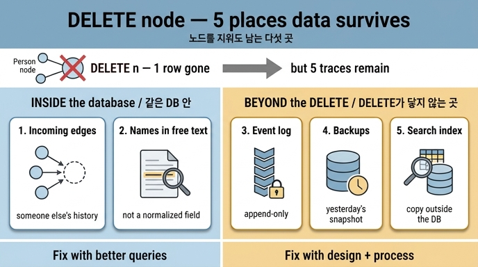

# 노드를 지워도 개인정보가 남는 다섯 곳

**질문** — 노드를 지워도 개인정보가 남는 다섯 곳은 어디인가?

**답** — 들어오는 엣지, 자유 텍스트 안의 이름, 이벤트 로그, 백업, 검색 색인이다.

---

## 왜 이 질문이 나왔나

34장은 「지웠습니다」라고 답한 뒤 3주 만에 다시 연락이 온 이야기로 시작합니다. 그 답은 거짓이 아니었어요. **한 곳에서만** 사실이었습니다.

관계형 DB라면 「그 행을 지우면 끝」에 가깝습니다. 그래프에서는 그렇지 않습니다. 노드 하나는 자기 자신만 담고 있는 게 아니라, 자기를 향해 들어오는 화살표들과 다른 노드의 본문 안에까지 흔적을 남기고 있기 때문입니다.

`DELETE n` 은 **노드 테이블의 한 행**만 지웁니다. 개인정보는 거기만 있는 게 아닙니다.

## 다섯 곳, 하나씩

### 1. 들어오는 엣지 (incoming edges)

내가 나가는 엣지(`(p1)-[:작성]->(d1)`)는 p1을 지우면서 같이 정리하기 쉽습니다. 문제는 **남이 나를 가리키는 엣지**입니다.

예제 1(`ex1_delete_scope.py`)의 엣지 목록에 이런 줄이 있습니다.

```python
("r1", "p1", "읽음"),          # 29장의 Reads — 실행이 이 사람을 읽었다
("p2", "p1", "멘토"),           # 남이 나를 가리킨다
("d1", "p1", "언급"),           # 문서 본문 안에 이름이 있다
```

`(p2)-[:멘토]->(p1)` 은 「이서연이 김도현의 멘티였다」는 뜻입니다. 이건 김도현 쪽 사실이면서 **동시에 이서연 쪽 사실**입니다. 그냥 지우면 이서연의 이력이 사라집니다. 그래서 「이어진 것을 전부 지운다」는 답이 될 수 없어요.

여기서 그래프 특유의 함정이 하나 더 나옵니다. 엣지를 다 끊는 것도 답이 아니라는 겁니다. 34.3절이 말하는 것처럼 그래프에서는 **관계 자체가 식별자**입니다. 속성을 전부 지워도 「이 팀에 속하고 저 문서를 작성했고 그 사람의 멘티다」라는 이웃 모양이 유일하면 그것만으로 특정됩니다.

### 2. 자유 텍스트 안의 이름

예제 1은 노드를 실제로 지워 보고 남은 노드를 훑습니다.

```python
c.execute("MATCH (n:N {id:'p1'})-[e:R]->() DELETE e")
c.execute("MATCH ()-[e:R]->(n:N {id:'p1'}) DELETE e")
c.execute("MATCH (n:N {id:'p1'}) DELETE n")
```

그런데 `m1` 노드의 라벨은 이렇게 남아 있습니다.

```
m1   Msg   김도현: 마포에서 봐요   ← 이름이 그대로 남아 있다
```

`Msg`, `Doc` 의 본문, 요약, 회의록. 이건 **정규화된 필드가 아니라 그냥 글**입니다. `SET p.name = NULL` 같은 한 줄로 못 지웁니다. 텍스트 안을 찾아 들어가 마스킹해야 합니다. 그래서 예제 5의 방침 표는 `Msg` 를 「삭제」가 아니라 **「본문 마스킹 — 이름·연락처만 가린다」**로 두었습니다.

덧붙여 이 문장에는 이름 말고도 「마포」라는 장소가 들어 있습니다. 예제 3의 재식별 문제와 바로 이어집니다. 이름을 가려도 「마포 + 결제팀 + 개발 + 2019년 입사」 같은 조합이 남으면 66%가 혼자가 됩니다.

### 3. 이벤트 로그

30장에서 이벤트 로그는 **추가 전용(append-only)** 이라고 했습니다. 지울 수 없다는 뜻입니다. 그리고 여기에 역설이 하나 있습니다.

> 지운 「기록」이 남아야 한다. 이벤트 로그에는 「p1 을 지웠다」가 남는다.
> **그 기록 자체가 「p1 이 있었다」는 정보다.**

삭제를 감사 가능하게 만들려면 삭제한 사실을 기록해야 하고, 그 기록이 다시 개인정보가 됩니다. 이 순환을 끊는 방법은 지우는 게 아니라 **처음부터 안 넣는 것**입니다. 예제 5의 방침 표에서 `Event` 만 유일하게 「식별자 치환」인 이유입니다.

```python
"Event": ("식별자 치환", "30장 — 이벤트는 못 지운다"),
```

이벤트에는 이름·연락처 대신 식별자(`p1`)만 넣고, 그 식별자를 실제 사람으로 이어 주는 표에서만 지웁니다. 그러면 이벤트 로그는 그대로 남지만 `p1` 이 누구인지는 아무도 되찾을 수 없습니다. 34장은 이걸 **「이벤트에 개인정보를 직접 안 넣는 설계가 여기서 값을 한다」**고 표현합니다.

### 4. 백업

운영 DB에서 지워도 어제 밤 스냅샷에는 그대로 있습니다. 그리고 백업은 보통 **되돌리기 위해** 존재하므로, 성질상 지우기 어렵게 만들어져 있습니다. 예제 2의 비교표에서 「백업까지 지워진다」 칸이 ○ 인 수준은 **4번 완전 삭제 하나뿐**입니다.

```
기준                          1     2     3     4
이름으로 못 찾는다             ✗     ○     ○     ○
백업까지 지워진다              ✗     ✗     ✗     ○
```

즉 실무에서 제일 많이 쓰는 1~3번(숨기기 / 식별자 끊기 / 가명화)은 **정의상 백업에 남깁니다.** 백업이 개인정보 삭제의 실제 병목이고, 34장이 「삭제 자체는 초 단위인데 전체는 며칠 걸린다」고 하는 이유의 큰 부분입니다. 보존 기간(retention period)을 짧게 잡아 백업이 자연히 만료되게 두는 게 현실적인 대응입니다.

### 5. 검색 색인

DB 밖에 사는 복사본입니다. 전문 검색 엔진, 임베딩 벡터 스토어, 캐시, 읽기 전용 복제본(read model), 데이터 웨어하우스. 색인은 **성능을 위해 원본을 복제한 것**이므로 원본을 지워도 색인 쪽에서 삭제 이벤트를 처리하지 않으면 그대로 남습니다. 「이름으로 검색하면 아직 나온다」는 신고가 대개 여기서 옵니다.

그래서 삭제 절차의 「완료」 기준에는 **재색인(reindex)** 이 반드시 들어갑니다. 예제 5의 `Stat: 재계산` 이 같은 성질의 항목입니다 — 파생 데이터는 지우는 게 아니라 **다시 만들어야** 합니다.

## 다섯 곳을 한눈에

| 남는 곳 | 왜 남나 | 대응 |
|---|---|---|
| 들어오는 엣지 | 남의 이력이기도 하다 | 익명 노드로 치환 (엣지 삭제 아님) |
| 자유 텍스트 안의 이름 | 정규화된 필드가 아니다 | 본문 마스킹 |
| 이벤트 로그 | 추가 전용이라 못 지운다 | 애초에 식별자만 넣고, 매핑 표에서 지운다 |
| 백업 | 되돌리기 위한 것이라 지우기 어렵다 | 보존 기간으로 만료시킨다 |
| 검색 색인 | DB 밖의 복사본 | 재색인 |

## 외우는 법

**「밖에서 들어오는 것 / 글 속에 박힌 것 / 지울 수 없는 것 셋」** 으로 묶으면 셉니다.

- 밖에서 들어오는 것 → **들어오는 엣지**
- 글 속에 박힌 것 → **자유 텍스트 안의 이름**
- 지울 수 없는 것 셋 → **이벤트 로그**(추가 전용), **백업**(과거 스냅샷), **검색 색인**(DB 밖의 사본)

앞의 둘은 *같은 DB 안*에 있고, 뒤의 셋은 *`DELETE` 문이 닿지 않는 곳*에 있습니다. 그래서 앞의 둘은 쿼리를 더 잘 쓰면 되지만, 뒤의 셋은 **설계와 운영 절차로만** 해결됩니다.

## 함께 보면 좋은 것

- 예제 1이 코드로 짚는 이유는 셋(들어오는 엣지 / 자유 텍스트 / 지운 기록)이고, 여기에 백업과 검색 색인을 더해 장 요약의 다섯이 됩니다. 「그리고 실제 시스템에서는 로그·백업·이벤트 로그에도 남는다」는 주석이 그 확장 지점입니다.
- 「지운다」의 네 수준(예제 2), 재식별과 k-익명성(예제 3), 연쇄 영향 범위(예제 4), 노드 종류별 방침 표(예제 5)가 각각 이 다섯 곳 중 어디를 겨냥하는지 대응시켜 보면 장 전체 구조가 잡힙니다.
- 관련 1차 출처: [GDPR Art. 17 삭제권](https://gdpr-info.eu/art-17-gdpr/), [Art. 4 가명화](https://gdpr-info.eu/art-4-gdpr/), [k-익명성](https://dataprivacylab.org/dataprivacy/projects/kanonymity/kanonymity.pdf)

## 인포그래픽


