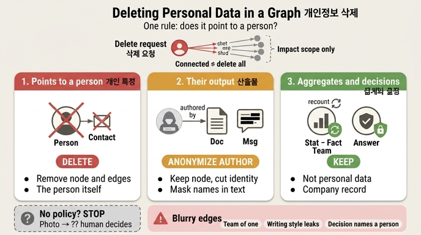

# 개인정보 삭제에서 세 부류를 어떻게 다르게 처리하는가?

**답:** 개인을 특정하는 것은 지우고, 그 사람이 만든 산출물은 대개 남기고(작성자만 익명화), 집계와 결정은 남긴다.

---

## 1. 왜 「세 부류」가 필요한가

삭제 요청이 오면 제일 먼저 떠오르는 답은 「이 사람에 이어진 것을 전부 지운다」입니다. 34장 예제 4(`ex4_cascade.py`)는 그 답이 왜 틀렸는지를 세어서 보여 줍니다.

`김도현(p1)` 하나를 지우려는데 영향 범위에 **일곱 개**가 걸립니다. 그리고 그 안에 이런 것들이 섞여 있어요.

```
김도현 → 3분기 보고서 → 팀별 문서 수 → 결제팀은 문서 생산이 많다
       → 결제팀에 리소스를 더 배정하자
```

- `이서연` — 같은 팀이라는 이유로 걸렸습니다. **명백히 지우면 안 되는 것**입니다. 남의 이력이니까요.
- `팀별 문서 수`(Stat) — 집계입니다. **개인정보가 아니므로 지울 이유가 없습니다.**
- `결제팀에 리소스를 더 배정하자`(Answer) — **회사의 결정 기록**입니다. 지우면 안 됩니다.

즉 그래프 연결은 「영향 범위」를 알려 줄 뿐이고, 그중 무엇을 어떻게 처리할지는 별도의 판정이 필요합니다. 그 판정을 세 부류로 정리한 것이 이 카드의 답입니다.

```
개인을 특정하는 것   → 지운다
그 사람이 만든 산출물 → 대개 남긴다 (작성자만 익명화)
집계와 결정          → 남긴다
```

## 2. 판정 기준: 「그것이 개인을 가리키는가」

세 부류를 나누는 단 하나의 질문은 이것입니다.

> **이 노드가 개인을 가리키는가, 아니면 개인이 만든 것인가?**
>
> 가리키면 지우고, 만든 것이면 「만든 사람만」 지운다.

「3분기 보고서」라는 문서 자체는 개인을 가리키지 않습니다. 개인을 가리키는 것은 「김도현이 **작성**」이라는 **엣지**입니다. 그래서 문서 노드는 두고 엣지의 작성자만 익명 노드로 바꿉니다.

여기서 그래프의 특징이 드러납니다. 관계형 DB라면 「그 행을 지우면 끝」에 가깝지만, 그래프에서는 **삭제 대상이 노드가 아니라 엣지의 한쪽 끝**인 경우가 대부분입니다. 지울 것은 「사람 노드」이고, 나머지는 「사람을 가리키던 엣지를 어디로 다시 붙일지」의 문제로 바뀝니다.

그리고 34장이 못을 박아 두는 대목이 있습니다.

> **이 판정은 자동으로 못 한다. 노드 종류마다 사람이 정해 둬야 한다.**

## 3. 방침 표와의 연결 (`ex5_deletion_plan.py`)

세 부류는 개념이고, 실무에서 쓰는 형태는 **노드 종류별 방침 표**입니다. 예제 5의 `POLICY`가 그것이며, 각 줄이 세 부류 중 어디에 속하는지 대응시키면 이렇게 됩니다.

| 노드 종류 | 방침 | 이유 | 부류 |
|---|---|---|---|
| `Person` | 삭제 | 개인 그 자체 | ① 개인을 특정하는 것 |
| `Contact` | 삭제 | 연락처 | ① 개인을 특정하는 것 |
| `Msg` | 본문 마스킹 | 발화 — 이름·연락처만 가린다 | ①과 ②의 경계 (본문에 이름이 박혀 있음) |
| `Doc` | 작성자 익명화 | 산출물은 회사 자산 | ② 산출물 |
| `Run` | 행위자 익명화 | 누가 돌렸는지만 가린다 | ② 산출물 (실행 이력) |
| `Team` | 유지 | 개인정보 아님 | ③ 남긴다 |
| `Stat` | 재계산 | 집계는 남기되 다시 센다 | ③ 집계 |
| `Fact` | 유지 | 개인을 안 가리키면 | ③ 남긴다 (단서 있음) |
| `Answer` | 유지 | 회사의 결정 기록 | ③ 결정 |
| `Event` | 식별자 치환 | 30장 — 이벤트는 못 지운다 | 별도 (추가 전용이라 삭제 불가) |
| `Photo` | **?? 방침 없음** | 사람이 정해야 한다 | 미분류 → **멈춘다** |

부류별 처리 동작이 이렇게 갈립니다.

- **① 지운다(삭제):** 노드와 그에 붙은 엣지를 없앱니다. `Person`, `Contact`.
- **② 익명화(끊고 남긴다):** 노드는 그대로 두고, 사람을 가리키던 엣지의 출발점만 익명 노드로 바꿉니다. `Doc`의 「작성자 익명화」, `Run`의 「행위자 익명화」, `Msg`의 「본문 마스킹」. 「지운다」의 네 수준 중 **2번(식별자 끊기)** 에 해당합니다.
- **③ 남긴다:** 손대지 않습니다. 단 `Stat`은 예외적으로 **재계산**입니다. 개인 자체는 지워졌으니 수치를 다시 세되, 집계라는 노드는 그대로 유지합니다.

`Stat`의 「재계산」이 세 부류 중 가장 미묘합니다. 「남긴다」이지만 **값이 바뀔 수 있다**는 뜻이니까요. 이 재계산 때문에 삭제 절차 전체가 초 단위가 아니라 며칠 단위가 됩니다.

### 표의 진짜 값어치

예제 5는 일부러 `Photo`에서 막히게 되어 있습니다. 방침 표에 없는 종류이기 때문입니다.

> 방침이 없으면 자동으로 처리하지 않고 **멈춘다.** 「모르는 것을 모른다」고 말해 주는 게 이 표의 값어치입니다.

표가 없으면 담당자가 그때그때 판단하고, 다음 요청에서 다른 담당자가 다르게 판단합니다. 「지난번엔 지웠는데 이번엔 안 지웠다」가 되는 쪽이 더 큰 문제입니다.

## 4. 부류 경계가 흐려지는 사례와 대응

세 부류는 깔끔해 보이지만 실무에서는 경계가 자주 무너집니다. 각각 대응이 다릅니다.

### (가) 1인 팀의 집계 — 「집계는 개인정보가 아니다」가 깨지는 곳

「팀별 문서 수」는 집계이니 개인정보가 아니라고 했습니다. 그런데 **결제팀에 사람이 한 명뿐이라면** 「결제팀 문서 수 = 12」는 곧 「김도현의 문서 수 = 12」입니다. 집계라는 형식만 갖췄을 뿐 실질은 개인 데이터예요.

이것은 예제 3에서 다룬 **k-익명성** 문제가 집계 노드로 옮겨 온 것입니다. 그룹 크기 k가 1이면 익명이 아닙니다. 대응은 예제 3의 셋과 같습니다.

- **일반화(generalization):** 팀 단위 집계를 부문 단위로 올려서 k를 키웁니다.
- **억제(suppression):** k가 임계값(예: 5) 미만인 그룹은 집계에서 아예 빼거나 마스킹합니다. 통계 공개에서 쓰는 최소 셀 크기 규칙과 같은 발상입니다.
- **잡음(noise):** 수치에 무작위 오차를 넣습니다(차등 정보보호 계열).

실무 규칙으로 정리하면: **집계 노드에 「기여자 수」 하한을 방침으로 박아 두고, 하한 미달이면 「유지」가 아니라 「억제 또는 일반화」로 넘긴다.** 셋 다 정확도를 내주고 익명성을 사는 거래이고, 공짜가 아닙니다.

### (나) 작성 스타일이 드러나는 산출물 — 「작성자만 익명화」가 안 통하는 곳

`Doc`은 작성자 엣지만 바꾸면 된다고 했습니다. 그런데 본문 자체가 사람을 가리키는 경우가 있습니다.

- **본문에 이름이 박혀 있다.** 예제 1의 `d1 -[언급]-> p1`이 그 경우입니다. 자유 텍스트는 정규화된 필드가 아니라 그냥 글이라서, 엣지를 끊어도 문자열은 남습니다. 예제 1에서 노드를 지운 뒤에도 `m1`의 「김도현: 마포에서 봐요」가 그대로 남아 있는 것이 이 문제의 실물입니다.
- **문체·서식·용어가 저자를 특정한다.** 저자 판별(stylometry)은 실제로 동작하는 기법입니다. 작성자 엣지를 익명화해도 「이 문서는 그 사람이 쓴 것」이 복원될 수 있습니다.
- **그래프 모양이 저자를 특정한다.** 34장이 가장 강조하는 대목입니다. 속성을 전부 지워도 「이 팀에 속하고, 저 문서를 작성했고, 그 사람의 멘티다」라는 **이웃 모양**이 유일하면 특정됩니다. **관계 자체가 식별자**이고, 이건 아직 제대로 된 해법이 없습니다.

대응은 이렇습니다.

- **`Msg` 방침을 「본문 마스킹」으로 별도로 둔다.** 실제로 방침 표가 `Doc`(작성자 익명화)과 `Msg`(본문 마스킹)를 나눠 놓은 이유입니다. 사람의 말이 담긴 노드는 본문까지 손대야 합니다.
- **본문 스캔을 절차에 넣는다.** 이름·연락처 패턴을 훑고, 걸린 문서는 사람 확인 단계로 보냅니다. 이것이 「며칠 걸린다」의 한 원인입니다.
- **설계 단계에서 자유 텍스트에 개인정보를 넣지 않는다.** 이벤트 로그에 대한 원칙과 같습니다. 이름 대신 식별자를 넣고 렌더링 시점에 이름을 붙이면, 삭제는 식별자를 가리키는 표 한 곳에서 끝납니다. 사후 수습보다 사전 최소화(data minimisation)가 압도적으로 쌉니다.
- **엣지 조합까지 본다.** 속성만 지우는 익명화는 그래프에서 충분하지 않습니다. 34장은 이 지점을 미해결로 명시합니다. 실무 대응은 「완전한 익명화」를 약속하지 않고, 남는 재식별 위험을 문서로 적어 두는 것입니다.

### (다) 개인을 지목하는 결정 — 「결정은 남긴다」가 깨지는 곳

`Answer`인 「결제팀에 리소스를 더 배정하자」는 개인을 가리키지 않으니 남깁니다. 그런데 결정이 이런 모양이면 어떻게 될까요.

- 「김도현을 승진 대상에서 제외한다」
- 「김도현의 접근 권한을 회수한다」

이건 회사의 기록이면서 동시에 **개인을 명시적으로 지목하는 개인정보**입니다. 두 부류에 동시에 속합니다.

대응은 「어느 한쪽을 고르기」가 아니라 **분리**입니다.

- **결정 노드는 유지하되 대상 엣지를 익명화한다.** 「결정이 있었다」는 사실과 「누구에 대한 결정인가」를 떼어 냅니다. `Run`의 「행위자 익명화」와 같은 패턴입니다.
- **법적 보존 의무를 먼저 확인한다.** 삭제권은 무조건이 아니고 보존 의무·정당한 이익 앞에서 물러납니다. 인사·회계·감사 기록은 보존 기간이 정해져 있는 경우가 많습니다. 그래서 방침 표의 이유 칸에 「어느 근거로 유지하는가」를 적어 두는 것이 중요합니다.
- **판단을 사람에게 올린다.** 개인을 지목하는 결정 노드는 자동 처리 대상에서 빼고, `Photo`가 막힌 것과 같은 방식으로 **멈추게** 만듭니다.

## 5. 잊지 말 것: 「지운다」는 한 가지가 아니다

세 부류의 처리 동작(삭제 / 익명화 / 유지·재계산)은 예제 2의 **네 수준**과 맞물립니다.

| 수준 | 내용 |
|---|---|
| 1. 숨기기(soft delete) | `deleted=true` 플래그 |
| 2. 식별자 끊기 | 이름·연락처를 지우고 대체 키만 남긴다 |
| 3. 가명화 | 식별자를 되돌릴 수 있는 토큰으로 |
| 4. 완전 삭제 | 노드·엣지·본문·백업까지 |

여덟 개 기준으로 채점하면 **어느 수준도 전부를 만족하지 못합니다.** 4번(완전 삭제)은 제일 강해 보이는데 만족한 기준이 4개로 제일 적습니다. 지우면 집계가 깨지고, 감사 이력이 사라지고, 남의 이력도 같이 깨지니까요. 제일 많이 만족하는 건 3번(가명화)으로 6개인데, 그것도 「다른 데이터와 못 잇는다」와 「백업까지 지워진다」는 못 합니다.

그래서 실무의 기본이 **2번(식별자 끊기)** 이고, 그것이 곧 세 부류에서 「② 작성자만 익명화」로 나타납니다. 「결제팀에 3명이 있었다」는 유지되고 「그중 하나가 김도현」은 사라집니다. 단, 2번에는 함정이 있습니다. 이름을 지워도 속성 조합으로 재식별될 수 있어요. 예제 3에서 속성 셋을 조합하면 0.6%가 혼자지만 **넷으로 가면 65.8%가 혼자**가 됩니다. 조합 수가 곱해지기 때문에 속성 하나 추가가 두 배가 아니라 백 배로 작동합니다.

## 6. 한 줄 정리

**「이어진 것을 전부 지운다」가 아니라 「그것이 개인을 가리키는가」로 세 부류로 나눈다 — 개인을 특정하는 것은 삭제, 그 사람의 산출물은 작성자만 익명화, 집계와 결정은 유지(집계는 재계산). 그리고 이 판정은 노드 종류별 방침 표로 미리 적어 두고, 표에 없는 종류가 나오면 멈춘다.**

## 인포그래픽


