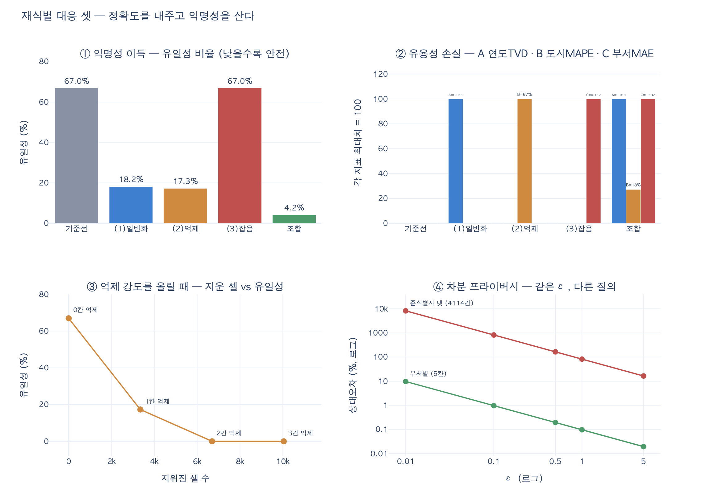

# 재식별에 대응하는 세 가지 방법

> **Q.** 재식별에 대응하는 세 가지 방법은 무엇인가?
>
> **A.** 일반화(2019년 입사 → 2015~2020년), 억제(혼자인 사람의 속성 제거), 잡음(생월을 ±2 흔들기)이다. 셋 다 정확도를 내주고 익명성을 산다.

---

## 0. 이 질문이 나오는 자리

34장은 「저를 지워 주세요」라는 요청 하나를 끝까지 따라가는 장이다.
그 여정에서 34.3절이 던지는 불편한 사실이 이것이다.

> **이름을 지워도 특정된다.**

`ex3_reidentify.py`가 5,000명 가상 인구로 보여 준 숫자다. 이름은 이미 지웠고,
남은 것은 팀·도시·직군·입사연도·생월뿐이다.

| 조합 | 최소 그룹 k | 혼자인 사람 | 비율 |
|---|---|---|---|
| `team` | 105 | 0 | 0.0% |
| `team + city` | ≥2 | 0 | 0.0% |
| `team + city + role` | 1 | 30 | 0.6% |
| `team + city + role + joined` | 1 | 3,290 | **65.8%** |
| `+ birth_month` | 1 | 4,815 | 96.3% |

(이하 이 문서의 숫자는 같은 실험을 `seed = 34`로 다시 돌린 `expy.py` 결과다.
기준선 유일성이 65.8% 대신 **67.0%** 로 나오는데, 난수 시드 차이일 뿐 구조는 같다.)

셋에서 넷으로 갈 때 0.6% → 65.8%. 두 배가 아니라 **백 배**다.
조합 가능한 칸의 수가 곱해지기 때문이다.
$40 \times 5 \times 5 = 1{,}000$개 칸에 5,000명이면 칸당 5명이지만,
여기에 연도 12개를 곱하면 12,000개 칸에 5,000명 —
**칸이 사람보다 많아지는 순간**이 절벽이다.

이 상태를 34.2절의 표에서는 「2번, 식별자 끊기」라고 부른다.
실무에서 제일 많이 쓰이는 수준인데, 「다른 데이터와 못 잇는다」 칸이 ✗ 다.
그 ✗ 를 메우려는 세 가지 시도가 이 카드의 답이다.

관련 개념은 **k-익명성(k-anonymity)** 이다.
"어떤 준식별자 조합으로도 최소 $k$명 이상으로 묶인다"는 성질로,

$$k = \min_{g \in G} |g|, \qquad
  \text{유일성 비율} = \frac{\bigl|\{g \in G : |g| = 1\}\bigr|}{N}$$

여기서 $G$는 준식별자(quasi-identifier) 값이 같은 사람끼리 묶은 동등 클래스다.
$k = 1$이면 혼자인 사람이 있다는 뜻이고, 그 사람은 이름 없이도 특정된다.

---

## 1. 세 가지 방법

### (1) 일반화 (generalization)

| 항목 | 내용 |
|---|---|
| **정의** | 속성 값의 **해상도를 낮춘다.** 개별 값을 그 값을 포함하는 더 넓은 범주로 바꾼다. 값을 지우지 않고 흐리게 만든다. |
| **적용 예** | `2019년 입사` → `2015~2020년`. 우편번호 `06236` → `062**`. 나이 `37` → `30대`. 도시 `마포` → `서울`. |
| **정확도 손실 형태** | **해상도 손실 (systematic, 되돌릴 수 없음).** 연도 단위 코호트 분석이 불가능해진다. 구간 안 분포를 균등하다고 가정해 복원하면, 실제 분포가 한쪽에 몰려 있을 때 크게 틀린다. |

값을 구간으로 묶으면 같은 구간에 든 사람들이 하나의 동등 클래스로 합쳐진다.
동등 클래스 수가 줄어들면 클래스당 인원이 늘고, 유일성이 떨어진다.
계층을 미리 정의해 두는 것이 보통이다 —
`연도 → 3년 구간 → 6년 구간 → 전체`처럼 계단을 만들고,
$k$가 목표치를 넘을 때까지 한 칸씩 올린다.

세 방법 중 **가성비가 제일 좋다.** 준식별자 자체에 직접 작용하니까.
반면 손실의 성격이 교활하다. "구간 단위로만 분석하겠다"고 물러서면
지표상 오차가 0으로 보인다. **오차가 없는 게 아니라, 그 질문을 이미 포기한 것이다.**

### (2) 억제 (suppression)

| 항목 | 내용 |
|---|---|
| **정의** | 위험한 값을 **아예 뺀다.** 셀 하나(`city = '*'`), 열 하나(`birth_month` 열 삭제), 또는 행 하나(그 사람 제거) 단위로 할 수 있다. |
| **적용 예** | 준식별자 조합이 유일한 사람의 `city`를 `*`로 바꾼다. 한 명뿐인 직군을 `기타`로 합친다. 5명 미만 셀은 통계표에서 공백 처리(cell suppression). |
| **정확도 손실 형태** | **결측 + 비무작위 편향.** 남은 값은 100% 정확하다는 게 장점. 문제는 결측이 무작위가 아니라 "특이한 사람"에 몰려 있어서, 그 열을 쓰는 집계가 조용히 과소 계상되고 다수 집단으로 편향된다. |

억제의 성질 두 가지를 기억할 만하다.

- **「혼자인 사람만 건드린다」가 소수 손실이 아니다.** 유일성이 67.0%인
  데이터에서 "유일한 사람"은 인구의 3분의 2다.
- **억제는 유일한 사람을 없애는 게 아니라 서로 섞는다.** `city`를 뺀
  사람들이 `('팀7', '*', '개발', 2019)` 같은 모양으로 모이면서 짝을 찾는다.
  짝을 못 찾은 사람은 여전히 혼자다. 그래서 억제를 한 번 해도 $k$는 1일 수 있다.

### (3) 잡음 (noise)

| 항목 | 내용 |
|---|---|
| **정의** | 값을 **무작위로 흔든다.** 값의 해상도는 유지하되 개별 값의 정확성을 포기한다. |
| **적용 예** | 생월을 ±2 흔든다(`7월` → `5~9월` 중 하나). 위치를 반경 500m 안에서 이동. 나이에 $\mathcal{N}(0, 3^2)$ 를 더한다. 집계 결과에 라플라스 잡음. |
| **정확도 손실 형태** | **개별 값의 오차, 통계는 대체로 보존.** 잡음이 평균 0이면 큰 집계의 평균·합은 거의 유지된다. 분산은 커지고, 작은 그룹의 평균은 흔들린다. 반복 관측이 가능하면 평균으로 잡음이 걷힌다. |

세 방법 중 **가장 오해가 많은 것**이다. `expy.py`의 표 3번 줄을 보면
잡음을 넣었는데 유일성이 **67.0% → 67.0%, 전혀 안 내려갔다.**
`birth_month`가 준식별자 넷에 안 들어 있었기 때문이다.
유용성만 내주고 익명성은 못 산 최악의 거래다.

> **잡음은 "어디를 흔들지"가 전부다.** 식별에 실제로 쓰이는 칸을 흔들어야 한다.
> 그리고 얼마나 흔들어야 하는지에는 답이 없다. ±2는 어디서 온 숫자인가?
> 이 질문에 근거를 주는 것이 차분 프라이버시다(§4).

---

## 2. 「정확도를 내주고 익명성을 산다」를 숫자로

이 문장이 이 카드의 핵심이고, 정량적으로 읽어야 뜻이 산다.
`expy.py`를 실행하면 나오는 실측 표다 (5,000명, seed=34, 준식별자 = 팀·도시·직군·입사연도).

| 방법 | $k$ | 유일성 | 동등 클래스 | A 연도 TVD | B 도시 MAPE | C 부서 MAE | 변형된 사람 |
|---|---|---|---|---|---|---|---|
| 기준선 (이름만 지움) | 1 | **67.0%** | 4,114 | 0.0000 | 0.0% | 0.000 | 0.0% |
| (1) 일반화 — `joined` 3구간 | 1 | 18.2% | 2,360 | **0.0107** | 0.0% | 0.000 | 0.0% |
| (2) 억제 — 유일한 사람의 `city` | 1 | 17.3% | 2,675 | 0.0000 | **67.0%** | 0.000 | 67.0% |
| (3) 잡음 — `birth_month` ±2 | 1 | **67.0%** | 4,114 | 0.0000 | 0.0% | **0.132** | 0.0% |
| (1)→(3)→(2) 조합 | 1 | **4.2%** | 1,944 | 0.0107 | 18.2% | 0.132 | 18.2% |

유용성은 세 가지 분석 작업으로 쟀다. 지표를 셋으로 나눈 이유가 있다 —
**세 방법이 각각 다른 칸을 깨뜨린다.** 하나의 스칼라로 뭉개면 이 차이가 안 보인다.

$$\underbrace{\text{TVD} = \tfrac{1}{2}\sum_{y}\bigl|\hat{p}(y) - p(y)\bigr|}_{\text{A: 연도별 분포}}
  \quad
  \underbrace{\text{MAPE} = \frac{1}{|C|}\sum_{c}\frac{|\hat{n}_c - n_c|}{n_c}}_{\text{B: 도시별 인원}}
  \quad
  \underbrace{\text{MAE} = \frac{1}{|D|}\sum_{d}\bigl|\hat{\mu}_d - \mu_d\bigr|}_{\text{C: 부서별 평균}}$$

### 표에서 읽어야 할 것 네 가지

**① 대각선.** 일반화는 A만, 억제는 B만, 잡음은 C만 깬다.
익명화 방법을 고르는 일은 **"어떤 분석을 포기할 것인가"를 고르는 일**이다.
"유용성 손실 10%" 같은 단일 숫자는 이 선택을 숨긴다.

**② 같은 익명성, 다른 가격.** 일반화(18.2%)와 억제(17.3%)는 거의 같은
유일성을 산다. 그런데 일반화는 아무도 안 건드리고 샀고, 억제는 인구의
67%를 건드려서 샀다. **같은 익명성이 같은 값이 아니다.**

**③ 조합은 곱셈으로 듣고, 순서가 값을 정한다.**
억제를 단독으로 하면 67%를 건드리는데, 일반화를 먼저 하면 억제가 손댈
사람이 **18.2%로 줄고** 유일성은 오히려 4.2%까지 내려간다.
앞 단계가 이미 유일성을 깎아 놓았으므로 억제할 대상이 적어지는 것이다.
**같은 익명성을 더 싸게 샀다. 파이프라인 순서는 설계 변수다.**

**④ $k$는 끝까지 1이다.** 유일성을 4.2%까지 내려도 $k = 1$이다.
209명이 여전히 혼자라는 뜻이다.
**평균적 익명성과 최악의 익명성은 다른 것이다.**
GDPR·HIPAA 류의 논의에서 문제가 되는 건 대개 최악값이다.

### 「값이 얼마인가」는 데이터에 달려 있다

일반화의 연도 TVD가 0.0107밖에 안 나온 건 입사연도가 **균등 분포**여서다.
구간 안에 균등 분배해 복원하면 거의 맞는다. 실제 조직은 최근 몇 년에 몰려 있다.
`expy.py`가 기울어진 분포로 같은 실험을 반복한 결과:

| 분포 | 2015년 비중 | 2026년 비중 | 유일성 | 일반화 후 | 연도 TVD |
|---|---|---|---|---|---|
| 균등 | 8.3% | 8.2% | 67.0% | 18.2% | 0.0107 |
| 최근 편중 | 0.6% | 30.1% | 45.0% | 15.4% | **0.1355** |

익명성 이득은 비슷한 배율(둘 다 4분의 1 수준)인데 **정확도 손실만 13배**다.

> **"일반화는 값이 싸다"는 일반론은 없다.** 구간을 어디서 끊느냐와, 데이터가
> 그 구간 안에서 어떻게 퍼져 있느냐가 값을 정한다. 균등하게 퍼진 칸은 싸고,
> 한쪽에 몰린 칸은 비싸다. **익명화 파라미터는 실제 데이터에 대고 측정해서
> 정하는 것이지 표준값을 베끼는 게 아니다.**

---

## 3. $k \ge 2$를 실제로 보장하려면

억제 강도를 올려 보면 "완전한 익명성의 값"이 보인다.

| 억제한 칸 | $k$ | 혼자인 사람 | 유일성 | 지워진 셀 |
|---|---|---|---|---|
| (없음) | 1 | 3,348 | 66.96% | 0 |
| `city` | 1 | 865 | 17.30% | 3,348 |
| `city + role` | 1 | **1** | 0.02% | 6,696 |
| `city + role + joined` | **2** | 0 | 0.00% | 10,044 |

세 번째 줄이 특히 볼 만하다. 혼자인 사람이 **단 1명**인데 $k$는 여전히 1이다.
$k$는 최악값이라 한 명만 남아도 1이다.
**유일성 0.02%와 $k=1$이 같이 나오는 이 줄이, 평균 지표만 봐서는 안 되는 이유다.**

$k = 2$를 만들려면 세 칸을 다 빼야 하고, 그 사람들의 준식별자는 `team`
하나만 남는다. 정보가 거의 없는 행이다.

> **완전한 익명성의 값은 완전한 무정보다.**

이건 34.2절 「지운다의 네 수준」 표와 같은 모양이다.
거기서도 가장 강한 4번(완전 삭제)이 만족하는 기준이 가장 *적었다*.
어느 수준도 전부를 만족하지 않는다는 것이 34장이 반복하는 구조다.

---

## 4. 차분 프라이버시 — 3번 잡음의 원칙화

세 방법 중 잡음에는 치명적인 공백이 있었다. **±2가 어디서 나온 숫자인가?**
±3이면 얼마나 더 안전한가? 같은 질의를 100번 물으면 어떻게 되나?
차분 프라이버시(differential privacy)는 이 질문들에 정의를 준다.

한 사람만 다른 인접 데이터셋 $D, D'$과 모든 결과 집합 $S$에 대해

$$\Pr[\mathcal{M}(D) \in S] \le e^{\varepsilon}\,\Pr[\mathcal{M}(D') \in S]$$

를 만족하면 메커니즘 $\mathcal{M}$은 $\varepsilon$-차분 프라이버시를 만족한다.
"내가 데이터에 있든 없든 결과 분포가 $e^{\varepsilon}$배 안에서 같다"는 뜻이다.

개수 세기 질의의 민감도는 $\Delta = 1$(한 사람이 빠지면 개수가 최대 1 변한다)이므로
$\mathrm{Lap}(\Delta / \varepsilon)$ 잡음을 더하면 되고, 표준편차는
$\sqrt{2}\,\Delta / \varepsilon$이다. **잡음 크기가 데이터 크기와 무관하다**는 게 열쇠다.

`expy.py`의 두 질의 비교:

| $\varepsilon$ | 잡음 SD | 부서별 인원 (5칸, 참값 ~1000) | 준식별자 넷 (4,114칸, 참값 ~1.2) |
|---|---|---|---|
| 0.1 | 14.1 | 1.0% 오차 — 신뢰 가능 | **824% 오차 — 무의미** |
| 1.0 | 1.4 | 0.1% 오차 — 신뢰 가능 | **82% 오차 — 무의미** |
| 5.0 | 0.28 | 0.0% 오차 | 16.5% 오차 — 주의 |

같은 $\varepsilon = 1$에서 부서별 집계는 0.1% 틀리고, 준식별자 조합별 집계는 82% 틀린다.
**같은 $\varepsilon$인데 결과가 다른 게 아니라, 위험이 다른 질의니까 그렇다.**
5,000명을 5칸으로 나눈 질의는 개인을 노출하지 않고, 4,114칸으로 나눈 질의는 곧 개인이다.
차분 프라이버시는 **후자만 정확히 쓸모없게 만든다.**

### 3번 잡음과 무엇이 다른가

| | 임의적 잡음 (3번) | 차분 프라이버시 |
|---|---|---|
| 잡음 크기 | ±2 — 근거 없음 | $\Delta / \varepsilon$ — 질의 민감도에서 유도 |
| 보장 | 없음. 사후에 유일성을 세 봐야 안다 | 수학적, 사전 보장 |
| 어디를 흔들지 | 사람이 고른다 (틀리면 위 3번 줄) | 질의 구조가 정한다 |
| 반복 질의 | 여러 번 물으면 평균으로 잡음이 걷힌다 | 예산 $\sum \varepsilon_i$ 로 누적 관리 |
| 대상 | 저장된 값 | 질의 결과 (또는 값: local DP) |
| 트레이드오프 손잡이 | 없음 (±2를 ±3으로 바꿔 봄) | $\varepsilon$ 하나 — 작을수록 안전, 클수록 정확 |

**차분 프라이버시는 3번 잡음의 원칙화된 버전이다.** 같은 도구(무작위 잡음)를
쓰지만, "얼마나 흔들어야 안전한가"에 답이 있고 "여러 번 물으면 어떻게 되나"에도
답이 있다. 그리고 트레이드오프가 $\varepsilon$ 하나에 모여 있어서
**"정확도를 내주고 익명성을 산다"는 문장이 다이얼이 된다.**
34장 키워드 표에서 차등 정보보호가 [사실상 표준]으로 올라와 있는 이유다.

한 가지 덧붙이면, $k$-익명성과 차분 프라이버시는 보호 대상이 다르다.
$k$-익명성은 **공개하는 데이터셋**의 성질이고,
차분 프라이버시는 **질의 응답 메커니즘**의 성질이다.
그래서 실무에서는 보통 둘을 겹친다 — 데이터셋은 일반화·억제로 $k$를 확보하고,
그 위에서 오가는 질의에는 예산을 걸어 잡음을 넣는다.

---

## 5. 그리고 그래프에서는 셋으로도 부족하다

여기까지는 **속성 표**에 대한 이야기다. 34.3절의 마지막 문단이 진짜 경고다.

> **관계 자체가 식별자다.**

속성을 전부 지워도 「이 사람은 이 팀에 속하고, 저 문서를 작성했고,
그 사람의 멘티다」라는 **모양**이 남는다. 그 모양이 유일하면 특정된다.

세 방법을 엣지에 옮겨 보면 곧 막힌다.

| 방법 | 속성에서 | 엣지에서 시도하면 |
|---|---|---|
| 일반화 | `2019년` → `2015~2020년` | 관계 타입을 뭉갠다 (`작성`·`승인`·`검토` → `관여`). 그래도 이웃 집합의 유일성은 거의 그대로다 |
| 억제 | 위험한 셀 제거 | 엣지를 지운다 = **남의 이력을 깬다.** 34.1절의 「들어오는 엣지」 문제 |
| 잡음 | 값을 ±2 흔든다 | 가짜 엣지를 추가/삭제한다. 그래프 통계(경로·중심성·커뮤니티)가 무너지고, 얼마나 흔들어야 안전한지는 미지 |

$k$-익명성의 그래프 버전($k$-degree anonymity, $k$-automorphism 등)은 연구가
있지만, 실무에서 쓸 만한 정착된 해법은 아직 없다.
34장이 이 대목에서 「이건 아직 제대로 된 해법이 없습니다」라고 솔직하게
멈추는 것이 이 장에서 가장 정직한 문장이다.

---

## 6. 실무에서 기억할 것

1. **먼저 세라.** 익명화 방법을 고르기 전에 유일성 비율과 $k$를 실제 데이터에서
   측정한다. 안 세고 「이름 지웠으니 됐다」고 하면 67%가 특정 가능한 상태다.
2. **준식별자를 명시해라.** 잡음을 넣을 칸이 준식별자에 없으면 익명성을
   전혀 못 산다(표 3번 줄). 무엇이 준식별자인지 문서로 적어 둔다.
3. **유용성은 여러 지표로 재라.** 하나의 스칼라는 세 방법의 성격 차이를 숨긴다.
   실제로 돌리는 분석 질의 몇 개를 골라 익명화 전후로 답을 비교한다.
4. **순서를 설계해라.** 일반화 → 잡음 → 억제. 억제를 마지막에 두면 손댈 사람이 줄어든다.
5. **$k$와 유일성을 같이 봐라.** 유일성이 0.02%여도 $k=1$일 수 있다.
   규제가 요구하는 건 대개 최악값이다.
6. **파라미터는 이 데이터에서 측정해 정해라.** 같은 일반화가 균등 분포에서는
   싸고 편중 분포에서는 13배 비싸다.
7. **질의 단계에서는 차분 프라이버시를 얹어라.** 저장된 값을 아무리 뭉개도,
   세밀한 질의를 반복 허용하면 다시 특정된다.

---

## 한 줄 요약

일반화는 값을 **흐리게**, 억제는 값을 **없애고**, 잡음은 값을 **흔든다**.
셋 다 익명성 이득(유일성 비율 감소)과 정확도 손실(분석 오차 증가)의 교환이고,
깨지는 지표가 서로 다르므로 **어떤 분석을 포기할지 고르는 일**이다.
차분 프라이버시는 그중 잡음에 근거와 예산을 붙인 버전이다.
그리고 그래프에서는 관계 자체가 식별자여서, 셋으로도 아직 부족하다.

---

## 시각화

- **① 익명성 이득** — 일반화·억제는 유일성을 67%에서 18% 아래로 내리고, 잡음은
  준식별자를 안 건드려서 67% 그대로다. 조합은 4.2%.
- **② 유용성 손실** — 지표별 최대치를 100으로 정규화했다. 대각선 모양이 핵심:
  일반화는 A만, 억제는 B만, 잡음은 C만 깬다. 조합은 셋 다 깬다.
- **③ 억제 강도** — 지운 셀을 늘리면 유일성이 0으로 수렴하지만, 마지막
  단계에서는 준식별자가 거의 남지 않는다.
- **④ 차분 프라이버시** — 같은 $\varepsilon$에서 큰 집계(초록)는 오차 1% 아래,
  개인에 가까운 세밀한 질의(빨강)는 오차 100%를 넘는다. 위험한 질의만 무의미해진다.
