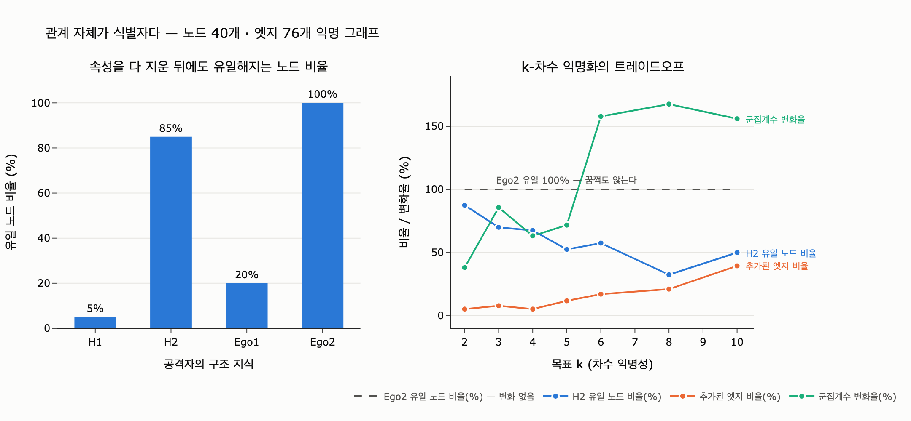

# 그래프 익명화에서 속성보다 더 어려운 문제

**질문** — 그래프 익명화에서 속성보다 더 어려운 문제는 무엇인가?

**답** — **관계 자체가 식별자**라는 점이다. 속성을 다 지워도 이웃 모양이 유일하면 특정되며, 아직 제대로 된 해법이 없다.

---

## 1. 34장 안에서의 위치

34장은 삭제를 다섯 절로 쪼갠다. 이 카드는 **34.3 「이름을 지워도 특정된다」의 마지막 문단**에 해당한다.

예제 `ex3_reidentify.py` 는 먼저 **속성 재식별**을 센다. 사람 5,000명, 이름은 이미 지운 상태에서 남은 속성을 조합한다.

| 조합 | 혼자인 사람 |
|---|---|
| 팀 | 0 (0%) — 팀 하나에 105명씩 있다 |
| 팀 + 지역 + 직군 | 30 (0.6%) |
| 팀 + 지역 + 직군 + 입사연도 | **65.8%** |
| + 생월 | 96.3% |

셋에서 넷으로 갈 때 0.6% → 65.8%. 두 배가 아니라 백 배로 뛴다. 조합의 수가 곱해지기 때문이다.

여기까지는 **관계형 DB에서도 똑같이 일어나는 일**이고, 대응책도 이미 이름이 붙어 있다.

- **일반화(generalization)** — 「2019년 입사」를 「2015~2020년」으로 뭉갠다
- **억제(suppression)** — 혼자인 사람의 그 속성을 아예 뺀다
- **잡음(noise)** — 생월을 무작위로 ±2 흔든다

그리고 예제는 이렇게 끝난다.

> 그런데 그래프에서는 하나 더 있다. **«관계 자체가 식별자»다.**
> 속성을 전부 지워도 「이 사람은 이 팀에 속하고 저 문서를 작성했고 그 사람의 멘티다」라는 «모양»이 남는다. 그 모양이 유일하면 특정된다.

이 카드가 묻는 것이 바로 그 "하나 더"다.

---

## 2. 왜 관계가 식별자가 되는가

속성 재식별과 구조 재식별의 차이를 한 줄로 놓으면 이렇다.

|  | 속성 재식별 | 구조 재식별 |
|---|---|---|
| 식별자 | 속성 값의 **조합** | 엣지의 **조합** = 이웃 모양 |
| 준식별자 목록 | 적을 수 있다 (팀, 지역, 직군, …) | **적을 수 없다.** 공격자 지식의 종류가 열린 집합 |
| 지우면? | 컬럼을 비우면 사라진다 | **비울 것이 없다.** 엣지는 남의 이력이기도 하다 |
| 성숙도 | $k$-익명성, $\ell$-다양성, DP — 성숙 | **미해결** |

핵심은 **엣지가 두 사람의 공동 소유**라는 점이다. 34장 예제 1이 이미 이 말을 했다.

> 「이서연이 김도현의 멘티였다」는 이서연 쪽 사실이기도 하다. 지우면 이서연의 이력이 사라진다.

속성은 내 것이니 지울 수 있다. 관계는 반쯤 남의 것이라 지울 수 없다. 지울 수 없는 것이 식별자로 작동한다. 그래서 어렵다.

---

## 3. 공격자의 구조 지식을 계층으로 — 정점 정련(vertex refinement)

Hay 등(VLDB 2008)은 "공격자가 구조에 대해 얼마나 아는가"를 계층으로 정의했다.

$$
H_0(v) = \varepsilon, \qquad H_1(v) = \deg(v), \qquad
H_{i+1}(v) = \{\!\{\, H_i(u) \;:\; u \in N(v) \,\}\!\}
$$

$\{\!\{\cdot\}\!\}$ 는 다중집합이다. 말로 풀면,

- $H_0$ — 아무것도 모른다.
- $H_1$ — "그 사람 지인이 7명이다." 차수.
- $H_2$ — "그 사람 지인들의 지인 수가 각각 1, 2, 2, 5, …다." **이웃 차수 다중집합.**
- $H_3$ — 한 홉 더.

같은 $H_i$ 값을 갖는 노드들의 집합이 **후보 집합(candidate set)** 이고, 그 최소 크기가 곧 구조적 $k$ 다.

$$
k_{\text{struct}}(H_i) \;=\; \min_{v \in V} \bigl|\{\, u \in V : H_i(u) = H_i(v) \,\}\bigr|
$$

후보 집합 크기가 1이면 그 사람은 **혼자다 = 특정된다**.

더 강한 지식도 있다. Zhou–Pei(ICDE 2008)의 **이웃 그래프**는 이웃들 사이의 연결(삼각형)까지 본다.

$$
\mathrm{Ego}_r(v) \;=\; G\bigl[\{\, u : d(u,v) \le r \,\}\bigr]
$$

"내 친구 A와 B는 서로도 친구다" 같은 지식이다. 이걸 동형(isomorphism)까지 비교한다.

### 실제로 세 보면

`expy.py` 는 노드 40개·엣지 76개의 익명 그래프(속성 0개, 대체 키만)에서 이걸 센다.

| 공격자의 구조 지식 | 유일한 노드 | 비율 | 최소 $k$ |
|---|---|---|---|
| $H_0$ (아무것도 모름) | 0 | 0.0% | 40 |
| $H_1$ (차수) | 2 | 5.0% | 1 |
| $H_2$ (이웃 차수 다중집합) | 34 | **85.0%** | 1 |
| $H_3$ | 40 | 100.0% | 1 |
| $\mathrm{Ego}_1$ (1-hop 이웃 구조) | 8 | 20.0% | 1 |
| $\mathrm{Ego}_2$ (2-hop 이웃 구조) | 40 | **100.0%** | 1 |

$H_1 \to H_2$ 에서 5% → 85%. 예제 3의 "셋에서 넷으로 갈 때의 절벽"과 같은 모양이다. **다른 점은 여기서는 지울 속성이 애초에 하나도 없었다는 것이다.**

차수 2를 공유하는 17명 중 11명이 "이웃이 누구인지"만으로 혼자가 된다. 남들과 똑같은 차수를 가졌는데도 특정된다.

### 계층이 단조롭지 않다는 것도 중요하다

표를 보면 $\mathrm{Ego}_1$(20%)이 $H_2$(85%)보다 **약하다**. 반지름 1 이웃 그래프는 이웃이 그래프 밖으로 뻗은 엣지를 잘라 버리므로 "이웃의 전체 차수"를 못 본다. 대신 삼각형을 본다. 두 지식은 포함 관계가 아니라 **종류가 다르다**.

여기서 실무적으로 중요한 결론이 나온다.

> **"이 그래프는 안전하다"를 한 숫자로 말할 수 없다.**

속성 익명화에서는 준식별자 목록을 적어 놓고 조합 수를 세면 끝이었다. 구조에서는 공격자가 무엇을 알 수 있는지가 열린 집합이다. 차수인가, 이웃 차수인가, 이웃 구조인가, 특정 부분그래프인가, 아니면 아예 **다른 그래프 전체**인가.

---

## 4. 실제로 있었던 공격들

### Backstrom, Dwork, Kumar (WWW 2007) — "Wherefore Art Thou R3579X?"

익명화된 소셜 그래프에 대한 최초의 체계적 공격. 두 가지를 보였다.

- **능동 공격(active attack)** — 데이터가 공개되기 *전에* 공격자가 계정 몇 개(sybil)를 만들어 서로 특이한 모양으로 연결하고, 표적들에게도 연결해 둔다. 공개된 익명 그래프에서 그 특이한 모양만 찾으면 옆에 붙은 표적이 누구인지 드러난다. 필요한 계정 수는 $O(\log n)$ — 수백만 노드 규모 그래프에서 **열 개 남짓**이면 된다.
- **수동 공격(passive attack)** — 아무것도 심지 않아도, 이미 서로 아는 사용자 $k \approx \Theta(\log n)$ 명이 담합하면 자기들 주변 구조로 자신들을 찾아내고 그 과정에서 $\sim k^2/2$ 쌍의 관계를 폭로할 수 있다.

논문의 제목 `R3579X` 는 "익명화된 노드 ID"를 흉내 낸 것이다. 그 ID를 붙여 놨는데도 찾아진다는 이야기다.

### Narayanan & Shmatikov (IEEE S&P 2009) — "De-anonymizing Social Networks"

더 실전적이고 더 무섭다. **보조 그래프(auxiliary graph)** 를 쓴다.

익명화된 Twitter 그래프와 공개된 Flickr 그래프를 놓고, **씨앗 확보 후 전파(seed-and-extend)** 방식으로 매핑을 키운다. 소수의 노드를 먼저 짝지어 놓고, 그 이웃 구조의 유사성으로 짝을 하나씩 늘려 간다.

결과: 두 서비스에 계정이 있음을 확인할 수 있는 사용자의 **약 1/3을 익명 Twitter 그래프에서 재식별**했고, 오류율은 12%였다.

이 공격의 성질이 결정적이다.

- **위상(topology)만 쓴다.** 속성을 하나도 안 쓴다.
- **sybil 노드를 심지 않아도 된다.** 사전 준비가 필요 없다.
- **잡음에 강하고, 두 그래프의 겹침이 작아도 동작한다.**
- 논문의 표현대로 **"기존 방어 전부에 강건하다(robust to all existing defenses)".**

여기서 "속성보다 어렵다"의 진짜 이유가 나온다. 속성 재식별의 보조 정보는 유권자 명부 같은 **표**였다. 구조 재식별의 보조 정보는 **다른 소셜 그래프 전체**다. 준식별자를 몇 개로 세는 게 불가능하다.

### 참고 — Netflix Prize (Narayanan & Shmatikov, 2008)

같은 저자들의 이전 작업. 익명화된 영화 평점 데이터를 IMDb 공개 평점과 맞춰 개인을 특정했다. 이건 **속성** 재식별의 교과서 사례고, 34장 예제 3이 세고 있는 것과 같은 종류다. 다음 해의 소셜 그래프 논문은 "표가 아니라 그래프로도 된다"를 보인 것이다.

---

## 5. 제안된 방어들, 그리고 왜 부족한가

| 방어 | 막는 지식 | 방법 | 한계 |
|---|---|---|---|
| **$k$-차수 익명성** (Liu & Terzi, SIGMOD 2008) | $H_1$ | 차수 수열이 $k$-익명이 되게 엣지 추가 | $H_2$ 이상에 무력. 엣지를 만들어 넣는다 |
| **$k$-이웃 익명성** (Zhou & Pei, ICDE 2008) | $\mathrm{Ego}_1$ | 1-hop 이웃 그래프가 동형인 노드를 $k$개씩 | 그래프 동형 판정에 기댐. 비용 급증. $\mathrm{Ego}_2$ 는 미보장 |
| **$k$-자기동형** (Zou, Chen, Özsu, VLDB 2009) | **임의의** 구조 질의 | 그래프에 $k$개의 자기동형(automorphism)을 강제 | 구조 왜곡이 매우 큼. 여러 릴리스 결합에 취약 |
| **$k$-동형** (Cheng, Fu, Liu, SIGMOD 2010) | 임의의 구조 질의 | $k$개의 동형 부분그래프로 분해 | 같은 문제. 엣지 삭제까지 필요 |
| **일반화 / 클러스터링** (Hay et al., VLDB 2008) | $H_i$ 전반 | 노드를 슈퍼노드로 뭉치고 엣지 수만 남긴다 | 개별 노드 분석이 불가능해진다. 그래프가 아니라 요약이 된다 |
| **엣지 차등 정보보호** (edge-DP) | 통계 질의 | 질의 결과에 잡음 | 그래프 **공개**가 아니라 통계 공개용. 엣지 1개 보호 ≠ 사람 1명 보호 |
| **노드 차등 정보보호** (node-DP) | 통계 질의 | 사람 단위 보호 | 민감도가 폭발해 잡음이 데이터를 삼킨다. 실용 범위가 좁다 |

### 트레이드오프를 숫자로

`expy.py` 는 $k$-차수 익명화를 직접 구현해 대가를 잰다. 원본은 엣지 76개, 군집계수 0.084, 평균 최단경로 2.65, 동류성 −0.251.

| 목표 $k$ | 달성 $k$ | 추가 엣지 | 엣지 증가 | $H_1$ 유일 | $H_2$ 유일 | $\mathrm{Ego}_2$ 유일 | 군집계수 | 평균 경로 | 동류성 |
|---|---|---|---|---|---|---|---|---|---|
| 원본 | 1 | – | – | 5.0% | 85.0% | 100.0% | 0.084 | 2.650 | −0.251 |
| 2 | 2 | 4 | +5.3% | **0.0%** | 87.5% | 100.0% | 0.116 | 2.601 | −0.245 |
| 3 | 3 | 6 | +7.9% | 0.0% | 70.0% | 100.0% | 0.157 | 2.585 | −0.193 |
| 4 | 4 | 4 | +5.3% | 0.0% | 67.5% | 100.0% | 0.138 | 2.591 | −0.206 |
| 5 | 5 | 9 | +11.8% | 0.0% | 52.5% | 100.0% | 0.145 | 2.513 | −0.188 |
| 6 | 6 | 13 | +17.1% | 0.0% | 57.5% | 100.0% | 0.217 | 2.541 | −0.099 |
| 8 | 8 | 16 | +21.1% | 0.0% | 32.5% | 100.0% | 0.226 | 2.456 | −0.137 |
| 10 | **8** | 30 | +39.5% | 0.0% | 50.0% | 100.0% | 0.216 | 2.344 | −0.023 |

읽을 곳이 다섯이다.

1. **$H_1$ 유일성은 0%가 된다.** $k$-차수 익명화는 자기가 약속한 것을 정확히 지킨다. 문제는 약속한 범위가 좁다는 것이다.
2. **$H_2$ 유일성은 잘 안 내려간다.** $k=2$ 에서는 85% → **87.5%로 오히려 올라간다.** 엣지를 추가하면 이웃들의 차수가 바뀌면서 없던 유일 조합이 새로 생긴다. **한 축의 방어가 다른 축에서 역효과를 낸다.**
3. **단조롭지 않다.** $k=8$ 에서 32.5%까지 내려갔다가 $k=10$ 에서 50%로 튄다. "$k$를 키우면 안전해진다"가 성립하지 않는다.
4. **$\mathrm{Ego}_2$ 유일성은 전 구간 100%다.** 2-hop을 아는 공격자에게는 어떤 $k$에서도 방어가 되지 않았다.
5. **대가는 확실히 치른다.** 엣지 최대 +39.5%, 군집계수 0.084 → 0.226(**+168%**), 평균 경로 2.65 → 2.34, 동류성 −0.251 → −0.023(거의 0). 커뮤니티 탐지, 확산 시뮬레이션, 추천 — 이 지표에 기대는 분석은 전부 다른 답을 낸다. 그리고 $k=10$ 은 목표조차 달성하지 못했다(달성 $k$ = 8).

**정확도는 확실히 내주고, 익명성은 한 축에서만 산다.** 34장 예제 2의 「지운다의 네 수준」 표와 정확히 같은 구조다. 완벽한 칸이 없다.

---

## 6. "아직 제대로 된 해법이 없다"를 여섯 줄로

1. **지울 것이 없다.** 엣지는 두 사람의 공동 사실이라 한쪽 요청으로 지우면 남의 이력이 깨진다.
2. **준식별자 목록을 만들 수 없다.** 차수, 이웃 차수, 이웃 구조, 부분그래프, 다른 그래프 전체 — 공격자 지식의 종류가 열린 집합이다.
3. **조합 폭발이 한 홉에서 일어난다.** 속성은 넷을 모아야 절벽이 왔다. 관계는 한 홉만 더 보면 온다.
4. **방어가 데이터를 파괴한다.** 없던 관계를 수십 개 만들어 넣은 그래프는 원본 그래프가 아니다. 그래프를 공개하는 이유(구조 분석) 자체가 사라진다.
5. **보장이 합성되지 않는다.** 같은 그래프를 시점을 달리해 두 번 공개하면, 각각이 $k$-익명이어도 둘을 겹치면 무너진다. 실무의 그래프는 계속 변한다.
6. **보조 그래프 공격은 전제를 무너뜨린다.** $k$-자기동형까지도 "공격자는 이 그래프만 본다"를 가정한다. Narayanan–Shmatikov는 다른 그래프를 들고 온다.

차등 정보보호는 속성 쪽에서 이 문제를 원리적으로 정리했다. 그래프에서는 아직 그런 것이 없다 — 노드 단위 DP는 정의는 깨끗하지만 민감도가 커서 실용 범위가 좁고, 엣지 단위 DP는 실용적이지만 "사람 하나"를 보호하지 않는다.

---

## 7. 그래서 실무에서는 무엇을 하나

34장의 답과 같다. **완전 삭제라는 마법은 없으니, 절차를 검사 가능하게 만든다.**

- **그래프 자체를 밖으로 내보내지 않는다.** 이것이 가장 강한 실무 방어다. 원본 그래프를 공개하지 않고 집계·질의 결과만 낸다. 익명화된 그래프를 배포하는 순간 6절의 문제 전부가 켜진다.
- **삭제는 「식별자 끊기」를 기본으로 한다**(예제 2의 2번 수준). 「김도현」을 「p-8f3a」로 바꾼다. 구조는 남고 이름은 사라진다. **다만 이것이 재식별을 막지 못한다는 걸 문서에 적어 둔다.** ✗ 칸을 ○ 라고 부르지 않는다.
- **노드 종류별 방침 표를 만들고, 방침 없는 종류가 나오면 멈춘다**(예제 5). 경계는 하나다 — 「이것이 개인을 가리키는가, 개인이 만든 것인가?」 가리키면 지우고, 만든 것이면 만든 사람만 지운다.
- **엣지 자체가 민감한 관계라면 엣지를 안 만든다.** 사후 익명화보다 수집 단계의 데이터 최소화가 훨씬 값이 싸다. 「누가 누구와 상담했다」를 그래프에 넣기 전에, 정말 필요한지 먼저 묻는다.
- **이벤트 로그에는 개인정보를 직접 넣지 않는다**(30장·예제 5). 식별자만 넣고, 그 식별자를 가리키는 표에서 지운다. 추가 전용 로그는 못 지우기 때문이다.
- **재식별 위험을 정기적으로 측정한다.** `expy.py` 의 계산이 그 최소 형태다. $H_1$/$H_2$/$\mathrm{Ego}_2$ 후보 집합 크기를 재고, 유일해지는 노드가 몇 %인지 대시보드에 띄운다. 못 고칠 수는 있어도 모를 이유는 없다.

---

## 8. 자주 나오는 오해

| 오해 | 실제 |
|---|---|
| "이름을 지웠으니 익명이다" | 속성 조합으로도, 관계 모양으로도 특정된다 |
| "ID를 해시했으니 안전하다" | 해시는 조인 키를 바꿀 뿐 그래프 구조를 하나도 바꾸지 않는다. 구조 공격에는 아무 효과가 없다 |
| "$k$-익명성을 만족시켰다" | **무엇에 대한** $k$인지 물어야 한다. 속성 $k$-익명 ≠ $k$-차수 익명 ≠ $k$-이웃 익명 |
| "$k$를 키우면 안전해진다" | 실험 표를 보라. $H_2$ 유일성은 단조롭게 줄지 않고 $k=2$ 에서는 오히려 늘었다 |
| "차등 정보보호를 쓰면 해결" | 엣지-DP는 사람 단위 보호가 아니고, 노드-DP는 잡음이 데이터를 삼킨다. 그래프 **배포** 문제를 해결하지 못한다 |
| "이어진 것을 전부 지우면 된다" | 예제 4가 반박한다. 집계는 개인정보가 아니고, 결정은 회사 기록이고, 남의 이력은 깨면 안 된다 |

---

## 9. 출처

- Backstrom, Dwork, Kumar, **"Wherefore Art Thou R3579X? Anonymized Social Networks, Hidden Patterns, and Structural Steganography"**, WWW 2007
- Narayanan, Shmatikov, **"De-anonymizing Social Networks"**, IEEE S&P 2009 — [arXiv:0903.3276](https://arxiv.org/abs/0903.3276)
- Hay, Miklau, Jensen, Towsley, Weis, **"Resisting Structural Re-identification in Anonymized Social Networks"**, VLDB 2008 — [PDF](https://people.cs.umass.edu/~miklau/assets/pubs/vldb2008/hay08resisting.pdf), [DOI](https://dl.acm.org/doi/10.14778/1453856.1453873)
- Liu, Terzi, **"Towards Identity Anonymization on Graphs"**, SIGMOD 2008 — $k$-차수 익명성
- Zhou, Pei, **"Preserving Privacy in Social Networks Against Neighborhood Attacks"**, ICDE 2008 — $k$-이웃 익명성
- Zou, Chen, Özsu, **"K-Automorphism: A General Framework for Privacy Preserving Network Publication"**, VLDB 2009
- Cheng, Fu, Liu, **"K-Isomorphism: Privacy Preserving Network Publication against Structural Attacks"**, SIGMOD 2010
- Sweeney, **"k-Anonymity: A Model for Protecting Privacy"** — [PDF](https://dataprivacylab.org/dataprivacy/projects/kanonymity/kanonymity.pdf)
- Dwork, **"Differential Privacy"** — [Microsoft Research](https://www.microsoft.com/en-us/research/publication/differential-privacy/)
- GDPR [Art. 17 삭제권](https://gdpr-info.eu/art-17-gdpr/), [Art. 4 가명화](https://gdpr-info.eu/art-4-gdpr/)
- NIST, [De-Identification of Personal Information](https://www.nist.gov/publications/de-identification-personal-information)
- 34장 예제 — `ex1_delete_scope.py`, `ex2_delete_levels.py`, `ex3_reidentify.py`, `ex4_cascade.py`, `ex5_deletion_plan.py`

---

## 시각화

왼쪽: 속성을 전부 지운 40노드 그래프에서 공격자의 구조 지식별로 **유일해지는 노드 비율**. $H_1$(차수) 5% → $H_2$(이웃 차수) 85% → $\mathrm{Ego}_2$(2-hop 구조) 100%.

오른쪽: $k$-차수 익명화의 트레이드오프. 파란 선($H_2$ 유일 비율)은 잘 내려가지 않고 단조롭지도 않으며, 회색 점선($\mathrm{Ego}_2$ 유일 100%)은 꿈쩍도 않는다. 그러는 동안 주황(추가된 엣지)과 초록(군집계수 왜곡)은 계속 커진다. **비용은 실제로 지불되고, 보호는 한 축에서만 얻는다.**
