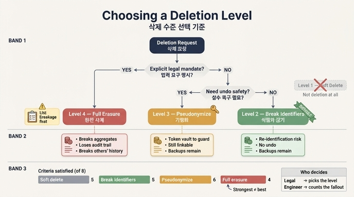

# 삭제 수준을 어떻게 고르는가 — 저자의 세 갈래 기준

## 질문과 답

**Q.** 저자가 제시하는 삭제 수준 선택 기준은 무엇인가?

**A.** 기본은 **식별자 끊기**, 법적 요구가 명시적이면 **완전 삭제**(단 무엇이 깨지는지 먼저 목록화), 실수 대비가 필요하면 **가명화**다.

---

## 1. 왜 "수준"이라는 말이 필요한가

「지워 주세요」라는 한 문장에 대응하는 기술적 동작은 하나가 아닙니다. 34장은 이를 네 수준으로 나눕니다.

| 수준 | 이름 | 실제로 하는 일 |
|---|---|---|
| 1 | 숨기기(soft delete) | `deleted=true` 플래그 |
| 2 | 식별자 끊기 | 이름·연락처를 지우고 대체 키만 남긴다 |
| 3 | 가명화(pseudonymisation) | 식별자를 **되돌릴 수 있는** 토큰으로 치환 |
| 4 | 완전 삭제 | 노드·엣지·본문·백업까지 |

그리고 이 네 수준을 여덟 기준에 대고 채점하면 **어느 칸도 전부를 만족하지 않습니다**.

| 기준 | 1 숨기기 | 2 식별자 끊기 | 3 가명화 | 4 완전 삭제 |
|---|:--:|:--:|:--:|:--:|
| 화면에서 안 보인다 | ○ | ○ | ○ | ○ |
| 이름으로 못 찾는다 | ✗ | ○ | ○ | ○ |
| 다른 데이터와 못 잇는다 | ✗ | ✗ | ✗ | ○ |
| 집계·통계가 유지된다 | ○ | ○ | ○ | ✗ |
| 감사 이력이 유지된다 | ○ | ○ | ○ | ✗ |
| 남의 이력이 안 깨진다 | ○ | ○ | ○ | ✗ |
| 되돌릴 수 있다 | ○ | ✗ | ○ | ✗ |
| 백업까지 지워진다 | ✗ | ✗ | ✗ | ○ |
| **만족한 기준 수** | **5** | **5** | **6** | **4** |

여기서 이 카드의 답이 나옵니다. **가장 강력해 보이는 4번(완전 삭제)이 만족하는 기준 수가 가장 적습니다(4개).** 그래서 "무조건 강한 것"을 고르는 규칙은 성립하지 않고, 상황별 선택 기준이 필요해진 것입니다.

1번은 애초에 선택지에 없습니다. 「이름으로 못 찾는다」가 ✗ 인데도 많은 시스템이 1번만 하고 「지웠습니다」라고 답합니다. 34장의 도입부 — "「지웠습니다」는 사실이었어요. 한 곳에서만요" — 가 바로 이 지점입니다.

---

## 2. 의사결정 흐름 (저자의 세 갈래)

```
              삭제 요청 도착
                    │
        ┌───────────┴────────────┐
        │ 법적 요구가 «명시적»인가? │
        └───────────┬────────────┘
             예 ────┴──── 아니오
              │              │
              ▼              ▼
     ┌────────────────┐   ┌──────────────────────┐
     │  4. 완전 삭제   │   │ 실수 복구가 필요한가? │
     │  (선행 조건:    │   └──────────┬───────────┘
     │  «무엇이 깨지   │        예 ───┴─── 아니오
     │  는지» 목록화)  │         │           │
     └────────────────┘         ▼           ▼
                          ┌──────────┐  ┌───────────────┐
                          │ 3. 가명화 │  │ 2. 식별자 끊기 │
                          │ (토큰 별도│  │  ← 기본값      │
                          │  보관)    │  └───────────────┘
                          └──────────┘
```

판단 순서가 이 모양인 이유:

- **완전 삭제를 먼저 걸러 냅니다.** 파괴적이고 되돌릴 수 없으므로, "그래도 해야 한다"는 외부 근거(법·규제)가 있을 때만 진입합니다. 근거가 "고객이 강하게 요구했다" 수준이면 이 갈래가 아닙니다.
- **가명화는 운영 안전장치입니다.** 되돌릴 수 있다는 성질은 프라이버시 강도가 아니라 *실수 대비* 용도로 선택됩니다. 잘못된 사람을 지웠거나, 요청이 철회되거나, 분쟁이 생겼을 때 복구할 수 있어야 하는 조직이 여기에 옵니다.
- **나머지는 전부 기본값(2번)입니다.** 「김도현」을 「p-8f3a」로 바꿉니다. 사람은 못 알아보는데 구조는 남습니다. 「결제팀에 3명이 있었다」는 유지되고 「그중 하나가 김도현」은 사라집니다.

---

## 3. 각 갈래를 택했을 때 내주는 대가

### 2번 식별자 끊기 — 대가는 «재식별 위험»

- **얻는 것**: 집계·감사 이력·남의 이력이 모두 온전합니다. 그래프 구조가 살아 있으니 통계와 분석이 계속 돕니다.
- **내주는 것**: 「다른 데이터와 못 잇는다」가 ✗ 입니다. 그리고 「되돌릴 수 있다」도 ✗ 입니다(대체 키만 남기고 매핑을 버리므로 3번과 갈립니다).
- **위험의 크기**: 34장은 5,000명 합성 데이터로 이를 직접 셉니다.

| 조합 속성 수 | 혼자인 사람 비율 |
|---|---|
| 1개 (팀) | 0% (팀당 약 105명) |
| 3개 (팀+도시+직무) | 0.6% (30명) |
| **4개** (+ 입사연도) | **65.8%** |
| 5개 (+ 생월) | 96.3% |

  셋에서 넷으로 갈 때 0.6% → 65.8%. **두 배가 아니라 백 배**로 뜁니다. 조합의 수가 곱해지기 때문입니다. 그래서 "이름은 지웠으니 익명"이라는 말은 대개 거짓입니다. k-익명성(어떤 조합으로도 최소 k명 이상으로 묶이는 성질)을 실제로 계산해서 k=1인 사람이 없는지 확인해야 합니다.
- **완화책과 그 값**: 일반화(「2019년 입사」→「2015~2020년」), 억제(혼자인 사람의 그 속성을 뺀다), 잡음(생월을 ±2 흔든다). 셋 다 **정확도를 내주고 익명성을 삽니다.** 공짜가 아닙니다.
- **그래프 고유의 남은 위험**: 속성을 전부 지워도 「이 팀에 속하고 저 문서를 작성했고 그 사람의 멘티다」라는 이웃 **모양**이 남습니다. 그 모양이 유일하면 특정됩니다. *관계 자체가 식별자*이고, 이 문제는 아직 제대로 된 해법이 없습니다.

### 4번 완전 삭제 — 대가는 «집계·감사·남의 이력»

기준표에서 ✗ 가 세 개 붙는 자리가 정확히 이 대가입니다.

- **집계·통계가 깨집니다.** 「팀별 문서 수」가 틀린 값이 되므로 재계산이 필요합니다.
- **감사 이력이 사라집니다.** 규제 준수 목적으로 보존해야 하는 기록이 삭제 요청 처리 때문에 사라지는 모순이 생깁니다. 삭제권과 보존 기간 의무가 정면으로 충돌하는 지점입니다.
- **남의 이력이 깨집니다.** 「이서연이 김도현의 멘티였다」는 *이서연 쪽 사실이기도* 합니다. 들어오는 엣지를 지우면 남의 이력이 사라집니다.
- **되돌릴 수 없습니다.** 잘못 지운 것을 복구할 방법이 없습니다.
- **그 대신 유일하게 얻는 것**: 「다른 데이터와 못 잇는다」와 「백업까지 지워진다」. 이 두 칸은 4번만 채웁니다. 법적 요구가 명시적일 때 4번을 택하는 이유는 이 두 칸 때문이고, 다른 이유는 없습니다.

### 3번 가명화 — 대가는 «토큰 보관소가 새 공격면»

- **얻는 것**: 여덟 기준 중 6개로 최다입니다. 되돌릴 수 있으면서 이름으로는 찾을 수 없습니다.
- **내주는 것**: 「다른 데이터와 못 잇는다」 ✗, 「백업까지 지워진다」 ✗. 그리고 표에 없는 대가가 하나 더 있습니다 — **매핑 토큰을 어딘가 보관해야 합니다.** 그 보관소가 유출되면 전부 되돌려집니다. 즉 가명화는 위험을 없애는 게 아니라 *한 곳으로 모으는* 조치입니다. 그래서 GDPR도 가명화 데이터를 익명 데이터가 아니라 여전히 개인정보로 취급합니다.
- **적합한 상황**: 실수 가능성이 높은 초기 운영, 되돌림 요청이 실제로 들어오는 도메인, 분쟁 대비가 필요한 조직.

---

## 4. "무엇이 깨지는지 먼저 목록화" — 실제로 무엇을 세는가

이 조건이 답의 절반입니다. 4번을 고르는 순간 **선행 작업**이 붙습니다. 그 작업은 감상이 아니라 **개수를 세는 일**입니다.

### (a) 직접 이어진 것 — 1-hop

삭제 대상에서 나가는/들어오는 엣지 전부를 뽑습니다. 방향이 중요합니다.

- **나가는 엣지**: 그 사람이 한 일(작성, 승인, 발화, 소속).
- **들어오는 엣지**: *남이 그 사람을 가리키는 것*(멘토 관계, 문서 본문의 언급, Run이 읽었다는 기록). 관계형 DB에서 「그 행을 지우면 끝」이 되는 것과 달리, 그래프에서는 이 방향이 남의 이력을 깨는 원인입니다.

### (b) 그것에 기대고 있는 것 — 다단 전파

1-hop 산출물에 기대는 것을 재귀적으로 셉니다. 34장의 경로 예시:

```
김도현 → 3분기 보고서 → 팀별 문서 수 → 결제팀은 문서 생산이 많다
                                    → 결제팀에 리소스를 더 배정하자
```

사람 하나를 지우려는데 **일곱 개**가 걸립니다. 문서를 지우면 집계가 바뀌고, 집계가 바뀌면 그 위의 판단이 근거를 잃습니다. 28장의 연쇄 철회와 같은 구조입니다.

### (c) 걸린 것을 «지워야 할 것»과 «지우면 안 되는 것»으로 분류

여기가 핵심입니다. 영향 범위 쿼리는 **범위를 보여 줄 뿐**이고, 「이어진 것을 전부 지운다」는 답이 아닙니다. 위 일곱 개 안에는 **같은 팀이라는 이유로 걸린 이서연**도 있습니다. 명백히 지우면 안 되는 것입니다.

분류의 기준은 한 문장입니다 — **「그것이 개인을 가리키는가, 아니면 개인이 만든 것인가?」**

| 성격 | 처리 |
|---|---|
| 개인을 특정하는 것 | 지운다 |
| 그 사람이 만든 산출물 | 대개 남긴다 (작성자만 익명화) |
| 집계와 결정 | 남긴다 — 개인정보가 아니고 회사의 기록이다 |

「3분기 보고서」는 개인을 안 가리킵니다. 「김도현이 작성」이 가리킵니다. 그러니 **문서는 두고 엣지의 «작성자»만 익명 노드로 바꿉니다.**

### (d) 노드 종류별 방침 표로 고정

이 판정은 자동으로 못 합니다. 노드 종류마다 사람이 미리 정해 둬야 합니다.

| 종류 | 방침 | 이유 |
|---|---|---|
| Person | 삭제 | 개인 그 자체 |
| Contact | 삭제 | 연락처 |
| Msg | 본문 마스킹 | 발화 — 이름·연락처만 가린다 |
| Doc | 작성자 익명화 | 산출물은 회사 자산 |
| Team | 유지 | 개인정보 아님 |
| Stat | 재계산 | 집계는 남기되 다시 센다 |
| Fact | 유지 | 개인을 안 가리키면 |
| Answer | 유지 | 회사의 결정 기록 |
| Run | 행위자 익명화 | 누가 돌렸는지만 가린다 |
| Event | **식별자 치환** | 이벤트 로그는 추가 전용이라 못 지운다 |
| Photo | **??** | 방침 없음 — 멈춘다 |

표의 진짜 값어치는 통과가 아니라 **막힘**입니다. 방침 없는 종류가 나오면 자동 처리하지 않고 멈춥니다. 「모르는 것을 모른다」고 말해 주는 게 이 표의 값어치입니다. 표가 없으면 담당자가 그때그때 판단하고, 다음 요청은 다른 담당자가 다르게 판단합니다. 「지난번엔 지웠는데 이번엔 안 지웠다」가 더 큰 문제입니다.

### (e) 지워도 남는 다섯 곳을 세기

노드를 지워도 남는 곳이 다섯입니다. **들어오는 엣지, 자유 텍스트 안의 이름, 이벤트 로그, 백업, 검색 색인.** 완전 삭제를 약속했다면 이 다섯을 전부 세야 하고, 그중 이벤트 로그는 애초에 못 지웁니다 — 그래서 이벤트에는 개인정보를 직접 넣지 않고 **식별자만 넣고, 그 식별자를 가리키는 표에서 지우는** 설계가 여기서 값을 합니다.

### (f) 실제 소요 시간을 재기

삭제 자체는 초 단위인데 전체는 며칠 걸립니다. 재계산이 있고 백업 순환이 있고 사람 확인이 있습니다. 「30일 안에 처리」 같은 약속을 하려면 이 절차의 실제 소요를 미리 재 둬야 합니다. 「완료」의 기준도 문서로 정해야 합니다.

즉 "목록화"는 여섯 종류의 **개수 세기**입니다 — 1-hop 엣지 수, 전파 노드 수, 재계산 필요 집계 수, 방침 미정 종류 수, 잔존 위험 위치 수, 소요 일수.

---

## 5. 역할 분담: 수준은 법무가, 파급은 엔지니어가

34장이 명시하는 선입니다.

> 어느 수준까지 지워야 하는지는 관할과 업종에 따라 다르고, 그건 법무가 정할 일입니다. 엔지니어가 할 일은 「그 수준을 선택했을 때 무엇이 깨지는지」를 미리 세는 것입니다.

| | 법무 / 컴플라이언스 | 엔지니어 |
|---|---|---|
| 결정하는 것 | **어느 수준인가** (1~4) | 아무것도 결정하지 않는다 |
| 산출물 | 관할·업종별 수준 지정, 「완료」의 법적 정의, 보존 의무와의 충돌 판정 | 영향 범위 개수, 깨지는 것 목록, 재식별 위험 수치(k값), 실제 소요 일수 |
| 판단 근거 | 삭제권, 보존 기간, 데이터 최소화 | 그래프 구조, 전파 경로, k-익명성 계산 |

이 분담이 세 갈래 기준과 어떻게 맞물리는가:

1. 엔지니어는 **먼저 계산해서 제출합니다.** "4번을 하면 집계 3개가 재계산 대상이고, 남의 이력 2건이 깨지고, 감사 이력 5년치가 사라집니다. 2번을 하면 4속성 조합으로 66%가 재식별 가능합니다."
2. 법무는 **그 숫자를 보고 수준을 지정합니다.** "감사 이력 상실은 보존 의무 위반이므로 Answer/Event는 4번 대상 제외. Person·Contact만 4번."
3. 엔지니어는 **지정된 수준을 방침 표에 적고 절차를 검사 가능하게 만듭니다.** 방침 없는 종류가 나오면 멈추고 다시 법무에게 올립니다(Photo 사례).

엔지니어가 넘어서면 안 되는 선은 "이 정도면 충분히 지운 것 같다"는 판단이고, 법무가 넘어서면 안 되는 선은 "다 지우세요"를 파급 계산 없이 지시하는 것입니다. 그래서 **4번에 「무엇이 깨지는지 먼저 목록화」라는 선행 조건이 붙습니다** — 이 조건은 법무의 결정을 엔지니어의 계산 위에 세우기 위한 장치입니다.

---

## 6. 암기 포인트

- 기본값은 **2번(식별자 끊기)** — 구조를 남기고 사람만 지운다.
- **4번(완전 삭제)** 은 *법적 요구가 명시적일 때만*, 그리고 *깨지는 것 목록이 먼저*.
- **3번(가명화)** 은 강도 때문이 아니라 *되돌림(실수 대비)* 때문에 고른다.
- **1번(숨기기)** 은 선택지가 아니다 — 지운 게 아니다.
- 강한 순서 ≠ 좋은 순서. 4번이 만족 기준 수 최소(4개), 3번이 최다(6개).
- 수준은 법무, 파급은 엔지니어.

---

## 인포그래픽


