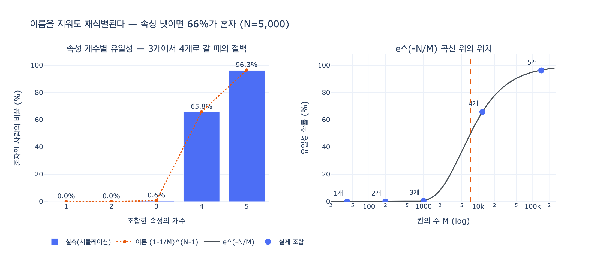

# 이름을 지워도 재식별되는 규모는 어느 정도인가?

> **답**: 속성 넷을 조합하면 66%가 혼자가 된다. 그리고 셋에서 넷으로 갈 때 절벽이 생긴다.

---

## 1. 질문의 자리 — 왜 이 숫자가 필요한가

34장의 흐름은 이렇다.

1. 34.1 노드를 지워도 다섯 곳에 남는다 (들어오는 엣지, 자유 텍스트, 이벤트 로그, 백업, 검색 색인)
2. 34.2 「지운다」는 네 수준이 있다 (숨기기 / 식별자 끊기 / 가명화 / 완전 삭제)
3. **34.3 이름을 지워도 특정된다** ← 이 카드
4. 34.4 지우면 무엇이 같이 무너지나
5. 34.5 절차를 검사 가능하게 만든다

34.2에서 실무에서 제일 많이 쓰는 수준이 **2번(식별자 끊기)** 이라고 했다.
「김도현」을 「p-8f3a」로 바꾸는 것이다. 사람은 못 알아보는데 구조는 남는다.

그런데 그 표에서 2번의 「다른 데이터와 못 잇는다」 칸이 `✗` 였다.
이름을 지워도 *남은 속성의 조합*으로 사람이 되찾아진다. 이게 **재식별
(re-identification)** 이고, 34.3은 그 규모를 숫자로 재는 절이다.

즉 이 카드의 답은 "이름 지우기로 안심하면 안 되는 정도"를 정량화한 것이다.

---

## 2. 실험 — `ex3_reidentify.py`가 재는 것

가상의 회사 인구 **5,000명**을 만든다. 이름·연락처는 이미 지웠다.
남은 속성은 다섯 개고, 각각 가질 수 있는 값의 개수(카디널리티)는 이렇다.

| 속성 | 값의 개수 |
|---|---:|
| `team` (팀) | 40 |
| `city` (근무지) | 5 |
| `role` (직군) | 5 |
| `joined` (입사연도, 2015~2026) | 12 |
| `birth_month` (생월) | 12 |

그리고 속성을 하나씩 더해 가며 **같은 조합을 가진 사람이 몇 명인지** 센다.

```
사람 5,000명. 이름은 이미 지웠다. 남은 속성을 조합해 본다.

조합                                          최소 그룹(k)   혼자인 사람     비율
--------------------------------------------------------------------------------
team                                                  105            0    0.0%
team + city                                            11            0    0.0%
team + city + role                                      1           30    0.6%
team + city + role + joined                             1        3,291   65.8%
team + city + role + joined + birth_month                1        4,816   96.3%
```

읽는 법은 이렇다.

- **최소 그룹(k)** — 가장 작은 묶음의 크기. `k=1`이면 자기 조합을 혼자 갖는 사람이
  있다는 뜻이다. 이게 바로 **k-익명성**의 $k$ 다.
- **혼자인 사람 / 비율** — 그 조합만으로 유일하게 특정되는 사람의 수와 비율.

### 답의 두 부분

**(1) 속성 넷 → 66%**
`team + city + role + joined` 넷만 알면 5,000명 중 3,291명(65.8%, 반올림 66%)이
그 조합을 혼자 갖는다. 셋 중 둘은 "팀, 근무지, 직군, 입사연도" 네 항목만으로
한 사람으로 좁혀진다는 뜻이다. 이름은 필요 없다.

**(2) 셋 → 넷에서 절벽**
0.6% 에서 65.8% 로 뛴다. 약 **110배**다.
속성을 하나 붙이는 일이 "두 배"가 아니라 "백 배"로 작동한다.
34장의 표현을 그대로 쓰면 — *조합의 수가 곱해지기 때문이다.*

| 속성 수 | 조합의 경우의 수 $M$ | $N/M$ | 유일성 |
|---:|---:|---:|---:|
| 1 | 40 | 125 | 0% |
| 2 | 200 | 25 | 0% |
| 3 | 1,000 | 5 | 0.6% |
| 4 | **12,000** | **0.42** | **65.8%** |
| 5 | 144,000 | 0.035 | 96.3% |

$M$ 이 $N$(=5,000)을 **넘어서는 구간**이 절벽이다.
칸이 사람보다 많아지면 대부분의 칸은 비거나 한 명만 들어가게 된다.
3개일 때는 칸 1,000개에 사람 5,000명 → 칸마다 평균 5명이 앉는다.
4개일 때는 칸 12,000개에 사람 5,000명 → 칸마다 평균 0.42명이다.
(수학적 유도는 `hi.md` 참고. 요약하면 유일성 $\approx e^{-N/M}$ 이고,
이 함수는 $N \approx M$ 근처에서 급하게 꺾인다.)

---

## 3. 왜 하필 66%인가 — 이 숫자에 의미가 있나

없다. **정확한 값은 데이터에 따라 달라진다.**
카디널리티를 바꾸면(팀이 40개가 아니라 400개면) 절벽은 3개 조합에서 이미 온다.
인구 $N$ 이 커지면 절벽은 뒤로 밀린다.

의미가 있는 것은 **모양**이다.

1. 속성 하나씩 볼 때는 안전해 보인다 ("팀 하나에 105명이나 있는데요")
2. 그런데 조합은 곱셈으로 늘어난다
3. 어느 지점에서 계단처럼 유일성이 튀어오른다
4. 그 지점은 예상보다 **훨씬 이른** 곳에 있다 — 속성 3~4개

그리고 이 모양은 실제 인구에서 반복 확인되었다.

| 연구 | 조합 | 유일성 |
|---|---|---:|
| Sweeney (2000) | 5자리 ZIP + 생년월일 + 성별 | **87%** (미국 인구) |
| Sweeney (2000) | 도시/읍 + 생년월일 + 성별 | 53% |
| Sweeney (2000) | 카운티 + 생년월일 + 성별 | 18% |
| Golle (2006, 2000년 인구조사 재검증) | ZIP + 생년월일 + 성별 | 61~63% |
| de Montjoye et al. (2013) | 시공간 좌표 4개 (기지국 해상도, 시간 단위) | **95%** (150만 명) |
| de Montjoye et al. (2015) | 신용카드 거래 4건 (날짜+상점) | 90% (110만 명) |

Sweeney의 87%는 **속성 세 개**로 나왔다. 우리 예제에서 3개가 0.6%였던 이유는
각 속성의 카디널리티가 작았기 때문이다. ZIP은 미국에 약 4만 개, 생년월일은
약 3만 6천 가지(100년 × 365일)다. 곱하면 $M \approx 2.9 \times 10^9$ 이고
미국 인구 $N \approx 2.5 \times 10^8$ 이므로 $N/M \approx 0.086$,
$e^{-0.086} \approx 0.92$ → 실측 87%와 자릿수가 맞는다.

**즉 "몇 개면 위험한가"는 개수가 아니라 $M$ 대 $N$ 의 비다.**
카디널리티가 큰 속성 하나(생년월일, 상세 주소, 타임스탬프)는 카디널리티가
작은 속성 여러 개보다 위험하다.

de Montjoye의 "시공간 좌표 4개로 95%"는 34.2에서 나온 예시와 정확히 겹친다 —
「2026년 3월 12일 14시 3분에 마포에서 결제」. 타임스탬프는 카디널리티가
사실상 무한한 준식별자다.

---

## 4. k-익명성 — 이 표의 「최소 그룹」 칸이 무엇인가

**k-익명성(k-anonymity)** 은 Samarati & Sweeney가 정식화한 성질이다.

> 공개하는 데이터에서, **어떤 준식별자 조합으로 봐도 최소 $k$ 명 이상으로
> 묶인다**면 그 데이터는 $k$-익명이다.

용어를 나누면 이렇다.

- **식별자(identifier)** — 이름, 주민번호, 이메일. 그냥 지운다.
- **준식별자(quasi-identifier, QI)** — 팀, 근무지, 직군, 입사연도, 생월.
  하나로는 못 특정하는데 조합하면 특정된다. **이게 문제의 핵심이다.**
- **민감 속성(sensitive attribute)** — 질병, 연봉, 성향. 지키고 싶은 값.

우리 표의 `k` 칸이 그 $k$ 다. `k=1`은 "익명이 아니다"라는 선언이다.

### 대응 세 가지 (34장에 나온 그대로)

| 방법 | 하는 일 | 원리 |
|---|---|---|
| **일반화(generalization)** | 「2019년 입사」→「2015~2020년」 | 속성의 카디널리티를 줄여 $M$ 을 낮춘다 |
| **억제(suppression)** | 혼자인 사람의 그 속성을 아예 뺀다 | 유일 개체를 데이터에서 제거 |
| **잡음(noise)** | 생월을 무작위로 ±2 흔든다 | 조합을 뭉갠다 |

`expy.py`의 4절에서 일반화를 실제로 재 봤다. 입사연도만 뭉개도

| 처리 | joined 값 수 | $M$ | 유일성 |
|---|---:|---:|---:|
| 원본 (연 단위) | 12 | 12,000 | 65.8% |
| 3년 구간 | 4 | 4,000 | 28.1% |
| 5년 구간 | 3 | 3,000 | 17.6% |
| 속성 제거 | 1 | 1,000 | 0.6% |

65.8% → 17.6% 까지 내려간다. 그런데 **$k$ 는 여전히 1**이다.
평균이 좋아졌다고 모든 사람이 안전해진 게 아니다.
$k \ge 2$ 를 실제로 달성하려면 5년 구간에서도 879명(17.6%)을 버려야 한다.

**셋 다 「정확도를 내주고 익명성을 산다」. 공짜가 아니다.**

### k-익명성의 한계도 알아 둘 것

- **동질성 공격(homogeneity attack)** — 묶음 안 $k$ 명 전원의 민감 속성이 같으면
  누구인지 몰라도 값은 안다. → $\ell$-다양성($\ell$-diversity)
- **배경지식 공격(background knowledge attack)** — 외부 정보와 결합.
  Netflix Prize 데이터가 IMDb 평점과 결합돼 재식별된 사례(Narayanan & Shmatikov, 2008).
  → $t$-근접성($t$-closeness)
- **여러 번 공개(composition)** — 같은 데이터를 다른 QI 조합으로 두 번 공개하면
  각각은 $k$-익명이어도 합치면 깨진다. → **차등 정보보호(differential privacy)** 가
  이 문제를 정면으로 다루는 방향이다.

34장의 키워드 표에 `차등 정보보호`가 함께 실려 있는 이유다.

---

## 5. 그런데 그래프에서는 하나가 더 있다

이 카드의 답까지가 34.3의 앞부분이고, 34장이 진짜 하려는 말은 그 다음이다.

> **관계 자체가 식별자다.**

속성을 **전부** 지워도, 「이 사람은 이 팀에 속하고 저 문서를 작성했고
그 사람의 멘티다」라는 **모양(구조)** 이 남는다. 그 모양이 유일하면 특정된다.

왜 더 나쁜가. 절벽의 원인이 $M$ 의 곱셈이었다는 걸 떠올리면 된다.
그래프에서 한 노드의 이웃 정보는 그 자체로 카디널리티가 폭발적인 준식별자다.

- 차수(degree) — 정수. 이미 카디널리티가 크다
- 이웃의 노드 종류 조합 — Person 3, Doc 7, Team 1, Run 2 …
- 2-hop 패턴, 삼각형 개수, 이웃의 차수 분포…

한 사람의 1-hop + 2-hop 구조만 있어도 $M$ 은 인구 $N$ 을 아득히 넘긴다.
즉 **속성 조합보다 훨씬 이른 지점에 절벽이 있다.**

관련 문헌:

- **Backstrom, Dwork & Kleinberg (2007)** — "Wherefore Art Thou R3579X?".
  익명화된 소셜 그래프에 공격자가 미리 몇 개의 노드를 심어 두면(active attack),
  $O(\log n)$ 개의 노드만으로 표적을 찾아낼 수 있다.
- **Narayanan & Shmatikov (2009)** — "De-anonymizing Social Networks".
  Twitter와 Flickr 그래프를 구조만으로 매칭해 재식별.
- **Hay et al. (2008)** — 이웃 구조만으로 유일해지는 노드의 비율 측정.

그래프용 방어책도 나와 있긴 하다 — $k$-degree anonymity(차수를 $k$개씩
같게 맞추려고 엣지를 넣거나 뺀다), $k$-neighborhood anonymity, 엣지 무작위화.
그런데 전부 **그래프의 구조를 바꾸는** 방법이다. 그러면 그래프를 쓰는 이유
자체(경로, 커뮤니티, 중심성)가 훼손된다.

34장이 이 대목에서 솔직하게 적어 둔 문장이 그것이다.

> 이건 아직 제대로 된 해법이 없습니다.

---

## 6. 실무로 옮기면 — 무엇을 하라는 말인가

이 절의 결론은 "이름을 지웠다고 보고하지 마라"가 아니다. 검사할 항목이 늘어난다는 뜻이다.

1. **준식별자 목록을 명시적으로 관리한다.**
   어떤 컬럼/속성이 QI인지 문서로 정해 둔다. 「이름 아니니까 괜찮다」가 아니다.
2. **조합으로 센다. 하나씩 보지 않는다.**
   `ex3`의 계산은 `Counter` 한 줄이다. 삭제/익명화 파이프라인의 테스트로 넣을 수 있다.
   *"어떤 QI 조합에서도 $k \ge 5$"* 같은 기준을 CI에 박아 둔다.
3. **카디널리티가 큰 속성을 경계한다.**
   타임스탬프, 상세 위치, 생년월일, 자유 텍스트. 개수가 아니라 $M$ 이 문제다.
4. **일반화는 미리 설계한다.**
   나중에 뭉개면 이미 그 정밀도에 의존하는 쿼리가 생겨 있다. 처음부터
   「분 단위가 필요한가, 일 단위면 되는가」를 물어 둔다 (데이터 최소화).
5. **그래프는 엣지도 센다.**
   속성을 다 지운 뒤에 이웃 구조로 다시 세어 본다. 여기서 $k=1$이면
   34.2의 2번(식별자 끊기)은 충분한 조치가 아니다.
6. **그래도 안 되면 34.2의 4번(완전 삭제)으로 올린다.**
   단, 34.4에서 보듯 「무엇이 깨지는지」 먼저 목록으로 만든 다음에.

그리고 34장의 단서를 그대로 옮겨 둔다 — 이 예제는 *구조*를 보여 주는 것이고
법적 조언이 아니다. 어느 수준까지 지워야 하는지는 법무가 정한다.
**엔지니어가 할 일은 "그 수준을 선택했을 때 무엇이 깨지는지"를 미리 세는 것이다.**

---

## 7. 한 줄 요약

| 질문 | 답 |
|---|---|
| 규모? | 속성 4개 조합으로 **66%가 유일**해진다 (5,000명, ex3 기준) |
| 절벽? | 3개(0.6%) → 4개(65.8%). **110배**. 조합의 수가 곱해지기 때문 |
| 이유? | 유일성 $\approx e^{-N/M}$, $M$ 은 곱셈으로 커진다. $M$ 이 $N$ 을 넘는 순간 꺾인다 |
| 지표 이름? | **k-익명성**. 표의 「최소 그룹」이 $k$. $k=1$이면 익명 아님 |
| 실제 사례? | Sweeney 87% (ZIP+생년월일+성별), de Montjoye 95% (시공간 4점) |
| 대응? | 일반화 / 억제 / 잡음 — 전부 정확도를 대가로 지불한다 |
| 그래프의 추가 문제? | **관계 자체가 식별자.** 속성을 다 지워도 이웃 모양으로 특정된다 |

---

## 참고

- [k-anonymity (Sweeney, 2002)](https://dataprivacylab.org/dataprivacy/projects/kanonymity/kanonymity.pdf)
- [Simple Demographics Often Identify People Uniquely (Sweeney, 2000)](https://dataprivacylab.org/projects/identifiability/paper1.pdf)
- [Revisiting the Uniqueness of Simple Demographics in the US Population (Golle, 2006)](https://crypto.stanford.edu/~pgolle/papers/census.pdf)
- [Unique in the Crowd: The privacy bounds of human mobility (de Montjoye et al., 2013)](https://www.nature.com/articles/srep01376)
- [De-identification of Personal Information (NIST)](https://www.nist.gov/publications/de-identification-personal-information)
- [GDPR Art.17 right to erasure](https://gdpr-info.eu/art-17-gdpr/) / [Art.4 pseudonymisation](https://gdpr-info.eu/art-4-gdpr/) / [Art.5 data minimisation](https://gdpr-info.eu/art-5-gdpr/)
- [Differential privacy (Dwork)](https://www.microsoft.com/en-us/research/publication/differential-privacy/)

## 시각화


