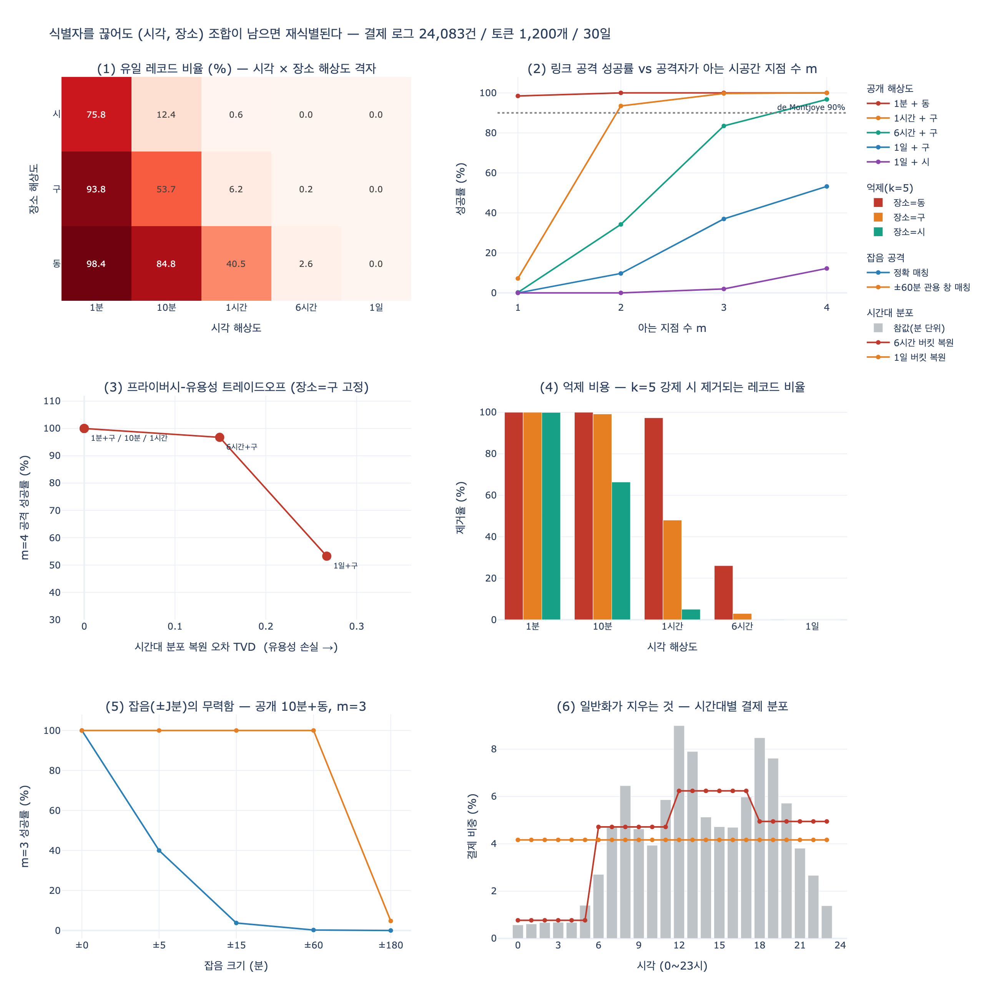

# 식별자 끊기의 함정 — 조합이 남으면 다시 특정된다

**질문**: 식별자 끊기의 함정은 무엇인가?

**답**: "2026년 3월 12일 14시 3분 마포에서 결제" 같은 조합이 남으면 재식별이 가능하다.

---

## 1. 어디서 나온 이야기인가

34장 34.2절은 「지운다」를 네 수준으로 나눈다. `ex2_delete_levels.py` 의 표가 그것이다.

| 수준 | 무엇을 하나 |
|---|---|
| 1. 숨기기(soft delete) | `deleted=true` 플래그 |
| 2. **식별자 끊기** | 이름·연락처를 지우고 대체 키만 남긴다 |
| 3. 가명화 | 식별자를 되돌릴 수 있는 토큰으로 |
| 4. 완전 삭제 | 노드·엣지·본문·백업까지 |

2번이 실무에서 제일 많이 쓰인다. 「김도현」을 「p-8f3a」로 바꾼다.
**사람은 못 알아보는데 구조는 남는다.** 「결제팀에 3명이 있었다」는 유지되고
「그중 하나가 김도현」은 사라진다. 집계도 살고 감사 이력도 살고 남의 이력도 안 깨진다.
여덟 개 기준 중 여섯을 만족한다. 그래서 매력적이다.

그런데 그 표에서 2번의 **«다른 데이터와 못 잇는다» 칸이 `✗`** 다. 그게 함정이다.

> 이름을 지워도 「2026년 3월 12일 14시 3분에 마포에서 결제」 같은 조합이
> 남아 있으면 그것으로 사람을 특정할 수 있다. 재식별(re-identification)이다.

식별자 끊기는 **직접 식별자(direct identifier)** 만 없앤다.
이름, 주민번호, 카드번호, 전화번호, 이메일. 눈에 보이는 것들이다.
남는 것은 «그냥 데이터»처럼 보이는 칸들 — 시각, 장소, 금액, 기기, 팀, 직군.
이 칸들이 문제다.

## 2. 준식별자(quasi-identifier)란 무엇인가

**준식별자**는 «그것 하나로는 누구도 특정하지 못하지만, 여러 개를 조합하면
특정할 수 있게 되는 속성»이다. 1998년 Latanya Sweeney 가 정식화한 개념이다.

- 「마포에서 결제했다」 — 마포구 인구는 수십만 명이다. 아무도 특정 안 된다.
- 「14시 3분에 결제했다」 — 하루에 그 분에 결제한 사람은 전국에 수만 명이다.
- 「2026년 3월 12일 14시 3분에 마포에서 결제했다」 — **한 명일 가능성이 높다.**

각 속성은 «개인정보 아님»으로 보이는데 곱하면 개인정보가 된다.
34장 `ex3_reidentify.py` 가 센 것이 정확히 이것이다. 팀 하나만으로는 105명이 섞이는데,
`팀 + 지역 + 직군 + 입사연도` 넷을 조합하면 65.8% 가 혼자가 된다.

### 형식적으로

준식별자 집합 $Q$ 에 대해 레코드 $r$ 의 **동치류(equivalence class)** 를

$$E_Q(r) = \{\, r' \in D : r'[Q] = r[Q] \,\}$$

로 정의한다. **k-익명성(k-anonymity)** 은

$$\min_{r \in D} \bigl|E_Q(r)\bigr| \;\ge\; k$$

를 요구한다. 즉 «어떤 준식별자 조합으로 조회해도 최소 $k$ 명이 걸린다»는 성질이다.
$|E_Q(r)| = 1$ 인 레코드는 $Q$ 만으로 **유일하게 지목**된다.
34장 표의 «최소 그룹(k)» 칸이 바로 이 $\min |E_Q|$ 다. 그 값이 1이면
"이름을 지웠지만 지워지지 않았다"는 뜻이다.

Sweeney 의 유명한 결과: 미국 인구의 **87%** 가 `우편번호 + 생년월일 + 성별` 세 칸만으로
유일하다. 세 칸 다 «개인정보 아님»으로 분류되던 것들이었다.

## 3. 왜 (분 단위 시각, 장소)가 사실상 유일 키인가

핵심은 **조합 공간의 크기**다. 30일치 결제 로그를 생각하자.

| 시각 해상도 | 시각 칸 수 (30일) | × 동 48개 | 조합 공간 |
|---|---|---|---|
| 1분 | 43,200 | 48 | **207만** |
| 1시간 | 720 | 48 | 34,560 |
| 1일 | 30 | 48 | 1,440 |

레코드가 2만 4천 개인데 칸이 207만 개다. **칸이 데이터보다 100배 많다.**
비둘기집 원리가 거꾸로 작동한다 — 대부분의 칸이 비어 있고,
차 있는 칸에는 레코드가 하나뿐이다.

$N$ 개 레코드가 $C$ 개 칸에 균등히 흩어졌다고 하면 어떤 레코드가 혼자일 확률은

$$\Pr[\text{유일}] = \left(1 - \frac{1}{C}\right)^{N-1} \approx e^{-N/C}$$

$N/C = 24000/2073600 \approx 0.0116$ 이므로 $e^{-0.0116} \approx 0.988$.
**98.8% 가 혼자다.** `expy.py` 의 실측값 98.4% 와 맞는다.

여기서 나오는 실무적 결론이 셋이다.

1. **시각 해상도가 살아 있으면 장소를 아무리 뭉개도 소용없다.**
   `expy.py` 표에서 «1분 + 시(3개뿐)» 조합도 유일 레코드가 75.8% 다.
   장소를 16분의 1로 줄였는데 여전히 4분의 3이 혼자다.
   한쪽만 일반화하는 것은 대응이 아니다.
2. **레코드 유일성이 낮아도 안전하지 않다.**
   «1시간 + 구» 에서 유일 레코드는 **6.2%** 뿐인데,
   유일 레코드를 하나 이상 가진 **토큰은 70.5%** 다.
   레코드 하나만 뚫리면 그 토큰이 확정되고, 그러면 그 토큰의 **전체 이력**이 열린다.
   평균이 아니라 최악(worst case)을 봐야 한다.
3. **사람은 궤적(trajectory)을 갖는다.** 레코드 단위 k-익명성은 궤적을 보호하지 않는다.
   다음 절이 그 이야기다.

## 4. 링크 공격 — 외부 데이터와 붙이면 끝난다

재식별은 «익명 데이터를 노려보다가 알아맞히는 것»이 아니다.
**다른 쪽 데이터와 조인하는 것**이다. 공격자가 가진 것은 얼마든지 있다.

| 외부 데이터 | 무엇이 적혀 있나 |
|---|---|
| 카드 명세서 (가족·회계팀·유출본) | 결제 시각과 가맹점 위치, 분 단위 |
| SNS 체크인·사진 EXIF | "지금 마포 ○○카페" + 타임스탬프 + GPS |
| 배달·택시 앱 주문 내역 | 시각 + 주소 |
| 사무실 출입기록·교통카드 | 시각 + 위치 |
| 그냥 아는 사이 | "그날 그 사람과 마포에서 점심을 먹었다" |

공격자는 자기가 아는 시공간 지점 $m$ 개를 익명 로그에서 찾아,
그 지점을 **모두 포함하는 토큰**을 구한다. 후보가 하나로 좁혀지면 끝이다.
그다음부터는 그 토큰의 모든 레코드가 실명 데이터다.

$m$ 개 지점을 쓸 때 조합 공간은 $C^m$ 으로 **지수적으로** 커진다.
그래서 34장 `ex3` 가 말한 "셋에서 넷으로 갈 때의 절벽"이 여기서도 나온다.

`expy.py` 의 시뮬레이션 결과(토큰 1,200개, 레코드 24,083건):

| 공개 해상도 | m=1 | m=2 | m=3 | m=4 |
|---|---|---|---|---|
| 1분 + 동 | **98.5%** | 100.0% | 100.0% | 100.0% |
| 1시간 + 구 | 7.2% | **93.5%** | 99.8% | 100.0% |
| 6시간 + 구 | 0.2% | 34.2% | 83.5% | 96.8% |
| 1일 + 구 | 0.0% | 9.8% | 37.0% | **53.2%** |
| 1일 + 시 | 0.0% | 0.0% | 2.0% | 12.2% |

읽는 법.

- `1분 + 동` 은 지점 **하나**로 98.5%. 이것이 지금 대부분의 결제·접속·이벤트
  테이블의 상태다. 「우리는 개인정보를 안 저장합니다, user_id 는 해시입니다」라고
  말하는 그 테이블이다.
- `1시간 + 구` 는 레코드 유일성이 6.2% 라서 «k-익명성 괜찮은 편»으로 보였다.
  그런데 지점 2개면 93.5% 가 뚫린다. **레코드 단위로 k-익명성을 검사하면
  궤적 공격을 놓친다.**
- `1일 + 구` 는 $m=1$ 에 0.0% 다. 안전해 *보인다*. 그런데 2, 3, 4로 올리면
  9.8% → 37.0% → 53.2%. 지점 하나 추가가 «조금 더»가 아니라 «자릿수»로 작동한다.

### 실제 연구들

이건 사고실험이 아니다. 공개된 재식별 연구가 줄줄이 있다.

| 연구 | 데이터 | 결과 |
|---|---|---|
| de Montjoye 등, *Unique in the Crowd* (Scientific Reports, 2013) | 이동통신 위치 기록 150만 명, 15개월, 기지국 단위 | 시공간 지점 **4개**로 **95%** 유일 |
| de Montjoye 등, *Unique in the shopping mall* (Science, 2015) | 익명화된 **신용카드 메타데이터** 110만 명, 3개월 | 시공간 지점 **4개**로 **90%** 재식별. 금액까지 알면 더 적은 지점으로 충분 |
| Sweeney (1997, 2000) | 미국 인구 통계 + 매사추세츠 보험 데이터 | `우편번호+생년월일+성별` 로 **87%** 유일. 주지사 의료기록 특정 |
| Narayanan & Shmatikov (2008) | Netflix Prize 익명 평점 데이터 | IMDb 공개 평점과 조인해 개인 특정 |
| AOL 검색 로그 (2006) | 사용자 id 를 숫자로 치환한 검색 질의 | 질의 내용만으로 실명 특정, 기자가 당사자 인터뷰까지 |
| NYC 택시 데이터 (2014) | 해시된 medallion 번호 + 승하차 시각·좌표 | 해시 역산 + 파파라치 사진으로 유명인 이동·팁 액수 특정 |
| Strava 히트맵 (2018) | 집계된 운동 궤적 | 해외 군사기지 위치와 순찰 경로 노출 |

`de Montjoye` 의 신용카드 연구는 이 카드의 답과 정확히 같은 상황이다.
**이름도, 카드번호도, 주소도 없는** 데이터에서 «언제 어디서 결제했나» 4개로 90% 다.
그리고 `expy.py` 의 `1분 + 동` 은 그보다 나쁘다(1개로 98.5%).

## 5. 대응, 그리고 그 대가

34장의 표현대로 **"셋 다 정확도를 내주고 익명성을 산다. 공짜가 아니다."**

### (a) 일반화 / 버킷화 (generalization)

값을 상위 범주로 올린다. `14:03` → `14시` → `오후` → `3월 12일`.
`마포2동` → `마포구` → `서울`. 「2019년 입사」 → 「2015~2020년」.

비용은 **분석 해상도**다. `expy.py` 가 잰 것:

| 시각 해상도 | 시간대 분포 복원 오차 TVD | 점심(11~14시) 비중 추정 | 오차 |
|---|---|---|---|
| 1분 | 0.000 | 22.8% | 0.0% |
| 10분 | 0.000 | 22.8% | 0.0% |
| 1시간 | 0.000 | 22.8% | 0.0% |
| 6시간 | 0.149 | 17.2% | 5.6% |
| 1일 | 0.267 | 12.5%(= 균등값) | **10.3%** |

여기서 TVD 는 총변동거리 $\mathrm{TVD}(p,q) = \frac12\sum_h |p_h - q_h|$ 다.

**가장 아픈 사실**: 시간대 분석이 손실 없이 되는 최저 해상도는 `1시간` 인데,
`1시간 + 구` 의 링크 공격 성공률은 $m=2$ 에 이미 93.5% 다.
즉 **분석에 충분한 해상도는 공격에도 충분하다.**
공격을 한 자릿수로 누르려면 `1일 + 시` 까지 내려가야 하고,
그 지점에서 시간대 분포는 사실상 균등해진다. "점심에 결제가 몰린다"를 더는 말할 수 없다.
`6시간` 같은 중간 타협은 오차 5.6% 를 내주고도 $m=4$ 성공률 96.8% 를 남긴다.
**타협은 방어가 아니다.**

### (b) 억제 (suppression)

$|E_Q(r)| < k$ 인 레코드(또는 그 속성)를 아예 뺀다. 확실한 방법이다. 대가가 크다.

`expy.py` 가 $k=5$ 를 강제했을 때 제거되는 레코드 비율:

| 시각 | 동 | 구 | 시 |
|---|---|---|---|
| 1분 | **100.0%** | 100.0% | 99.9% |
| 10분 | 100.0% | 99.2% | 66.4% |
| 1시간 | 97.3% | 48.0% | 5.0% |
| 6시간 | 26.0% | 3.0% | 0.0% |
| 1일 | 0.0% | 0.0% | 0.0% |

분 단위 데이터에 k=5 를 강제하면 **전부 지워진다**(남는 토큰 0개).
억제는 일반화 없이는 쓸 수 없는 도구다.
그리고 «1시간 + 동»(97.3% 제거)처럼 어중간한 지점에서는
**드물게 움직이는 사람, 특이한 시간에 활동하는 사람이 먼저 사라진다.**
억제는 편향을 만든다. 남은 데이터는 «평범한 사람들»의 데이터다.

### (c) 잡음 (noise) / 차등 정보보호

시각을 ±J분 흔들거나, 집계값에 라플라스 잡음을 더한다.
`expy.py` 의 결과가 여기서 가장 교훈적이다 (공개 10분+동, $m=3$):

| 잡음 ±J분 | 정확 매칭 성공률 | ±60분 관용 창 매칭 성공률 |
|---|---|---|
| ±0 | 100.0% | 100.0% |
| ±5 | 40.0% | **100.0%** |
| ±15 | 3.8% | **100.0%** |
| ±60 | 0.2% | **100.0%** |
| ±180 | 0.0% | 4.8% |

- **정확 매칭**만 보면 ±15분 잡음으로 3.8% — 방어에 성공한 것처럼 보인다.
- 그런데 공격자가 «±60분 안에 있으면 같은 결제로 본다»는 **관용 창**을 쓰면
  ±5·±15·±60 전부에서 **100%** 가 뚫린다.
  공격자는 정확 매칭을 강요당하지 않는다. 창을 넓히면 된다.
- 관용 창보다 훨씬 큰 ±180분을 넣으면 4.8% 로 내려간다. 그런데 그때 시각 데이터의
  실제 오차는 ±3시간 — 결국 «6시간 버킷»과 같은 값을 치른 것이다.
  게다가 **컬럼은 분 단위인 채 «정확한 척»을 하고 있어서 더 위험하다.**
  분석자는 그 데이터를 분 단위로 믿고 쓴다.

그래서 임의 잡음은 방어가 아니다. 잡음이 의미가 있으려면 **형식적 보증**이 붙어야 한다.
차등 정보보호(differential privacy)는 인접 데이터셋 $D, D'$ (한 사람 차이)에 대해

$$\Pr[M(D) \in S] \;\le\; e^{\varepsilon}\,\Pr[M(D') \in S]$$

를 요구한다. 「내가 데이터에 있든 없든 결과 분포가 $e^{\varepsilon}$ 배 안에서 같다」는 뜻이다.
이건 «공격자가 무엇을 알고 있든» 성립하는 보증이라서, k-익명성의
약점(공격자의 배경지식을 가정해야 함)을 넘어선다.
대신 $\varepsilon$ 이 곧 유용성 예산이고, 질의를 반복하면 예산이 **합산되어** 소모된다.

### (d) k-익명성만으로 부족한 이유

k-익명성은 «누가 이 그룹에 있나»만 감춘다. 그룹 안의 값이 다 같으면 소용없다.

- **동질성 공격**: 동치류 5명 전부가 «강남 성형외과 결제»면 $k=5$ 여도 사실이 노출된다.
  → **l-다양성(l-diversity)**: 민감 속성이 동치류마다 최소 $l$ 종류.
- **쏠림 공격**: 동치류 안 분포가 전체 분포와 크게 다르면 정보가 새어 나간다.
  → **t-근접성(t-closeness)**: 동치류 내 민감 속성 분포가 전체 분포와 거리 $t$ 이내.
- **조합 공개**: 같은 데이터를 다른 준식별자 조합으로 두 번 공개하면
  각각 k-익명이어도 교차하면 뚫린다. k-익명성은 **합성에 대해 닫혀 있지 않다.**

## 6. GDPR 관점 — 가명화는 익명화가 아니다

이 구분이 실무에서 가장 자주 틀리는 지점이다.

- **가명화(pseudonymisation, GDPR Art. 4(5))**: 추가 정보 없이는 특정할 수 없게 만든 것.
  → 여전히 **개인정보다.** GDPR 이 그대로 적용된다. 삭제권도 살아 있다.
- **익명화(anonymisation, Recital 26)**: «더 이상 특정될 수 없는» 상태.
  → 개인정보가 아니고 GDPR 밖이다. 그런데 판정 기준이 «singling out, linkability,
  inference» 가 모두 합리적 수단으로 불가능해야 한다는 것이라, 넘기가 매우 어렵다.

「식별자를 끊었으니 개인정보가 아니다」는 거의 항상 틀린 주장이다.
`expy.py` 가 보인 대로 조합이 남아 있으면 singling out 이 가능하고,
그러면 법적으로도 여전히 개인정보다. 34장이 "법무가 정할 일"이라고 말한 부분이 여기고,
**엔지니어가 할 일은 «그 수준을 선택했을 때 무엇이 남는지»를 숫자로 세는 것**이다.

## 7. 그래프에서는 한 겹 더 있다

34장 34.3절의 마지막 문단이 이 카드의 «그다음»이다.

> 그런데 그래프에서는 하나 더 있다. **«관계 자체가 식별자»다.**
> 속성을 전부 지워도 「이 사람은 이 팀에 속하고 저 문서를 작성했고
> 그 사람의 멘티다」라는 «모양»이 남는다. 그 모양이 유일하면 특정된다.

결제 로그의 준식별자는 `(시각, 장소)` 두 칸이었다. 그래프에서는 그 자리에
**차수, 이웃의 차수 다중집합, 1-hop/2-hop 서브그래프 모양**이 들어온다.
그리고 이건 «칸을 뭉갠다»로 처리할 수가 없다. 엣지를 더하거나 지워야 하고,
그러면 그래프 통계가 왜곡된다(k-degree anonymity, k-automorphism 등의 접근이 있지만
34장 표현대로 "아직 제대로 된 해법이 없다").

## 8. 실무 체크리스트

식별자를 끊고 「지웠습니다」라고 답하기 전에 세어야 하는 것.

1. **준식별자 목록을 명시한다.** 어떤 칸들이 조합되면 개인을 좁히는지 문서로 적는다.
   금액, 기기 지문, User-Agent, 언어 설정, 화면 해상도도 준식별자다.
2. **$\min |E_Q|$ 를 실제로 계산한다.** «k-익명성 검사»를 배치로 돌린다.
   이 값이 1이면 이름을 지워도 지운 게 아니다.
3. **레코드 단위가 아니라 궤적 단위로 검사한다.** 같은 토큰의 레코드 $m$ 개를
   묶었을 때 유일해지는 비율을 $m=1..4$ 로 잰다. `expy.py` 의 링크 공격이 그것이다.
4. **최악을 본다.** 「유일 레코드 6% 뿐」이 아니라 「토큰 70% 가 노출」로 보고한다.
5. **외부 데이터를 가정한다.** 「누가 이걸 조인할 수 있나」를 적는다.
   카드 명세서, 사내 출입기록, 공개 SNS. 공격자는 데이터셋 하나만 보지 않는다.
6. **해상도를 애초에 낮춰 저장한다.** 데이터 최소화(GDPR Art. 5(1)(c))는
   삭제보다 싸다. 분 단위가 필요 없으면 처음부터 시간 단위로 적재한다.
   이벤트 로그는 못 지우므로(30장) 특히 그렇다.
7. **일반화 비용을 미리 잰다.** 「1일 버킷으로 내리면 어떤 대시보드가 죽는가」를
   목록으로 만들어 두면, 나중에 협상이 «감»이 아니라 «표»로 진행된다.
8. **잡음을 넣었으면 «어떤 공격 모델에서» 안전한지 쓴다.**
   정확 매칭만 막았다면 그건 방어가 아니다.

## 9. 한 줄로

식별자 끊기는 **직접 식별자를 지우고 준식별자를 남긴다.**
그런데 시각을 분 단위로, 장소를 동 단위로 남기면 그 둘의 조합이
데이터보다 100배 넓은 공간을 만들어 거의 모든 레코드를 유일하게 만든다.
그러면 카드 명세서 한 장, 인스타 스토리 네 장으로 실명이 다시 붙는다.
막으려면 일반화·억제·잡음을 써야 하는데, 공격을 못 하게 만드는 해상도에서는
**분석도 이미 못 하게 되어 있다.** 그 교환비를 숫자로 재 놓는 것이 엔지니어의 일이다.

## 시각화

- **(1)** 시각 × 장소 해상도 격자에서 유일 레코드 비율. 왼쪽 위가 붉을수록 위험하다.
  `1분 + 동` 98.4%. 그리고 `1분 + 시` 가 75.8% — 장소만 뭉개는 건 소용없다.
- **(2)** 링크 공격 성공률 vs 공격자가 아는 지점 수 $m$. 점선이 de Montjoye 의 90% 선이다.
  `1일 + 구` 조차 $m$ 을 올리면 절벽처럼 올라간다.
- **(3)** 프라이버시-유용성 트레이드오프. 오른쪽으로 갈수록 데이터가 쓸모를 잃고
  아래로 갈수록 안전해진다. 왼쪽 위 세 점(1분/10분/1시간)은 «유용성 손실 0,
  공격 성공률 100%» — 공짜 점심이 없다는 뜻이다.
- **(4)** k=5 를 강제할 때 억제되는 레코드 비율. 분 단위에서는 전부 사라진다.
- **(5)** 잡음의 무력함. 파란 선(정확 매칭)만 보면 방어에 성공한 것 같지만
  주황 선(±60분 관용 창)은 ±60분 잡음까지 100% 를 유지한다.
- **(6)** 일반화가 지우는 것. 회색 막대가 참 시간대 분포(점심·퇴근 피크),
  선이 6시간/1일 버킷에서 복원한 분포다. 1일 버킷은 완전 균등 — 피크가 사라졌다.

재현: `python3 expy.py` (필요 패키지 `plotly`, `kaleido`. 난수 seed 34 로 고정).
