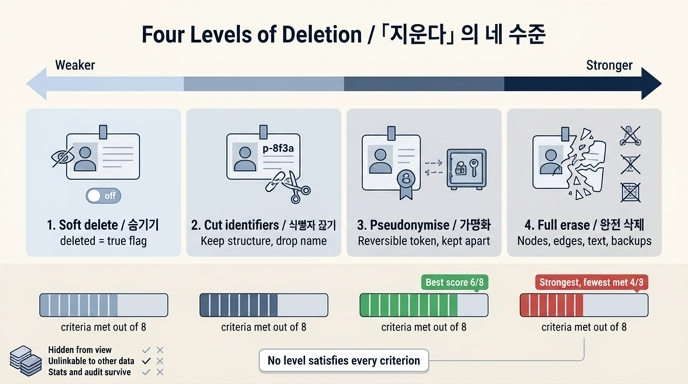

# 「지운다」의 네 가지 수준

**Q.** 「지운다」의 네 가지 수준은 무엇인가?

**A.** 숨기기(soft delete), 식별자 끊기, 가명화, 완전 삭제다.

---

## 왜 「지운다」를 나눠야 하나

34장은 「지웠습니다」라고 답한 뒤 3주 만에 다시 연락이 온 이야기로 시작합니다. 「지웠습니다」는 사실이었는데, *한 곳에서만* 사실이었습니다.

그래프에서 노드 하나를 지워도 남는 곳이 다섯입니다.

1. **들어오는 엣지** — `이서연 -[멘토]-> 김도현`. 이건 이서연 쪽 사실이기도 합니다.
2. **자유 텍스트 안의 이름** — 발화, 문서 본문, 요약. 정규화된 필드가 아니라 그냥 글입니다.
3. **이벤트 로그** — 「p1을 지웠다」는 기록 자체가 「p1이 있었다」는 정보입니다.
4. **백업**
5. **검색 색인**

관계형 DB라면 「그 행을 지우면 끝」에 가깝습니다. 그래프에서는 그렇지 않아서, 「지운다」를 하나의 동작으로 다루면 안 됩니다. **무엇을 어느 수준으로 지울지 나눠야** 합니다.

## 네 수준

| # | 수준 | 하는 일 |
|---|---|---|
| 1 | **숨기기(soft delete)** | `deleted=true` 플래그만 세운다 |
| 2 | **식별자 끊기** | 이름·연락처를 지우고 대체 키만 남긴다 (`김도현` → `p-8f3a`) |
| 3 | **가명화(pseudonymisation)** | 식별자를 **되돌릴 수 있는** 토큰으로 바꾼다 |
| 4 | **완전 삭제** | 노드·엣지·본문·백업까지 전부 |

강도만 보면 1 → 4로 갈수록 세지는 스펙트럼입니다. 그런데 **「강함」이 「좋음」이 아니라는 것**이 이 장의 핵심입니다.

## 기준 × 수준 표 (`ex2_delete_levels.py`)

| 기준 | 1 숨기기 | 2 식별자 끊기 | 3 가명화 | 4 완전 삭제 |
|---|:---:|:---:|:---:|:---:|
| 화면에서 안 보인다 | ○ | ○ | ○ | ○ |
| 이름으로 못 찾는다 | ✗ | ○ | ○ | ○ |
| 다른 데이터와 못 잇는다 | ✗ | ✗ | ✗ | ○ |
| 집계·통계가 유지된다 | ○ | ○ | ○ | ✗ |
| 감사 이력이 유지된다 | ○ | ○ | ○ | ✗ |
| 남의 이력이 안 깨진다 | ○ | ○ | ○ | ✗ |
| 되돌릴 수 있다 | ○ | ✗ | ○ | ✗ |
| 백업까지 지워진다 | ✗ | ✗ | ✗ | ○ |
| **만족한 기준 수** | **5** | **5** | **6** | **4** |

읽는 법이 세 가지입니다.

- **완벽한 칸이 없다.** 어느 수준도 8개를 전부 만족하지 않습니다. 그게 이 표의 요점입니다.
- **가장 강한 4번이 만족 개수는 가장 적다(4개).** 완전 삭제를 하면 집계가 깨지고, 감사 이력이 사라지고, 남의 이력까지 같이 깨집니다.
- **가장 많이 만족하는 건 3번 가명화(6개).** 그래도 「다른 데이터와 못 잇는다」와 「백업까지 지워진다」는 못 합니다.

## 실무에서의 선택

- **기본은 2번(식별자 끊기)** — 「김도현」을 「p-8f3a」로 바꿉니다. 사람은 못 알아보는데 구조는 남습니다. 「결제팀에 3명이 있었다」는 유지되고 「그중 하나가 김도현」은 사라집니다.
- **법적 요구가 명시적이면 4번(완전 삭제)** — 다만 *무엇이 깨지는지* 먼저 목록으로 만듭니다.
- **실수 대비가 필요하면 3번(가명화)** — 되돌릴 수 있게 토큰을 따로 보관합니다.
- **1번(숨기기)은 「지운 것」이 아닙니다.** 그런데 많은 시스템이 1번만 하고 지웠다고 말합니다.

## 2번의 함정 — 재식별

2번의 「다른 데이터와 못 잇는다」 칸이 ✗ 인 이유가 중요합니다. 이름을 지워도 「2026년 3월 12일 14시 3분에 마포에서 결제」 같은 **조합**이 남아 있으면 사람을 특정할 수 있습니다. **재식별(re-identification)** 입니다.

`ex3_reidentify.py`가 5,000명으로 이걸 셉니다(이름은 이미 지운 상태).

| 조합 | 최소 그룹(k) | 혼자인 사람 비율 |
|---|---|---|
| team | 105 정도 | 0% |
| team + city | | 거의 0% |
| team + city + role | 1 | 0.6% (30명) |
| team + city + role + joined | 1 | **65.8%** |
| + birth_month | 1 | 96.3% |

셋에서 넷으로 갈 때 0.6% → 65.8%로 뛰는 **절벽**이 생깁니다. 속성 하나 추가가 「두 배」가 아니라 「백 배」로 작동합니다 — 조합의 수가 곱해지기 때문입니다.

- **k-익명성(k-anonymity)**: 어떤 조합으로도 최소 k명 이상으로 묶인다는 성질. k=1이면 혼자인 사람이 있다는 뜻입니다.
- 대응 셋: **일반화**(2019년 → 2015~2020년), **억제**(혼자인 사람의 속성 제거), **잡음**(생월 ±2 흔들기). 셋 다 정확도를 내주고 익명성을 삽니다.

그리고 그래프에는 하나 더 있습니다. **관계 자체가 식별자**입니다. 속성을 전부 지워도 「이 팀에 속하고 저 문서를 작성했고 그 사람의 멘티다」라는 이웃 **모양**이 유일하면 특정됩니다. 이건 아직 제대로 된 해법이 없습니다.

## 수준을 정한 다음 — 노드 종류별 방침

「지운다」의 수준은 노드 하나에 일괄 적용되는 게 아니라 **노드 종류마다** 달라집니다(`ex5_deletion_plan.py`).

| 종류 | 방침 | 이유 |
|---|---|---|
| Person / Contact | 삭제 | 개인 그 자체, 연락처 |
| Msg | 본문 마스킹 | 발화 — 이름·연락처만 가린다 |
| Doc | 작성자 익명화 | 산출물은 회사 자산 |
| Team | 유지 | 개인정보 아님 |
| Stat | 재계산 | 집계는 남기되 다시 센다 |
| Fact / Answer | 유지 | 개인을 안 가리킴 / 회사의 결정 기록 |
| Run | 행위자 익명화 | 누가 돌렸는지만 가린다 |
| Event | **식별자 치환** | 이벤트 로그는 추가 전용이라 못 지운다 |

경계는 하나입니다 — **「이 노드가 개인을 가리키는가, 아니면 개인이 만든 것인가?」** 가리키면 지우고, 만든 것이면 「만든 사람만」 지웁니다. 「3분기 보고서」는 개인을 안 가리키고, 「김도현이 작성」이 가리킵니다. 그러니 문서는 두고 엣지의 작성자만 익명 노드로 바꿉니다.

방침 표에 없는 종류(예제에서는 `Photo`)가 나오면 **멈춥니다**. 「모르는 것을 모른다」고 말해 주는 게 이 표의 값어치입니다.

## 외우는 법

**숨 → 끊 → 가 → 완** (숨기기 · 식별자 끊기 · 가명화 · 완전 삭제)

- 1번은 지운 게 아니다
- 2번이 기본
- 3번이 점수 최고(6/8)
- 4번이 가장 강하지만 점수 최저(4/8)

## 참고

- GDPR Art.17 [right to erasure](https://gdpr-info.eu/art-17-gdpr/), Art.4 [pseudonymisation](https://gdpr-info.eu/art-4-gdpr/)
- [k-anonymity (Sweeney)](https://dataprivacylab.org/dataprivacy/projects/kanonymity/kanonymity.pdf)
- [NIST — De-identification of Personal Information](https://www.nist.gov/publications/de-identification-personal-information)

## 인포그래픽

