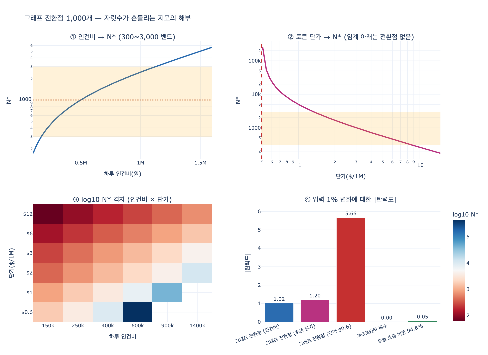

# 자릿수가 흔들리는 지표 — 「그래프 전환점 1,000개」

**질문**: 자릿수가 흔들릴 수 있다고 명시된 지표의 예는 무엇인가?

**답**: 그래프 전환점 1,000개다. 인건비와 단가에 따라 300일 수도 3,000일 수도 있다.

---

## 1. 답이 어디서 나왔나

35장 `ex4_selfcheck.py`는 이 책의 숫자를 「여러분이 직접 재야 하는 것」으로 바꾼 표다. 그 표에 그래프 전환점 행이 이렇게 들어 있다.

| 장 | 지표 | 무엇을 재나 | 책의 값 | 주의 |
|---|---|---|---|---|
| 27장 | 그래프 전환점 | 사실 몇 개부터 그래프가 싼가 | 1,000개 | **인건비·단가에 달렸다** |

그리고 예제 마지막 출력이 이 문제를 정면으로 말한다.

```
제 숫자의 쓸모는 «자릿수»와 «방향»이다.
  체크포인터가 2배쯤 느리다 → 여러분도 배수는 비슷할 것
  모델 호출이 95% 다      → 여러분도 90% 는 넘을 것
  그래프 전환점이 1,000개  → 여러분은 300일 수도 3,000일 수도

마지막 것처럼 자릿수가 흔들리는 것들이 있다. 그건 주의 칸에 적었다.
```

앞의 두 개는 「자릿수와 방향」이 그대로 이식된다. 세 번째는 자릿수조차 이식되지 않는다. 그래서 35장은 이 지표를 자릿수가 흔들리는 예로 명시적으로 지목한다.

## 2. 「그래프 전환점」이 무엇인가

27장(에이전트에게 기억을 주는 가장 싼 방법)의 지표다. 정의는 한 줄이다.

> 사실(엔티티) 수가 **몇 개를 넘으면** 평평한 목록·문서·벡터 검색보다 그래프를 세우는 쪽이 이득이 되는가.

두 방식의 하루 비용이 이렇게 다르게 자란다.

- **비그래프**: 관련 사실을 전부(또는 대량으로) 컨텍스트에 넣으므로 하루 비용이 **사실 수에 비례해서** 오른다. 27장 `ex4_memory_cost.py`의 값으로 사실 50개는 하루 911원, 5,000개는 하루 91,080원(한 달 273만 원)이다.
- **그래프**: 질문에 걸린 것만 넣으므로 질의당 컨텍스트가 **사실 수와 거의 무관하게** 열 개 안팎으로 고정된다. 조회 시간도 색인이 일해서 사실이 100배 늘어도 2~7ms 사이에서 논다.

그래서 두 곡선은 반드시 한 번 교차한다. 그 교차점이 전환점이다. 27장 저자의 결론:

> 토큰 값만 보면 «사실 20개»부터 그래프가 싸다. 그런데 그래프를 세우고 유지하는 사람 시간이 있다. 그걸 넣으면 실제 경계는 훨씬 뒤다. 저는 «1,000개»를 기준으로 쓴다.

즉 1,000개는 측정된 물리량이 아니라 **토큰 비용 + 인건비를 합산한 손익분기 계산의 결과값**이다. 이게 이 지표가 흔들리는 이유의 씨앗이다.

## 3. 왜 인건비·단가에 이렇게 민감한가

손익분기를 식으로 쓰면 구조가 바로 보인다. 엔티티 수를 $N$, 하루 비용을 비교하면

$$
\underbrace{N \cdot c_{no}}_{\text{비그래프}} \;=\; \underbrace{\frac{C_{fixed}}{H} + N \cdot c_{graph}}_{\text{그래프}}
$$

- $c_{no}$: 엔티티 하나를 컨텍스트에 넣는 하루 토큰 비용 → **토큰 단가에 정비례**
- $c_{graph}$: 엔티티 하나를 그래프에 유지하는 하루 비용(정규화 검토, 저장·색인) → 사람 손이 섞이므로 **인건비에 정비례**
- $C_{fixed}$: 설계·정규화 파이프라인·운영 셋업 등 **일회성 인건비**, $H$는 회수 기간

정리하면

$$
N^{*} \;=\; \frac{C_{fixed} / H}{\,c_{no} - c_{graph}\,}
$$

여기서 두 가지가 동시에 일어난다.

1. **분자는 인건비 그 자체다.** $C_{fixed}$가 「설계 며칠 × 하루 인건비」이므로, 시니어 한 명이 5.5일 붙는 조직과 주니어가 절반의 임률로 붙는 조직 사이에서 분자가 그대로 몇 배 차이 난다. $N^{*}$는 인건비에 **정비례**한다. 인건비 3배 → 전환점 3배.

2. **분모는 두 값의 차이다.** 이게 진짜 증폭기다. 차이값은 원래 값보다 훨씬 크게 요동친다. 토큰 단가가 3분의 1이 되면 $c_{no}$만 3분의 1이 되는데 $c_{graph}$는 그대로 남으므로, 분모는 3분의 1보다 훨씬 더 크게 줄어든다. 분모가 절반이 되면 $N^{*}$는 2배가 된다.

극단에서는 아예 발산한다. $c_{no} \le c_{graph}$가 되는 순간, 즉 토큰이 충분히 싸져서 「전부 넣기」가 「그래프를 유지하기」보다 싸지면

$$
N^{*} \to \infty \quad (\text{전환점이 없다})
$$

가 된다. 아무리 엔티티가 늘어도 그래프가 이기지 못한다. 반대로 단가가 폭등하면 $N^{*}$가 수백 아래로 내려가 「처음부터 그래프」가 정답이 된다. **분자와 분모가 각각 다른 외부 가격에 매달려 있고, 분모는 차이값이다.** 자릿수가 흔들리는 지표의 교과서적 형태다.

## 4. 300~3,000이라는 10배 폭이 실무에 뜻하는 것

책의 다른 숫자들은 「내 값은 저자 값의 2배쯤이겠지」로 보정하면 판단이 선다. 전환점은 그게 안 된다.

- **1,000을 그대로 쓰면 판단이 뒤집힌다.** 실제 전환점이 3,000인 조직이 1,000에서 그래프로 옮기면, 아직 평평한 목록이 싼 구간에서 설계·정규화·운영 비용을 미리 태운다. 27장이 「그 이틀을 처음에 쓰면 대개 낭비가 된다」고 말하는 그 낭비다. 반대로 실제가 300인 조직이 1,000까지 버티면 몇 배의 토큰 비용을 그냥 낸다.
- **그러니 이 지표는 「값」이 아니라 「식」으로 가져가야 한다.** 옮겨 갈 것은 1,000이라는 수가 아니라 $N^{*} = (C_{fixed}/H)/(c_{no}-c_{graph})$라는 구조와, 여기에 꽂을 네 개의 입력(우리 인건비, 우리 토큰 단가, 우리 회수 기간, 우리 엔티티당 유지비)이다.
- **재는 비용이 싸다.** 35장의 핵심 처방이 이것이다. 「이 책의 숫자는 자릿수와 방향으로만 쓰세요. 여러분 환경에서 다시 재는 데 하루면 됩니다.」 전환점은 실측이랄 것도 없고, 청구서에서 단가를 꺼내고 인건비를 곱하면 나온다.
- **그리고 재측정 주기가 짧아야 한다.** 인건비는 연 단위로 움직이지만 토큰 단가는 분기마다 떨어진다. 작년에 계산한 전환점이 올해도 맞다는 보장이 없다. 이건 35장의 1번 주장(「모델 호출이 90%를 차지한다」, 확신 35%)이 흔들리는 것과 같은 원인 — 모델 가격·속도가 계속 움직인다 — 에서 온다.
- **실행 순서는 바뀌지 않는다.** 값이 흔들려도 방향은 남는다. 처음부터 그래프로 가지 말고, 평평한 목록으로 시작해서 하루 비용이 눈에 띌 때 옮긴다. 옮기는 데 이틀이다. 흔들리는 것은 「언제」이고, 「어떤 순서로」는 흔들리지 않는다.

## 5. 반대로, 자릿수가 잘 안 흔들리는 지표

35장이 같은 자리에서 대조로 든 두 개가 있다.

| 지표 | 형태 | 왜 안 흔들리나 |
|---|---|---|
| **체크포인터 2배**(21장, 2.0~4.8배) | **비율** $t_{disk}/t_{mem}$ | 분자와 분모가 **같은 방향으로 함께** 움직인다. 하드웨어가 전반적으로 빨라지면 둘 다 빨라져 배수는 남는다. 공통 인자가 약분되므로 외부 가격에 대한 탄력도가 0에 가깝다. 남는 것은 「디스크가 메모리보다 한 자릿수 안쪽으로 느리다」는 물리적 사실이다. |
| **모델 호출 90%**(33장, 94.8%) | **경계가 있는 비율** $\frac{t_{model}}{t_{model}+t_{rest}}$ | 값이 구조적으로 $[0, 1]$에 갇힌다. 게다가 95% 근처에서는 탄력도가 $1-s \approx 0.05$로 아주 작다. 모델 지연이 2배가 되어도 97%가 될 뿐이고, 절반이 되어도 90%다. 그래서 「여러분도 90%는 넘을 것」이라고 말할 수 있다. 실제로 이 주장을 뒤집으려면 **10분의 1**이라는 극단적 변화가 필요하고, 35장은 그걸 그대로 반증 조건으로 적었다. |
| **그래프 전환점 1,000개**(27장) | **차이의 역수** $\dfrac{C_{fixed}/H}{c_{no}-c_{graph}}$ | 분자는 인건비에 비례, 분모는 서로 다른 가격에 매달린 **두 값의 차이**. 상쇄가 없고 증폭만 있으며, 위로 열려 있어 분모가 0을 지나면 발산한다. |

정리하면 판별법은 이렇다.

- **비율형·경계형 지표**는 공통 인자가 약분되거나 값이 구간에 갇혀서 이식이 잘 된다 → 저자의 자릿수를 믿고 시작해도 된다.
- **차이의 역수 형태, 특히 서로 다른 가격이 분자와 분모에 따로 들어가는 손익분기형 지표**는 이식되지 않는다 → 값을 베끼지 말고 식을 베낀 뒤 자기 숫자를 꽂아야 한다.

35장 마지막 문장이 그래서 이렇게 끝난다. 「재 보시고, 다르게 나오면 그쪽이 맞습니다. 이 책의 어느 문장보다 여러분 환경에서 잰 값이 정확합니다.」

## 시각화



`expy.py`를 실행하면 위 네 장면을 확인할 수 있다.

1. 인건비를 흔들 때 $N^{*}$가 정비례로 300~3,000을 훑고 지나가는 곡선
2. 토큰 단가를 흔들 때 $N^{*}$가 비선형으로 튀고, 임계 단가 아래에서 발산해 「전환점이 없다」가 되는 곡선
3. (인건비 × 토큰 단가) 격자에서 $\log_{10} N^{*}$ 히트맵 — 같은 등고선 위 어디에 서 있는지에 따라 답이 300인지 3,000인지 갈린다
4. 탄력도 비교 — 전환점 vs 체크포인터 배수 vs 모델 호출 비중
