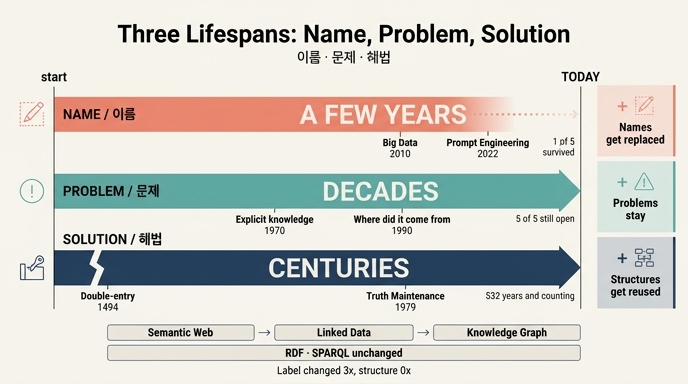

# 이름·문제·해법의 수명

**질문** 이름·문제·해법의 수명은 각각 어느 정도인가?

**답** 이름은 몇 년, 문제는 수십 년, 해법은 수백 년 간다.

---

## 한 줄로

기술을 볼 때 **이름 / 문제 / 해법**을 분리해서 보면, 세 층의 시간 척도가 자릿수 단위로 다르다. 이름은 **연(年)** 단위, 문제는 **수십 년** 단위, 해법은 **수백 년** 단위로 산다. 그래서 무엇을 배우고 무엇을 흘려보낼지가 정해진다.

35장의 `ex3_what_survives.py`가 이걸 표로 만든 예제다. 지난 30년(그리고 500년)의 항목 16개를 세 종류로 분류해서 나이를 센다.

## 세 시간 척도를 숫자로

`ex3_what_survives.py`의 데이터를 2026년 기준으로 계산하면 이렇게 나온다.

| 종류 | 항목 | 등장 연도 | 나이(2026 기준) | 평균 나이 |
|---|---|---|---|---|
| **이름** | 전문가 시스템 / 시맨틱 웹 / 빅데이터 / 마이크로서비스 / 프롬프트 엔지니어링 | 1980, 2001, 2010, 2014, 2022 | 46, 25, 16, 12, 4년 | **21년** |
| **문제** | 지식을 명시적으로 적기 / 무엇이 언제 참이었나 / 어디서 온 정보인가 / 동시 변경 충돌 / 무엇을 잊을 것인가 | 1970, 1980, 1990, 1975, 1985 | 56, 46, 36, 51, 41년 | **46년** |
| **해법** | 규칙 기반 추론 / 이시간 모델 / 낙관적 잠금 / 이벤트 소싱 / 진리 유지 시스템 / 복식부기 | 1975, 1990, 1979, 2005, 1979, **1494** | 51, 36, 47, 21, 47, **532년** | **122년** |

여기서 주의할 점 하나. **표의 「나이」는 「등장 이후 경과 연수」지 「수명」이 아니다.** 그런데 세 종류에서 나이가 뜻하는 게 서로 다르다.

- **문제**는 다섯 개 전부 상태가 「지금도 문제」다. 그러니까 나이 = **아직 안 죽은 수명의 하한**이다. 1970년의 「지식을 명시적으로 적기」는 56년째 살아 있고, 언제 끝날지 알 수 없다. → **수십 년**
- **해법**도 상태가 「그대로 씀 / 다시 필요해짐」이라 나이가 수명의 하한이다. 복식부기가 1494년에 등장해 **532년째** 쓰이고 있다. → **수백 년**
- **이름**만 다르다. 다섯 중 상태가 「이름은 남음」인 것은 **마이크로서비스 하나뿐**이다(예제도 `survived`를 이렇게 세서 1개를 출력한다). 나머지는 사라졌거나(전문가 시스템, 빅데이터), 흐려졌거나(시맨틱 웹), 다른 말로 옮겨갔다(프롬프트 엔지니어링). 즉 **이름의 나이 21년은 대부분 「죽은 뒤 흐른 시간」을 포함한 값**이고, 실제로 그 이름이 현장에서 통용된 기간은 훨씬 짧다. → **몇 년**

## 이름은 왜 가장 짧은가

이름은 기술의 실체가 아니라 **그 실체를 팔기 위한 포장**이기 때문이다. 포장은 새로울 때만 값이 있어서, 익숙해지는 순간 교체 압력을 받는다. 표의 다섯 개가 각각 다른 방식으로 죽는다.

**1. 사라짐 — 「빅데이터」(2010)**
문제(대용량 데이터를 어떻게 저장·처리하나)와 해법(분산 파일 시스템, 맵리듀스 계열)은 그대로 남았는데 이름만 사라졌다. 지금은 같은 일을 「데이터 엔지니어링」, 「데이터 플랫폼」, 「레이크하우스」라고 부른다. 하는 일이 바뀐 게 아니라 **말이 닳았다.** 이름 하나가 통용된 기간은 대략 5~8년.

**2. 사라짐 — 「전문가 시스템」(1980)**
1980년대에 정점을 찍고 AI 겨울과 함께 이름이 오염됐다. 그런데 그 안의 해법인 **규칙 기반 추론**은 「일부만 남음」 상태로 살아 있고(비즈니스 룰 엔진, SHACL 제약, 정책 엔진), 그 시대의 문제인 「지식을 명시적으로 적기」는 아직 미해결이다. 이름만 못 쓰게 됐다.

**3. 흐려짐 — 「시맨틱 웹」(2001)**
가장 교과서적인 사례다. 이름이 바뀌는 동안 **밑에 깔린 표준은 하나도 안 바뀌었다.**
「시맨틱 웹」 → 「링크드 데이터」 → 「지식 그래프」로 간판이 세 번 갈렸는데, RDF·OWL·SPARQL은 그대로다. 35장의 `ex2_standard_watch.py`가 이 표준들을 「단계 4 / 널리 채택 / 이미 안정. 큰 변화 없을 것」으로 적어 둔 게 그 증거다. 즉 **이름은 3세대를 지나갔고 해법은 1세대도 안 지나갔다.**

**4. 옮겨감 — 「프롬프트 엔지니어링」(2022)**
표에서 가장 어리고(4년), 가장 빠르게 이동한 이름이다. 2022~2023년에 직무명·채용 공고·책 제목까지 붙었는데, 2024~2025년에는 같은 일이 「컨텍스트 엔지니어링」, 「에이전트 설계」, 「평가(eval) 설계」로 흩어졌다. 이름의 실효 수명이 **2~3년**. 이게 「이름은 몇 년」의 가장 선명한 실측치다.

**5. 유일한 생존 — 「마이크로서비스」(2014)**
다섯 중 하나만 남았다. 12년째다. 그러니까 확률로 보면 **새 이름이 10년을 넘길 가능성은 5분의 1 정도**라는 뜻이다.

## 문제와 해법이 왜 긴가

**문제는 사람과 조직의 성질에서 나오기 때문에 안 늙는다.** 「어디서 온 정보인가」(1990, 출처/계보)는 기술이 아니라 신뢰의 문제고, 「무엇을 잊을 것인가」(1985)는 저장 용량이 아니라 판단의 문제다. 저장장치가 1000배 빨라져도 이 질문들은 그대로 남는다. 그래서 다섯 개 모두 36~56년째 「지금도 문제」다.

**해법은 「구조」라서 이름을 바꿔 입으며 재사용된다.** 35장이 드는 두 사례가 결정적이다.

**복식부기(1494) → 이벤트 소싱(2005)**
표에서 가장 오래된 항목이고 **532년**째 쓰인다. 그리고 35장은 이게 30장의 이벤트 소싱과 **같은 구조**라고 지적한다. 「지우지 말고 반대 기입을 하라」가 「이벤트를 쌓아라」가 됐을 뿐이다. 불변 추가 전용(append-only) 원장, 파생 상태는 재계산, 정정은 삭제가 아니라 역방향 기록 — 규칙이 동일하다. 이름은 두 번 갈렸어도(복식부기 → 저널링 → 이벤트 소싱) 구조는 5세기를 버텼다. **이게 「해법은 수백 년」의 근거다.**

**진리 유지 시스템(1979) → 다시 필요해짐**
해법의 수명이 「연속 사용」이 아니라 **「잠들었다 깨어남」** 형태일 수도 있음을 보여 준다. TMS(Truth Maintenance System)는 1979년에 나왔다가 한동안 잊혔다. 35장의 설명이 정확하다 — 딥러닝 시대에는 필요 없었다. **신경망은 「왜 그렇게 생각했나」를 못 대니 철회할 것도 없었다.** 그런데 에이전트가 그래프에 직접 쓰기 시작하니, 「A를 믿어서 B를 넣었는데 A가 거짓으로 밝혀지면 B도 빼야 한다」는 문제가 되살아났다. 47년 전 해법이 그대로 다시 필요해진 것이다.

즉 해법은 유행이 끝나도 **폐기되는 게 아니라 대기 상태로 들어간다.** 문제가 다시 나타나면 다시 꺼내 쓴다. 이름은 그렇게 부활하지 않는다 — 「빅데이터」라는 말이 2035년에 다시 유행할 일은 없다.

## 그래서 무엇을 가져가나

35장이 붙인 우선순위 그대로다.

1. **문제** — 30년 뒤에도 그대로 있을 것
2. **해법** — 이름이 바뀌어도 구조는 남을 것
3. **이름** — 내년에 없을 수도 있는 것

## 저자가 이 척도를 자기 책에 적용한 대목

여기가 35장의 매듭이다. 저자는 이 세 층 이야기를 남 얘기로 끝내지 않고 **자기 책 제목에 들이댄다.**

> 이름은 몇 년, 문제는 수십 년, 해법은 수백 년 갑니다. 이 책의 제목은 첫 번째 층에 걸려 있고, 안에 든 것은 두 번째와 세 번째이기를 바랍니다.

그리고 `ex1_five_claims.py`에서 이걸 숫자로 못 박는다. 주장 5번 「'에이전트 그래프 엔지니어링'이라는 용어가 자리를 잡는다」의 **확신이 0.20 — 다섯 주장 중 최저**다. 반증 조건은 「3년 뒤에 아무도 이 말을 안 쓰면 틀린 것이다」, 덧붙임은 「제일 자신 없는 주장. 이름은 자주 바뀐다」.

대비해 볼 값들:

| 주장 | 어느 층인가 | 확신 |
|---|---|---|
| 5. 「에이전트 그래프 엔지니어링」이 자리를 잡는다 | **이름** | 20% |
| 1. 모델 호출이 응답 시간의 90% 넘게 차지한다 | 관측값(더 짧다) | 35% |
| 4. 지식 그래프와 에이전트 상태는 따로 둔다 | **문제**(수명이 다름) | 50% |
| 2. 인젝션은 프롬프트 층에서 못 막는다 | 구조 | 55% |
| 3. 자동 확장에는 관문이 필요하다 | **문제**(이름 정규화) | 70% |

확신이 낮은 쪽이 이름 층, 높은 쪽이 문제 층이다. 주장 3번의 덧붙임 「정확도가 올라도 «이름 정규화»는 남는다. 다른 문제라서」와 주장 4번의 「성능이 아니라 «수명이 다르다»는 이유는 안 바뀐다」가 그 이유를 대고 있다. **문제 층에 걸린 주장은 기술 진보로 안 무너지고, 이름 층에 걸린 주장은 유행 한 번으로 무너진다.** 세 시간 척도는 결국 「내 주장이 어느 층에 서 있는지」를 재는 자다.

## 외우는 요령

- **몇 년 / 수십 년 / 수백 년** — 자릿수가 하나씩 커진다
- 근거 숫자: 이름 평균 21년(그런데 5중 1만 생존), 문제 평균 46년(5중 5 생존), 해법 평균 122년(**복식부기 532년**)
- 대표 사례 두 개: **복식부기 1494 → 이벤트 소싱**(수백 년), **진리 유지 시스템 1979 → 다시 필요해짐**(잠들었다 깨어남)
- 이름이 짧은 이유: 포장은 새로울 때만 값이 있다. 「시맨틱 웹 → 링크드 데이터 → 지식 그래프」로 간판이 세 번 갈리는 동안 RDF·SPARQL은 그대로였다

## 인포그래픽

