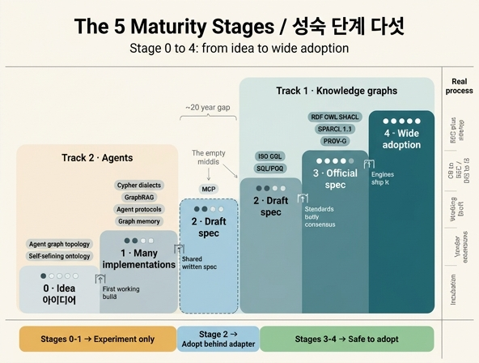

# `ex2_standard_watch.py`의 성숙 단계 다섯

**질문** `ex2_standard_watch.py`의 성숙 단계 다섯은 무엇인가?

**답** 아이디어, 구현이 여럿, 명세 초안, 공식 명세, 널리 채택이다.

원본 코드 한 줄이 전부입니다.

```python
STAGES = ["아이디어", "구현이 여럿", "명세 초안", "공식 명세", "널리 채택"]
```

그리고 이 리스트의 인덱스(0~4)가 표의 `단계` 칼럼입니다. 출력에서는 점으로 그려집니다.

```python
dots = "●" * (stage + 1) + "○" * (4 - stage)
```

즉 단계 0은 `●○○○○`, 단계 4는 `●●●●●`입니다. 채워진 점 하나가 "여기까지 왔다"는 뜻이고, 다섯 칸 사다리라고 보면 됩니다.

## 1. 각 단계가 뜻하는 것, 그리고 다음 칸으로 올라가는 조건

이 사다리의 핵심은 **각 칸 사이의 문턱이 서로 다른 종류의 사건**이라는 점입니다. 시간이 지나면 자동으로 올라가는 게 아니라, 칸마다 "이 일이 일어나야 넘어간다"가 정해져 있습니다.

| 단계 | 이름 | 뜻 | 다음 칸으로 넘어가려면 |
|---|---|---|---|
| 0 | 아이디어 | 논문·블로그·발표에만 있다. 부르는 말도 사람마다 다르다 | **동작하는 구현이 최소 하나** 나와야 한다 |
| 1 | 구현이 여럿 | 돌아가는 것이 둘 이상 있다. 그런데 서로 호환되지 않는다 | 구현자들이 **한자리에 모여 공통 문서**를 쓰기 시작해야 한다 |
| 2 | 명세 초안 | 글로 적힌 명세가 있다. 그런데 버전이 자주 바뀌고 하위 호환을 약속하지 않는다 | **표준화 기구의 합의 절차를 통과**해야 한다 (안정성 약속이 생긴다) |
| 3 | 공식 명세 | W3C·ISO 같은 곳에서 확정 문서가 나왔다 | **엔진·제품들이 실제로 구현**해서 시장에 깔려야 한다 |
| 4 | 널리 채택 | 명세도 있고, 여러 구현이 상호운용된다. 이제 "그냥 쓴다" | (끝. 여기서 남는 건 유지보수와 차기 버전) |

주목할 문턱은 **2 → 3**과 **3 → 4**입니다.

- **2 → 3은 "정치"가 필요합니다.** 명세를 쓰는 것과, 여러 이해관계자가 합의해서 "이제 안 바꾼다"고 약속하는 것은 다른 일입니다. 좋은 명세가 여기서 몇 년 멈춰 있는 일이 흔합니다.
- **3 → 4는 "구현"이 필요합니다.** 문서가 확정되어도 아무도 구현하지 않으면 죽은 표준입니다. 그래서 표에서 ISO GQL과 SQL/PGQ가 단계 3에 머물러 있고, 지켜볼 신호가 각각 "엔진들이 실제로 구현하는지", "DuckDB·상용 DB의 지원 범위"입니다. 문서는 이미 있는데 채택이 아직인 상태입니다.

반대 방향도 있습니다. 단계 1에서 **위로 못 가고 갈라지는** 경우입니다. Cypher 방언의 지켜볼 신호가 "GQL로 수렴하는지, 갈라지는지"인 게 그 뜻입니다. 사다리는 한 방향 보장이 아닙니다.

## 2. W3C / ISO 실제 절차와의 대응

이 다섯 칸은 실제 표준화 절차를 압축한 것입니다.

| 이 책의 단계 | W3C Process | ISO/IEC JTC 1 |
|---|---|---|
| 0 아이디어 | (Community Group / Incubation, 개인 제안) | PWI (Preliminary Work Item) |
| 1 구현이 여럿 | Working Group 결성 전후, 벤더별 독자 확장 | NP (New Proposal) 제출 전 단계 |
| 2 명세 초안 | **Working Draft (WD)** | **WD → CD (Committee Draft)** |
| 3 공식 명세 | **Candidate Rec. → Proposed Rec. → Recommendation (REC)** | **DIS → FDIS → IS (International Standard)** |
| 4 널리 채택 | REC + 복수의 상호운용 구현 (CR 단계의 implementation report가 요구하는 것) | IS + 시장 채택, 정기 systematic review |

특히 W3C의 **Candidate Recommendation**이 이 표의 3 → 4 문턱을 그대로 보여 줍니다. CR은 "명세는 다 썼으니 이제 구현해 보라"는 단계이고, W3C는 여기서 **독립적인 구현 두 개 이상이 각 기능을 상호운용**한다는 증거(implementation report)를 요구합니다. 즉 "널리 채택"은 표준화 기구도 별도로 확인하는 항목입니다.

ISO 쪽에서는 GQL(ISO/IEC 39075)이 2024년에 IS로 발행되었습니다. 문서는 3단계를 끝냈다는 뜻이고, 그래서 표에서 단계 3에 앉아 있으면서 지켜볼 신호가 구현 여부인 것입니다.

에이전트 쪽 항목들이 놓인 자리도 대응이 됩니다. MCP는 단계 2인데, 이는 W3C WD와 비슷한 자리입니다. 명세 문서(`2025-06-18` 같은 날짜 버전)는 있지만 표준화 기구의 합의 절차를 밟지 않았고, 그래서 지켜볼 신호가 "명세 버전이 얼마나 자주 바뀌는지"입니다. 버전이 자주 바뀌는 것 자체가 아직 3단계가 아니라는 증거입니다.

## 3. 12개 항목이 각 단계에 어떻게 분포하는가

`ITEMS`의 12개를 단계별로 세우면 이렇게 됩니다.

| 단계 | 항목 | 이 책 표시 |
|---|---|---|
| **4 널리 채택** (3개) | RDF · OWL · SHACL / SPARQL 1.1 / PROV-O | 표준 · 표준 · 표준 |
| **3 공식 명세** (2개) | ISO GQL / SQL/PGQ | 표준 · 표준 |
| **2 명세 초안** (1개) | MCP | 업계 표준 |
| **1 구현이 여럿** (4개) | Cypher 방언 / GraphRAG 계열 / 에이전트 간 프로토콜 / 그래프 기반 장기 기억 | 업계 표준 · 업계 표준 · 실험 · 실험 |
| **0 아이디어** (2개) | 에이전트 그래프 위상 이론 / 자기수정 온톨로지 | 실험 · 실험 |

표시별로 세면 `{표준: 5, 업계 표준: 3, 실험: 4}`이고, 코드가 계산하는 `[실험]` 4개의 평균 단계는 `(1 + 0 + 1 + 0) / 4 = 0.5 / 4`입니다.

이 분포에서 세 가지가 읽힙니다.

**(1) [표준] 다섯은 전부 단계 3 이상, [실험] 넷은 전부 단계 1 이하입니다.** 라벨과 단계가 거의 완벽하게 갈립니다. 라벨은 저자가 붙인 것이고 단계는 절차상의 사실인데, 둘이 일치한다는 건 라벨이 자의적이지 않다는 뜻입니다.

**(2) 단계 2가 비어 있습니다.** MCP 하나뿐입니다. 이게 예제의 출력이 말하는 "[표준]과 [실험] 사이가 비어 있는 게 이 표의 요점"입니다. 계곡이 있습니다. 1단계에 넷이 몰려 있는데 2단계로 올라간 것은 하나입니다. 즉 에이전트 쪽에는 구현은 많고 합의된 문서는 거의 없습니다.

**(3) 계곡이 트랙 경계와 겹칩니다.** 단계 3~4의 다섯은 전부 W3C나 ISO 것이고 트랙 1(지식 그래프) 쪽입니다. 단계 0~1의 여섯 중 넷은 트랙 2(에이전트) 쪽입니다. 그래서 저자는 "두 트랙의 성숙도가 20년쯤 차이 난다"고 쓰고, 3부는 「이렇게 하면 된다」로, 4부는 「저는 이렇게 하는데 확신은 없습니다」로 쓸 수밖에 없었다고 말합니다. 문체 차이가 취향이 아니라 이 표의 결과라는 것입니다.

## 4. 단계별로 도입 판단이 어떻게 달라지는가

이 사다리의 실용적 쓸모는 **"지금 이걸 도입해도 되나"의 답이 단계마다 다르다**는 것입니다.

| 단계 | 도입 판단 | 코드에 들어가는 방식 |
|---|---|---|
| **4 널리 채택** | **그냥 쓴다.** 명세도 구현도 안정적이다 | 직접 의존해도 된다. 추상화 계층을 두는 게 오히려 낭비다 |
| **3 공식 명세** | **채택 가능.** 문서가 확정됐으니 배운 게 버려지지 않는다 | 쓰되 구현 성숙도는 확인한다. 엔진 하나가 아직이면 그 엔진만 우회 |
| **2 명세 초안** | **조건부.** 쓸 만하지만 버전 업 비용을 예산에 넣어라 | **어댑터 뒤에 둔다.** 명세가 바뀌면 어댑터만 고치게 |
| **1 구현이 여럿** | **실험.** 특정 벤더에 묶인다고 가정하라 | 격리한다. 갈아탈 것을 전제로 경계를 좁게 |
| **0 아이디어** | **읽기만.** 도입 대상이 아니라 추적 대상이다 | 코드에 넣지 않는다. 개념만 참고 |

거칠게는 **단계 3~4면 채택 가능, 단계 0~1이면 실험**입니다. 단계 2는 그 사이의 판단 구간이고, 그래서 "명세 버전이 얼마나 자주 바뀌는지"라는 신호가 필요합니다. 버전이 안정되어 가면 3에 가깝게 취급하고, 자주 깨지면 1에 가깝게 취급하는 것입니다.

여기서 예제의 마지막 문장이 나옵니다.

> 「MCP 명세 버전이 얼마나 자주 바뀌는지」 같은 건 링크 하나 열면 5분에 확인된다.
> 그리고 그 5분이 「지금 이걸 도입해도 되나」의 답을 준다.

`ITEMS`의 네 번째 칼럼이 전부 "지켜볼 신호"인 이유가 이것입니다. 단계는 확정된 라벨이 아니라 **다시 재야 하는 값**입니다. 각 항목에 "무엇을 보면 단계가 바뀐 걸 알 수 있는지"가 붙어 있어서, 3년 뒤에 이 표를 다시 그릴 수 있게 되어 있습니다. 이는 `ex1_five_claims.py`의 `falsifier`/`watch` 칼럼과 같은 설계이고, 35장 전체를 관통하는 형식입니다. 주장에는 반증 조건을, 단계에는 관측 신호를 붙인다는 것입니다.

## 함께 보면 좋은 것

- `ex1_five_claims.py` — 주장마다 `falsifier`와 `watch`를 붙이는 같은 형식
- 35.7절 「표준은 어디까지 왔나」 — 이 예제가 대응하는 절
- W3C Process Document의 Candidate Recommendation과 implementation report 요구사항
- ISO/IEC 39075 (GQL), SPARQL 1.2 — 표에서 단계 3~4에 놓인 실제 문서들

## 인포그래픽


