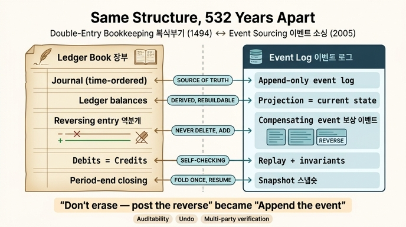

# 복식부기와 이벤트 소싱은 어떻게 같은 구조인가?

> **답**: "지우지 말고 반대 기입을 하라"가 "이벤트를 쌓아라"가 됐을 뿐이다.

## 이 카드가 나온 자리

35장 예제 3(`ex3_what_survives.py`)은 지난 50년(그리고 500년)의 것들을 **이름 / 문제 / 해법** 세 종류로 나눠서 나이를 셉니다. 그 표에서 제일 오래된 항목이 **복식부기(1494년, 532년)**이고, 상태는 "그대로 씀"입니다. 예제의 마지막 해설이 이 카드의 답 그 자체입니다.

```
«복식부기»가 이 표에서 제일 오래됐다. 532년이다.
그리고 30장의 이벤트 소싱이 그것과 같은 구조다.
「지우지 말고 반대 기입을 하라」가 「이벤트를 쌓아라」가 됐을 뿐이다.
```

같은 표에서 **이벤트 소싱**은 2005년, 상태는 역시 "그대로 씀"입니다. 즉 이 장이 하려는 말은 "회계가 소프트웨어의 조상"이라는 감상이 아니라, **해법은 이름을 바꿔 가며 재사용된다**는 관찰의 가장 극단적인 사례가 이 둘이라는 것입니다. 1494년 파치올리(Luca Pacioli)의 『산술집성』이 정리한 복식부기와, 2005년 파울러(Martin Fowler)가 이름 붙인 이벤트 소싱은 **같은 구조를 서로 다른 어휘로 적은 것**입니다.

## 항목별 대응 관계

| 복식부기 (1494) | 이벤트 소싱 (2005) | 공통 성질 |
|---|---|---|
| 분개장(journal) — 거래를 발생 순서대로 적는 원본 | 이벤트 로그(append-only log) — 사실을 발생 순서대로 쌓는 원본 | **추가 전용**. 한 번 적은 줄은 고치지 않는다 |
| 원장(ledger) / 시산표 — 계정별로 접어 놓은 잔액 | 프로젝션(projection) / 조회용 뷰 = 현재 상태 | **파생**. 지워도 원본에서 다시 만들 수 있다 |
| 반대 기입 = 역분개(reversing entry) | 보상 이벤트(compensating event) | 취소도 **새 줄을 추가**해서 한다 |
| 대차 균형 (차변 합 = 대변 합) | 리플레이 가능성 · 불변식 검사 | 언제든 다시 접어서 **검증할 수 있는 항등식**이 있다 |
| 결산 잔액 / 기말 마감 | 스냅숏(snapshot) | 앞부분을 한 번 접어 두고 **거기서부터 재생** |
| 감사 추적(audit trail) | 이력 조회 · 이시간 질의 · 해시 고리 | "그때 무엇이 참이었나"에 답할 수 있다 |

### 1. 분개장/원장 ↔ 이벤트 로그/프로젝션

복식부기의 핵심은 장부가 **두 층**이라는 점입니다. 분개장은 "언제 무슨 거래가 있었다"를 시간순으로 적는 원본이고, 원장은 그것을 계정별로 접어 놓은 결과입니다. 원장이 타 버려도 분개장이 있으면 다시 만들 수 있지만, 그 반대는 안 됩니다.

이벤트 소싱이 하는 말이 정확히 같습니다. 30장의 표현으로는 **"이벤트가 원본이고 상태는 파생"**입니다. 그리고 30장은 여기에 한 가지를 더 요구합니다 — 파생인지 아닌지는 **실제로 지우고 재생해 봐야** 안다는 것. 원장을 지워도 겁이 안 나는 상태가 되어야 진짜로 분개장이 원본입니다.

한 가지 더: 30장은 이벤트에 "바뀐 것"을 넣고 "바뀐 뒤 전체 상태"를 넣지 말라고 합니다. 이것도 분개와 같습니다. 분개장에는 "현금 잔액이 이제 130만 원"이 아니라 **"현금 30만 원 증가"**라는 증감을 적습니다. 증감을 적어야 무엇이 바뀌었는지 알 수 있고, 서로 다른 두 거래를 합칠 수도 있습니다.

### 2. 반대 기입(역분개) ↔ 보상 이벤트

여기가 이 카드의 문장이 직접 가리키는 대응입니다.

회계에서 잘못 적은 분개를 고치는 방법은 **지우개가 아닙니다.** 원래 분개의 차변·대변을 뒤집은 **역분개를 새로 한 줄 추가**하고, 그 다음에 올바른 분개를 또 한 줄 추가합니다. 결과 잔액은 맞고, 장부에는 "틀렸었다"와 "고쳤다"가 둘 다 남습니다. 옛날 회계 장부에서 잉크로 지운 흔적이 곧 부정의 증거로 취급되던 이유가 이것입니다.

이벤트 소싱에서 잘못된 이벤트를 처리하는 방법도 같습니다. 이벤트를 삭제하거나 수정하는 게 아니라 **보상 이벤트를 추가**합니다. `주문취소`, `배송철회`, `관계삭제` 같은 이벤트가 그것입니다. 22장의 되갚기(compensation) 설계가 여기에 붙습니다 — 되돌릴 수 없는 일(메일 발송, 결제, 외부 API 호출)에 대해서는 "취소"가 아니라 "되갚는 새 행위"를 정의해야 한다는 것. 회계도 마찬가지로 이미 나간 돈을 없던 일로 만들지 않고, **반대 방향의 거래로 상쇄**합니다.

35장 예제 3의 문장은 그래서 정확히 이 층을 짚습니다. 명령형 규칙 하나가 어휘만 바뀐 것입니다.

- 1494: **지우지 말고 반대 기입을 하라**
- 2005: **이벤트를 쌓아라**

### 3. 대차 균형 ↔ 리플레이 가능성·불변식

복식부기가 "복식(double-entry)"인 이유는 모든 거래를 두 번, 차변과 대변에 적기 때문입니다. 그 결과 **차변 총합 = 대변 총합**이라는 항등식이 항상 성립하고, 이 항등식이 깨지면 어딘가에 기입 오류가 있다는 신호가 됩니다. 즉 복식부기는 기록 형식이 아니라 **자체 검증(self-checking) 장치**입니다.

이벤트 소싱의 대응물은 **리플레이로 확인하는 불변식**입니다. 로그를 처음부터 다시 접었을 때 지금 프로젝션과 같은 값이 나오는가. 계좌 잔액이 음수가 되지 않는가. 같은 엔티티에 대한 이벤트 순번이 빠짐없이 이어지는가. 30장의 **해시 고리(hash chain)**는 이 검증을 한 단계 더 밀어붙인 것입니다 — 각 이벤트가 앞 이벤트의 해시를 품게 하면, 중간을 고치는 순간 고리가 안 맞아서 **막지는 못해도 표가 납니다.** 이것도 회계의 정신과 같습니다. 장부는 부정을 물리적으로 막지 못하지만, 부정을 **눈에 보이게** 만듭니다.

### 4. 결산 잔액 ↔ 스냅숏

이벤트 소싱의 실무적 걱정은 "10년 치를 매번 처음부터 재생하는 건 불가능하다"입니다. 답은 스냅숏 — 특정 시점의 접은 결과를 저장해 두고 거기서부터만 재생하는 것입니다. 30장은 스냅숏 **주기를 복구 목표 시간에서 거꾸로 계산**하라고 합니다. 재생 시간은 데이터 총량이 아니라 스냅숏 주기가 정한다는 것이죠.

회계에서는 이것을 500년 동안 **기말 마감과 이월**로 해 왔습니다. 회계 기간이 끝나면 잔액을 확정해 차기로 넘기고, 그 다음 기간은 이월 잔액에서 시작합니다. 창업 첫날의 분개부터 다시 더하지 않습니다. 그리고 분기 결산·월 결산으로 주기를 조절하는 것도 같은 트레이드오프입니다 — 자주 접으면 마감 비용이 늘고, 드물게 접으면 문제를 늦게 발견합니다.

### 5. 감사 추적 ↔ 이력 조회

30장이 이벤트 소싱을 도입하는 명분은 성능이 아니라 **답할 수 없는 질문들**입니다. "이거 원래 이랬나요?", "누가 언제 바꿨나요?", "사고 시점의 상태로 되돌려 보여 주세요." 현재 상태만 저장하면 "지금 뭐죠?"밖에 답할 수 없습니다.

이것이 회계 장부가 애초에 존재하는 이유이기도 합니다. 회계 장부의 1차 독자는 경영자가 아니라 **외부 검증자**(투자자, 세무 당국, 감사인)입니다. 이력이 없으면 감사가 불가능하고, 감사가 불가능하면 신뢰가 불가능합니다.

## 왜 둘 다 "덮어쓰기 금지"를 골랐나 — 공통 동기 세 가지

두 기법이 500년을 건너 같은 구조에 도달한 것은 우연이 아닙니다. **같은 세 가지 요구가 append-only를 강제**합니다.

1. **감사 가능성** — "지금 값이 맞다"만으로는 부족하고 "어떻게 이 값이 됐다"를 보여야 하는 상황. 덮어쓰기는 그 경로를 파괴합니다. 그리고 30장의 지적처럼 "기록도 남긴다"는 안 됩니다. 로그는 빠뜨려도 당장 아무 일이 안 생기니까요. **"기록이 곧 쓰기다"**로 뒤집어야 합니다. 복식부기는 이것을 강제하는 데 성공한 최초의 설계입니다 — 분개를 안 하면 잔액 자체가 안 나옵니다.

2. **되돌리기** — 잘못을 되돌려야 하는데, 되돌린 사실 자체도 기록되어야 하는 상황. "조용히 원상복구"는 되돌리기가 아니라 은폐입니다. 그래서 둘 다 취소를 **삭제가 아니라 추가**로 표현합니다(역분개 / 보상 이벤트). 부수적으로 이 선택은 되돌리기를 **결합 가능**하게 만듭니다. 취소의 취소도 그냥 또 한 줄 추가입니다.

3. **다자 검증** — 이해가 엇갈리는 여러 주체가 같은 기록을 놓고 다퉈야 하는 상황. 상인과 투자자, 회사와 감사인, 그리고 30장 이후의 맥락에서는 **사람과 에이전트**. 기록이 가변이면 "누가 바꿨나"가 결론이 안 나므로, 기록을 불변으로 두고 **모두가 같은 것을 다시 접어 보게** 하는 쪽이 싸게 끝납니다. 블록체인·거래 로그·git이 전부 같은 답에 도달한 이유입니다.

거꾸로 말하면, 이 셋 중 하나도 필요 없는 시스템에는 append-only가 과잉입니다. 이벤트 소싱이 "만능"이 아니라 **감사·되돌리기·다자 검증이 요구되는 자리의 해법**인 이유가 이것입니다.

## 30장 설계와의 연결, 그리고 이 카드가 35장에 있는 이유

30장은 이벤트를 쌓는 것만으로는 **아무것도 안 정해진다**고 못 박습니다. 실제 동작을 정하는 건 **어떻게 접을 것인가(리듀서)**이고, 그건 도메인 결정입니다. "마지막이 이긴다"를 기본값으로 두면 에이전트가 사람의 판단을 덮습니다.

회계에도 정확히 같은 층이 있습니다. 분개장이 있어도 **회계 정책**(수익 인식 시점, 감가상각 방법, 재고 평가 방법)을 정하지 않으면 재무제표가 나오지 않습니다. 같은 분개장으로 서로 다른 손익이 나올 수 있죠. 즉 **"원본을 append-only로 둔다"는 기록의 문제를 풀고, "어떻게 접는다"는 의미의 문제를 푼다** — 이 둘의 분리가 두 기법의 진짜 공통 구조입니다.

그리고 이 카드가 35장(틀렸을 가능성이 큰 주장을 지목하는 장)에 있는 게 중요합니다. 35장의 메시지는 세 층의 수명이 다르다는 것입니다.

| 층 | 수명 | 예 |
|---|---|---|
| 이름 | 몇 년 | "빅데이터", "프롬프트 엔지니어링", "에이전트 그래프 엔지니어링"(저자 확신 20%) |
| 문제 | 수십 년 | "무엇이 언제 참이었나"(1980~), "어디서 온 정보인가"(1990~) |
| 해법 | 수백 년 | **복식부기(1494), 이벤트 소싱(2005), 낙관적 잠금(1979)** |

저자가 자기 책의 주장 다섯 개에 평균 46%만 확신하면서도 이 대응 관계를 자신 있게 적는 이유가 여기 있습니다. **"이벤트 소싱"이라는 이름은 사라질 수 있어도, 그것이 푸는 문제(이력·감사·되돌리기)와 그 해법의 구조(append-only + 접기)는 532년을 버텼습니다.** 학습 우선순위도 그래서 문제 → 해법 → 이름 순입니다.

*참고: 이 장의 asset 마크다운에는 삽입할 이미지가 없어 원본 이미지는 첨부하지 않았습니다.*

## 인포그래픽


