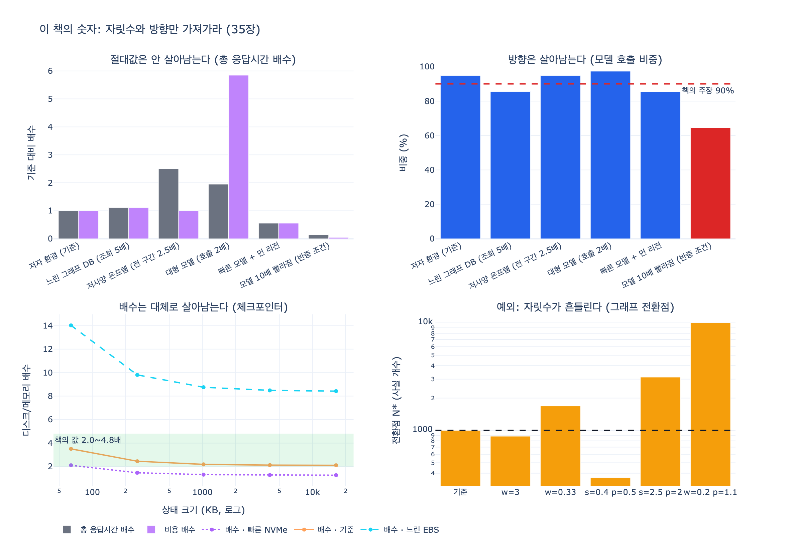

# 이 책의 숫자는 어떻게 써야 하는가?

> **답**: 자릿수와 방향으로만 쓴다. 자기 환경에서 다시 재는 데 하루면 된다.

35장 「한 장 요약」의 여섯 번째 항목이 이 문장이다.

> 이 책의 숫자는 자릿수와 방향으로만 쓰세요. 여러분 환경에서 다시 재는 데 하루면 됩니다. 하나만 고르라면 33장의 지배 구간입니다.

이 짧은 문장에 세 가지 판단이 접혀 있다. **왜 숫자를 아예 안 쓰지 않았는가**, **그 숫자 중 무엇이 이식되는가**, 그리고 **왜 하루면 된다고 말할 수 있는가**.

---

## 1. 숫자를 안 쓰면 안 되는 이유

`ex4_selfcheck.py`의 맺음말이 이 딜레마를 정면으로 적어 둔다.

> 이 책에 숫자가 200개 넘게 나오는데, 그중 여러분 시스템에 «그대로» 맞는 건 하나도 없다. 환경이 다르고, 규모가 다르고, 단가가 다르다.
>
> 그런데 숫자를 안 쓰면 「대체로 그렇습니다」가 되고, 그러면 판단할 근거가 없어진다. 그래서 제 숫자를 적었다.

여기서 나오는 선택이 「자릿수와 방향으로만」이다. 숫자를 **버리지도 않고**, **그대로 믿지도 않는** 중간 지점이다. 200개가 넘는 숫자를 다 옮겨 적을 수는 없으니, 옮겨 적을 수 있는 **형태**만 골라 가져가라는 뜻이다.

이건 35.1절 「주장을 반증 가능한 형태로」와 같은 태도다. 반증 조건을 쓸 수 없는 문장은 주장이 아니라 의견이니 다 뺐다는 것과, 이식되지 않는 절대값은 참고선으로만 쓰라는 것은 하나의 규율이다. **자기가 확신하는 만큼만 주장하라.**

---

## 2. 무엇이 이식되고 무엇이 이식되지 않는가

`ex4_selfcheck.py`가 「제 숫자의 쓸모」를 세 줄로 정리한다. 이 세 줄이 답의 핵심 근거다.

```
제 숫자의 쓸모는 «자릿수»와 «방향»이다.
  체크포인터가 2배쯤 느리다 → 여러분도 배수는 비슷할 것
  모델 호출이 95% 다      → 여러분도 90% 는 넘을 것
  그래프 전환점이 1,000개  → 여러분은 300일 수도 3,000일 수도
```

앞의 두 줄이 **환경이 달라도 비슷한 것**, 마지막 줄이 **자릿수가 흔들리는 것**이다. 그리고 바로 다음 문장이 이 구분을 표에 새겨 뒀다고 말한다.

> 마지막 것처럼 자릿수가 흔들리는 것들이 있다. 그건 주의 칸에 적었다.

즉 `ex4`의 표는 「책의 값」 칸과 「주의」 칸이 짝을 이룬다. **주의 칸은 그 값을 얼마나 믿어도 되는지를 알려주는 신뢰도 라벨**이다. 27장 행의 주의 칸이 「인건비·단가에 달렸다」인 것은 우연이 아니고, 그 값만 본문에서 「300일 수도 3,000일 수도」로 다시 언급되는 것도 우연이 아니다.

### 왜 어떤 것은 살아남는가 — 약분되는 값과 약분되지 않는 값

**비중·배수는 무차원량이라 공통 배수가 약분된다.** 구간 시간을 $t_i$, 환경 배수를 $c$라 하면

$$T(c) = c\sum_i t_i, \qquad \text{share}_i(c) = \frac{c\,t_i}{c\sum_j t_j} = \frac{t_i}{\sum_j t_j}$$

절대 시간은 $c$에 비례하지만 비중은 $c$와 무관하다. 33장의 94.8%가 이 형태다. `expy.py`에서 하드웨어·모델 속도·리전·단가를 흔들어 여섯 환경을 만들면

- 절대 총 응답시간: **0.15x ~ 2.50x** (약 17배 폭)
- 절대 비용: **0.04x ~ 5.84x** (약 133배 폭)
- 모델 호출 비중: **85.4% ~ 97.3%** (반증 조건 환경 제외)
- 1위 구간이 「모델 호출」인 환경: **6/6**

절대값은 두 자릿수로 흔들리는데 「모델 호출이 압도적 1위」라는 방향은 전부 유지된다. **책의 4,430ms는 못 가져가지만 「모델 호출이 지배한다」는 가져갈 수 있다.**

21장 체크포인터 배수(2.0~4.8배)도 같은 계열이다. 상태 크기와 스토리지를 함께 흔들면 절대 지연은 2.7ms에서 2,760ms까지 **1,000배** 폭으로 흔들리지만, 디스크/메모리 배수는 좁은 구간에 머문다. 완전한 상수는 아니다 — fsync 같은 크기 무관 고정 오버헤드 $f$ 때문에

$$\text{ratio}(n) = \frac{a_d n + f}{a_m n} = \frac{a_d}{a_m} + \frac{f}{a_m n}$$

작은 상태에서 배수가 커진다. 그래서 주의 칸이 「상태 크기별로 재라」다. **주의 칸은 그 지표가 어느 축에 대해 흔들리는지를 지목한다.**

### 왜 어떤 것은 살아남지 못하는가 — 차가 분모에 들어가는 값

27장 그래프 전환점은 구조가 다르다. 「사실 몇 개부터 그래프가 싼가」는 두 방식의 **단가 차이**를 분모에 놓는다.

$$N^{*} = \frac{S \cdot w \cdot s}{u_{\text{doc}}\,w - u_{\text{graph}}\,p}$$

($w$ 인건비 배수, $s$ 스키마 설정 난이도, $p$ 인프라 단가 배수)

여기서는 공통 배수가 약분되지 않는다. `expy.py`로 계산해 보면 결과가 직관을 배신한다.

| 조건 | 전환점 $N^{*}$ | 기준 대비 |
|---|---|---|
| 저자 환경 (기준) | 1,000 | 1.00x |
| 인건비 3배 (w=3) | 882 | 0.88x |
| 인건비 1/3 (w=0.33) | 1,684 | 1.68x |
| 스키마 단순 + 단가 싸다 (s=0.4, p=0.5) | 364 | 0.36x |
| 스키마 복잡 + 단가 비싸다 (s=2.5, p=2) | 3,125 | 3.13x |
| 싼 인건비 + 비싼 그래프 (w=0.2, p=1.1) | 10,000 | 10.00x |
| 더 비싼 그래프 (w=0.2, p=1.3) | ∞ (안 싸짐) | — |

- 인건비를 **3배로 올리면 전환점이 내려간다**(1,000 → 882). 방향이 직관과 반대다.
- 인건비를 **1/3로 낮추면 전환점이 올라간다**(1,000 → 1,684).
- 분모가 0에 붙으면 $N^{*}$가 **10,000까지 폭발**하고, 음수가 되면 **그래프가 아무리 커도 안 싸진다** — 자릿수가 아니라 **방향 자체가 없어지는** 경우다.

유한한 값만 봐도 364에서 10,000까지, 백 단위와 만 단위를 넘나든다. 책이 「300일 수도 3,000일 수도」라고 적은 것은 겸양이 아니라 **모형의 성질**이다.

**정리하면 이렇다.**

| 지표의 모양 | 환경을 옮기면 | 쓰는 법 |
|---|---|---|
| 비중 $t_i/\sum t_j$ | 공통 배수가 약분됨 | 자릿수·방향 그대로 가져간다 |
| 배수 $a/b$ | 대체로 유지, 고정 오버헤드만큼 흔들림 | 「몇 배쯤」까지만 가져간다 |
| 차가 분모인 값 $S/(u_1-u_2)$ | 자릿수가 튀고 부호가 뒤집히기도 함 | 반드시 다시 잰다 |

---

## 3. 왜 「하루면 된다」고 말할 수 있는가

책에 숫자가 200개 넘게 나오는데 하루가 가능한 이유는, **다시 재야 하는 것이 200개가 아니라 11개**이기 때문이다. `ex4_selfcheck.py`의 `MEASURE` 목록이 정확히 그 11개다.

| 장 | 지표 | 무엇을 재나 | 책의 값 | 주의 |
|---|---|---|---|---|
| 21장 | 체크포인터 배수 | 메모리 대비 디스크 체크포인터 지연 | 2.0~4.8배 | 상태 크기별로 재라 |
| 22장 | 재시도 봉우리 | 동시 실패 뒤 구간별 최대 도착 요청 | 흔들기로 200→83 | 실패율부터 재라 |
| 23장 | 승인 문턱 | 검토 시간 ÷ 담당자 용량 | 70% 이하 | 용량은 조직마다 다르다 |
| 24장 | 사실 보존율 | 줄이기 뒤에 살아남는 «필요한 사실» | 요약 72% / 오프로딩 100% | 사후 계측으로 재라 |
| 25장 | 팬아웃 이득 천장 | 직렬 대비 병렬 배수 | 1.57배 | 합류 값에 달렸다 |
| 27장 | 그래프 전환점 | 사실 몇 개부터 그래프가 싼가 | 1,000개 | **인건비·단가에 달렸다** |
| 28장 | 드리프트 | 종류별 비율 변화 | 제약 20%→9% | 종류 분류부터 하라 |
| 31장 | 잠금 갈림길 | 낙관/비관이 뒤집히는 충돌률 | 15~30% | 판단 시간에 달렸다 |
| 32장 | 가장 긴 주기 | 제일 드물게 도는 잡의 주기 | 730일 | 크론을 파싱해서 계산하라 |
| 33장 | 지배 구간 | 응답 시간에서 모델 호출 비중 | 94.8% | **이게 제일 먼저 잴 것** |
| 34장 | 구조적 k | 같은 이웃 모양을 가진 사람 수 | 1 | 속성 k 와 따로 재라 |

> 총 11개. 전부 재는 데 대략 하루면 된다.

「하루」는 이 목록이 **닫혀 있다**는 사실에서 나오는 숫자다. 각 항목은 이미 「무엇을 재나」가 한 줄로 정해져 있어서, 무엇을 측정할지 설계하는 시간이 들지 않는다. 그리고 32장·34장처럼 측정이 아니라 **계산**(크론 파싱, 이웃 모양 세기)인 항목도 있다.

### 하나만 고르라면

> 그리고 위에서 하나만 고르라면 «33장 지배 구간»이다. 이걸 안 재고 시작한 성능 작업은 대개 헛일이 된다. 재는 데 30분이면 되고, 안 재면 3주를 쓴다.

11개 중 우선순위 1위가 있다는 것이 이 답의 실용적인 부분이다. 33장 지배 구간을 먼저 재는 이유는 그것이 **다른 모든 최적화의 상한을 정하기** 때문이다. 모델 호출이 95%를 차지하면 나머지 5%를 0으로 만들어도 응답 시간은 5%밖에 줄지 않는다(암달의 법칙). **30분 대 3주**는 이 비대칭을 가격으로 환산한 것이다.

---

## 4. 이 답이 35장 전체와 어떻게 맞물리나

- **`ex1` — 반증 가능성.** 「모델 호출이 90%를 차지한다」의 확신은 35%뿐이고, 반증 조건은 「모델 지연이 10분의 1이 되면 60% 아래로 내려간다」다. `expy.py`에서 그 환경을 실제로 넣으면 비중이 **64.6%** 로 떨어져 90% 주장이 깨진다. 즉 **방향(1위 구간)은 그래도 살아남지만 자릿수 주장은 죽는다.** 자릿수·방향조차 영원하지 않다는 뜻이고, 그래서 「분기마다 구간별 시간을 다시 잰다」가 지켜볼 것으로 붙어 있다.
- **`ex3` — 이름·문제·해법의 수명.** 이름은 몇 년, 문제는 수십 년, 해법은 수백 년이다. 숫자는 이 스펙트럼에서 **이름 쪽에 가장 가깝다** — 환경과 함께 늙는다. 반면 「어느 구간이 지배하는가를 먼저 재라」는 **해법** 쪽이다. 그래서 절대값은 버리고 측정 절차를 가져가는 것이 옳다.
- **35장 마지막 문장.** 「재 보시고, 다르게 나오면 그쪽이 맞습니다. 이 책의 어느 문장보다 여러분 환경에서 잰 값이 정확합니다.」 이 답의 두 번째 절반(「하루면 된다」)은 그 권한 이양을 실행 가능하게 만드는 장치다. 재는 비용이 하루라면, 책을 믿을 이유가 없어진다.

---

## 시각화



네 패널이 각각 「이식되지 않는 것 / 이식되는 것 / 대체로 이식되는 것 / 예외」다.

- **좌상**: 환경을 흔들면 절대 총시간과 절대 비용이 0.15x~2.50x, 0.04x~5.84x로 흔들린다.
- **우상**: 같은 환경들에서 모델 호출 비중은 85~97%에 머문다. 빨간 막대는 반증 조건(모델 10배)으로, 여기서만 90% 선이 깨진다.
- **좌하**: 체크포인터 배수는 상태 크기가 커지면 책의 값 구간(초록 띠)에 수렴한다. 느린 EBS에서는 배수 자체가 위로 이탈한다.
- **우하**: 그래프 전환점은 로그 축에서 백 단위부터 만 단위까지 퍼진다. 검은 점선이 책의 1,000개다.
