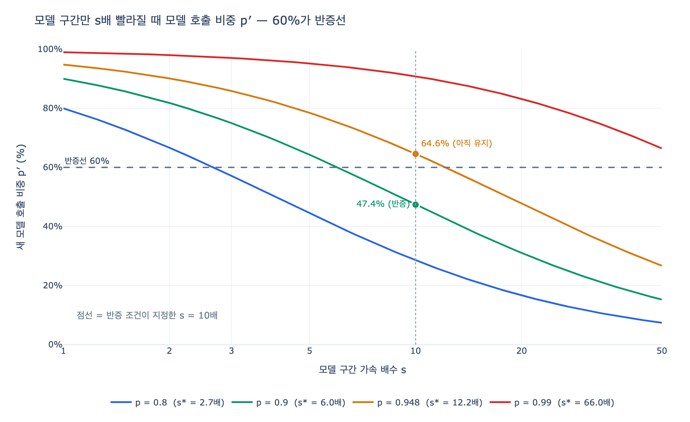

# 주장 1의 반증 조건은 무엇인가?

## 답

> **같은 작업의 모델 지연이 10분의 1이 되면 모델 호출 비중이 60% 아래로 내려간다.**
> **분기마다 구간별 시간을 다시 재야 한다.**

앞 문장이 반증 조건(`falsifier`)이고, 뒤 문장이 지켜볼 것(`watch`)입니다.

---

## 1. 주장 1이 무엇인지부터

35장은 이 책의 핵심 주장 다섯 개를 "무엇이 참이면 이게 틀리는가"의 형태로 다시 씁니다.
그 중 첫 번째, 그리고 **저자가 제일 빨리 틀릴 것 같다고 지목한** 주장입니다.

`code/ex1_five_claims.py`의 원문:

```python
dict(
    n=1,
    claim="모델 호출이 응답 시간의 90% 넘게 차지한다",
    chapter="33장",
    falsifier="같은 작업의 모델 지연이 10분의 1이 되면 60% 아래로 내려간다",
    watch="분기마다 구간별 시간을 다시 잰다",
    confidence=0.35,
    note="지난 2년 추세가 이대로면 3년 안에 뒤집힌다",
),
```

| 칸 | 값 |
|---|---|
| 주장 | 모델 호출이 응답 시간의 90% 넘게 차지한다 |
| 근거 장 | 33장 (지배 구간) — 실측 **94.8%** |
| 반증 조건 | 모델 지연이 1/10이 되면 비중이 60% 아래로 |
| 지켜볼 것 | 분기마다 구간별 시간 재측정 |
| 확신 | **35%** (다섯 중 두 번째로 낮음) |

다섯 주장의 평균 확신은 46%인데, 주장 1은 35%입니다. 저자가 "제일 빨리 틀릴 것 같은 건
「모델 호출이 90%를 차지한다」입니다. 모델이 빨라지고 있어요"라고 쓴 게 이 항목입니다.

### 왜 반증 조건이 있어야 하나

35.1절의 문제의식이 이겁니다.

> 반증 조건을 못 쓰는 것은 주장이 아니라 **의견**입니다. 이 책에서 그리로 빠진 문장은 전부 뺐습니다.

「그래프가 중요하다」는 무엇이 참이면 틀리는지 말할 수 없어서 반증 조건을 못 씁니다.
반면 「모델 호출이 90%를 넘는다」는 **숫자와 문턱과 측정 방법**이 다 붙어 있어서
누구든 자기 환경에서 재 보고 "아니오"라고 말할 수 있습니다. 그래서 주장입니다.

---

## 2. 산수 — 이건 암달의 법칙과 똑같습니다

여기가 이 카드의 핵심입니다. **"모델이 10배 빨라지면 비중이 9%가 되겠지"가 아닙니다.**

전체 응답 시간을 1로 정규화하고 두 조각으로 나눕니다.

- 모델 호출 구간: $p$ (책의 실측은 0.948, 주장은 "0.9 초과")
- 모델이 아닌 구간: $1-p$ — 그래프 조회, 직렬화, 네트워크 왕복, 정책 검사, 로깅

모델 구간만 $s$배 빨라지면 새 전체 시간과 새 비중은 이렇게 됩니다.

$$T' = \frac{p}{s} + (1-p), \qquad p' = \frac{p/s}{\;p/s + (1-p)\;}$$

**분모가 같이 줄어드는 게 요점입니다.** 모델 구간이 짧아지면 전체도 짧아지므로,
비중은 $p/s$까지 떨어지지 않고 훨씬 완만하게 떨어집니다.

$p = 0.9$, $s = 10$을 넣어 봅니다.

$$\frac{p}{s} = \frac{0.9}{10} = 0.09, \qquad 1-p = 0.1$$

$$p' = \frac{0.09}{0.09 + 0.1} = \frac{0.09}{0.19} = 0.4737 = \mathbf{47.4\%}$$

| | 모델 구간 | 모델 아닌 구간 | 전체 | 모델 비중 |
|---|---|---|---|---|
| 이전 | 0.900 | 0.100 | 1.000 | **90.0%** |
| 모델만 10배 빨라진 뒤 | 0.090 | 0.100 | 0.190 | **47.4%** |

47.4%는 60%를 확실히 밑돕니다. 그래서 반증 조건이 성립합니다.

### 곁가지로 나오는 사실: 전체는 10배가 아니라 5.3배

$$\text{전체 단축} = \frac{1}{T'} = \frac{1}{0.19} = 5.26\text{배}$$

이게 암달의 법칙 그 자체입니다. **모델을 10배 빠르게 만들어도 전체 응답 시간은 5.3배밖에
안 짧아집니다.** 남은 10%가 하한을 만들기 때문입니다. $s \to \infty$ 로 보내도 전체 단축은
$1/(1-p)$, 즉 $p=0.9$면 10배, $p=0.948$면 19.2배가 천장입니다.

그리고 이건 반증 조건의 이면입니다. 주장 1이 반증되는 순간이란 곧
**"이제 모델 말고 다른 구간도 봐야 하는 시점"** 이라는 뜻입니다.

---

## 3. 임계 가속 $s^\*$ 역산 — 몇 배 빨라지면 60%를 깨나

$p' = q$ 가 되는 $s$를 풀면

$$\frac{p/s}{p/s + (1-p)} = q \;\Longrightarrow\; s^{*} = \frac{p\,(1-q)}{q\,(1-p)}$$

$q = 0.6$을 대입하면 아주 짧아집니다.

$$s^{*} = \frac{2p}{3\,(1-p)}$$

| $p$ | $s^{*}$ (60% 문턱) | $s=10$일 때 $p'$ | 판정 |
|---|---|---|---|
| 0.80 | 2.67배 | 28.6% | 반증 |
| **0.90** | **6.0배** | **47.4%** | **반증** |
| 0.948 (33장 실측) | 12.15배 | 64.6% | 아직 유지 |
| 0.99 | 66.0배 | 90.8% | 아직 유지 |

여기서 두 가지를 읽어야 합니다.

**(1) 10배는 애매한 자리에 놓인 숫자입니다.**
주장의 문면("90% 넘게") 그대로 $p=0.9$로 보면 $s^{*}=6$이라 10배는 여유 있게 넘습니다.
그런데 33장의 실측값 94.8%로 보면 $s^{*}=12.2$라서 **10배로는 아직 안 깨집니다(64.6%)**.
같은 10배인데 판정이 갈립니다. 반증 조건에 "분기마다 다시 재라"가 붙어야 하는 이유가 이겁니다.

**(2) $p$에 대해 극도로 민감합니다.**
0.90 → 0.948, 4.8%p 올라가는데 임계 가속은 6배 → 12.2배로 **두 배**가 됩니다.
$s^{*}$가 $1-p$의 역수에 비례하기 때문입니다. 90%와 95%는 감각상 비슷해 보여도
반증 판정에서는 전혀 다른 세계입니다. **그래서 자기 환경의 $p$를 먼저 재야 합니다.**

---

## 4. 왜 60%가 반증선으로 쓸 만한가

60%는 물리 상수가 아닙니다. 저자가 고른 값입니다. 그래도 판정선으로 쓸 만한 성질이 셋 있습니다.

### (1) "지배 구간"이라는 말이 성립하는 마지막 지점

33장의 실무 결론은 「성능 작업은 지배 구간부터, 즉 모델 호출부터」입니다.

- 90% — 모델만 보면 됩니다. 나머지는 노이즈입니다.
- 60% — 아직 제일 큰 조각이지만, 나머지 40%도 무시할 수 없습니다.
- 50% 아래 — 모델이 더 이상 "지배"하지 않습니다. 조회·직렬화도 같이 봐야 합니다.

60%는 그 경계에 있어서, **넘어가면 33장의 조언 자체가 바뀌는** 자리입니다.
반증선은 "숫자가 조금 달라진 지점"이 아니라 **"결론이 뒤집히는 지점"** 에 놓아야 합니다.

### (2) 측정 잡음보다 훨씬 큰 간격

90%에서 60%는 30%p 차이입니다. 구간별 시간 측정은 분기마다 몇 %p씩 흔들립니다
(트래픽 패턴, 캐시 적중률, 배포 시점). 문턱이 잡음보다 한참 커야
"이게 추세인가 그냥 흔들림인가"를 매번 따지지 않아도 됩니다.

문턱을 90% 그대로 두면 어떻게 되는지 보면 이 점이 분명해집니다.

| 반증선 $q$ | $p=0.948$ 기준 필요한 $s^{*}$ |
|---|---|
| 90% | 2.03배 |
| 80% | 4.56배 |
| 70% | 7.81배 |
| **60%** | **12.15배** |
| 50% | 18.23배 |

문턱을 90%로 두면 **모델이 두 배 빨라지기만 해도 "틀렸다"** 가 나옵니다. 너무 예민합니다.
반대로 50%로 두면 18배를 요구해서 반증이 너무 늦게 걸립니다.
60%는 "의미 있는 변화만 잡고, 잡음은 안 잡는" 폭입니다.

### (3) 한쪽으로만 넘는 선 (단조성)

$p'$는 $s$에 대해 **단조 감소**합니다. 한 번 60% 아래로 내려가면 모델이 다시 느려지거나
모델 아닌 구간이 더 빨라지지 않는 한 되돌아오지 않습니다.
왔다갔다 하는 선은 반증 조건으로 못 씁니다. "이 값이 이렇게 되면 틀린다"가
한 번 성립하고 끝나야 판정이 의미를 갖습니다.

---

## 5. 왜 분기마다 다시 재야 하나

반증 조건은 **판정만 하는 장치가 아니라, 언제 판정이 뒤집힐지 미리 보여 주는 장치**입니다.
그런데 위 계산은 전부 $p$와 $s$를 안다고 가정했습니다. 실제로는 둘 다 모릅니다.

- $p$는 계속 움직입니다 — 모델 교체, 컨텍스트 길이 변화, 조회 경로 변경, 캐시 도입
- $s$는 "지난 분기 대비 모델 구간이 몇 배 짧아졌나"로만 알 수 있습니다

그래서 실무에서 재는 것은 $s$가 아니라 **분기별 구간 시간 그 자체**이고,
$p'$는 그 측정값에서 곧바로 나옵니다.

모델 구간이 분기마다 30% 짧아지고 모델 아닌 구간(105ms)은 그대로일 때:

| 분기 | 모델(ms) | 기타(ms) | 전체(ms) | 모델 비중 | 판정 |
|---|---|---|---|---|---|
| Q0 | 1900.0 | 105.0 | 2005.0 | 94.8% | 유지 |
| Q1 | 1330.0 | 105.0 | 1435.0 | 92.7% | 유지 |
| Q2 | 931.0 | 105.0 | 1036.0 | 89.9% | 유지 |
| Q3 | 651.7 | 105.0 | 756.7 | 86.1% | 유지 |
| Q4 | 456.2 | 105.0 | 561.2 | 81.3% | 유지 |
| Q5 | 319.3 | 105.0 | 424.3 | 75.3% | 유지 |
| Q6 | 223.5 | 105.0 | 328.5 | 68.0% | 유지 |
| **Q7** | **156.5** | **105.0** | **261.5** | **59.8%** | **반증** |
| Q8 | 109.5 | 105.0 | 214.5 | 51.1% | 반증 |

여기서 세 가지가 보입니다.

**(1) 비중은 초반에 거의 안 움직입니다.**
분기마다 30%씩 빨라지는데도 Q6까지 68%로 여전히 지배 구간입니다.
**한 분기만 재면 "아무 일도 없다"로 보입니다.** 한 번 재고 끝내면 안 되는 이유입니다.

**(2) 그러다 한 번에 넘어갑니다.**
Q6 → Q7에서 68% → 59.8%. 추세를 쌓아 두고 보지 않으면 **넘어간 뒤에 알게 됩니다.**
그러면 그 사이 몇 분기의 성능 작업이 이미 잘못된 구간을 향했던 겁니다.

**(3) 누적 가속 12.1배 — 앞에서 역산한 $s^{*}=12.15$와 정확히 맞습니다.**
$1/0.7^7 = 12.1$. 이론 계산과 시뮬레이션이 같은 답을 냅니다.

그리고 Q8을 보세요. 전체 지연이 214.5ms인데 그 중 105ms가 모델이 아닌 구간입니다.
**모델을 무한히 빠르게 해도 105ms 아래로는 못 내려갑니다.** 반증 조건이 걸리는 순간부터는
$1-p$를 줄이는 일이 진짜 일이 됩니다.

---

## 6. 다섯 주장 중에서의 위치

| # | 주장 | 반증 조건 | 확신 |
|---|---|---|---|
| **1** | **모델 호출이 응답 시간의 90% 넘게 차지** | **모델 지연 1/10 → 비중 60% 아래** | **35%** |
| 2 | 프롬프트 인젝션은 프롬프트 층에서 못 막는다 | 지시와 데이터를 구조적으로 나눈 모델이 나오면 | 55% |
| 3 | 에이전트가 넓힌 그래프는 관문 없이 못 쓴다 | 추출 정확도 99.9% → 관문 넷 중 셋 불필요 | 70% |
| 4 | 지식 그래프와 에이전트 상태는 따로 | 그래프 DB 쓰기 성능이 키-값 수준이 되면 | 50% |
| 5 | 「에이전트 그래프 엔지니어링」이 자리를 잡는다 | 3년 뒤 아무도 이 말을 안 쓰면 | 20% |

주장 1이 35%로 낮은 이유는 **추세가 이미 보이기 때문**입니다.
`note`에 저자가 직접 써 뒀습니다 — "지난 2년 추세가 이대로면 3년 안에 뒤집힌다".
12배는 3년 안에 닿을 거리입니다.

반대로 주장 3(70%)이 가장 오래 갈 것으로 본 이유는 **관문 중 하나(이름 정규화)가
추출 정확도와 무관**하기 때문입니다. 정확도가 99.9%가 되어도 「같은 것을 같은 이름으로
부르는 문제」는 다른 문제라서 남습니다. 반증 조건이 겨냥하는 변수 하나로
전부 무너지지 않는 주장이 오래 갑니다.

---

## 7. 실전에서 어떻게 쓰나

35.8절과 `ex4_selfcheck.py`가 이 반증 조건의 실행 지침입니다.

```
33장  지배 구간   응답 시간에서 모델 호출 비중   94.8%   이게 제일 먼저 잴 것
```

- 재는 데 **30분**, 안 재면 **3주**를 씁니다.
- 책의 숫자는 **자릿수와 방향으로만** 쓰세요. "모델 호출이 95%다 → 여러분도 90%는 넘을 것"
- 11개 재측정 항목 중 하나만 고르라면 **33장의 지배 구간**입니다.

체크리스트:

1. 지금의 $p$를 잰다 (구간별 시간 계측 — 모델 호출 / 조회 / 직렬화 / 네트워크 / 기타)
2. $s^{*} = 2p / (3(1-p))$ 로 내 환경의 임계 가속을 구한다
3. 분기마다 1번을 다시 하고, 모델 구간 시간의 **비율 변화**를 누적 기록한다
4. 누적 가속이 $s^{*}$에 가까워지면 성능 작업의 초점을 $1-p$ 쪽으로 옮길 준비를 한다

---

## 한 줄 정리

**반증 조건은 "모델 지연이 1/10 → 비중 60% 미만"이고, 산수는 암달의 법칙과 같아서
$p=0.9$에서 10배면 $0.09/0.19 = 47.4\%$로 문턱을 깬다. 60%는 지배 구간이라는 말이
성립하는 마지막 경계이자 측정 잡음보다 큰 간격이고 되돌아오지 않는 선이라서 판정선으로
쓸 만하다. 다만 $p$가 계속 변하고 $p'$는 초반에 거의 안 움직이다 한 번에 넘어가므로,
분기마다 구간별 시간을 다시 재지 않으면 넘어간 뒤에 알게 된다.**

## 시각화


