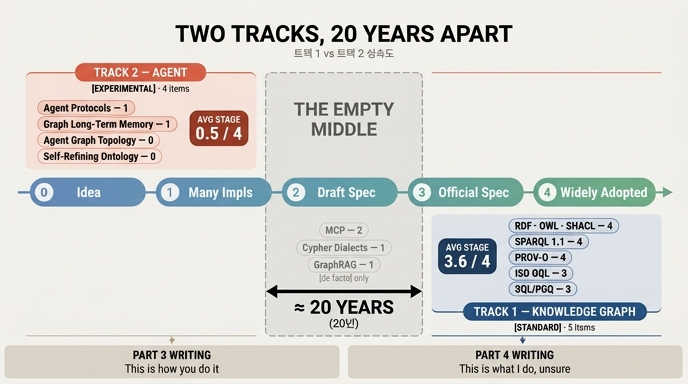

# 트랙 1과 트랙 2의 성숙도 차이 — 20년

## 한 줄 답

**약 20년.** 35.7절 「표준은 어디까지 왔나」의 표(`ex2_standard_watch.py`)에서 **[표준] 다섯은 전부 트랙 1(지식 그래프)**, **[실험] 넷은 전부 트랙 2(에이전트)** 로 갈라진다. 그래서 3부는 「이렇게 하면 된다」로 쓸 수 있었고, 4부는 「저는 이렇게 하는데 확신은 없습니다」로 쓸 수밖에 없었다.

## 성숙도 눈금 — 5단계

`ex2`는 항목을 0~4의 다섯 단계로 매긴다.

| 단계 | 이름 | 뜻 |
|---|---|---|
| 0 | 아이디어 | 논문·블로그에만 있다. 공통 용어조차 없다 |
| 1 | 구현이 여럿 | 돌아가는 것이 여러 개 있지만 서로 안 맞는다 |
| 2 | 명세 초안 | 문서화된 초안이 있고 버전이 자주 바뀐다 |
| 3 | 공식 명세 | W3C REC·ISO 표준으로 확정됐다 |
| 4 | 널리 채택 | 명세도 있고 구현도 널려 있다 |

## 표를 트랙별로 다시 세우면

### 트랙 1 — 지식 그래프 (W3C · ISO 계열)

| 항목 | 단계 | 이 책 표시 | 지켜볼 신호 |
|---|---|---|---|
| RDF · OWL · SHACL | 4 (널리 채택) | [표준] | 이미 안정. 큰 변화 없을 것 |
| SPARQL 1.1 | 4 (널리 채택) | [표준] | 1.2 작업이 진행 중 |
| PROV-O | 4 (널리 채택) | [표준] | 에이전트 계보에 실제로 쓰이는지 |
| ISO GQL | 3 (공식 명세) | [표준] | 엔진들이 실제로 구현하는지 |
| SQL/PGQ | 3 (공식 명세) | [표준] | DuckDB · 상용 DB 의 지원 범위 |

**평균 단계 3.6 / 4.**

### 트랙 2 — 에이전트 (실험 계열)

| 항목 | 단계 | 이 책 표시 | 지켜볼 신호 |
|---|---|---|---|
| 에이전트 간 프로토콜 | 1 (구현이 여럿) | [실험] | 구현이 둘 이상 상호운용되는지 |
| 그래프 기반 장기 기억 | 1 (구현이 여럿) | [실험] | 벤치마크가 생기는지 |
| 에이전트 그래프 위상 이론 | 0 (아이디어) | [실험] | 논문에 공통 용어가 생기는지 |
| 자기수정 온톨로지 | 0 (아이디어) | [실험] | 운영 사례가 공개되는지 |

**평균 단계 0.5 / 4.**

### 사이에 걸친 것들 — [업계 표준] 셋

| 항목 | 단계 | 지켜볼 신호 |
|---|---|---|
| MCP | 2 (명세 초안) | 명세 버전이 얼마나 자주 바뀌는지 |
| Cypher 방언 | 1 (구현이 여럿) | GQL 로 수렴하는지, 갈라지는지 |
| GraphRAG 계열 | 1 (구현이 여럿) | 공통 평가 기준이 생기는지 |

> **이 표의 요점은 [표준]과 [실험] 사이가 비어 있다는 것이다.** 3.6과 0.5 사이 — 즉 단계 2~3 구간 — 에 있는 것은 [업계 표준] 셋뿐이고, 그 셋 중 공식 명세(3단계)에 도달한 것은 하나도 없다.

## 왜 「20년」인가

단계 차이(3.6 - 0.5 = 3.1단계)를 **연도**로 환산해 보면 20년이라는 숫자가 나온다.

| 트랙 1 | 표준화 시점 | 트랙 2 | 등장 시점 |
|---|---|---|---|
| RDF 1.0 | 1999 / 2004 | MCP | 2024 |
| OWL | 2004 | 에이전트 간 프로토콜(A2A 등) | 2025 |
| SPARQL 1.0 | 2008 | 그래프 기반 장기 기억 | 2023~ |
| PROV-O | 2013 | 자기수정 온톨로지 | 2024 (arXiv) |
| SHACL | 2017 | 에이전트 그래프 위상 이론 | 아직 논문 단계 |

트랙 1의 핵심 명세들은 2004~2017년에 확정됐고, 트랙 2의 것들은 2023~2025년에 이름이 붙기 시작했다. 확인 시점(2026년 8월)에서 **한쪽은 20년 넘게 굳어 온 것이고, 다른 쪽은 2년쯤 된 것**이다. 「20년쯤」은 자릿수로 읽어야 하는 어림값이다(35.8절의 원칙: 이 책의 숫자는 자릿수와 방향으로만 쓰라).

## 이 차이가 낳은 결과 — 문체가 갈린 이유

성숙도 차이는 단순한 관찰이 아니라 **이 책의 서술 방식을 결정한 제약**이다.

| | 3부 (트랙 1) | 4부 (트랙 2) |
|---|---|---|
| 근거 | 공식 명세 · 안정된 구현 | 논문 몇 편 · 저자 경험 |
| 문체 | 「이렇게 하면 된다」 | 「저는 이렇게 하는데 확신은 없습니다」 |
| 3년 뒤 | 큰 변화 없을 것 | 위로 올라갈 수도, 이름이 바뀔 수도 |

## 3년 뒤 다시 그릴 때 — 반증 조건

35장 전체의 논지대로, 이 주장도 반증 가능한 형태로 적혀 있다.

- **위로 올라간다면**: 아래쪽 넷이 단계 2~3으로 이동한다 → 격차가 줄고, 4부를 3부 문체로 다시 쓸 수 있다.
- **그대로라면**: 격차가 유지된다 → 이 장의 진단이 맞았다.
- **이름이 바뀐다면**: 항목 자체가 사라지고 다른 이름이 들어선다 → 35.6절의 「이름은 몇 년, 문제는 수십 년, 해법은 수백 년」이 다시 확인된다.

각 항목의 「지켜볼 신호」가 그래서 붙어 있다. 「MCP 명세 버전이 얼마나 자주 바뀌는지」 같은 것은 링크 하나 열면 5분에 확인되고, 그 5분이 「지금 이걸 도입해도 되나」의 답을 준다.

## 함께 볼 것

- 35.7절 · `ex2_standard_watch.py` — 이 답의 직접 근거인 12항목 표
- 35.6절 · `ex3_what_survives.py` — 이름 / 문제 / 해법의 수명 차이
- 키워드 표 — 에이전트 상호운용 · 세계 모형 · 자기수정 온톨로지가 모두 [실험]으로 표시됨

## 인포그래픽

